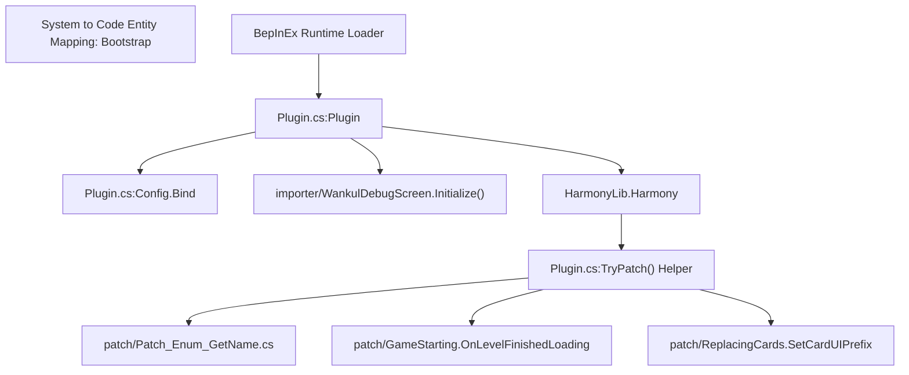
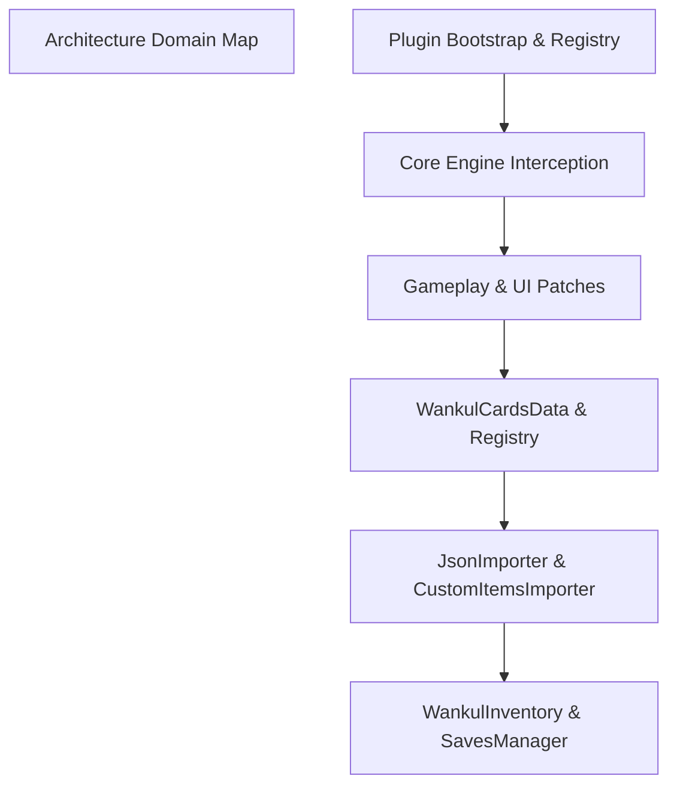

# Aperçu

> **Fichiers sources pertinents**
> * [.github/ISSUE_TEMPLATE/BUG-REPORT.yml](https://github.com/Drakilis-57/WankulCrazy/blob/57b1f5ed/.github/ISSUE_TEMPLATE/BUG-REPORT.yml)
> * [Docs/DOCS.md](https://github.com/Drakilis-57/WankulCrazy/blob/57b1f5ed/Docs/DOCS.md?plain=1)
> * [INSTALL.txt](https://github.com/Drakilis-57/WankulCrazy/blob/57b1f5ed/INSTALL.txt)
> * [Plugin.cs](https://github.com/Drakilis-57/WankulCrazy/blob/57b1f5ed/Plugin.cs)
> * [PluginInfo.cs](https://github.com/Drakilis-57/WankulCrazy/blob/57b1f5ed/PluginInfo.cs)
> * [README.md](https://github.com/Drakilis-57/WankulCrazy/blob/57b1f5ed/README.md?plain=1)
> * [libs/Assembly-CSharp.dll](https://github.com/Drakilis-57/WankulCrazy/blob/57b1f5ed/libs/Assembly-CSharp.dll)

## Objectif et portée

`WankulCrazy` est une modification basée sur BepInEx 5.4 et Harmony pour *TCG Card Shop Simulator*, implémentée en C#.Son objectif principal est de remplacer les ressources, cartes et éléments d'interface utilisateur standard du jeu par du contenu personnalisé de l'univers Wankul [Docs/DOCS.md:7-17].Le mod gère un pipeline de données dynamiques complexe, chargeant des définitions de cartes personnalisées, des saisons, des raretés, des maillages 3D et des textures à partir de fichiers JSON et les injectant dans le runtime à l'aide des correctifs de la méthode Harmony [Docs/DOCS.md:7-40].

L'orchestration principale du runtime est ancrée par la classe `Plugin`, qui étend `BaseUnityPlugin` de BepInEx et gère l'initialisation du cycle de vie, la liaison de configuration et l'application de correctifs de méthodes [Plugin.cs:14-46].

*Sources : [Plugin.cs:14-112]*, *[Docs/DOCS.md:7-17]*

---

## Présentation de l'architecture

La base de code est organisée en couches fonctionnelles distinctes responsables du démarrage, des modèles de domaine, des hooks de gameplay, de la persistance de l'inventaire et de l'importation des actifs de contenu.Interface de sous-systèmes de haut niveau via des gestionnaires centralisés et des registres statiques.

*Sources : [Plugin.cs:1-176]*, *[Docs/DOCS.md:92-104]*

Pour des explorations détaillées de sous-systèmes spécifiques, reportez-vous aux pages de documentation enfant :

* [Mise en route et installation](/Drakilis-57/WankulCrazy/1.1-getting-started-and-installation) — Instructions d'installation, disposition du dossier mod sous `BepInEx/plugins`, paramètres de configuration et documents de référence dans `Docs/` et `INSTALL.txt` [INSTALL.txt:1-4, Plugin.cs:40].
* [Plugin Bootstrap and Harmony Patch Registry](/Drakilis-57/WankulCrazy/1.2-plugin-bootstrap-and-harmony-patch-registry) — Détail détaillé de l'exécution du cycle de vie de `Plugin.cs` dans `Awake()`, de l'assistant d'enregistrement `TryPatch`, des stratégies de mise en cache de réflexion, des utilitaires de chemin GameObject et des correctifs de correction de bugs d'exécution [Plugin.cs:36-92].

---

## Présentation des autres sous-systèmes

Alors que le démarrage et l'installation de base sont traités dans les pages enfants [Mise en route et installation] (/Drakilis-57/WankulCrazy/1.1-getting-started-and-installation) et [Plugin Bootstrap et Harmony Patch Registry] (/Drakilis-57/WankulCrazy/1.2-plugin-bootstrap-and-harmony-patch-registry), le reste de l'architecture du mod est divisé enles domaines majeurs suivants sur le wiki :

* **Modèle de données de carte (Section 2)** : gère `WankulCardsData`, les types de cartes (`EffigyCardData`, `TerrainCardData`, `SpecialCardData`), `SeasonsManager` dynamique, `RaritiesManager` et les pipelines d'analyse JSON [Docs/DOCS.md:22-40].
* **Patches de gameplay (Section 3)** : intercepte les mécanismes de base du jeu, notamment les séquences d'ouverture des boosters (`CardOpening`), les interactions des joueurs (`InteractionPlayerControllerPatch`), les remplacements visuels de l'interface utilisateur (`ReplacingCards`) et la tarification économique (`CardPrice`) [Docs/DOCS.md:71-88].
* **Inventaire et persistance (Section 4)** : suit les inventaires singleton (`WankulInventory`), les mécanismes de perte de poids, l'agrégation des prix et les routines de migration de sauvegarde (`SavesManager`) [Docs/DOCS.md:100].
* **Importateurs d'actifs et de contenu (Section 5)** : gère l'enregistrement des éléments personnalisés (`CustomItemsImporter`), le chargement du maillage et des textures OBJ (`OBJImporter`, `PatchTexturesImporter`) et les écrans de chargement budgétisés par cadre (`WankulLoadingScreen`) [Docs/DOCS.md:42-59, 99].
* **Build, CI et tests (Section 6)** : définit le pipeline de build (`build.ps1`), les suites de tests via xUnit/Mono.Cecil et les workflows GitHub Actions [Docs/DOCS.md:103].
* **Glossaire (Section 7)** : référence technique pour la terminologie de la base de code, les conventions Harmony, l'intégration BepInEx et les hachages d'actifs internes.

*Sources : [Plugin.cs:1-644]*, *[Docs/DOCS.md:1-282]*