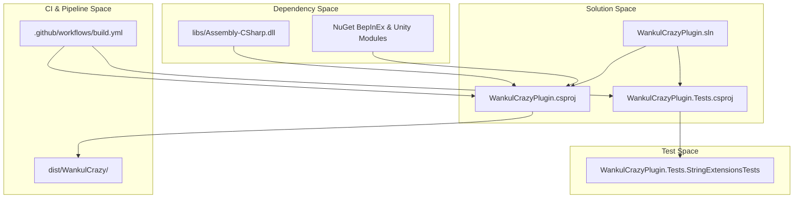

# Build, CI et tests

> **Fichiers sources pertinents**
> * [.github/workflows/build.yml](https://github.com/Drakilis-57/WankulCrazy/blob/57b1f5ed/.github/workflows/build.yml)
> * [WankulCrazyPlugin.Tests/StringExtensionsTests.cs](https://github.com/Drakilis-57/WankulCrazy/blob/57b1f5ed/WankulCrazyPlugin.Tests/StringExtensionsTests.cs)
> * [WankulCrazyPlugin.csproj](https://github.com/Drakilis-57/WankulCrazy/blob/57b1f5ed/WankulCrazyPlugin.csproj)
> * [WankulCrazyPlugin.sln](https://github.com/Drakilis-57/WankulCrazy/blob/57b1f5ed/WankulCrazyPlugin.sln)

## Objectif et portée

Cette page fournit une présentation générale des pipelines de build, des workflows d'intégration continue, des cadres de tests automatisés et des outils de gouvernance de projet qui prennent en charge la base de code `WankulCrazyPlugin`.La chaîne d'outils compile le mod BepInEx, résout les assemblys de dépendances du jeu, exécute les suites de tests `xUnit` et automatise le packaging via GitHub Actions.Les détails détaillés de la mise en œuvre sont conservés dans les pages enfants liées ci-dessous.

Sources : [WankulCrazyPlugin.csproj L1-L84](https://github.com/Drakilis-57/WankulCrazy/blob/57b1f5ed/WankulCrazyPlugin.csproj#L1-L84)

 [.github/workflows/build.yml L1-L33](https://github.com/Drakilis-57/WankulCrazy/blob/57b1f5ed/.github/workflows/build.yml#L1-L33)

 [WankulCrazyPlugin.sln L1-L66](https://github.com/Drakilis-57/WankulCrazy/blob/57b1f5ed/WankulCrazyPlugin.sln#L1-L66)

---

## 6.1 Construire le système et les dépendances

Le pipeline de compilation est géré via `WankulCrazyPlugin.csproj` ciblant `netstandard2.1` avec les blocs non sécurisés activés [WankulCrazyPlugin.csproj:1-8].Le fichier de solution `WankulCrazyPlugin.sln` regroupe à la fois le projet de plugin principal et le projet de test [WankulCrazyPlugin.sln:6-9].Les assemblys de jeu externes et les frameworks d'interface utilisateur, tels que `Assembly-CSharp.dll`, `Newtonsoft.Json.dll`, `Unity.TextMeshPro.dll` et `UnityEngine.UI.dll`, sont référencés localement à partir du répertoire `libs/` [WankulCrazyPlugin.csproj:44-60].

Les builds et déploiements locaux sont assistés par des scripts d'assistance et des cibles MSBuild, tandis que l'intégration continue est pilotée par GitHub Actions (`.github/workflows/build.yml`) qui restaure les dépendances, construit sous `ReleaseNoDeps` et exécute les tests [.github/workflows/build.yml:29-33].

For full details on project configurations, reference assemblies, local build scripts, and CI setup, see [Build System and Dependencies](/Drakilis-57/WankulCrazy/6.1-build-system-and-dependencies).

Sources : [WankulCrazyPlugin.csproj L1-L84](https://github.com/Drakilis-57/WankulCrazy/blob/57b1f5ed/WankulCrazyPlugin.csproj#L1-L84)

 [.github/workflows/build.yml L1-L33](https://github.com/Drakilis-57/WankulCrazy/blob/57b1f5ed/.github/workflows/build.yml#L1-L33)

 [WankulCrazyPlugin.sln L1-L66](https://github.com/Drakilis-57/WankulCrazy/blob/57b1f5ed/WankulCrazyPlugin.sln#L1-L66)

---

## 6.2 Suite de tests

La vérification automatisée est implémentée via le projet `WankulCrazyPlugin.Tests` intégré à la solution principale [WankulCrazyPlugin.sln:8-9].La suite de tests utilise `xUnit` pour valider les utilitaires de manipulation de chaînes (tels que `StringExtensionsTests.cs`) [WankulCrazyPlugin.Tests/StringExtensionsTests.StringExtensionsTests.csL1-L39](https://github.com/Drakilis-57/WankulCrazy/blob/57b1f5ed/WankulCrazyPlugin.Tests/StringExtensionsTests.StringExtensionsTests.cs#L1-L39)

Structures de données JSON, routines d'analyse sécurisée d'énumération, critères de rareté et invariants de documentation.Les tests avancés utilisent également `Mono.Cecil` pour les routines d'inspection et de référence IL.

Pour plus de détails sur la couverture des tests, les structures de test et les règles de validation, voir [Test Suite](/Drakilis-57/WankulCrazy/6.2-test-suite).

Sources : [WankulCrazyPlugin.sln L8-L9](https://github.com/Drakilis-57/WankulCrazy/blob/57b1f5ed/WankulCrazyPlugin.sln#L8-L9)

 [WankulCrazyPlugin.Tests/StringExtensionsTests.cs L1-L39](https://github.com/Drakilis-57/WankulCrazy/blob/57b1f5ed/WankulCrazyPlugin.Tests/StringExtensionsTests.cs#L1-L39)

---

## 6.3 Gouvernance de projet et modèles de problèmes

L'organisation du projet comprend des modèles de problèmes pour les rapports de bogues et les demandes de fonctionnalités, les métadonnées de version liées à `PluginInfo`, les conditions de licence via `LICENCE.txt` [WankulCrazyPlugin.csproj:69-71], les instructions d'installation via `INSTALL.txt` [WankulCrazyPlugin.csproj:72-74] et les politiques de contribution du référentiel.Ces éléments garantissent un emballage, une distribution et une conformité open source cohérents.

Pour plus de détails sur les flux de travail de contribution, les schémas de gestion des versions et les modèles de gouvernance, voir [Modèles de gouvernance de projet et de problème](/Drakilis-57/WankulCrazy/6.3-project-governance-and-issue-templates).

Sources : [WankulCrazyPlugin.csproj L69-L75](https://github.com/Drakilis-57/WankulCrazy/blob/57b1f5ed/WankulCrazyPlugin.csproj#L69-L75)

---

## Construction et architecture CI

Sources : [WankulCrazyPlugin.csproj L1-L84](https://github.com/Drakilis-57/WankulCrazy/blob/57b1f5ed/WankulCrazyPlugin.csproj#L1-L84)

 [.github/workflows/build.yml L1-L33](https://github.com/Drakilis-57/WankulCrazy/blob/57b1f5ed/.github/workflows/build.yml#L1-L33)

 [WankulCrazyPlugin.sln L1-L66](https://github.com/Drakilis-57/WankulCrazy/blob/57b1f5ed/WankulCrazyPlugin.sln#L1-L66)

 [WankulCrazyPlugin.Tests/StringExtensionsTests.cs L1-L39](https://github.com/Drakilis-57/WankulCrazy/blob/57b1f5ed/WankulCrazyPlugin.Tests/StringExtensionsTests.cs#L1-L39)