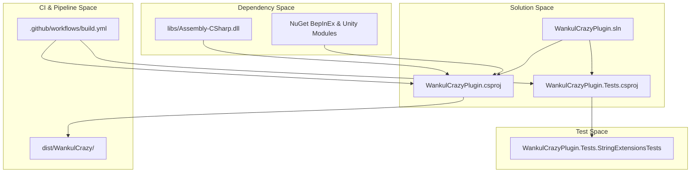

# Build, CI and Testing

> **Relevant source files**
> * [.github/workflows/build.yml](https://github.com/Drakilis-57/WankulCrazy/blob/57b1f5ed/.github/workflows/build.yml)
> * [WankulCrazyPlugin.Tests/StringExtensionsTests.cs](https://github.com/Drakilis-57/WankulCrazy/blob/57b1f5ed/WankulCrazyPlugin.Tests/StringExtensionsTests.cs)
> * [WankulCrazyPlugin.csproj](https://github.com/Drakilis-57/WankulCrazy/blob/57b1f5ed/WankulCrazyPlugin.csproj)
> * [WankulCrazyPlugin.sln](https://github.com/Drakilis-57/WankulCrazy/blob/57b1f5ed/WankulCrazyPlugin.sln)

## Purpose and Scope

This page provides a high-level overview of the build pipelines, continuous integration workflows, automated testing frameworks, and project governance tools that support the `WankulCrazyPlugin` codebase. The toolchain compiles the BepInEx mod, resolves game dependency assemblies, executes `xUnit` test suites, and automates packaging via GitHub Actions. Detailed implementation specifics are maintained in the child pages linked below.

Sources: [WankulCrazyPlugin.csproj L1-L84](https://github.com/Drakilis-57/WankulCrazy/blob/57b1f5ed/WankulCrazyPlugin.csproj#L1-L84)

 [.github/workflows/build.yml L1-L33](https://github.com/Drakilis-57/WankulCrazy/blob/57b1f5ed/.github/workflows/build.yml#L1-L33)

 [WankulCrazyPlugin.sln L1-L66](https://github.com/Drakilis-57/WankulCrazy/blob/57b1f5ed/WankulCrazyPlugin.sln#L1-L66)

---

## 6.1 Build System and Dependencies

The compilation pipeline is managed through `WankulCrazyPlugin.csproj` targeting `netstandard2.1` with unsafe blocks enabled [WankulCrazyPlugin.csproj:1-8]. The solution file `WankulCrazyPlugin.sln` aggregates both the main plugin project and the test project [WankulCrazyPlugin.sln:6-9]. External game assemblies and UI frameworks—such as `Assembly-CSharp.dll`, `Newtonsoft.Json.dll`, `Unity.TextMeshPro.dll`, and `UnityEngine.UI.dll`—are referenced locally from the `libs/` directory [WankulCrazyPlugin.csproj:44-60].

Local builds and deployments are assisted by helper scripts and MSBuild targets, while continuous integration is driven by GitHub Actions (`.github/workflows/build.yml`) which restores dependencies, builds under `ReleaseNoDeps`, and executes tests [.github/workflows/build.yml:29-33].

For full details on project configurations, reference assemblies, local build scripts, and CI setup, see [Build System and Dependencies](/Drakilis-57/WankulCrazy/6.1-build-system-and-dependencies).

Sources: [WankulCrazyPlugin.csproj L1-L84](https://github.com/Drakilis-57/WankulCrazy/blob/57b1f5ed/WankulCrazyPlugin.csproj#L1-L84)

 [.github/workflows/build.yml L1-L33](https://github.com/Drakilis-57/WankulCrazy/blob/57b1f5ed/.github/workflows/build.yml#L1-L33)

 [WankulCrazyPlugin.sln L1-L66](https://github.com/Drakilis-57/WankulCrazy/blob/57b1f5ed/WankulCrazyPlugin.sln#L1-L66)

---

## 6.2 Test Suite

Automated verification is implemented via the `WankulCrazyPlugin.Tests` project integrated into the main solution [WankulCrazyPlugin.sln:8-9]. The test suite uses `xUnit` to validate string manipulation utilities (such as `StringExtensionsTests.cs`) [WankulCrazyPlugin.Tests/StringExtensionsTests.StringExtensionsTests.cs L1-L39](https://github.com/Drakilis-57/WankulCrazy/blob/57b1f5ed/WankulCrazyPlugin.Tests/StringExtensionsTests.StringExtensionsTests.cs#L1-L39)

 JSON data structures, enum safe-parsing routines, rarity criteria, and documentation invariants. Advanced tests also employ `Mono.Cecil` for IL inspection and benchmark routines.

For details on test coverage, test structures, and validation rules, see [Test Suite](/Drakilis-57/WankulCrazy/6.2-test-suite).

Sources: [WankulCrazyPlugin.sln L8-L9](https://github.com/Drakilis-57/WankulCrazy/blob/57b1f5ed/WankulCrazyPlugin.sln#L8-L9)

 [WankulCrazyPlugin.Tests/StringExtensionsTests.cs L1-L39](https://github.com/Drakilis-57/WankulCrazy/blob/57b1f5ed/WankulCrazyPlugin.Tests/StringExtensionsTests.cs#L1-L39)

---

## 6.3 Project Governance and Issue Templates

Project organization encompasses issue templates for bug reports and feature requests, versioning metadata tied to `PluginInfo`, licensing terms via `LICENCE.txt` [WankulCrazyPlugin.csproj:69-71], installation instructions via `INSTALL.txt` [WankulCrazyPlugin.csproj:72-74], and repository contribution policies. These elements ensure consistent packaging, distribution, and open-source compliance.

For details on contribution workflows, versioning schemes, and governance templates, see [Project Governance and Issue Templates](/Drakilis-57/WankulCrazy/6.3-project-governance-and-issue-templates).

Sources: [WankulCrazyPlugin.csproj L69-L75](https://github.com/Drakilis-57/WankulCrazy/blob/57b1f5ed/WankulCrazyPlugin.csproj#L69-L75)

---

## Build and CI Architecture

Sources: [WankulCrazyPlugin.csproj L1-L84](https://github.com/Drakilis-57/WankulCrazy/blob/57b1f5ed/WankulCrazyPlugin.csproj#L1-L84)

 [.github/workflows/build.yml L1-L33](https://github.com/Drakilis-57/WankulCrazy/blob/57b1f5ed/.github/workflows/build.yml#L1-L33)

 [WankulCrazyPlugin.sln L1-L66](https://github.com/Drakilis-57/WankulCrazy/blob/57b1f5ed/WankulCrazyPlugin.sln#L1-L66)

 [WankulCrazyPlugin.Tests/StringExtensionsTests.cs L1-L39](https://github.com/Drakilis-57/WankulCrazy/blob/57b1f5ed/WankulCrazyPlugin.Tests/StringExtensionsTests.cs#L1-L39)