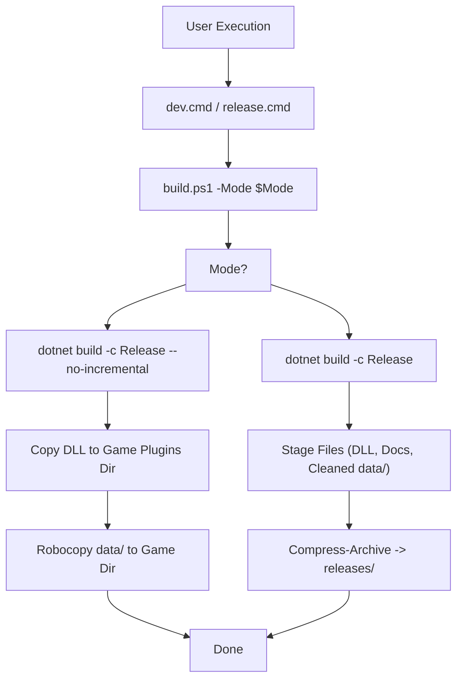

# Build System and Dependencies

> **Relevant source files**
> * [.github/workflows/build.yml](https://github.com/Drakilis-57/WankulCrazy/blob/57b1f5ed/.github/workflows/build.yml)
> * [.gitignore](https://github.com/Drakilis-57/WankulCrazy/blob/57b1f5ed/.gitignore)
> * [Docs/BUILD_GUIDE.md](https://github.com/Drakilis-57/WankulCrazy/blob/57b1f5ed/Docs/BUILD_GUIDE.md?plain=1)
> * [Docs/inventaire.md](https://github.com/Drakilis-57/WankulCrazy/blob/57b1f5ed/Docs/inventaire.md?plain=1)
> * [WankulCrazyPlugin.Tests/StringExtensionsTests.cs](https://github.com/Drakilis-57/WankulCrazy/blob/57b1f5ed/WankulCrazyPlugin.Tests/StringExtensionsTests.cs)
> * [WankulCrazyPlugin.csproj](https://github.com/Drakilis-57/WankulCrazy/blob/57b1f5ed/WankulCrazyPlugin.csproj)
> * [WankulCrazyPlugin.sln](https://github.com/Drakilis-57/WankulCrazy/blob/57b1f5ed/WankulCrazyPlugin.sln)
> * [build.ps1](https://github.com/Drakilis-57/WankulCrazy/blob/57b1f5ed/build.ps1)
> * [cards/SortType.cs](https://github.com/Drakilis-57/WankulCrazy/blob/57b1f5ed/cards/SortType.cs)
> * [dev.cmd](https://github.com/Drakilis-57/WankulCrazy/blob/57b1f5ed/dev.cmd)
> * [libs/Newtonsoft.Json.dll](https://github.com/Drakilis-57/WankulCrazy/blob/57b1f5ed/libs/Newtonsoft.Json.dll)
> * [release.cmd](https://github.com/Drakilis-57/WankulCrazy/blob/57b1f5ed/release.cmd)

### Purpose and Scope

This document details the build configuration, project structure, external assembly dependencies, automation scripts, and Continuous Integration (CI) workflows for the `WankulCrazy` BepInEx mod. It outlines how `WankulCrazyPlugin.csproj` [WankulCrazyPlugin.csproj L1-L84](https://github.com/Drakilis-57/WankulCrazy/blob/57b1f5ed/WankulCrazyPlugin.csproj#L1-L84)

 and `WankulCrazyPlugin.sln` [WankulCrazyPlugin.sln L1-L66](https://github.com/Drakilis-57/WankulCrazy/blob/57b1f5ed/WankulCrazyPlugin.sln#L1-L66)

 configure compilation targets, how reference assemblies in `libs/` are consumed, how `build.ps1` [build.ps1 L1-L149](https://github.com/Drakilis-57/WankulCrazy/blob/57b1f5ed/build.ps1#L1-L149)

 coordinates development and release deployments, and how GitHub Actions execute remote builds and test suites.

---

## 1. Solution and Project Configuration

The project is structured around a central solution file, `WankulCrazyPlugin.sln` [WankulCrazyPlugin.sln L1-L66](https://github.com/Drakilis-57/WankulCrazy/blob/57b1f5ed/WankulCrazyPlugin.sln#L1-L66)

 which contains two main projects:

1. `WankulCrazyPlugin` (`WankulCrazyPlugin.csproj`) [WankulCrazyPlugin.csproj L1-L84](https://github.com/Drakilis-57/WankulCrazy/blob/57b1f5ed/WankulCrazyPlugin.csproj#L1-L84)  — The core BepInEx mod assembly targeting `netstandard2.1` [WankulCrazyPlugin.csproj L3](https://github.com/Drakilis-57/WankulCrazy/blob/57b1f5ed/WankulCrazyPlugin.csproj#L3-L3)
2. `WankulCrazyPlugin.Tests` (`WankulCrazyPlugin.Tests.csproj`) [WankulCrazyPlugin.sln L8](https://github.com/Drakilis-57/WankulCrazy/blob/57b1f5ed/WankulCrazyPlugin.sln#L8-L8)  — The xUnit test suite validating JSON schemas, enums, and data integrity.

### Project Properties (WankulCrazyPlugin.csproj)

The project enables unsafe blocks, targets the latest C# language version, and customizes output paths to isolate build artifacts under `dist/WankulCrazy/`:

```xml
<PropertyGroup>    <TargetFramework>netstandard2.1</TargetFramework>    <AssemblyName>WankulCrazyPlugin</AssemblyName>    <Product>My first plugin</Product>    <Version>1.0.0</Version>    <AllowUnsafeBlocks>true</AllowUnsafeBlocks>    <LangVersion>latest</LangVersion>    <OutputPath>.\dist\WankulCrazy\</OutputPath>    <BaseOutputPath>.\dist\WankulCrazy\</BaseOutputPath>    <AppendTargetFrameworkToOutputPath>false</AppendTargetFrameworkToOutputPath>    <GenerateDependencyFile>false</GenerateDependencyFile>    <DebugType>none</DebugType>    <GenerateAssemblyInfo>false</GenerateAssemblyInfo></PropertyGroup>
```

*Sources: [WankulCrazyPlugin.csproj L1-L24](https://github.com/Drakilis-57/WankulCrazy/blob/57b1f5ed/WankulCrazyPlugin.csproj#L1-L24)

 [WankulCrazyPlugin.sln L1-L66](https://github.com/Drakilis-57/WankulCrazy/blob/57b1f5ed/WankulCrazyPlugin.sln#L1-L66)*

---

## 2. Reference Assemblies and External Dependencies

Because `WankulCrazy` runs as a BepInEx mod inside *TCG Card Shop Simulator* (built on Unity 2021.3.39), compilation relies on both NuGet packages and private game reference assemblies stored locally in the `libs/` directory. These references are marked with `<Private>False</Private>` to prevent duplicating engine and game assemblies in the output distribution.

### Table of Dependencies

| Dependency Type | Source / Package Name | Version / HintPath | Role in Build |
| --- | --- | --- | --- |
| **NuGet** | `BepInEx.Core` | `5.*` [WankulCrazyPlugin.csproj L34](https://github.com/Drakilis-57/WankulCrazy/blob/57b1f5ed/WankulCrazyPlugin.csproj#L34-L34) | Core BepInEx plugin loading framework |
| **NuGet** | `BepInEx.Analyzers` | `1.*` [WankulCrazyPlugin.csproj L33](https://github.com/Drakilis-57/WankulCrazy/blob/57b1f5ed/WankulCrazyPlugin.csproj#L33-L33) | Roslyn analyzers for BepInEx code patterns |
| **NuGet** | `BepInEx.PluginInfoProps` | `2.*` [WankulCrazyPlugin.csproj L35](https://github.com/Drakilis-57/WankulCrazy/blob/57b1f5ed/WankulCrazyPlugin.csproj#L35-L35) | Automatic `PluginInfo` generation properties |
| **NuGet** | `UnityEngine.Modules` | `2021.3.39` [WankulCrazyPlugin.csproj L36](https://github.com/Drakilis-57/WankulCrazy/blob/57b1f5ed/WankulCrazyPlugin.csproj#L36-L36) | Unity engine compile-time references |
| **Local Lib** | `Assembly-CSharp.dll` | `libs\Assembly-CSharp.dll` [WankulCrazyPlugin.csproj L44-L47](https://github.com/Drakilis-57/WankulCrazy/blob/57b1f5ed/WankulCrazyPlugin.csproj#L44-L47) | Main game logic and classes |
| **Local Lib** | `Newtonsoft.Json.dll` | `libs\Newtonsoft.Json.dll` [WankulCrazyPlugin.csproj L48-L51](https://github.com/Drakilis-57/WankulCrazy/blob/57b1f5ed/WankulCrazyPlugin.csproj#L48-L51) | JSON parsing for cards, saves, and configs |
| **Local Lib** | `Unity.TextMeshPro.dll` | `libs\Unity.TextMeshPro.dll` [WankulCrazyPlugin.csproj L52-L55](https://github.com/Drakilis-57/WankulCrazy/blob/57b1f5ed/WankulCrazyPlugin.csproj#L52-L55) | UI text rendering components |
| **Local Lib** | `UnityEngine.UI.dll` | `libs\UnityEngine.UI.dll` [WankulCrazyPlugin.csproj L56-L59](https://github.com/Drakilis-57/WankulCrazy/blob/57b1f5ed/WankulCrazyPlugin.csproj#L56-L59) | Unity UI canvas and layout elements |

### Diagram: Build System Component Mapping

```

```

*Sources: [WankulCrazyPlugin.csproj L26-L66](https://github.com/Drakilis-57/WankulCrazy/blob/57b1f5ed/WankulCrazyPlugin.csproj#L26-L66)

 [WankulCrazyPlugin.sln L1-L66](https://github.com/Drakilis-57/WankulCrazy/blob/57b1f5ed/WankulCrazyPlugin.sln#L1-L66)*

---

## 3. Build Automation and Scripting

Build operations are driven by `build.ps1`, which supports two primary execution modes: `dev` and `release` [build.ps1 L8-L12](https://github.com/Drakilis-57/WankulCrazy/blob/57b1f5ed/build.ps1#L8-L12)

### Development Mode (dev)

Invoked via `dev.cmd` [dev.cmd L1-L3](https://github.com/Drakilis-57/WankulCrazy/blob/57b1f5ed/dev.cmd#L1-L3)

 or `.\dev` [Docs/BUILD_GUIDE.md L3](https://github.com/Drakilis-57/WankulCrazy/blob/57b1f5ed/Docs/BUILD_GUIDE.md?plain=1#L3-L3)

 this mode:

1. Compiles the project in `Release` configuration without incremental caching (`dotnet build -c Release --no-incremental`) [build.ps1 L64](https://github.com/Drakilis-57/WankulCrazy/blob/57b1f5ed/build.ps1#L64-L64)
2. Locates the target game directory using environment variables (`$env:TCGCARDSHOP_PLUGIN_DIR`), `local.config.json`, or common Steam installation paths [build.ps1 L28-L56](https://github.com/Drakilis-57/WankulCrazy/blob/57b1f5ed/build.ps1#L28-L56)
3. Copies `WankulCrazyPlugin.dll` directly into the BepInEx plugins folder [build.ps1 L74](https://github.com/Drakilis-57/WankulCrazy/blob/57b1f5ed/build.ps1#L74-L74)
4. Synchronizes the asset-heavy `data/` directory using `robocopy` with options `/E /XO /FFT` to mirror updated textures, card definitions, and configuration files efficiently [build.ps1 L81-L90](https://github.com/Drakilis-57/WankulCrazy/blob/57b1f5ed/build.ps1#L81-L90)

### Release Mode (release)

Invoked via `release.cmd` [release.cmd L1-L3](https://github.com/Drakilis-57/WankulCrazy/blob/57b1f5ed/release.cmd#L1-L3)

 or `.\release` [Docs/BUILD_GUIDE.md L3](https://github.com/Drakilis-57/WankulCrazy/blob/57b1f5ed/Docs/BUILD_GUIDE.md?plain=1#L3-L3)

 this mode:

1. Compiles a clean `Release` build [build.ps1 L101](https://github.com/Drakilis-57/WankulCrazy/blob/57b1f5ed/build.ps1#L101-L101)
2. Prepares an isolated staging folder `release_build/WankulCrazy/` [build.ps1 L103-L110](https://github.com/Drakilis-57/WankulCrazy/blob/57b1f5ed/build.ps1#L103-L110)
3. Copies the compiled DLL, `INSTALL.txt`, `LICENCE.txt`, and the full `data/` directory while purging temporary development artifacts (e.g., `save_*.json`, backups, and test season directories) [build.ps1 L117-L134](https://github.com/Drakilis-57/WankulCrazy/blob/57b1f5ed/build.ps1#L117-L134)
4. Compresses the staging folder into a timestamped `.zip` archive under `releases/WankulCrazy_Release_YYYYMMDD_HHMMSS.zip` [build.ps1 L137-L141](https://github.com/Drakilis-57/WankulCrazy/blob/57b1f5ed/build.ps1#L137-L141)

### Diagram: Build Script Execution Flow



*Sources: [build.ps1 L1-L149](https://github.com/Drakilis-57/WankulCrazy/blob/57b1f5ed/build.ps1#L1-L149)

 [dev.cmd L1-L3](https://github.com/Drakilis-57/WankulCrazy/blob/57b1f5ed/dev.cmd#L1-L3)

 [release.cmd L1-L3](https://github.com/Drakilis-57/WankulCrazy/blob/57b1f5ed/release.cmd#L1-L3)*

---

## 4. CI/CD Pipeline and GitHub Actions

Automated validation is handled by GitHub Actions (`.github/workflows/build.yml`) [.github/workflows/build.yml L1-L33](https://github.com/Drakilis-57/WankulCrazy/blob/57b1f5ed/.github/workflows/build.yml#L1-L33)

 The pipeline triggers on pushes and pull requests to `main` or `master`, as well as version tags [.github/workflows/build.yml L3-L11](https://github.com/Drakilis-57/WankulCrazy/blob/57b1f5ed/.github/workflows/build.yml#L3-L11)

### Pipeline Workflow Steps

1. **Checkout**: Uses `actions/checkout@v4` to clone the repository [.github/workflows/build.yml L21-L22](https://github.com/Drakilis-57/WankulCrazy/blob/57b1f5ed/.github/workflows/build.yml#L21-L22)
2. **Setup .NET**: Configures .NET SDK `8.0.x` via `actions/setup-dotnet@v4` [.github/workflows/build.yml L24-L27](https://github.com/Drakilis-57/WankulCrazy/blob/57b1f5ed/.github/workflows/build.yml#L24-L27)
3. **Build**: Restores dependencies and builds using the `ReleaseNoDeps` configuration (`dotnet build --configuration ReleaseNoDeps`) [.github/workflows/build.yml L29-L30](https://github.com/Drakilis-57/WankulCrazy/blob/57b1f5ed/.github/workflows/build.yml#L29-L30)
4. **Test**: Executes the unit test suite (`dotnet test --configuration Release`) [.github/workflows/build.yml L32-L33](https://github.com/Drakilis-57/WankulCrazy/blob/57b1f5ed/.github/workflows/build.yml#L32-L33)

*Sources: [.github/workflows/build.yml L1-L33](https://github.com/Drakilis-57/WankulCrazy/blob/57b1f5ed/.github/workflows/build.yml#L1-L33)*

---

## 5. Build Guide and Artifact Layout

As documented in `Docs/BUILD_GUIDE.md`, developers can execute builds using PowerShell, Command Prompt, or direct file shortcuts [Docs/BUILD_GUIDE.md L1-L5](https://github.com/Drakilis-57/WankulCrazy/blob/57b1f5ed/Docs/BUILD_GUIDE.md?plain=1#L1-L5)

### Player Distribution Package Structure

The packaged `.zip` file generated by release builds provides the following layout expected by BepInEx:

```
TCG Card Shop Simulator/└── BepInEx/    └── plugins/        └── WankulCrazy/            ├── WankulCrazyPlugin.dll            ├── INSTALL.txt            ├── LICENCE.txt            └── data/                ├── seasons.json                ├── rarities.json                ├── cards/                ├── sprites/                ├── masks/                ├── patchtextures/                └── names/
```

*Sources: [Docs/BUILD_GUIDE.md:43-62]*