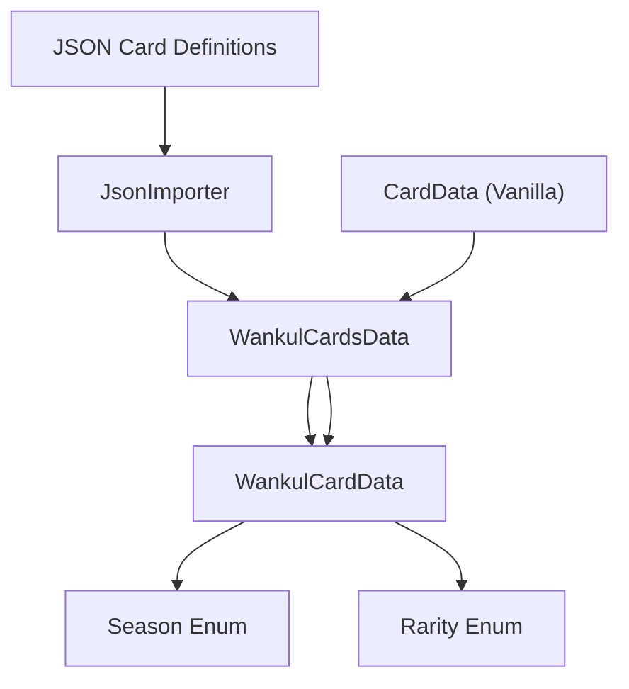

# Card Data Model

> **Relevant source files**
> * [cards/Rarity.cs](https://github.com/Drakilis-57/WankulCrazy/blob/57b1f5ed/cards/Rarity.cs)
> * [cards/Season.cs](https://github.com/Drakilis-57/WankulCrazy/blob/57b1f5ed/cards/Season.cs)
> * [cards/Seasons.cs](https://github.com/Drakilis-57/WankulCrazy/blob/57b1f5ed/cards/Seasons.cs)
> * [cards/WankulCardsData.cs](https://github.com/Drakilis-57/WankulCrazy/blob/57b1f5ed/cards/WankulCardsData.cs)

## Purpose and Scope

The Card Data Model governs how Wankul custom cards are structured, categorized, and tracked within the `WankulCrazy` modification. Located primarily under the `cards/` directory, this domain model bridges vanilla TCG Card Shop Simulator card structures with custom Wankul entities, supporting seasons, rarities, and dynamic card types (Effigies, Terrains, and Specials).

As a parent page, this document provides a high-level architectural overview of the card domain subsystem. For implementation specifics, consult the child pages:

* WankulCardsData Registry and Card Types: [WankulCardsData Registry and Card Types](/Drakilis-57/WankulCrazy/2.1-wankulcardsdata-registry-and-card-types)
* Seasons and Rarities: [Seasons and Rarities](/Drakilis-57/WankulCrazy/2.2-seasons-and-rarities)
* Card JSON Data and Importing: [Card JSON Data and Importing](/Drakilis-57/WankulCrazy/2.3-card-json-data-and-importing)

Sources: `cards/WankulCardsData.cs:1-165` [cards/WankulCardsData.cs](https://github.com/Drakilis-57/WankulCrazy/blob/57b1f5ed/cards/WankulCardsData.cs)

---

## High-Level Architecture

The card data subsystem coordinates between raw JSON definitions, container singletons, vanilla game entities (`CardData`, `MonsterData`), and inventory tracking structures.

*Sources: `cards/WankulCardsData.cs:12-30` [cards/WankulCardsData.cs](https://github.com/Drakilis-57/WankulCrazy/blob/57b1f5ed/cards/WankulCardsData.cs)*

---

## 2.1 WankulCardsData Registry and Card Types

The central coordinator for card lookup and instantiation is `WankulCardsData`, a singleton inheriting from `Singleton<WankulCardsData>` [cards/WankulCardsData.cs L12-L13](https://github.com/Drakilis-57/WankulCrazy/blob/57b1f5ed/cards/WankulCardsData.cs#L12-L13)

 It maintains the master list of custom cards (`cards`), forward association maps (`association`), and reverse lookup caches (`reverseAssociation`) to translate between vanilla game card references and Wankul card representations.

For full details on card subclasses (`EffigyCardData`, `TerrainCardData`, `SpecialCardData`), field definitions, and fallback mechanisms like `AJETER`, see [WankulCardsData Registry and Card Types](/Drakilis-57/WankulCrazy/2.1-wankulcardsdata-registry-and-card-types).

Sources: `cards/WankulCardsData.cs:12-165` [cards/WankulCardsData.cs](https://github.com/Drakilis-57/WankulCrazy/blob/57b1f5ed/cards/WankulCardsData.cs)

---

## 2.2 Seasons and Rarities

Card classification relies on strongly typed enums and dynamic manager structures. The `Season` enum defines eras such as `S01`, `S02`, `S03`, `S04`, `S05`, and `HS` (Hors Serie) [cards/Season.cs L3-L11](https://github.com/Drakilis-57/WankulCrazy/blob/57b1f5ed/cards/Season.cs#L3-L11)

 mapped to descriptive labels via `SeasonsContainer` [cards/Seasons.cs L5-L16](https://github.com/Drakilis-57/WankulCrazy/blob/57b1f5ed/cards/Seasons.cs#L5-L16)

 Similarly, the `Rarity` enum supports an extensive tier list ranging from standard commons (`C`) and uncommons (`UC`) to special editions, starter packs, and custom meme classifications [cards/Rarity.cs L3-L27](https://github.com/Drakilis-57/WankulCrazy/blob/57b1f5ed/cards/Rarity.cs#L3-L27)

For detailed information on JSON converters, seasons/rarities managers, and data files, see [Seasons and Rarities](/Drakilis-57/WankulCrazy/2.2-seasons-and-rarities).

Sources: `cards/Season.cs:3-11]`, `cards/Seasons.cs:5-16]`, `cards/Rarity.cs:3-27` [cards/Season.cs L3-L11](https://github.com/Drakilis-57/WankulCrazy/blob/57b1f5ed/cards/Season.cs#L3-L11)

---

## 2.3 Card JSON Data and Importing

Custom card data is loaded dynamically from disk via the importer pipelines. The system parses card attributes, sprite paths, mask paths, and legacy schemas from the `data/cards` directory.

For information on parsing logic, `legacy.json` schema support, and asset path resolution, see [Card JSON Data and Importing](/Drakilis-57/WankulCrazy/2.3-card-json-data-and-importing).

Sources: `cards/WankulCardsData.cs:18-25` [cards/WankulCardsData.cs](https://github.com/Drakilis-57/WankulCrazy/blob/57b1f5ed/cards/WankulCardsData.cs)