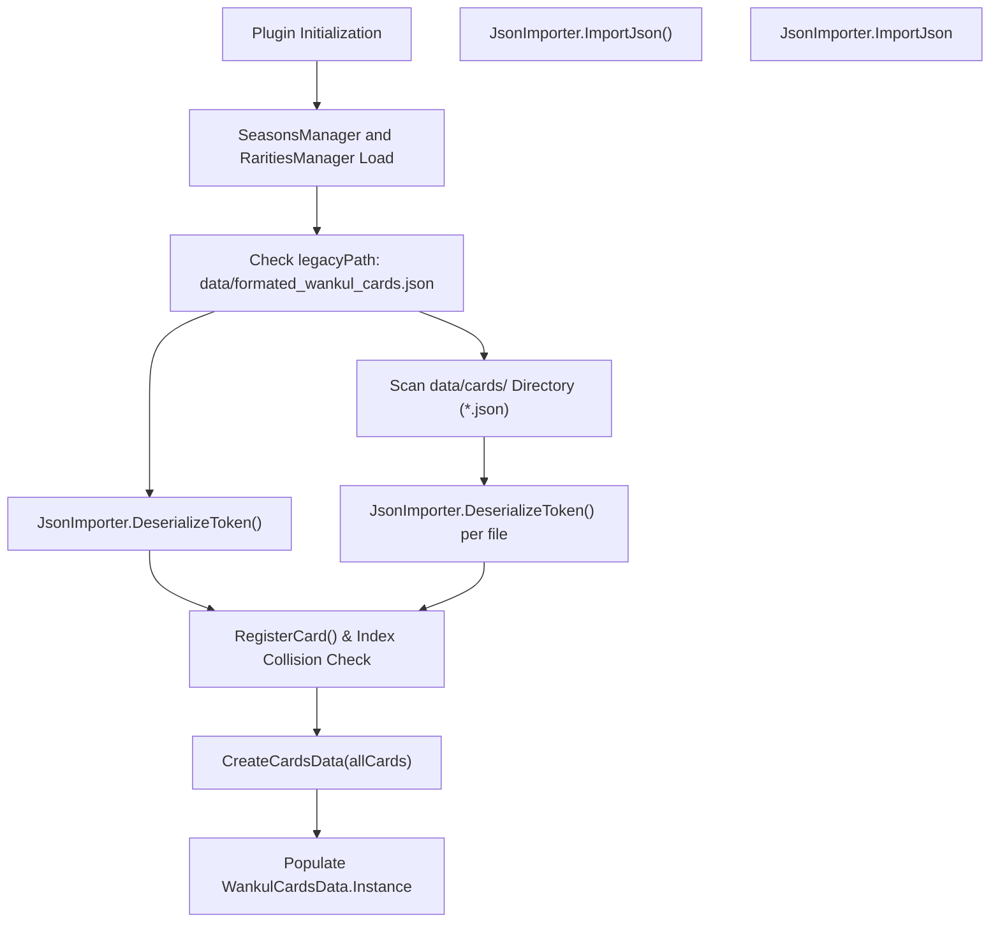
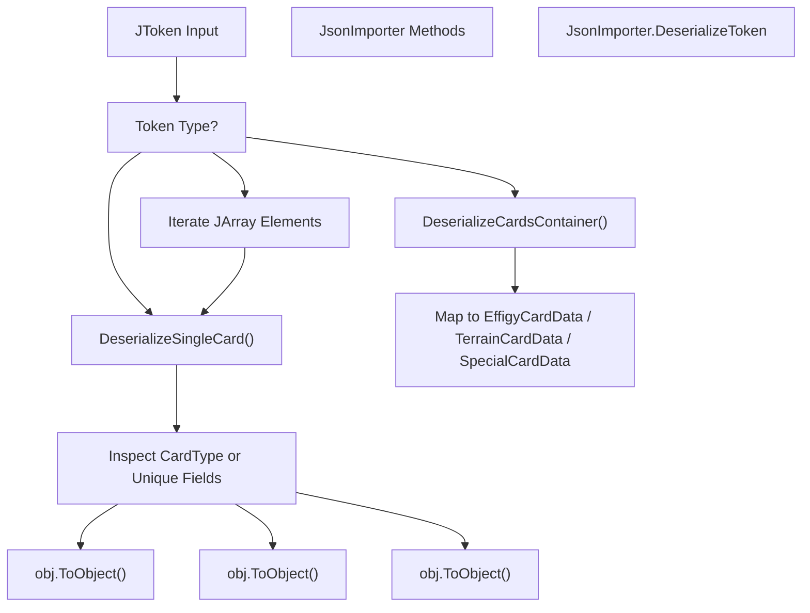
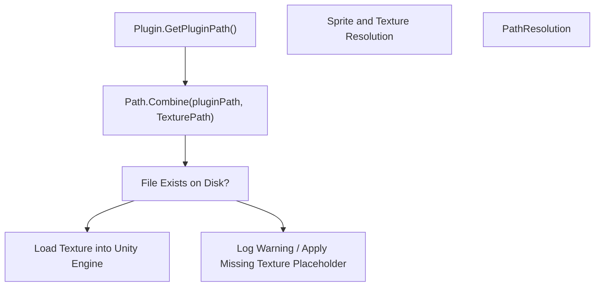

# Card JSON Data and Importing

> **Relevant source files**
> * [WankulCrazyPlugin.Tests/LegacyCardsRarityValidationTests.cs](https://github.com/Drakilis-57/WankulCrazy/blob/57b1f5ed/WankulCrazyPlugin.Tests/LegacyCardsRarityValidationTests.cs)
> * [data/cards/Legacy/legacy.json](https://github.com/Drakilis-57/WankulCrazy/blob/57b1f5ed/data/cards/Legacy/legacy.json)
> * [data/rarities.json](https://github.com/Drakilis-57/WankulCrazy/blob/57b1f5ed/data/rarities.json)
> * [importer/JsonImporter.cs](https://github.com/Drakilis-57/WankulCrazy/blob/57b1f5ed/importer/JsonImporter.cs)

The purpose of this page is to document the technical implementation of card data parsing, JSON deserialization strategies, legacy schema structures, and asset path resolution handled by `JsonImporter` and associated components within the WankulCrazy codebase.

---

## 1. Importer Architecture and Data Flow

The card import pipeline is orchestrated by `JsonImporter.ImportJson()` [importer/JsonImporter.cs:14-92] during plugin initialization. It coordinates loading configuration files, parsing both legacy single-file schemas and modular multi-file directories, resolving card indices, and committing the resulting structures to the global card registry singleton.

### Importer Pipeline Architecture

*Figure 1: High-level architectural flow of `JsonImporter.ImportJson()` from raw disk storage to runtime registration.*

Sources: `importer/JsonImporter.cs:12-92`

---

## 2. Deserialization Strategies and Polymorphism

`JsonImporter` implements a flexible deserialization strategy utilizing `Newtonsoft.Json` [importer/JsonImporter.cs:5-6] to handle varied JSON structures, ranging from monolithic file arrays to modular container objects and polymorphic card types.

### Token Analysis and Dispatch

The entry point for processing raw JSON structures is `JsonImporter.DeserializeToken(JToken token)` [importer/JsonImporter.cs:94-131]. It inspects the root `JToken` type:

* If the token is a `JObject`, it checks for container keys (`wankuls`, `terrains`, `specials`) via `DeserializeCardsContainer` [importer/JsonImporter.cs:133-159], or falls back to `DeserializeSingleCard` [importer/JsonImporter.cs:161-187].
* If the token is a `JArray`, it iterates over each child element, processing them individually through `DeserializeSingleCard` [importer/JsonImporter.cs:117-128].

Polymorphic card instantiation relies on `TypeNameHandling.Auto` settings [importer/JsonImporter.cs:99-102] alongside explicit property inspection in `DeserializeSingleCard` [importer/JsonImporter.cs:161-187]:

* Cards explicitly declaring a `CardType` string (`Terrain`, `Special`, `Effigy`) are cast to `TerrainCardData`, `SpecialCardData`, or `EffigyCardData` respectively.
* In the absence of an explicit `CardType`, fallback checks inspect unique structural properties (`Terrain`, `Special`, `Effigy`, `Rarity`, or `RarityId`) to determine the target subclass type.

### Asset and Code Entity Mapping

*Figure 2: Method-level code mapping for token deserialization and type routing.*

Sources: `importer/JsonImporter.cs:94-187`

---

## 3. Card Legacy Schema and Index Resolution

Card definitions may reside in the legacy monolithic file `data/formated_wankul_cards.json` or within modular JSON files located under `data/cards/` [importer/JsonImporter.cs:36,57].

### Schema Definition

As exemplified in legacy records [data/cards/Legacy/legacy.json:1-17], individual card definitions encode core metadata:

* `Index`: Unique integer identifier used as the primary dictionary key.
* `Number`: Padded string representation of the card order (e.g., `"001"`).
* `Title`: Display title of the card.
* `CardType`: Classification string (`Terrain`, `Special`, `Effigy`).
* `SeasonId`: Associated season reference (e.g., `"S05"`).
* `TexturePath`: Relative path pointing to texture assets.
* `Drop` / `Percentage`: Drop-rate weighting parameters.
* `RarityId`: Foreign key linking to rarity definitions (e.g., `"C"`).
* `Rules`, `WinningEffect`, `LosingEffect`, `SpecialEffect`: Gameplay text rules.

### Index Collision and Auto-Assignment Logic

During loading:

1. Cards with an unassigned or non-positive index (`card.Index <= 0`) automatically receive a sequentially incremented index starting at `900000` [importer/JsonImporter.cs:24-31].
2. Cards are registered into a central dictionary (`allCardsDict`) keyed by `Index` [importer/JsonImporter.cs:22,32].
3. Files loaded from the modular `data/cards/` directory overwrite any existing legacy entries sharing the same `Index`, ensuring modular files take precedence [importer/JsonImporter.cs:57-78].

Sources: `importer/JsonImporter.cs:22-78`, `data/cards/Legacy/legacy.json:1-17`

---

## 4. Sprite, Mask and Texture Path Resolution

Texture assets referenced by card definitions (such as `TexturePath` fields specifying paths like `cards/Legacy/textures/001_ROAD TRIP.png` [data/cards/Legacy/textures/001_ROAD L9](https://github.com/Drakilis-57/WankulCrazy/blob/57b1f5ed/data/cards/Legacy/textures/001_ROAD TRIP.png#L9-L9)

) are resolved relative to the base plugin installation directory.

### Resolution Workflow

*Figure 3: Runtime asset path resolution flow linking JSON string definitions to filesystem assets.*

Sources: `importer/JsonImporter.cs:16`, `data/cards/Legacy/legacy.json:1-17`

---

## 5. Rarity Validation and Integrity Checks

To prevent silent fallback bugs where invalid rarity identifiers (e.g., typographical errors like `"L-B"` instead of `"LB"`) default to `Rarity.C` with unintended baseline multiplicateurs [WankulCrazyPlugin.Tests/LegacyCardsRarityValidationTests.cs:11-18], strict validation routines run during testing.

### Validation Rules

* **Schema Declared Rarities**: All `RarityId` strings referenced across card files under `data/cards/**/*.json` must be explicitly declared in `data/rarities.json` [WankulCrazyPlugin.Tests/LegacyCardsRarityValidationTests.cs:50-110].
* **Missing Rarity Trapping**: `LegacyCardsRarityValidationTests` parses all card JSON files, cross-referencing their `RarityId` against `RaritiesManager.GetRarity()`. Unrecognized identifiers trigger an assertion failure, preventing deployment errors [WankulCrazyPlugin.Tests/LegacyCardsRarityValidationTests.cs:87-109].

Sources: `WankulCrazyPlugin.Tests/LegacyCardsRarityValidationTests.cs:1-134`, `data/rarities.json:1-56`