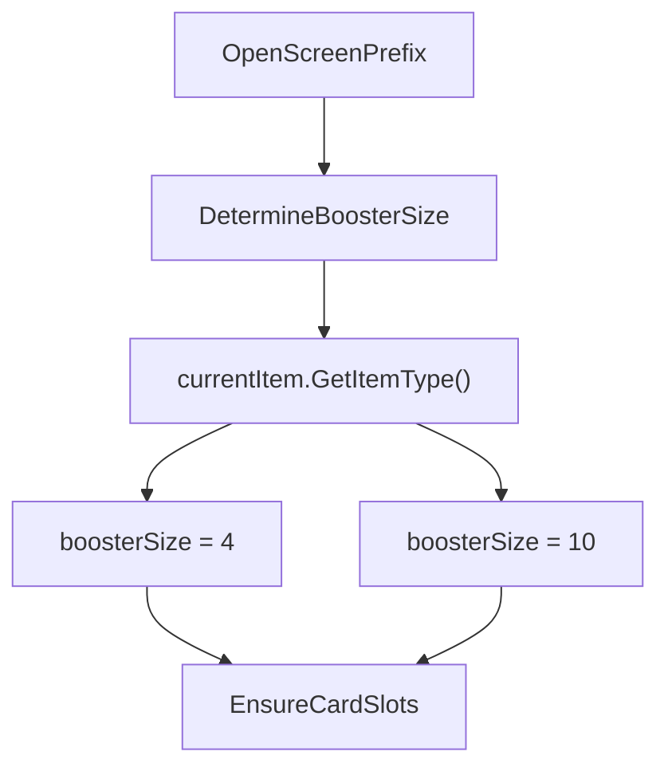
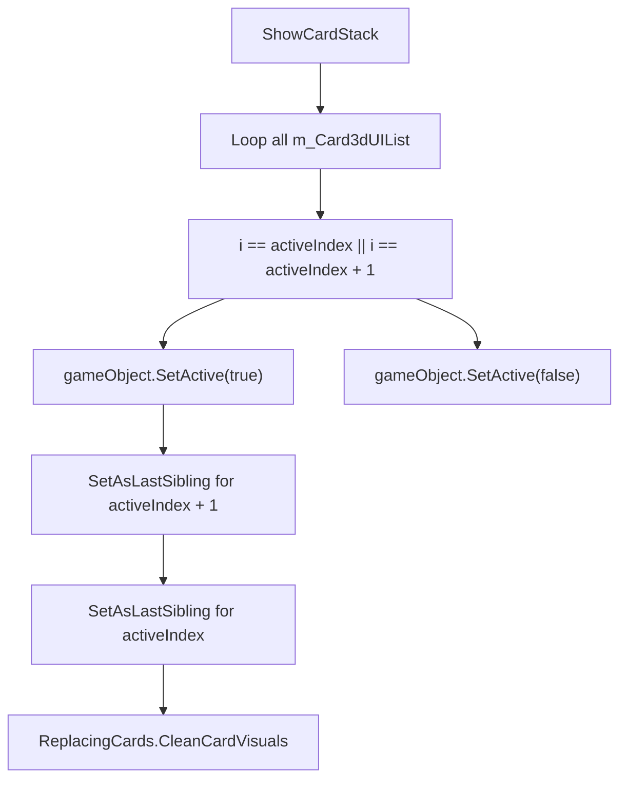
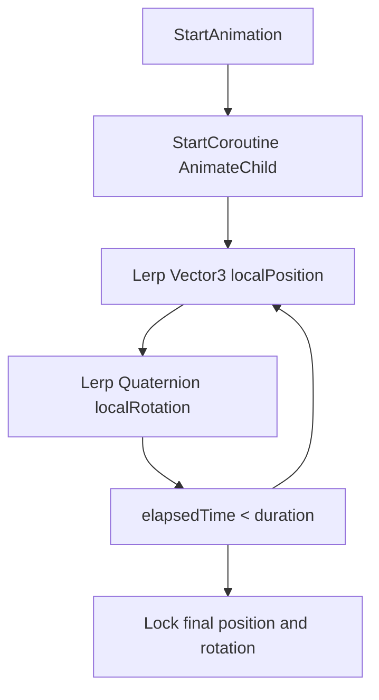

# Card Opening Sequence

> **Relevant source files**
> * [patch/AnimationOpeningDisplay.cs](https://github.com/Drakilis-57/WankulCrazy/blob/57b1f5ed/patch/AnimationOpeningDisplay.cs)
> * [patch/CardOpening.cs](https://github.com/Drakilis-57/WankulCrazy/blob/57b1f5ed/patch/CardOpening.cs)
> * [patch/CardOpeningHelpers.cs](https://github.com/Drakilis-57/WankulCrazy/blob/57b1f5ed/patch/CardOpeningHelpers.cs)
> * [utils/AnimationCopier.cs](https://github.com/Drakilis-57/WankulCrazy/blob/57b1f5ed/utils/AnimationCopier.cs)

## Purpose and Scope

The `CardOpening` system manages the booster pack opening loop in *WankulCrazy*, intercepting vanilla game logic via Harmony patches to support custom booster formats (such as 4-card gold boosters versus standard 10-card boosters), active card stack rendering, private field accessors, and card-opening animations. The primary logic is split across `patch/CardOpening.cs`, `patch/CardOpeningHelpers.cs`, `patch/AnimationOpeningDisplay.cs`, and `utils/AnimationCopier.cs`.

Sources: `patch/CardOpening.cs:1-152`, `patch/CardOpeningHelpers.cs:1-125`, `patch/AnimationOpeningDisplay.cs:1-38`, `utils/AnimationCopier.cs:1-55`

---

## 1. State Machine & Booster Sizes

The card opening process is governed by the vanilla `CardOpeningSequence` state machine. `CardOpening` hooks into state transitions to override booster sizes depending on the item type being opened and flushes shop experience when state index `11` is reached [patch/CardOpening.cs L26-L34](https://github.com/Drakilis-57/WankulCrazy/blob/57b1f5ed/patch/CardOpening.cs#L26-L34)

### Booster Size Determination

When a booster screen opens, `OpenScreenPrefix` invokes `CheckBoosterSize`, which evaluates the current item type (`BoosterGoldBattle` or `BoosterGoldStellar`) to set `boosterSize` to `4`, defaulting to `10` for standard packs [patch/CardOpening.cs

NaN-NaN](https://github.com/Drakilis-57/WankulCrazy/blob/57b1f5ed/patch/CardOpening.cs#LNaN-LNaN)

Sources: `patch/CardOpening.cs:26-123`

---

## 2. Card Stack Rendering & Visual Hygiene

To optimize rendering and enforce proper visual layering during card flipping, `ShowCardStack` isolates the active card and the immediate next card (`activeIndex + 1`), disabling all other card GameObjects (`SetActive(false)`) [patch/CardOpening.cs L58-L70](https://github.com/Drakilis-57/WankulCrazy/blob/57b1f5ed/patch/CardOpening.cs#L58-L70)

### Z-Index and Canvas Hierarchy

Because Unity UI relies on sibling index order within a `CanvasWorldspace` to determine rendering priority (last child renders on top), `ShowCardStack` forces the background card and active card into correct sibling order using `SetAsLastSibling()` [patch/CardOpening.cs L72-L83](https://github.com/Drakilis-57/WankulCrazy/blob/57b1f5ed/patch/CardOpening.cs#L72-L83)

 Finally, it cleans up foil attributes, glitter shaders, and vanilla stats on active and upcoming cards using `ReplacingCards.CleanCardVisuals` [patch/CardOpening.cs L85-L100](https://github.com/Drakilis-57/WankulCrazy/blob/57b1f5ed/patch/CardOpening.cs#L85-L100)

Sources: `patch/CardOpening.cs:58-100`

---

## 3. CardOpeningHelpers Accessor Layer

Because `CardOpeningSequence` encapsulates its state in private fields, `CardOpeningHelpers` acts as a static bridge exposing typed getters and setters via `Plugin.GetPProperty` and `Plugin.SetPProperty` [patch/CardOpeningHelpers.cs L1-L125](https://github.com/Drakilis-57/WankulCrazy/blob/57b1f5ed/patch/CardOpeningHelpers.cs#L1-L125)

| Category | Helper Methods | Underlying Property Target |
| --- | --- | --- |
| **Flags** | `GetIsScreenActive`, `SetIsScreenActive` | `m_IsScreenActive` [patch/CardOpeningHelpers.cs L14-L17](https://github.com/Drakilis-57/WankulCrazy/blob/57b1f5ed/patch/CardOpeningHelpers.cs#L14-L17) |
| **Flags** | `GetIsAutoFire`, `SetIsAutoFire` | `m_IsAutoFire` [patch/CardOpeningHelpers.cs L34-L37](https://github.com/Drakilis-57/WankulCrazy/blob/57b1f5ed/patch/CardOpeningHelpers.cs#L34-L37) |
| **Timers** | `GetSlider`, `SetSlider` | `m_Slider` [patch/CardOpeningHelpers.cs L54-L57](https://github.com/Drakilis-57/WankulCrazy/blob/57b1f5ed/patch/CardOpeningHelpers.cs#L54-L57) |
| **Indexes** | `GetCurrentOpenedCardIndex`, `SetCurrentOpenedCardIndex` | `m_CurrentOpenedCardIndex` [patch/CardOpeningHelpers.cs L82-L85](https://github.com/Drakilis-57/WankulCrazy/blob/57b1f5ed/patch/CardOpeningHelpers.cs#L82-L85) |
| **Lists** | `GetRolledCardDataList` | `m_RolledCardDataList` [patch/CardOpeningHelpers.cs L115-L117](https://github.com/Drakilis-57/WankulCrazy/blob/57b1f5ed/patch/CardOpeningHelpers.cs#L115-L117) |
| **Item** | `GetCurrentItem`, `SetCurrentItem` | `m_CurrentItem` [patch/CardOpeningHelpers.cs L120-L123](https://github.com/Drakilis-57/WankulCrazy/blob/57b1f5ed/patch/CardOpeningHelpers.cs#L120-L123) |

Sources: `patch/CardOpeningHelpers.cs:1-125`

---

## 4. Animations & Coroutines

Card unpacking visuals are orchestrated by `AnimationOpeningDisplay` and supported by `AnimationCopier` [patch/AnimationOpeningDisplay.cs

NaN-NaN](https://github.com/Drakilis-57/WankulCrazy/blob/57b1f5ed/patch/AnimationOpeningDisplay.cs#LNaN-LNaN)

### Coroutine Display Loop

`AnimationOpeningDisplay` runs an `AnimateChild` coroutine that lerps a card transform from a starting position and rotation (`Quaternion.Euler(90, 180, 0)`) to an end position and rotation (`Quaternion.Euler(180, 180, 0)`) over a duration of `1.5` seconds [patch/AnimationOpeningDisplay.cs L8-L31](https://github.com/Drakilis-57/WankulCrazy/blob/57b1f5ed/patch/AnimationOpeningDisplay.cs#L8-L31)

Sources: `patch/AnimationOpeningDisplay.cs:1-38`

### Animation Cloning

`AnimationCopier` provides helper routines to extract `AnimationClip` data from a source `GameObject` and inject them into a target `GameObject`'s `Animation` component [utils/AnimationCopier.cs L1-L55](https://github.com/Drakilis-57/WankulCrazy/blob/57b1f5ed/utils/AnimationCopier.cs#L1-L55)

Sources: `utils/AnimationCopier.cs:1-55`