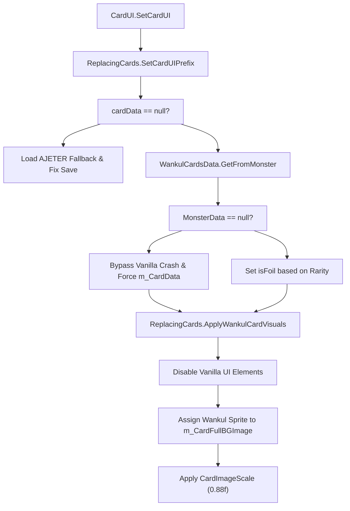
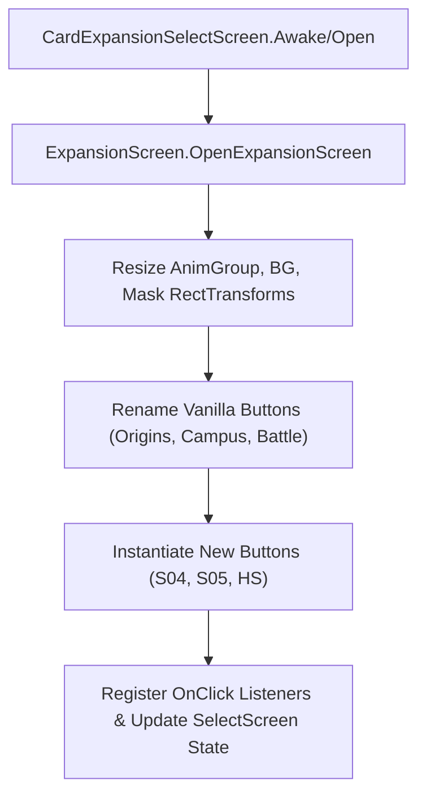
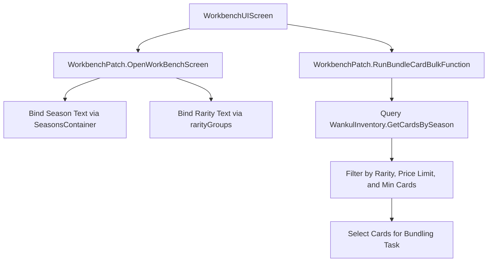
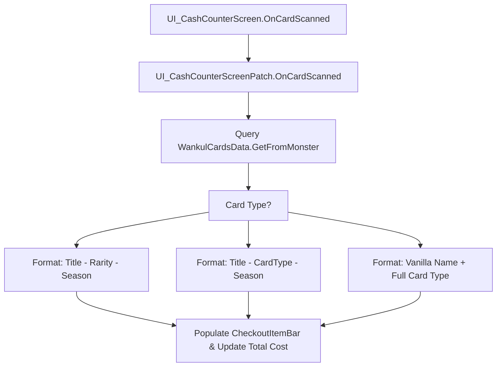
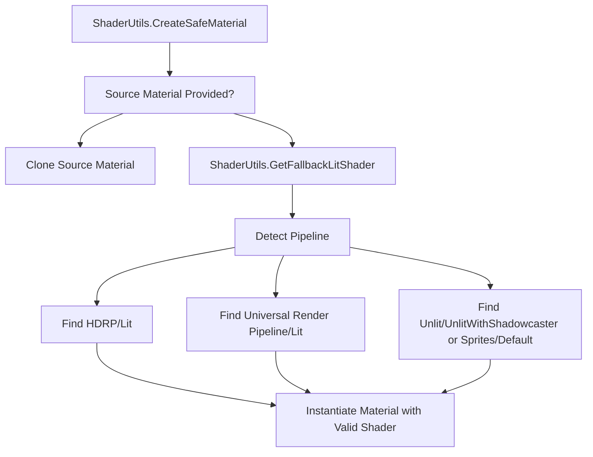

# Card Rendering and UI Replacement

> **Relevant source files**
> * [cards/SortSeasonType.cs](https://github.com/Drakilis-57/WankulCrazy/blob/57b1f5ed/cards/SortSeasonType.cs)
> * [patch/ExpansionScreen.cs](https://github.com/Drakilis-57/WankulCrazy/blob/57b1f5ed/patch/ExpansionScreen.cs)
> * [patch/ReplacingCards.cs](https://github.com/Drakilis-57/WankulCrazy/blob/57b1f5ed/patch/ReplacingCards.cs)
> * [patch/SortUI.cs](https://github.com/Drakilis-57/WankulCrazy/blob/57b1f5ed/patch/SortUI.cs)
> * [patch/UI_CashCounterScreenPatch.cs](https://github.com/Drakilis-57/WankulCrazy/blob/57b1f5ed/patch/UI_CashCounterScreenPatch.cs)
> * [patch/WindowsPosters.cs](https://github.com/Drakilis-57/WankulCrazy/blob/57b1f5ed/patch/WindowsPosters.cs)
> * [patch/workbench/WorkbenchPatch.cs](https://github.com/Drakilis-57/WankulCrazy/blob/57b1f5ed/patch/workbench/WorkbenchPatch.cs)
> * [utils/ShaderUtils.cs](https://github.com/Drakilis-57/WankulCrazy/blob/57b1f5ed/utils/ShaderUtils.cs)
> * [utils/TextureUtils.cs](https://github.com/Drakilis-57/WankulCrazy/blob/57b1f5ed/utils/TextureUtils.cs)
> * [utils/obj/OBJLoaderHelper.cs](https://github.com/Drakilis-57/WankulCrazy/blob/57b1f5ed/utils/obj/OBJLoaderHelper.cs)

## Purpose and Scope

This page details the technical implementation of card rendering overrides, UI layout modifications, store environment customization, and shader/texture utilities in `WankulCrazy`. It covers how vanilla UI components and game screens are intercepted via Harmony patches to display Wankul-specific assets, manage custom expansion packs, operate the workbench, render custom store posters, and prevent rendering failures (such as magenta shaders in custom rendering pipelines).

---

## 1. CardUI Visual Replacement (ReplacingCards)

The core of card visual substitution is handled by `ReplacingCards`, which intercepts `CardUI.SetCardUI` execution via a prefix patch (`SetCardUIPrefix`) [patch/ReplacingCards.cs L16-L78](https://github.com/Drakilis-57/WankulCrazy/blob/57b1f5ed/patch/ReplacingCards.cs#L16-L78)

When a card is rendered in the UI, the patch performs the following steps:

1. **Save Validation & Recovery**: If `cardData` is null (indicating a broken or corrupted save slot), it defaults to an unassociated card fallback using `WankulCardsData.GetAJETER()` and injects it into player data [patch/ReplacingCards.cs L22-L35](https://github.com/Drakilis-57/WankulCrazy/blob/57b1f5ed/patch/ReplacingCards.cs#L22-L35)
2. **Monster Data Mapping**: It fetches the corresponding `WankulCardData` via `WankulCardsData.Instance.GetFromMonster(gameCardData, true)` [patch/ReplacingCards.cs L39](https://github.com/Drakilis-57/WankulCrazy/blob/57b1f5ed/patch/ReplacingCards.cs#L39-L39)  If vanilla monster data is missing (e.g., custom IDs $\ge 122$), it intercepts the call to prevent a `NullReferenceException`, assigns `m_CardData` manually, executes Wankul visuals, and aborts the original vanilla method execution by returning `false` [patch/ReplacingCards.cs L40-L75](https://github.com/Drakilis-57/WankulCrazy/blob/57b1f5ed/patch/ReplacingCards.cs#L40-L75)
3. **Foil and Champion Overrides**: Forces `isFoil` and `isChampionCard` flags based on rarity thresholds (e.g., `EffigyCardData` with `Rarity >= Rarity.UR1` automatically becomes foil) [patch/ReplacingCards.cs L53-L64](https://github.com/Drakilis-57/WankulCrazy/blob/57b1f5ed/patch/ReplacingCards.cs#L53-L64)
4. **Visual Replacement (`ApplyWankulCardVisuals`)**: Disables standard background, border, and front layer GameObjects (`__instance.m_CardBGImage`, `__instance.m_CardBorderImage`, `__instance.m_CardFrontImage`, etc.). It enables `m_CardFullBGImage`, assigns the custom Wankul sprite (or falls back to AJETER), sets preserve aspect ratios, and applies a scaling factor (`CardImageScale = 0.88f`) [patch/ReplacingCards.cs L82-L165](https://github.com/Drakilis-57/WankulCrazy/blob/57b1f5ed/patch/ReplacingCards.cs#L82-L165)

*Sources: [patch/ReplacingCards.cs L16-L165](https://github.com/Drakilis-57/WankulCrazy/blob/57b1f5ed/patch/ReplacingCards.cs#L16-L165)*

---

## 2. Album Sorting, Expansion Screens, and Filtering

WankulCrazy replaces vanilla expansion and sorting screens to support Wankul seasons (`S01`, `S02`, `S03`, `S04`, `S05`, `HS`) instead of vanilla identifiers.

### Album Sorting (SortUI)

`SortUI` intercepts `CollectionBinderUI` operations to inject custom season filtering buttons. It replaces the `m_ExpansionBtnList` with dynamically generated Wankul season buttons (`ALL_Button`, `S01_Button`, etc.), hides vanilla title texts/backgrounds, and disables layout groups that conflict with custom positioning [patch/SortUI.cs L35-L130](https://github.com/Drakilis-57/WankulCrazy/blob/57b1f5ed/patch/SortUI.cs#L35-L130)

### Expansion Selection (ExpansionScreen)

`ExpansionScreen` patches `CardExpansionSelectScreen` [patch/ExpansionScreen.cs L11-L122](https://github.com/Drakilis-57/WankulCrazy/blob/57b1f5ed/patch/ExpansionScreen.cs#L11-L122)

 It resizes container rects (`AnimGroup`, `BG`, `Mask`) and re-maps vanilla expansion button labels to Wankul equivalents:

* `Tetramon_Button` $\rightarrow$ "Origins" [patch/ExpansionScreen.cs L42-L43](https://github.com/Drakilis-57/WankulCrazy/blob/57b1f5ed/patch/ExpansionScreen.cs#L42-L43)
* `Destiny_Button` $\rightarrow$ "Campus" [patch/ExpansionScreen.cs L49-L50](https://github.com/Drakilis-57/WankulCrazy/blob/57b1f5ed/patch/ExpansionScreen.cs#L49-L50)
* `Ghost_Button` $\rightarrow$ "Battle" [patch/ExpansionScreen.cs L52-L53](https://github.com/Drakilis-57/WankulCrazy/blob/57b1f5ed/patch/ExpansionScreen.cs#L52-L53)

Furthermore, it programmatically instantiates new UI GameObjects for `S04`, `S05`, and `HS` seasons, attaching event listeners that update `CardExpansionSelectScreen` indices dynamically [patch/ExpansionScreen.cs L69-L122](https://github.com/Drakilis-57/WankulCrazy/blob/57b1f5ed/patch/ExpansionScreen.cs#L69-L122)

*Sources: [patch/ExpansionScreen.cs L11-L122](https://github.com/Drakilis-57/WankulCrazy/blob/57b1f5ed/patch/ExpansionScreen.cs#L11-L122)

 [patch/SortUI.cs L35-L130](https://github.com/Drakilis-57/WankulCrazy/blob/57b1f5ed/patch/SortUI.cs#L35-L130)*

---

## 3. Workbench UI and Bulk Operations (WorkbenchPatch)

The workbench UI is adapted to filter and bundle Wankul cards according to custom season and rarity groups [patch/workbench/WorkbenchPatch.cs L15-L128](https://github.com/Drakilis-57/WankulCrazy/blob/57b1f5ed/patch/workbench/WorkbenchPatch.cs#L15-L128)

* **Rarity Groups (`rarityGroups`)**: Maps integer indices to custom labels and rarity sets (e.g., `0`: "Toute Rareté", `1`: "Commune", `2`: "Peu Commune", `3`: "Rare", `4`: "Terrains") [patch/workbench/WorkbenchPatch.cs L22-L29](https://github.com/Drakilis-57/WankulCrazy/blob/57b1f5ed/patch/workbench/WorkbenchPatch.cs#L22-L29)
* **Screen Initialization (`OpenWorkBenchScreen`)**: Updates `WorkbenchUIScreen` fields, setting expansion names from `SeasonsContainer.Seasons` and bounding price limits [patch/workbench/WorkbenchPatch.cs L80-L86](https://github.com/Drakilis-57/WankulCrazy/blob/57b1f5ed/patch/workbench/WorkbenchPatch.cs#L80-L86)
* **Bulk Processing (`RunBundleCardBulkFunction`)**: Queries inventory via `WankulInventory.GetCardsBySeason()`, filtering `EffigyCardData` and `TerrainCardData` based on active sliders (price limit, minimum card quantity, rarity limits) to bundle cards automatically [patch/workbench/WorkbenchPatch.cs L88-L128](https://github.com/Drakilis-57/WankulCrazy/blob/57b1f5ed/patch/workbench/WorkbenchPatch.cs#L88-L128)

*Sources: [patch/workbench/WorkbenchPatch.cs L15-L128](https://github.com/Drakilis-57/WankulCrazy/blob/57b1f5ed/patch/workbench/WorkbenchPatch.cs#L15-L128)*

---

## 4. Store Environment and Cash Counter Integration

### Windows Posters (WindowsPosters)

`WindowsPosters` initializes custom posters on store door windows (`StoreModel_Group/Windows door`) [patch/WindowsPosters.cs L13-L15](https://github.com/Drakilis-57/WankulCrazy/blob/57b1f5ed/patch/WindowsPosters.cs#L13-L15)

 It creates primitive `Quad` GameObjects at predefined local positions, loads PNG assets from the mod directory, configures materials safely using `ShaderUtils.CreateSafeMaterial()`, and adjusts aspect ratios based on texture dimensions [patch/WindowsPosters.cs L17-L68](https://github.com/Drakilis-57/WankulCrazy/blob/57b1f5ed/patch/WindowsPosters.cs#L17-L68)

### Cash Counter Screen (UI_CashCounterScreenPatch)

`UI_CashCounterScreenPatch` overrides `OnCardScanned` to inspect scanned cards and display detailed Wankul metadata (title, rarity, season, or custom card type) directly inside checkout item bars (`__instance.m_CheckoutItemBarList`) [patch/UI_CashCounterScreenPatch.cs L11-L52](https://github.com/Drakilis-57/WankulCrazy/blob/57b1f5ed/patch/UI_CashCounterScreenPatch.cs#L11-L52)

*Sources: [patch/UI_CashCounterScreenPatch.cs L9-L52](https://github.com/Drakilis-57/WankulCrazy/blob/57b1f5ed/patch/UI_CashCounterScreenPatch.cs#L9-L52)

 [patch/WindowsPosters.cs L11-L70](https://github.com/Drakilis-57/WankulCrazy/blob/57b1f5ed/patch/WindowsPosters.cs#L11-L70)*

---

## 5. Shader and Texture Pipeline Utilities

To prevent rendering breakages (such as full-screen magenta materials caused by missing shaders in HDRP/URP pipelines), WankulCrazy relies on robust utility classes [utils/ShaderUtils.cs L6-L12](https://github.com/Drakilis-57/WankulCrazy/blob/57b1f5ed/utils/ShaderUtils.cs#L6-L12)

:

* **Pipeline-Aware Fallbacks (`ShaderUtils`)**: `GetFallbackLitShader()` detects whether the active render pipeline is HDRP, URP, or Built-in. For Built-in or unrecognised pipelines, it avoids the obsolete/stripped `"Standard"` shader, preferring compiled fallbacks like `"Unlit/UnlitWithShadowcaster"` or `"Sprites/Default"` [utils/ShaderUtils.cs L18-L62](https://github.com/Drakilis-57/WankulCrazy/blob/57b1f5ed/utils/ShaderUtils.cs#L18-L62)
* **Safe Material Instantiation (`ShaderUtils.CreateSafeMaterial`)**: Guarantees that newly created materials will not trigger magenta errors [utils/ShaderUtils.cs L106-L116](https://github.com/Drakilis-57/WankulCrazy/blob/57b1f5ed/utils/ShaderUtils.cs#L106-L116)
* **CPU-Readable Textures (`TextureUtils`)**: `MakeTextureReadable()` copies GPU textures via temporary render textures so that CPU-side operations (`GetPixels()`) can safely inspect pixel data without violating graphics memory restrictions [utils/TextureUtils.cs L10-L29](https://github.com/Drakilis-57/WankulCrazy/blob/57b1f5ed/utils/TextureUtils.cs#L10-L29)

*Sources: [utils/ShaderUtils.cs L13-L116](https://github.com/Drakilis-57/WankulCrazy/blob/57b1f5ed/utils/ShaderUtils.cs#L13-L116)

 [utils/TextureUtils.cs L8-L39](https://github.com/Drakilis-57/WankulCrazy/blob/57b1f5ed/utils/TextureUtils.cs#L8-L39)*