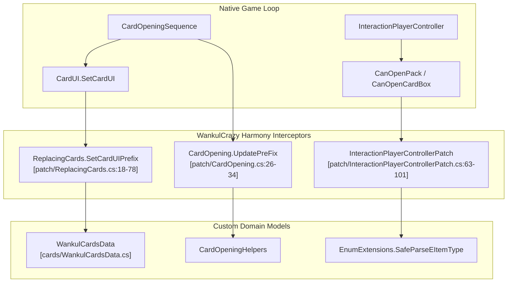

# Correctifs de gameplay

> **Fichiers sources pertinents**
> * [patch/CardOpening.cs](https://github.com/Drakilis-57/WankulCrazy/blob/57b1f5ed/patch/CardOpening.cs)
> * [patch/InteractionPlayerControllerPatch.cs](https://github.com/Drakilis-57/WankulCrazy/blob/57b1f5ed/patch/InteractionPlayerControllerPatch.cs)
> * [patch/ReplacingCards.cs](https://github.com/Drakilis-57/WankulCrazy/blob/57b1f5ed/patch/ReplacingCards.cs)

La couche Gameplay Patches constitue le principal intercepteur d’exécution de `WankulCrazy`.Construite sur Harmony (`HarmonyLib`), cette couche s'intègre aux systèmes natifs de TCG Card Shop Simulator pour rediriger la visualisation des cartes, les flux de travail d'ouverture des boosters, les capacités d'inventaire des joueurs, les contraintes d'interaction et les modèles de tarification économiques.En interceptant les hooks de cycle de vie, des méthodes telles que `CardUI.SetCardUI` [patch/ReplacingCards.cs:18-78] et `InteractionPlayerController.Awake` [patch/InteractionPlayerControllerPatch.cs:23-61] sont réutilisées pour gérer les entités Wankul personnalisées sans altérer de manière permanente l'assemblage de jeu sous-jacent.

This parent page provides a high-level summary of the gameplay subsystems managed via Harmony patches. For granular technical details, implementation specifics, and execution flows, refer to the respective child pages:

* Séquence d'ouverture de carte : voir [Séquence d'ouverture de carte](/Drakilis-57/WankulCrazy/3.1-card-opening-sequence)
* Interaction des joueurs et boîtes de cartes : voir [Interaction des joueurs et boîtes de cartes](/Drakilis-57/WankulCrazy/3.2-player-interaction-and-card-boxes)
* Rendu de carte et remplacement de l'interface utilisateur : voir [Rendu de carte et remplacement de l'interface utilisateur](/Drakilis-57/WankulCrazy/3.3-card-rendering-and-ui-replacement)
* Économie : tarification et échanges : voir [Économie : tarification et échanges](/Drakilis-57/WankulCrazy/3.4-economy:-pricing-and-trades)

Sources : [patch/CardOpening.cs L1-L48](https://github.com/Drakilis-57/WankulCrazy/blob/57b1f5ed/patch/CardOpening.cs#L1-L48)

 [patch/ReplacingCards.cs L1-L78](https://github.com/Drakilis-57/WankulCrazy/blob/57b1f5ed/patch/ReplacingCards.cs#L1-L78)

 [patch/InteractionPlayerControllerPatch.cs L1-L61](https://github.com/Drakilis-57/WankulCrazy/blob/57b1f5ed/patch/InteractionPlayerControllerPatch.cs#L1-L61)

---

## Architecture et flux de correctifs

The following diagram illustrates how external game events and native loops are intercepted by WankulCrazy Harmony patches before reaching vanilla engine components.

Sources : [patch/CardOpening.cs L26-L47](https://github.com/Drakilis-57/WankulCrazy/blob/57b1f5ed/patch/CardOpening.cs#L26-L47)

 [patch/ReplacingCards.cs L18-L78](https://github.com/Drakilis-57/WankulCrazy/blob/57b1f5ed/patch/ReplacingCards.cs#L18-L78)

 [patch/InteractionPlayerControllerPatch.cs L63-L101](https://github.com/Drakilis-57/WankulCrazy/blob/57b1f5ed/patch/InteractionPlayerControllerPatch.cs#L63-L101)

---

## 3.1 Séquence d'ouverture de carte

The card opening layer manages the state machine and visual stack during booster unboxing. Handled primarily within `CardOpening`, it supports dynamic booster sizes (such as 4-card Gold boosters versus 10-card standard packs) [patch/CardOpening.cs:103-123], guarantees specific rarity drops, implements auto-fire mechanics, and orchestrates the canvas hierarchy so that active cards render strictly above background stacks [patch/CardOpening.cs:58-100].

Pour plus de détails sur l'implémentation des transitions d'état, des listes d'animation personnalisées et des utilitaires d'assistance, voir [Séquence d'ouverture de carte](/Drakilis-57/WankulCrazy/3.1-card-opening-sequence).

Sources : [patch/CardOpening.cs L16-L152](https://github.com/Drakilis-57/WankulCrazy/blob/57b1f5ed/patch/CardOpening.cs#L16-L152)

---

## 3.2 Interaction des joueurs et boîtes à cartes

Les interactions des joueurs, telles que la conservation des packs, l'évaluation des mappages boîte à pack et la gestion des contraintes de disposition physique, sont régies par `InteractionPlayerControllerPatch` [patch/InteractionPlayerControllerPatch.cs:16-61].Ce correctif étend le nombre maximal d'emplacements de pack pouvant être conservés (`MaxPacks = 24`) [patch/InteractionPlayerControllerPatch.cs:18] sur deux colonnes, introduit une validation dynamique des types d'objets pour les types de boosters stellaires et hérités [patch/InteractionPlayerControllerPatch.cs:63-101] et mappe les boîtes d'affichage scellées aux variantes de pack de cartes correspondantes [patch/InteractionPlayerControllerPatch.cs:103-120].

For detailed information on mesh swapping, spawn lerp coroutines, and item mapping routines, see [Player Interaction and Card Boxes](/Drakilis-57/WankulCrazy/3.2-player-interaction-and-card-boxes).

Sources : [patch/InteractionPlayerControllerPatch.cs L16-L120](https://github.com/Drakilis-57/WankulCrazy/blob/57b1f5ed/patch/InteractionPlayerControllerPatch.cs#L16-L120)

---

## 3.3 Rendu de carte et remplacement de l'interface utilisateur

Pour transformer complètement la présentation visuelle des cartes, `ReplacingCards` intercepte les méthodes `CardUI` [patch/ReplacingCards.cs:18-78].Il remplace les arrière-plans, les bordures et les portraits des cartes Vanilla par des sprites Wankul personnalisés, gère les seuils de rendu des feuilles en fonction des raretés `EffigyCardData` [patch/ReplacingCards.cs:56-64] et applique les paramètres de mise à l'échelle de l'arrière-plan complet (`CardImageScale`) [patch/ReplacingCards.cs:80].Il protège également contre les états de sauvegarde corrompus ou hors limites en revenant aux structures de cartes de débogage telles que `WankulCardsData.GetAJETER()` [patch/ReplacingCards.cs:27-35].

Pour plus de détails sur les pages de classeur, le tri des extensions d'interface utilisateur, les interfaces d'atelier et le remplacement d'affiches, voir [Rendu de carte et remplacement de l'interface utilisateur](/Drakilis-57/WankulCrazy/3.3-card-rendering-and-ui-replacement).

Sources: [patch/ReplacingCards.cs L1-L179](https://github.com/Drakilis-57/WankulCrazy/blob/57b1f5ed/patch/ReplacingCards.cs#L1-L179)

---

## 3.4 Économie : tarification et échanges

Les correctifs économiques gèrent l'historique d'évaluation des cartes, les algorithmes de génération de prix dynamiques et les offres commerciales des clients.En corrigeant les classes économiques de base, `WankulCrazy` garantit que les valorisations des cartes personnalisées s'alignent sur les niveaux de rareté, les types d'extension et les fluctuations historiques du marché.

Pour les spécifications techniques complètes sur la logique de tarification, les modifications `CheckPriceUI` et les hooks de persistance des données des joueurs, voir [Économie : tarification et échanges](/Drakilis-57/WankulCrazy/3.4-economy:-pricing-and-trades).

Sources : [patch/ReplacingCards.cs L1-L179](https://github.com/Drakilis-57/WankulCrazy/blob/57b1f5ed/patch/ReplacingCards.cs#L1-L179)