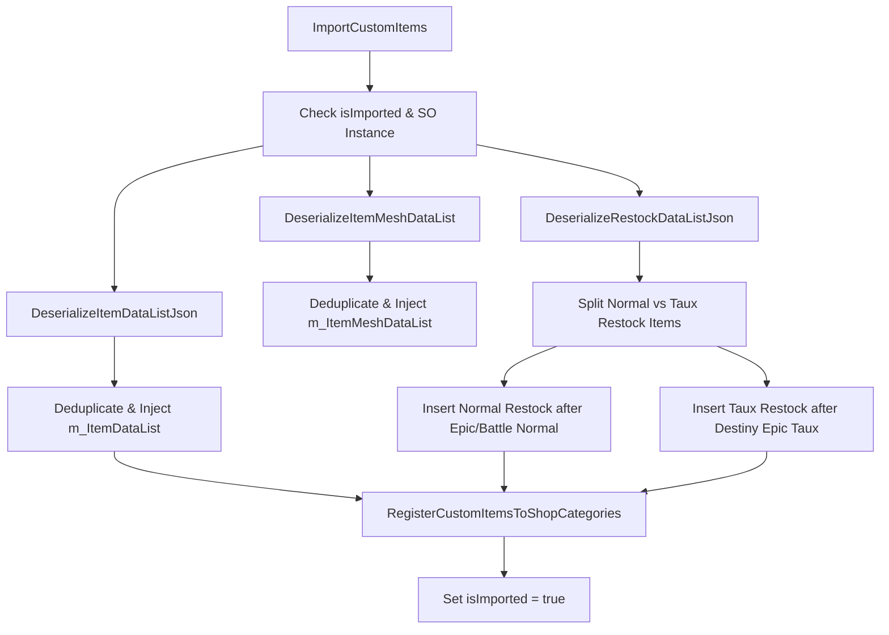
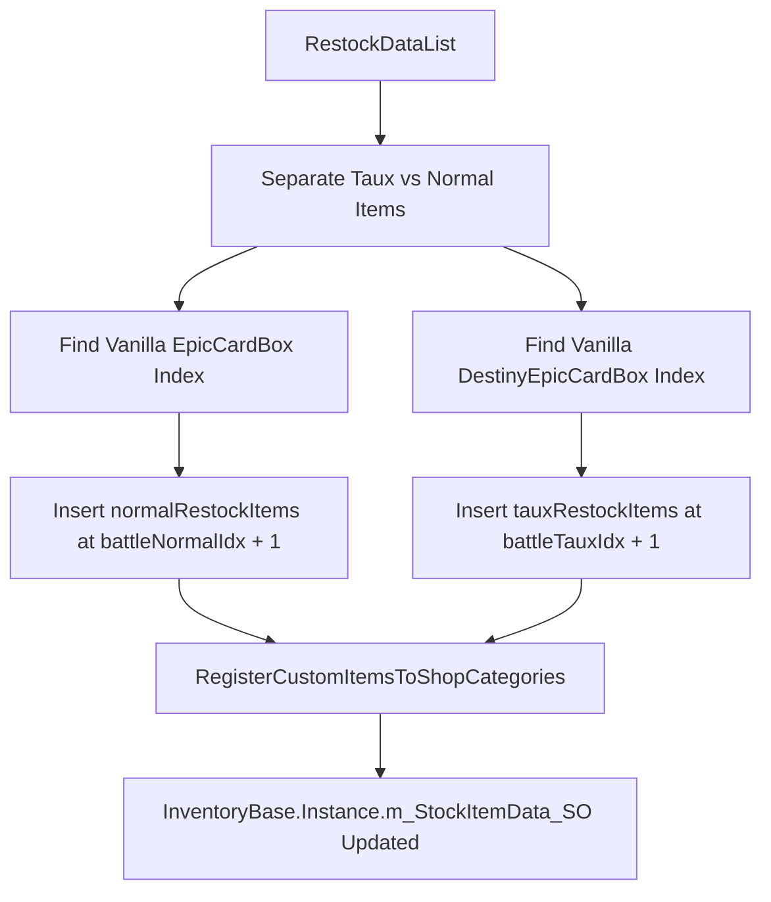

# Custom Items and Shop Registration

> **Relevant source files**
> * [data/customitems/ItemDataList.json](https://github.com/Drakilis-57/WankulCrazy/blob/57b1f5ed/data/customitems/ItemDataList.json)
> * [data/customitems/itemMeshDataList.json](https://github.com/Drakilis-57/WankulCrazy/blob/57b1f5ed/data/customitems/itemMeshDataList.json)
> * [data/customitems/restockDataList.json](https://github.com/Drakilis-57/WankulCrazy/blob/57b1f5ed/data/customitems/restockDataList.json)
> * [importer/CustomItemsImporter.cs](https://github.com/Drakilis-57/WankulCrazy/blob/57b1f5ed/importer/CustomItemsImporter.cs)

## Purpose and Scope

This page details the implementation of the custom asset importing pipeline centered around `CustomItemsImporter` [importer/CustomItemsImporter.cs L13-L100](https://github.com/Drakilis-57/WankulCrazy/blob/57b1f5ed/importer/CustomItemsImporter.cs#L13-L100)

 It covers how JSON-driven definitions for items, restock rules, and meshes are deserialized, deduplicated, and injected into the base game's ScriptableObject inventory databases (`InventoryBase`) [importer/CustomItemsImporter.cs L23-L98](https://github.com/Drakilis-57/WankulCrazy/blob/57b1f5ed/importer/CustomItemsImporter.cs#L23-L98)

 Furthermore, it documents the structural JSON schemas (`ItemData`, `RestockData`, `ItemMeshData`), chronological restock placement algorithms, shop category registration, and special handling of high-drop-rate `Taux` variants.

---

## 1. CustomItemsImporter Pipeline & Data Flow

The custom items pipeline is orchestrated by the `CustomItemsImporter` class [importer/CustomItemsImporter.cs L13](https://github.com/Drakilis-57/WankulCrazy/blob/57b1f5ed/importer/CustomItemsImporter.cs#L13-L13)

 When triggered, `ImportCustomItems()` [importer/CustomItemsImporter.cs:20] verifies that the import has not already occurred (`isImported` flag) and that the inventory ScriptableObject reference (`InventoryBase.Instance.m_StockItemData_SO`) is available [importer/CustomItemsImporter.cs L22-L23](https://github.com/Drakilis-57/WankulCrazy/blob/57b1f5ed/importer/CustomItemsImporter.cs#L22-L23)

The pipeline executes in three major phases:

1. **Deserialization**: Loads and parses `ItemDataList.json`, `restockDataList.json`, and `itemMeshDataList.json` from the `data/customitems` directory using JSON.NET [importer/CustomItemsImporter.cs L27-L29](https://github.com/Drakilis-57/WankulCrazy/blob/57b1f5ed/importer/CustomItemsImporter.cs#L27-L29)
2. **Deduplication and Injection**: Clears existing items and meshes matching custom names to prevent duplicates, then appends the newly parsed items into `m_ItemDataList` and `m_ItemMeshDataList` [importer/CustomItemsImporter.cs L31-L44](https://github.com/Drakilis-57/WankulCrazy/blob/57b1f5ed/importer/CustomItemsImporter.cs#L31-L44)
3. **Restock Chronology & Shop Categorization**: Sorts restock entries into normal and `Taux` variant lists, inserts them into specific chronological indices relative to base game items, and registers them into shop display categories [importer/CustomItemsImporter.cs L47-L95](https://github.com/Drakilis-57/WankulCrazy/blob/57b1f5ed/importer/CustomItemsImporter.cs#L47-L95)

### Importer Execution Flow



*Sources: [importer/CustomItemsImporter.cs L20-L99](https://github.com/Drakilis-57/WankulCrazy/blob/57b1f5ed/importer/CustomItemsImporter.cs#L20-L99)*

---

## 2. JSON Schemas: ItemData, RestockData, and ItemMeshData

Custom assets rely on three distinct JSON schema configurations stored under the `data/customitems/` directory.

### ItemData (ItemDataList.json)

Defines the core economic, dimensional, and category properties of items (boosters, displays, figurines, playmat, binders).

| Field | Type | Description |
| --- | --- | --- |
| `itemType` | `string` | Unique internal identifier (e.g., `BoosterStellar`, `CaleconStellar`) [data/customitems/ItemDataList.json L3-L85](https://github.com/Drakilis-57/WankulCrazy/blob/57b1f5ed/data/customitems/ItemDataList.json#L3-L85) |
| `name` | `string` | Display name of the item [data/customitems/ItemDataList.json L4-L86](https://github.com/Drakilis-57/WankulCrazy/blob/57b1f5ed/data/customitems/ItemDataList.json#L4-L86) |
| `category` | `string` | Shop category (`TCG`, `Figurine`, `Playmat`) [data/customitems/ItemDataList.json L5-L145](https://github.com/Drakilis-57/WankulCrazy/blob/57b1f5ed/data/customitems/ItemDataList.json#L5-L145) |
| `baseCost` | `float` | Base purchase cost from wholesalers [data/customitems/ItemDataList.json L8-L28](https://github.com/Drakilis-57/WankulCrazy/blob/57b1f5ed/data/customitems/ItemDataList.json#L8-L28) |
| `marketPriceMinPercent` / `maxPercent` | `float` | Fluctuating market price bounds [data/customitems/ItemDataList.json L9-L30](https://github.com/Drakilis-57/WankulCrazy/blob/57b1f5ed/data/customitems/ItemDataList.json#L9-L30) |
| `colliderScale` / `colliderPosOffset` | Vector3 | Physical collider sizing and position offsets for interaction [data/customitems/ItemDataList.json L18-L19](https://github.com/Drakilis-57/WankulCrazy/blob/57b1f5ed/data/customitems/ItemDataList.json#L18-L19) |

*Sources: [data/customitems/ItemDataList.json L1-L187](https://github.com/Drakilis-57/WankulCrazy/blob/57b1f5ed/data/customitems/ItemDataList.json#L1-L187)*

### RestockData (restockDataList.json)

Defines license requirements, box sizing, and box quantities available in the computer order system.

```json
{    "index": 0,    "name": "Booster Stellar (32)",    "isBigBox": false,    "amount": 32,    "licenseShopLevelRequired": 20,    "licensePrice": 10000,    "itemType": "BoosterStellar"}
```

*Sources: [data/customitems/restockDataList.json L1-L266](https://github.com/Drakilis-57/WankulCrazy/blob/57b1f5ed/data/customitems/restockDataList.json#L1-L266)*

### ItemMeshData (itemMeshDataList.json)

Controls whether the item is generated via a basic mesh copy (`CopyItem`) or loaded from an external `.obj` file (`ImportObj`), alongside texture bindings.

| Field | Type | Description |
| --- | --- | --- |
| `importType` | `string` | Strategy identifier: `CopyItem` or `ImportObj` [data/customitems/itemMeshDataList.json L3-L67](https://github.com/Drakilis-57/WankulCrazy/blob/57b1f5ed/data/customitems/itemMeshDataList.json#L3-L67) |
| `copyItemType` | `string` | Base game item type to clone geometry from [data/customitems/itemMeshDataList.json L6-L46](https://github.com/Drakilis-57/WankulCrazy/blob/57b1f5ed/data/customitems/itemMeshDataList.json#L6-L46) |
| `texture` | `string` | Filename of the custom diffuse/specular texture [data/customitems/itemMeshDataList.json L7-L70](https://github.com/Drakilis-57/WankulCrazy/blob/57b1f5ed/data/customitems/itemMeshDataList.json#L7-L70) |
| `obj` | `string` | Path to `.obj` geometry file (used when `ImportObj`) [data/customitems/itemMeshDataList.json L71](https://github.com/Drakilis-57/WankulCrazy/blob/57b1f5ed/data/customitems/itemMeshDataList.json#L71-L71) |

*Sources: [data/customitems/itemMeshDataList.json L1-L131](https://github.com/Drakilis-57/WankulCrazy/blob/57b1f5ed/data/customitems/itemMeshDataList.json#L1-L131)*

---

## 3. Shop Tab Registration and Restock Chronology

To ensure that custom licenses appear logically in the shop progression tree without overwriting vanilla licenses, `CustomItemsImporter` separates restock data into standard items and `Taux` variants [importer/CustomItemsImporter.cs L52-L91](https://github.com/Drakilis-57/WankulCrazy/blob/57b1f5ed/importer/CustomItemsImporter.cs#L52-L91)

### Chronological Insertion Logic

1. **Normal Restock Items**: Searched for the index of standard battle items (`EpicCardBox` or names containing `"Epic"`) and inserts the normal custom restock array immediately after [importer/CustomItemsImporter.cs L64-L72](https://github.com/Drakilis-57/WankulCrazy/blob/57b1f5ed/importer/CustomItemsImporter.cs#L64-L72)
2. **Taux Restock Items**: Targets high-drop-rate `Taux` items (`BoosterStellarTaux`, `DisplayStellarTaux`, `BoosterLegacyTaux`, `DisplayLegacyTaux`) and inserts them directly after vanilla `DestinyEpicCardBox` or equivalent `Taux` battle structures [importer/CustomItemsImporter.cs L52-L91](https://github.com/Drakilis-57/WankulCrazy/blob/57b1f5ed/importer/CustomItemsImporter.cs#L52-L91)

### Shop Registration Architecture



*Sources: [importer/CustomItemsImporter.cs L47-L98](https://github.com/Drakilis-57/WankulCrazy/blob/57b1f5ed/importer/CustomItemsImporter.cs#L47-L98)*

---

## 4. Taux Variants and Special Importer Configurations

`Taux` variants represent enhanced card packs featuring elevated drop rates. They utilize distinct item types (e.g., `BoosterStellarTaux` and `DisplayStellarTaux`) paired with modified custom icon files (`Icon_Booster_S4_TauxDrop.png`) and texture mappings (`Texture_Booster_S4_TauxDrop.png`) [data/customitems/ItemDataList.json L43-L81](https://github.com/Drakilis-57/WankulCrazy/blob/57b1f5ed/data/customitems/ItemDataList.json#L43-L81)

 [data/customitems/itemMeshDataList.json L20-L33](https://github.com/Drakilis-57/WankulCrazy/blob/57b1f5ed/data/customitems/itemMeshDataList.json#L20-L33)

Unlike standard booster packs which inherit baseline pricing, `Taux` variants feature scaled `baseCost` multipliers (e.g., `baseCost: 40` vs `20` for standard Stellar boosters) and are unlocked at higher shop license tiers (`licenseShopLevelRequired` up to `70`) [data/customitems/restockDataList.json L98-L193](https://github.com/Drakilis-57/WankulCrazy/blob/57b1f5ed/data/customitems/restockDataList.json#L98-L193)

 [data/customitems/ItemDataList.json L48](https://github.com/Drakilis-57/WankulCrazy/blob/57b1f5ed/data/customitems/ItemDataList.json#L48-L48)