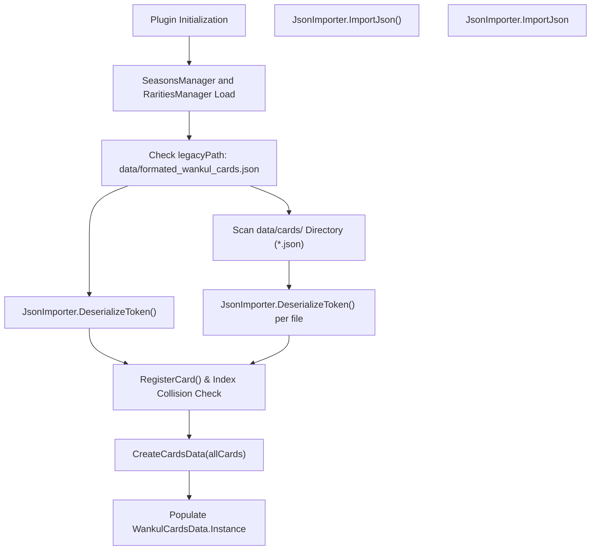
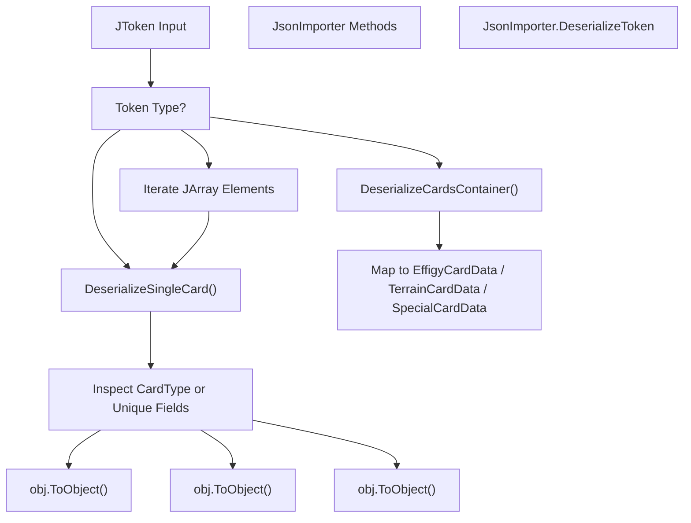
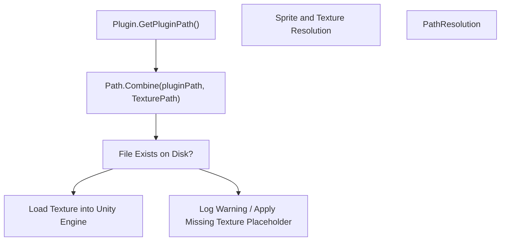

# Données JSON de la carte et importation

> **Fichiers sources pertinents**
> * [WankulCrazyPlugin.Tests/LegacyCardsRarityValidationTests.cs](https://github.com/Drakilis-57/WankulCrazy/blob/57b1f5ed/WankulCrazyPlugin.Tests/LegacyCardsRarityValidationTests.cs)
> * [data/cards/Legacy/legacy.json](https://github.com/Drakilis-57/WankulCrazy/blob/57b1f5ed/data/cards/Legacy/legacy.json)
> * [data/rarities.json](https://github.com/Drakilis-57/WankulCrazy/blob/57b1f5ed/data/rarities.json)
> * [importer/JsonImporter.cs](https://github.com/Drakilis-57/WankulCrazy/blob/57b1f5ed/importer/JsonImporter.cs)

Le but de cette page est de documenter la mise en œuvre technique de l'analyse des données de carte, les stratégies de désérialisation JSON, les structures de schéma héritées et la résolution des chemins d'actifs gérées par `JsonImporter` et les composants associés dans la base de code WankulCrazy.

---

## 1. Architecture de l'importateur et flux de données

Le pipeline d'importation de cartes est orchestré par `JsonImporter.ImportJson()` [importer/JsonImporter.cs:14-92] lors de l'initialisation du plugin.Il coordonne le chargement des fichiers de configuration, l'analyse des schémas à fichier unique existants et des répertoires multi-fichiers modulaires, la résolution des index de cartes et la validation des structures résultantes dans le singleton global du registre de cartes.

### Architecture du pipeline d'importateur

*Figure 1 : Flux architectural de haut niveau de `JsonImporter.ImportJson()`, du stockage sur disque brut à l'enregistrement du runtime.*

Sources : `importer/JsonImporter.cs:12-92`

---

## 2. Stratégies de désérialisation et polymorphisme

`JsonImporter` implémente une stratégie de désérialisation flexible utilisant `Newtonsoft.Json` [importer/JsonImporter.cs:5-6] pour gérer diverses structures JSON, allant des tableaux de fichiers monolithiques aux objets conteneurs modulaires et aux types de cartes polymorphes.

### Analyse et répartition des jetons

Le point d'entrée pour le traitement des structures JSON brutes est `JsonImporter.DeserializeToken(JToken token)` [importer/JsonImporter.cs:94-131].Il inspecte le type racine `JToken` :

* Si le jeton est un `JObject`, il vérifie les clés du conteneur (`wankuls`, `terrains`, `specials`) via `DeserializeCardsContainer` [importer/JsonImporter.cs:133-159], ou revient à `DeserializeSingleCard` [importer/JsonImporter.cs:161-187].
* Si le jeton est un `JArray`, il parcourt chaque élément enfant, en les traitant individuellement via `DeserializeSingleCard` [importer/JsonImporter.cs:117-128].

L'instanciation de carte polymorphe repose sur les paramètres `TypeNameHandling.Auto` [importer/JsonImporter.cs:99-102] ainsi que sur l'inspection explicite des propriétés dans `DeserializeSingleCard` [importer/JsonImporter.cs:161-187] :

* Les cartes déclarant explicitement une chaîne `CardType` (`Terrain`, `Special`, `Effigy`) sont converties respectivement en `TerrainCardData`, `SpecialCardData` ou `EffigyCardData`.
* En l'absence de `CardType` explicite, les contrôles de secours inspectent les propriétés structurelles uniques (`Terrain`, `Special`, `Effigy`, `Rarity` ou `RarityId`) pour déterminer le type de sous-classe cible.

### Mappage des actifs et des entités de code

*Figure 2 : Mappage de code au niveau de la méthode pour la désérialisation des jetons et le routage des types.*

Sources : `importer/JsonImporter.cs:94-187`

---

## 3. Schéma hérité de la carte et résolution de l'index

Les définitions de cartes peuvent résider dans l'ancien fichier monolithique `data/formated_wankul_cards.json` ou dans des fichiers JSON modulaires situés sous `data/cards/` [importer/JsonImporter.cs:36,57].

### Définition du schéma

Comme le montrent les anciens enregistrements [data/cards/Legacy/legacy.json:1-17], les définitions de cartes individuelles codent les métadonnées de base :

* `Index` : Identifiant entier unique utilisé comme clé primaire du dictionnaire.
* `Number` : représentation sous forme de chaîne rembourrée de la commande de la carte (par exemple, `"001"`).
* `Title` : Afficher le titre de la carte.
* `CardType` : Chaîne de classification (`Terrain`, `Special`, `Effigy`).
* `SeasonId` : Référence de saison associée (ex. `"S05"`).
* `TexturePath` : Chemin relatif pointant vers les ressources de texture.
* `Drop` / `Percentage` : Paramètres de pondération du taux de chute.
* `RarityId` : clé étrangère liée aux définitions de rareté (par exemple, `"C"`).
* `Rules`, `WinningEffect`, `LosingEffect`, `SpecialEffect` : Règles textuelles du gameplay.

### Collision d'index et logique d'affectation automatique

Pendant le chargement :

1. Les cartes avec un index non attribué ou non positif (`card.Index <= 0`) reçoivent automatiquement un index incrémenté séquentiellement à partir de `900000` [importer/JsonImporter.cs:24-31].
2. Les cartes sont enregistrées dans un dictionnaire central (`allCardsDict`) saisi par `Index` [importer/JsonImporter.cs:22,32].
3. Les fichiers chargés à partir du répertoire modulaire `data/cards/` écrasent toutes les entrées existantes partageant le même `Index`, garantissant ainsi que les fichiers modulaires ont la priorité [importer/JsonImporter.cs:57-78].

Sources : `importer/JsonImporter.cs:22-78`, `data/cards/Legacy/legacy.json:1-17`

---

## 4. Résolution du chemin des sprites, des masques et des textures

Actifs de texture référencés par les définitions de cartes (tels que les champs `TexturePath` spécifiant des chemins comme `cards/Legacy/textures/001_ROAD TRIP.png` [data/cards/Legacy/textures/001_ROAD L9](https://github.com/Drakilis-57/WankulCrazy/blob/57b1f5ed/data/cards/Legacy/textures/001_ROAD TRIP.png#L9-L9)

) sont résolus par rapport au répertoire d'installation du plugin de base.

### Workflow de résolution

*Figure 3 : Flux de résolution du chemin des ressources d'exécution reliant les définitions de chaînes JSON aux ressources du système de fichiers.*

Sources : `importer/JsonImporter.cs:16`, `data/cards/Legacy/legacy.json:1-17`

---

## 5. Validation de rareté et contrôles d'intégrité

Pour éviter les bogues de secours silencieux où des identifiants de rareté invalides (par exemple, des erreurs typographiques comme `"L-B"` au lieu de `"LB"`) sont par défaut `Rarity.C` avec des multiplicateurs de base involontaires [WankulCrazyPlugin.Tests/LegacyCardsRarityValidationTests.cs:11-18], des routines de validation strictes sont exécutées pendant les tests.

### Règles de validation

* **Rarités déclarées par le schéma** : toutes les chaînes `RarityId` référencées dans les fichiers de carte sous `data/cards/**/*.json` doivent être explicitement déclarées dans `data/rarities.json` [WankulCrazyPlugin.Tests/LegacyCardsRarityValidationTests.cs:50-110].
* **Missing Rarity Trapping** : `LegacyCardsRarityValidationTests` analyse tous les fichiers JSON de la carte, en croisant leur `RarityId` avec `RaritiesManager.GetRarity()`.Les identifiants non reconnus déclenchent un échec d'assertion, empêchant les erreurs de déploiement [WankulCrazyPlugin.Tests/LegacyCardsRarityValidationTests.cs:87-109].

Sources : `WankulCrazyPlugin.Tests/LegacyCardsRarityValidationTests.cs:1-134`, `data/rarities.json:1-56`