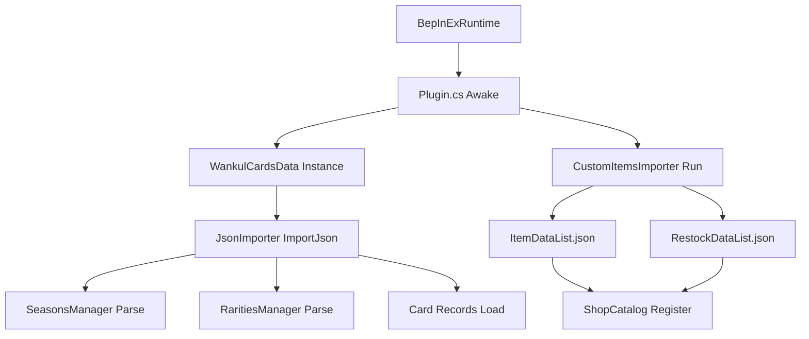

# Mise en route et installation

> **Fichiers sources pertinents**
> * [.agents/rules/tcg_shop_modding.md](https://github.com/Drakilis-57/WankulCrazy/blob/57b1f5ed/.agents/rules/tcg_shop_modding.md?plain=1)
> * [Docs/DOCS.md](https://github.com/Drakilis-57/WankulCrazy/blob/57b1f5ed/Docs/DOCS.md?plain=1)
> * [INSTALL.txt](https://github.com/Drakilis-57/WankulCrazy/blob/57b1f5ed/INSTALL.txt)
> * [LICENCE.txt](https://github.com/Drakilis-57/WankulCrazy/blob/57b1f5ed/LICENCE.txt)
> * [README.md](https://github.com/Drakilis-57/WankulCrazy/blob/57b1f5ed/README.md?plain=1)

## Objectif et portée

Cette section détaille le pipeline d'installation, les conditions préalables, la disposition du dossier mod, les options de configuration d'exécution et la structure de la documentation pour `WankulCrazy`.Il relie les étapes de déploiement avec les mécanismes d'initialisation du plugin sous-jacents, guidant les développeurs et les utilisateurs avancés dans la configuration de l'environnement d'exécution BepInEx/Harmony et dans la gestion des actifs de données.

Sources : SNIPPET 0, SNIPPET _1, SNIPPET _2

---

## Conditions préalables et exigences en matière d'environnement

`WankulCrazy` cible *TCG Card Shop Simulator* exécuté sur le moteur Unity, en utilisant BepInEx pour l'injection de hooks et Harmony pour l'application de correctifs aux méthodes d'exécution.

|Composant |Version / Exigence |Objectif |
|--- |--- |--- |
|**Moteur de jeu** |Unité `2021.3.38.8007589` |Environnement d'exécution de base |
|**Chargeur de modules** |BepInEx `5.4.23.2` |Chargeur de plugin principal et framework de hook |
|**Bibliothèque de correctifs** |Harmonie `2.7.0` |Moteur de manipulation et de correction de méthodes IL |
|**IDE de développement** |VisualStudio 2022 |Compilation et gestion de solutions |

Sources : `README.md:16-19`, `INSTALL.txt:3`

---

## Installation Procedure

L'installation du mod nécessite la configuration du runtime BepInEx, le placement des binaires compilés et le remplissage des ressources de carte et de texture requises dans le répertoire de données.

1. **Cloner le référentiel** : ``` git clone https://github.com/Drakilis-57/WankulCrazy.git ``` Sources: `README.md:34-37`
2. **Installer BepInEx** : Téléchargez et extrayez BepInEx `5.4.23.2` dans le répertoire racine de *TCG Card Shop Simulator*. Sources : `README.md:28-29`, `INSTALL.txt:3`
3. **Déployer les données d'actifs** : téléchargez le package d'actifs correspondant (`WankulCrazyData-vX.X.X`) et extrayez le répertoire `data` directement dans la racine du plugin ou dans le répertoire de données de jeu, en vous assurant que les définitions et textures JSON correspondent aux chemins attendus.Sources : `README.md:38-40`
4. **Compiler et Déployer les Binaires du Plugin** : Compilez la solution en utilisant Visual Studio (préréglage `ReleaseNoDeps` ou via des scripts de build) et copiez les fichiers de distribution de sortie dans le répertoire `BepInEx/plugins`. Sources : `README.md:41-45`, `INSTALL.txt:4`

Sources: `README.md:31-45`, `INSTALL.txt:1-4`

---

## Disposition des dossiers Mod et structure des fichiers

La présentation du runtime combine les dossiers du plugin BepInEx avec la structure de contenu interne du mod.Vous trouverez ci-dessous la configuration standard du répertoire :

```
GameRoot/├── BepInEx/│   ├── core/│   ├── plugins/│   │   └── WankulCrazy/│   │       ├── WankulCrazy.dll        [Compiled plugin assembly]│   │       └── data/                   [Mod content & definitions]│   │           ├── seasons.json        [Dynamic season declarations]│   │           ├── rarities.json       [Dynamic rarity declarations]│   │           ├── cards/              [Modular card definition json files]│   │           │   └── Legacy/│   │           │       ├── legacy.json│   │           │       └── textures/│   │           └── customitems/│   │               ├── ItemDataList.json│   │               └── restockDataList.json
```

Sources : `Docs/DOCS.md:24-26`, `INSTALL.txt:1-4`

---

## Options de configuration et schéma de données

`WankulCrazy` évite de coder en dur les extensions statiques et les éléments personnalisés dans les énumérations C#.Au lieu de cela, il s'appuie sur des pipelines de configuration JSON analysés lors de l'initialisation.

### Sources de configuration

* **`seasons.json` & `rarities.json`** : Déclare les identifiants de saison dynamiques (`SeasonId`) et les poids de rareté (`RaritiesManager`), permettant des extensions personnalisées sans recompilation.
* **`ItemDataList.json` et `restockDataList.json`** : régit l'intégration de la boutique, en établissant les coûts de base, les marges sur les prix du marché, les exigences de licence et les allocations d'onglets de boutique (`m_ShownItemType`, `m_ShownFigurineItemType`, `m_ShownAccessoryItemType`).
* **Sous-répertoire `cards/`** : Héberge les définitions de cartes modulaires (`WankulCardData`, `EffigyCardData`, `TerrainCardData`, `SpecialCardData`) liées à des actifs de sprites personnalisés et des chemins de masques.

Sources : `Docs/DOCS.md:24-38`, `.agents/rules/tcg_shop_modding.md:7-22`

---

## Ressources de documentation (Docs/ & INSTALL.txt)

Le dépôt comprend un ensemble de documentation dédié dans le répertoire `Docs/` à côté du guide d'installation racine :

* `Docs/DOCS.md` : aperçu complet de l'architecture détaillant le mappage des domaines de la carte, les importateurs JSON, les hooks d'inventaire et le suivi du décompte des stocks.
* `INSTALL.txt` : instructions d'installation minimalistes destinées aux utilisateurs finaux déployant des versions précompilées.

Sources : `Docs/DOCS.md:1-17`, `INSTALL.txt:1-4`

---

## Architecture et flux d'initialisation

Le diagramme suivant illustre le cycle de vie depuis le chargement du plugin par BepInEx jusqu'à l'ingestion de données par `JsonImporter` et `CustomItemsImporter` :



Sources: `Docs/DOCS.md:94-114`, `README.md:16-19`