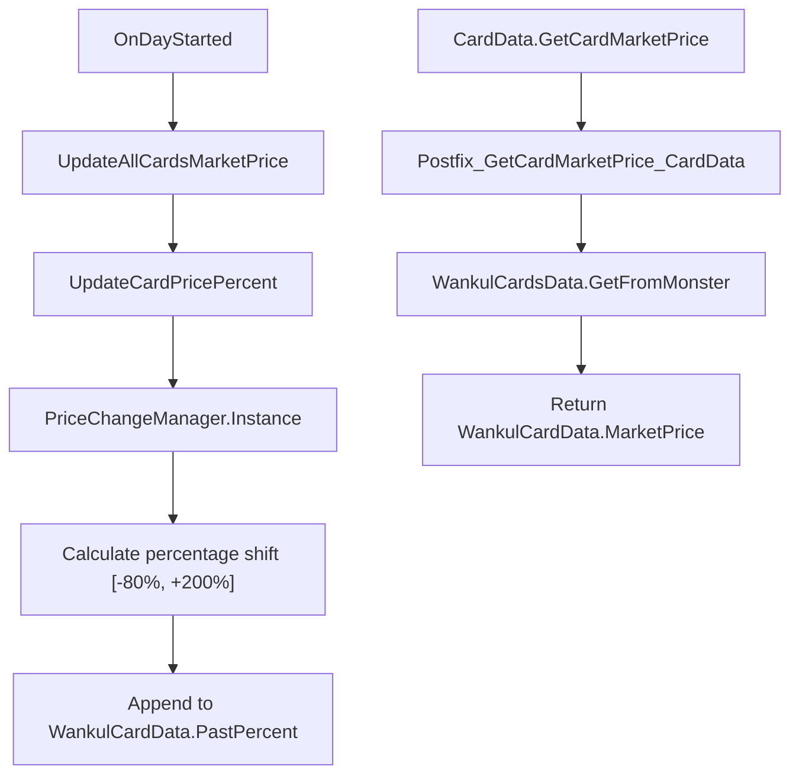
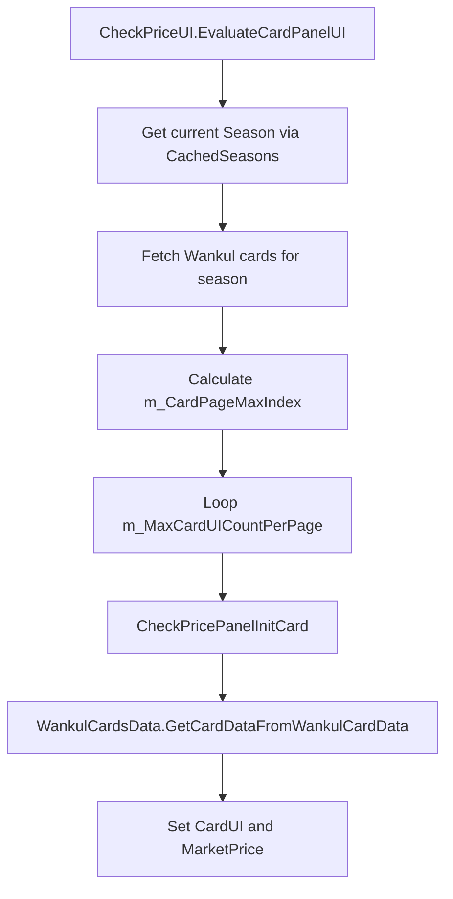
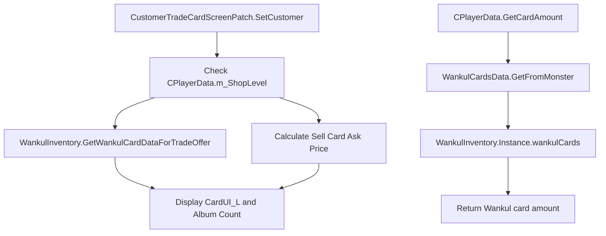

# Economy: Pricing and Trades

> **Relevant source files**
> * [cards/WankulCardData.cs](https://github.com/Drakilis-57/WankulCrazy/blob/57b1f5ed/cards/WankulCardData.cs)
> * [patch/CPlayerDataPatch.cs](https://github.com/Drakilis-57/WankulCrazy/blob/57b1f5ed/patch/CPlayerDataPatch.cs)
> * [patch/CardPrice.cs](https://github.com/Drakilis-57/WankulCrazy/blob/57b1f5ed/patch/CardPrice.cs)
> * [patch/CheckPriceUI.cs](https://github.com/Drakilis-57/WankulCrazy/blob/57b1f5ed/patch/CheckPriceUI.cs)
> * [patch/CustomerTradeCardScreenPatch.cs](https://github.com/Drakilis-57/WankulCrazy/blob/57b1f5ed/patch/CustomerTradeCardScreenPatch.cs)

This page details the economic subsystem of the WankulCrazy mod, covering dynamic market price generation, daily price fluctuations, UI inspection panels (`CheckPriceUI`), customer trade/selling logic (`CustomerTradeCardScreenPatch`), and inventory integration patches (`CPlayerDataPatch`).

---

## 1. Market Price Generation and Daily Fluctuations

The mod replaces vanilla card valuation with a multi-tiered pricing system anchored to card rarities, drop rates, and seasonal factors (`patch/CardPrice.cs`).

### Price Calculation Logic

When a card's market price is requested, `CardPrice.generateMarketPrice(WankulCardData)` calculates a baseline price by evaluating:

1. **Season Multiplier**: Different seasons (`Season.S01` through `Season.HS`) apply baseline scale factors ranging from `1.0f` to `2.0f` [patch/CardPrice.cs L21-L41](https://github.com/Drakilis-57/WankulCrazy/blob/57b1f5ed/patch/CardPrice.cs#L21-L41)
2. **Drop Rate Segments**: Cards are categorized into drop-rate tiers (from common drops `>= 0.45f` with a price range of `0.01f`–`0.5f` up to extreme rarities like the Golden Ticket `>= 0.0001f` ranging from `10,000f` to `100,000f`) [patch/CardPrice.cs L43-L106](https://github.com/Drakilis-57/WankulCrazy/blob/57b1f5ed/patch/CardPrice.cs#L43-L106)
3. **Randomized Variation**: A baseline random variance between `-2%` and `+2%` is applied to the segment bounds [patch/CardPrice.cs L18-L111](https://github.com/Drakilis-57/WankulCrazy/blob/57b1f5ed/patch/CardPrice.cs#L18-L111)

In `WankulCardData`, the `MarketPrice` property uses lazy initialization to call `CardPrice.generateMarketPrice(this)` once, caching the result in `generatedMarketPrice`, and scales it dynamically by the current daily percentage multiplier (`Percentage / 100`) [cards/WankulCardData.cs L92-L114](https://github.com/Drakilis-57/WankulCrazy/blob/57b1f5ed/cards/WankulCardData.cs#L92-L114)

### Daily Price Shifts

At the start of every day via `CardPrice.OnDayStarted()`, `UpdateAllCardsMarketPrice()` iterates over all registered cards and invokes `UpdateCardPricePercent(WankulCardData)` [patch/CardPrice.cs L119-L165](https://github.com/Drakilis-57/WankulCrazy/blob/57b1f5ed/patch/CardPrice.cs#L119-L165)

* Cached reflection fields (`priceChangeMinField` and `priceChangeMaxField`) query `PriceChangeManager.Instance` to fetch configuration parameters without performance-heavy `AccessTools.Field` lookups on every tick [patch/CardPrice.cs L114-L128](https://github.com/Drakilis-57/WankulCrazy/blob/57b1f5ed/patch/CardPrice.cs#L114-L128)
* The card's percentage value is adjusted and clamped between `-80f` and `+200f` [patch/CardPrice.cs L130-L143](https://github.com/Drakilis-57/WankulCrazy/blob/57b1f5ed/patch/CardPrice.cs#L130-L143)
* A rolling history of up to 30 past percentages is maintained in `PastPercent` [patch/CardPrice.cs L144-L148](https://github.com/Drakilis-57/WankulCrazy/blob/57b1f5ed/patch/CardPrice.cs#L144-L148)

*Sources: [patch/CardPrice.cs L114-L181](https://github.com/Drakilis-57/WankulCrazy/blob/57b1f5ed/patch/CardPrice.cs#L114-L181)

 [cards/WankulCardData.cs L92-L114](https://github.com/Drakilis-57/WankulCrazy/blob/57b1f5ed/cards/WankulCardData.cs#L92-L114)*

---

## 2. Price Inspection UI and Pagination

The `CheckPriceUI` class overrides vanilla check-price screen behavior to display Wankul-specific catalog information, seasonal filtering, and calculated market valuations (`patch/CheckPriceUI.cs`).

### Pagination and Layout Evaluation

`CheckPriceUI.EvaluateCardPanelUI(...)` manages card rendering loops within the check-price interface:

* Resolves instance properties (`m_PosX`, `m_LerpPosX`, `m_CardPageMaxIndex`, etc.) using cached accessor delegates [patch/CheckPriceUI.cs L25-L30](https://github.com/Drakilis-57/WankulCrazy/blob/57b1f5ed/patch/CheckPriceUI.cs#L25-L30)
* Retrieves current seasonal groupings using `CachedSeasons[ExpansionScreen.currentExpensionIndex]` [patch/CheckPriceUI.cs L32](https://github.com/Drakilis-57/WankulCrazy/blob/57b1f5ed/patch/CheckPriceUI.cs#L32-L32)
* Dynamically sizes card grids per page using `__instance.m_MaxCardUICountPerPage` and populates `wankulCardsSet` [patch/CheckPriceUI.cs L44-L81](https://github.com/Drakilis-57/WankulCrazy/blob/57b1f5ed/patch/CheckPriceUI.cs#L44-L81)

Individual panels are initialized via `CheckPricePanelInitCard(...)`, binding the target `WankulCardData` to its corresponding UI container and formatting custom effigy titles and rarities [patch/CheckPriceUI.cs L95-L136](https://github.com/Drakilis-57/WankulCrazy/blob/57b1f5ed/patch/CheckPriceUI.cs#L95-L136)

*Sources: [patch/CheckPriceUI.cs L21-L136](https://github.com/Drakilis-57/WankulCrazy/blob/57b1f5ed/patch/CheckPriceUI.cs#L21-L136)*

---

## 3. Customer Trade Offers and Inventory Hooks

Modifications to customer interactions and player data queries allow custom Wankul inventory items to be traded and evaluated seamlessly (`patch/CustomerTradeCardScreenPatch.cs`, `patch/CPlayerDataPatch.cs`).

### Customer Trade Screen Pipeline

`CustomerTradeCardScreenPatch.SetCustomer(...)` intercepts customer interactions at the shop counter:

* Evaluates shop level (`CPlayerData.m_ShopLevel`) to determine if a trade proposal should be initiated (capped at level 40) [patch/CustomerTradeCardScreenPatch.cs L22-L30](https://github.com/Drakilis-57/WankulCrazy/blob/57b1f5ed/patch/CustomerTradeCardScreenPatch.cs#L22-L30)
* Pulls trade offer candidates via `WankulInventory.GetWankulCardDataForTradeOffer()` if no existing trade data is provided [patch/CustomerTradeCardScreenPatch.cs L66-L68](https://github.com/Drakilis-57/WankulCrazy/blob/57b1f5ed/patch/CustomerTradeCardScreenPatch.cs#L66-L68)
* Computes asking prices using dynamic multipliers scaled against the card's market price [patch/CustomerTradeCardScreenPatch.cs L81-L127](https://github.com/Drakilis-57/WankulCrazy/blob/57b1f5ed/patch/CustomerTradeCardScreenPatch.cs#L81-L127)

### Player Data Interception

`CPlayerDataPatch.GetCardAmount` overrides base game card ownership checks [patch/CPlayerDataPatch.cs L11-L24](https://github.com/Drakilis-57/WankulCrazy/blob/57b1f5ed/patch/CPlayerDataPatch.cs#L11-L24)

:

* Maps vanilla `CardData` to `WankulCardData` using `WankulCardsData.GetFromMonster` [patch/CPlayerDataPatch.cs L13](https://github.com/Drakilis-57/WankulCrazy/blob/57b1f5ed/patch/CPlayerDataPatch.cs#L13-L13)
* Queries `WankulInventory.Instance.wankulCards` by index to return the exact quantity owned by the player, bypassing default save structures [patch/CPlayerDataPatch.cs L20-L21](https://github.com/Drakilis-57/WankulCrazy/blob/57b1f5ed/patch/CPlayerDataPatch.cs#L20-L21)

*Sources: [patch/CustomerTradeCardScreenPatch.cs L16-L127](https://github.com/Drakilis-57/WankulCrazy/blob/57b1f5ed/patch/CustomerTradeCardScreenPatch.cs#L16-L127)

 [patch/CPlayerDataPatch.cs:9-25]*