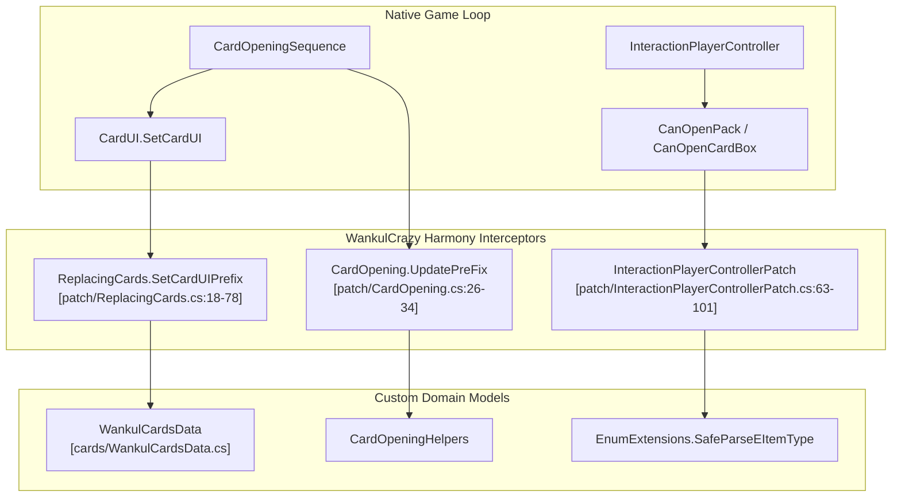

# Gameplay Patches

> **Relevant source files**
> * [patch/CardOpening.cs](https://github.com/Drakilis-57/WankulCrazy/blob/57b1f5ed/patch/CardOpening.cs)
> * [patch/InteractionPlayerControllerPatch.cs](https://github.com/Drakilis-57/WankulCrazy/blob/57b1f5ed/patch/InteractionPlayerControllerPatch.cs)
> * [patch/ReplacingCards.cs](https://github.com/Drakilis-57/WankulCrazy/blob/57b1f5ed/patch/ReplacingCards.cs)

The Gameplay Patches layer forms the core runtime interceptor of `WankulCrazy`. Built on top of Harmony (`HarmonyLib`), this layer hooks into native TCG Card Shop Simulator systems to redirect card visualization, booster pack opening workflows, player inventory capacities, interaction constraints, and economic pricing models. By intercepting lifecycle hooks, methods like `CardUI.SetCardUI` [patch/ReplacingCards.cs:18-78] and `InteractionPlayerController.Awake` [patch/InteractionPlayerControllerPatch.cs:23-61] are repurposed to handle custom Wankul entities without altering the underlying game assembly permanently.

This parent page provides a high-level summary of the gameplay subsystems managed via Harmony patches. For granular technical details, implementation specifics, and execution flows, refer to the respective child pages:

* Card Opening Sequence: See [Card Opening Sequence](/Drakilis-57/WankulCrazy/3.1-card-opening-sequence)
* Player Interaction and Card Boxes: See [Player Interaction and Card Boxes](/Drakilis-57/WankulCrazy/3.2-player-interaction-and-card-boxes)
* Card Rendering and UI Replacement: See [Card Rendering and UI Replacement](/Drakilis-57/WankulCrazy/3.3-card-rendering-and-ui-replacement)
* Economy: Pricing and Trades: See [Economy: Pricing and Trades](/Drakilis-57/WankulCrazy/3.4-economy:-pricing-and-trades)

Sources: [patch/CardOpening.cs L1-L48](https://github.com/Drakilis-57/WankulCrazy/blob/57b1f5ed/patch/CardOpening.cs#L1-L48)

 [patch/ReplacingCards.cs L1-L78](https://github.com/Drakilis-57/WankulCrazy/blob/57b1f5ed/patch/ReplacingCards.cs#L1-L78)

 [patch/InteractionPlayerControllerPatch.cs L1-L61](https://github.com/Drakilis-57/WankulCrazy/blob/57b1f5ed/patch/InteractionPlayerControllerPatch.cs#L1-L61)

---

## Architecture and Patch Flow

The following diagram illustrates how external game events and native loops are intercepted by WankulCrazy Harmony patches before reaching vanilla engine components.

Sources: [patch/CardOpening.cs L26-L47](https://github.com/Drakilis-57/WankulCrazy/blob/57b1f5ed/patch/CardOpening.cs#L26-L47)

 [patch/ReplacingCards.cs L18-L78](https://github.com/Drakilis-57/WankulCrazy/blob/57b1f5ed/patch/ReplacingCards.cs#L18-L78)

 [patch/InteractionPlayerControllerPatch.cs L63-L101](https://github.com/Drakilis-57/WankulCrazy/blob/57b1f5ed/patch/InteractionPlayerControllerPatch.cs#L63-L101)

---

## 3.1 Card Opening Sequence

The card opening layer manages the state machine and visual stack during booster unboxing. Handled primarily within `CardOpening`, it supports dynamic booster sizes (such as 4-card Gold boosters versus 10-card standard packs) [patch/CardOpening.cs:103-123], guarantees specific rarity drops, implements auto-fire mechanics, and orchestrates the canvas hierarchy so that active cards render strictly above background stacks [patch/CardOpening.cs:58-100].

For full implementation details on state transitions, custom animation lists, and helper utilities, see [Card Opening Sequence](/Drakilis-57/WankulCrazy/3.1-card-opening-sequence).

Sources: [patch/CardOpening.cs L16-L152](https://github.com/Drakilis-57/WankulCrazy/blob/57b1f5ed/patch/CardOpening.cs#L16-L152)

---

## 3.2 Player Interaction and Card Boxes

Player interactions—such as holding packs, evaluating box-to-pack mappings, and managing physical layout constraints—are governed by `InteractionPlayerControllerPatch` [patch/InteractionPlayerControllerPatch.cs:16-61]. This patch expands the maximum holdable pack slots (`MaxPacks = 24`) [patch/InteractionPlayerControllerPatch.cs:18] across dual columns, introduces dynamic item type validation for stellar and legacy booster types [patch/InteractionPlayerControllerPatch.cs:63-101], and maps sealed display boxes to their corresponding card pack variants [patch/InteractionPlayerControllerPatch.cs:103-120].

For detailed information on mesh swapping, spawn lerp coroutines, and item mapping routines, see [Player Interaction and Card Boxes](/Drakilis-57/WankulCrazy/3.2-player-interaction-and-card-boxes).

Sources: [patch/InteractionPlayerControllerPatch.cs L16-L120](https://github.com/Drakilis-57/WankulCrazy/blob/57b1f5ed/patch/InteractionPlayerControllerPatch.cs#L16-L120)

---

## 3.3 Card Rendering and UI Replacement

To completely transform the visual presentation of cards, `ReplacingCards` intercepts `CardUI` methods [patch/ReplacingCards.cs:18-78]. It replaces vanilla card backgrounds, borders, and creature portraits with custom Wankul sprites, manages foil rendering thresholds based on `EffigyCardData` rarities [patch/ReplacingCards.cs:56-64], and applies full-background scaling parameters (`CardImageScale`) [patch/ReplacingCards.cs:80]. It also protects against corrupted or out-of-bounds save states by falling back to debug card structures like `WankulCardsData.GetAJETER()` [patch/ReplacingCards.cs:27-35].

For further details on binder pages, sorting UI extensions, workbench interfaces, and poster replacements, see [Card Rendering and UI Replacement](/Drakilis-57/WankulCrazy/3.3-card-rendering-and-ui-replacement).

Sources: [patch/ReplacingCards.cs L1-L179](https://github.com/Drakilis-57/WankulCrazy/blob/57b1f5ed/patch/ReplacingCards.cs#L1-L179)

---

## 3.4 Economy: Pricing and Trades

Economic patches handle card valuation history, dynamic price generation algorithms, and customer trade offers. By patching core economic classes, `WankulCrazy` ensures that custom card valuations align with rarity tiers, expansion types, and historical market fluctuations.

For complete technical specifications on pricing logic, `CheckPriceUI` modifications, and player data persistence hooks, see [Economy: Pricing and Trades](/Drakilis-57/WankulCrazy/3.4-economy:-pricing-and-trades).

Sources: [patch/ReplacingCards.cs L1-L179](https://github.com/Drakilis-57/WankulCrazy/blob/57b1f5ed/patch/ReplacingCards.cs#L1-L179)