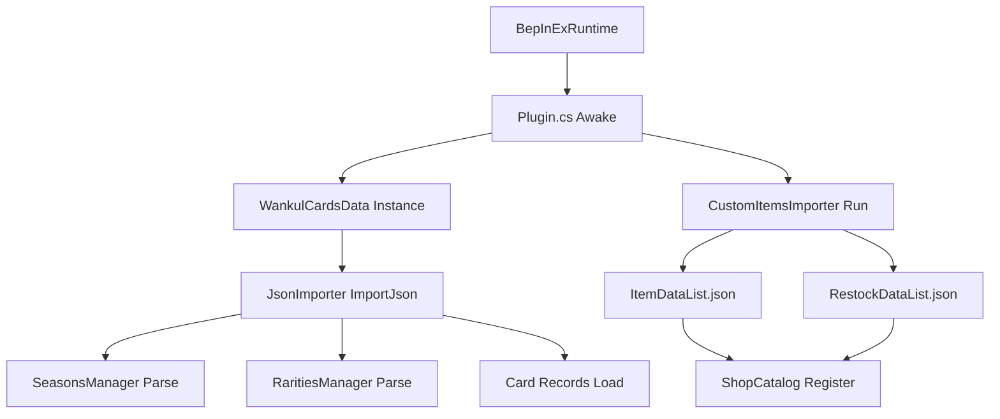

# Getting Started & Installation

> **Relevant source files**
> * [.agents/rules/tcg_shop_modding.md](https://github.com/Drakilis-57/WankulCrazy/blob/57b1f5ed/.agents/rules/tcg_shop_modding.md?plain=1)
> * [Docs/DOCS.md](https://github.com/Drakilis-57/WankulCrazy/blob/57b1f5ed/Docs/DOCS.md?plain=1)
> * [INSTALL.txt](https://github.com/Drakilis-57/WankulCrazy/blob/57b1f5ed/INSTALL.txt)
> * [LICENCE.txt](https://github.com/Drakilis-57/WankulCrazy/blob/57b1f5ed/LICENCE.txt)
> * [README.md](https://github.com/Drakilis-57/WankulCrazy/blob/57b1f5ed/README.md?plain=1)

## Purpose and Scope

This section details the installation pipeline, prerequisites, mod folder layout, runtime configuration options, and documentation structure for `WankulCrazy`. It bridges deployment steps with underlying plugin initialization mechanics, guiding developers and advanced users through setting up the BepInEx/Harmony runtime environment and managing data assets.

Sources: `README.md:1-20`, `INSTALL.txt:1-4`, `Docs/DOCS.md:1-17`

---

## Prerequisites and Environment Requirements

`WankulCrazy` targets *TCG Card Shop Simulator* running on the Unity engine, utilizing BepInEx for hook injection and Harmony for runtime method patching.

| Component | Version / Requirement | Purpose |
| --- | --- | --- |
| **Game Engine** | Unity `2021.3.38.8007589` | Base runtime environment |
| **Mod Loader** | BepInEx `5.4.23.2` | Core plugin loader and hook framework |
| **Patch Library** | Harmony `2.7.0` | IL manipulation and method patching engine |
| **Development IDE** | Visual Studio 2022 | Compilation and solution management |

Sources: `README.md:16-19`, `INSTALL.txt:3`

---

## Installation Procedure

Installing the mod requires setting up the BepInEx runtime, placing compiled binaries, and populating required card and texture assets in the data directory.

1. **Clone the Repository**: ``` git clone https://github.com/Drakilis-57/WankulCrazy.git ``` Sources: `README.md:34-37`
2. **Install BepInEx**: Download and extract BepInEx `5.4.23.2` into the root directory of *TCG Card Shop Simulator*. Sources: `README.md:28-29`, `INSTALL.txt:3`
3. **Deploy Asset Data**: Download the corresponding asset package (`WankulCrazyData-vX.X.X`) and extract the `data` directory directly to the plugin root or game data directory, ensuring JSON definitions and textures match expected paths. Sources: `README.md:38-40`
4. **Build and Deploy Plugin Binaries**: Compile the solution using Visual Studio (`ReleaseNoDeps` preset or via build scripts) and copy the output distribution files into the `BepInEx/plugins` directory. Sources: `README.md:41-45`, `INSTALL.txt:4`

Sources: `README.md:31-45`, `INSTALL.txt:1-4`

---

## Mod Folder Layout & File Structure

The runtime layout combines BepInEx plugin folders with the mod's internal content structure. Below is the standard directory configuration:

```
GameRoot/├── BepInEx/│   ├── core/│   ├── plugins/│   │   └── WankulCrazy/│   │       ├── WankulCrazy.dll        [Compiled plugin assembly]│   │       └── data/                   [Mod content & definitions]│   │           ├── seasons.json        [Dynamic season declarations]│   │           ├── rarities.json       [Dynamic rarity declarations]│   │           ├── cards/              [Modular card definition json files]│   │           │   └── Legacy/│   │           │       ├── legacy.json│   │           │       └── textures/│   │           └── customitems/│   │               ├── ItemDataList.json│   │               └── restockDataList.json
```

Sources: `Docs/DOCS.md:24-26`, `INSTALL.txt:1-4`

---

## Configuration Options and Data Schema

`WankulCrazy` avoids hardcoding static expansions and custom items into C# enums. Instead, it relies on JSON configuration pipelines parsed during initialization.

### Configuration Sources

* **`seasons.json` & `rarities.json`**: Declares dynamic season identifiers (`SeasonId`) and rarity weights (`RaritiesManager`), allowing custom expansions without recompilation.
* **`ItemDataList.json` & `restockDataList.json`**: Governs shop integration, establishing base costs, market price margins, license requirements, and shop tab allocations (`m_ShownItemType`, `m_ShownFigurineItemType`, `m_ShownAccessoryItemType`).
* **`cards/` Subdirectory**: Houses modular card definitions (`WankulCardData`, `EffigyCardData`, `TerrainCardData`, `SpecialCardData`) linked with custom sprite assets and mask paths.

Sources: `Docs/DOCS.md:24-38`, `.agents/rules/tcg_shop_modding.md:7-22`

---

## Documentation Resources (Docs/ & INSTALL.txt)

The repository includes a dedicated documentation set inside the `Docs/` directory alongside the root installation guide:

* `Docs/DOCS.md`: Comprehensive architectural overview detailing card domain mapping, JSON importers, inventory hooks, and inventory count tracking.
* `INSTALL.txt`: Minimalist installation instructions targeting end-users deploying pre-compiled builds.

Sources: `Docs/DOCS.md:1-17`, `INSTALL.txt:1-4`

---

## Architecture and Initialization Flow

The following diagram illustrates the lifecycle from plugin loading by BepInEx to data ingestion by `JsonImporter` and `CustomItemsImporter`:



Sources: `Docs/DOCS.md:94-114`, `README.md:16-19`