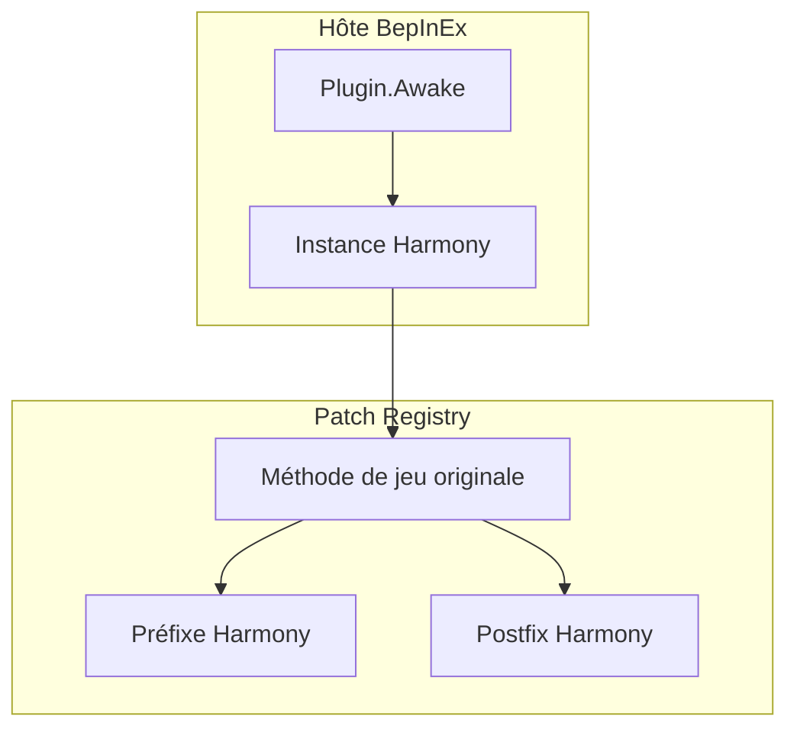
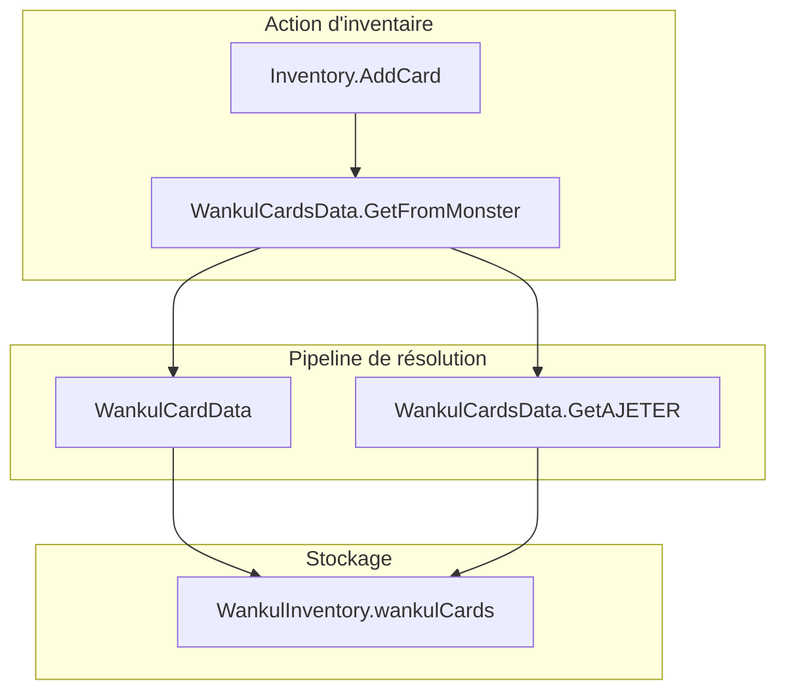
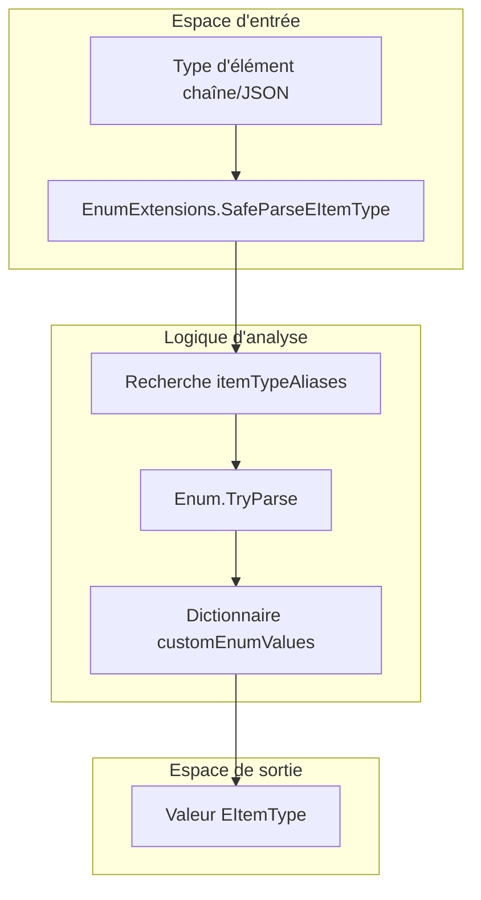

# Glossaire

> **Fichiers sources pertinents**
> * [Plugin.cs](https://github.com/Drakilis-57/WankulCrazy/blob/57b1f5ed/Plugin.cs)
> * [cards/WankulCardsData.cs](https://github.com/Drakilis-57/WankulCrazy/blob/57b1f5ed/cards/WankulCardsData.cs)
> * [inventaire/WankulInventory.cs](https://github.com/Drakilis-57/WankulCrazy/blob/57b1f5ed/inventory/WankulInventory.cs)
> * [patch/EItemTypeExtension.cs](https://github.com/Drakilis-57/WankulCrazy/blob/57b1f5ed/patch/EItemTypeExtension.cs)
> * [patch/Inventory.cs](https://github.com/Drakilis-57/WankulCrazy/blob/57b1f5ed/patch/Inventory.cs)

## Objectif et portée

Cette page fournit des définitions techniques complètes pour les concepts de base, la terminologie spécifique au domaine, les énumérations, les modèles architecturaux et les structures de données spécialisées utiles dans la base de code `WankulCrazy`. Chaque entrée est détaillée selon son rôle dans le flux de données et les liens vers les fichiers de code source et les pages de logique pertinentes.

---

## 1. Termes du cadre de base et de l'architecture

### BepInEx

Le framework de plugin et l'hôte d'exécution utilisés pour injecter le mod `WankulCrazy` dans le jeu Unity cible (`TCG Card Shop Simulator`). Il fournit des services de gestion du cycle de vie, de liaison de configuration et de journalisation.

* **Implémentation** : initialisé via la classe `Plugin` héritant de `BaseUnityPlugin` [Plugin.cs L14-L16](https://github.com/Drakilis-57/WankulCrazy/blob/57b1f5ed/Plugin.cs#L14-L16). Les indicateurs de débogage détaillés sont liés via le système de configuration de BepInEx [Plugin.cs L40-L41](https://github.com/Drakilis-57/WankulCrazy/blob/57b1f5ed/Plugin.cs#L40-L41) et les journaux de diagnostic sont acheminés via `ManualLogSource` [Plugin.cs L17](https://github.com/Drakilis-57/WankulCrazy/blob/57b1f5ed/Plugin.cs#L17).

### Préfixe/Suffixe d'Harmony

Le mécanisme d'interception fourni par la bibliothèque `HarmonyLib` pour modifier, étendre ou remplacer les méthodes de jeu existantes sans recompiler les assemblys de jeu.

* **Préfixe** : exécuté avant la méthode d'origine, capable de modifier les arguments ou de court-circuiter l'exécution.
* **Postfix** : exécuté après la méthode d'origine, couramment utilisé pour ajouter une logique personnalisée ou modifier les valeurs de retour.
* **Implémentation** : les correctifs sont enregistrés dynamiquement dans `Plugin.Awake()` à l'aide de la fonction d'assistance `TryPatch` [Plugin.cs L49-L71](https://github.com/Drakilis-57/WankulCrazy/blob/57b1f5ed/Plugin.cs#L49-L71), ciblant des méthodes telles que `CardUI.SetCardUI` [Plugin.cs L107-L111](https://github.com/Drakilis-57/WankulCrazy/blob/57b1f5ed/Plugin.cs#L107-L111) et `CSaveLoad.Save` [Plugin.cs L151-L154](https://github.com/Drakilis-57/WankulCrazy/blob/57b1f5ed/Plugin.cs#L151-L154).

### Budget cadre

Un modèle d'optimisation des performances implémenté dans des chargeurs asynchrones et des pipelines de rendu d'interface utilisateur (tels que `WankulLoadingScreen`) pour répartir les tâches lourdes de chargement d'assets sur plusieurs images, évitant ainsi le blocage du jeu et les bogues de thread principal.

> **Diagramme 1 : Exécution du framework et flux de correctifs**

Sources : [Plugin.cs L36-L71](https://github.com/Drakilis-57/WankulCrazy/blob/57b1f5ed/Plugin.cs#L36-L71)

---

## 2. Modèle de domaine et conditions de la carte

### Carte Wankul

L'entité de domaine personnalisée principale représentant des cartes stylisées avec du contenu Wankul, remplaçant les monstres de jeu standard.

* **Implémentation** : modélisée par des sous-classes sous l'espace de noms `cards/` et stockée de manière centralisée via le registre singleton `WankulCardsData` [cards/WankulCardsData.cs L12-L16](https://github.com/Drakilis-57/WankulCrazy/blob/57b1f5ed/cards/WankulCardsData.cs#L12-L16), ce qui permet d'associer aux éléments du jeu standard via des cartes d'association d'activités.

### AJETER

Une entité de carte de secours désignée utilisée lorsqu'un mappage de carte monstre demandé ne peut pas être résolu ou génère une référence nulle lors des opérations d'inventaire.

* **Implémentation** : récupéré via `WankulCardsData.GetAJETER()` et injecté comme garde de sécurité dans les wrappers de modification d'inventaire [patch/Inventory.cs L14-L16](https://github.com/Drakilis-57/WankulCrazy/blob/57b1f5ed/patch/Inventory.cs#L14-L16).

### Taux

Un modificateur de variante spécialisé appliqué aux boosters, aux présentoirs et aux articles de la boutique indiquant des taux d'obtention améliorés ou améliorés et une pondération statistique.

* **Implémentation** : les constantes d'énumération personnalisées telles que `BoosterStellarTaux` et `DisplayStellarTaux` sont enregistrées dans des dictionnaires d'énumération personnalisés avec des identifiants d'attributs [patch/EItemTypeExtension.cs L17-L21](https://github.com/Drakilis-57/WankulCrazy/blob/57b1f5ed/patch/EItemTypeExtension.cs#L17-L21).

### Effigie

Une classification de rareté de carte ou un type de données de carte spécifique (`EffigyCardData`) représentant des portraits de personnages ou des statues dans les drops saisonniers.

* **Mise en œuvre** : filtré et évalué lors de l'ouverture du booster et garanties de rareté minimale [inventory/WankulInventory.cs L104-L128](https://github.com/Drakilis-57/WankulCrazy/blob/57b1f5ed/inventory/WankulInventory.cs#L104-L128).

### Saison

Un regroupement organisationnel représentant les vagues de lancement ou les collections saisonnières (par exemple, `S01`, `S02`, `S03`, `S04`, `S05` et `HS` pour haute saison/spécial).

* **Mise en œuvre** : mappé directement à partir des types de packs de collecte via `WankulInventory.ConvertPackTypeToSeason()` [inventory/WankulInventory.cs L30-L51](https://github.com/Drakilis-57/WankulCrazy/blob/57b1f5ed/inventory/WankulInventory.cs#L30-L51) et indexé pour une récupération rapide via `WankulCardsData.GetCardsBySeasonFast()` [cards/WankulCardsData.cs L62-L76](https://github.com/Drakilis-57/WankulCrazy/blob/57b1f5ed/cards/WankulCardsData.cs#L62-L76).

### Feuille

Une finition visuelle spéciale appliquée aux rendus de cartes, contrôlée via des superpositions de textures et des paramètres de shader personnalisés lors des mises à jour du rendu de l'interface utilisateur de la carte.

### Textures de podium

Textures et matériaux 3D spécialisés utilisés sur les podiums d'exposition et les comptoirs des magasins pour présenter des articles Wankul de grande valeur et des présentoirs personnalisés.

> **Diagramme 2 : Résolution d'entité de domaine et mappage d'inventaire**

Sources : [cards/WankulCardsData.cs L79-L147](https://github.com/Drakilis-57/WankulCrazy/blob/57b1f5ed/cards/WankulCardsData.cs#L79-L147)
[patch/Inventory.cs L8-L19](https://github.com/Drakilis-57/WankulCrazy/blob/57b1f5ed/patch/Inventory.cs#L8-L19)
[inventory/WankulInventory.cs L12-L15](https://github.com/Drakilis-57/WankulCrazy/blob/57b1f5ed/inventory/WankulInventory.cs#L12-L15)

---

## 3. Énumérations et identifiants

### EItemType

L'énumération native du jeu définissant les catégories d'articles d'inventaire et de magasin, étendue dynamiquement par le mod pour prendre en charge les articles Wankul personnalisés tels que les boosters stellaires, les vêtements et les tapis spécialisés.

* **Implémentation** : étendue via `EnumExtensions.customEnumValues` avec des mappings d'entiers personnalisés (par exemple, `BoosterStellar` = `125`, `CaleconStellar` = `129`) [patch/EItemTypeExtension.cs L15-L35](https://github.com/Drakilis-57/WankulCrazy/blob/57b1f5ed/patch/EItemTypeExtension.cs#L15-L35) et analyse robuste via `SafeParseEItemType()` [patch/EItemTypeExtension.cs L128-L160](https://github.com/Drakilis-57/WankulCrazy/blob/57b1f5ed/patch/EItemTypeExtension.cs#L128-L160).

### ECollectionPackType

L'énumération native représentant les types de packs de collection, étendue pour inclure les packs saisonniers Wankul personnalisés.

* **Implémentation** : les types de packs personnalisés tels que `Stellar` (valeur `15`) et `Legacy` (valeur `19`) sont définis dans `EnumExtensions` [patch/EItemTypeExtension.cs L38-L47](https://github.com/Drakilis-57/WankulCrazy/blob/57b1f5ed/patch/EItemTypeExtension.cs#L38-L47) et analysés via `SafeParseECollectionPackType()` [patch/EItemTypeExtension.cs L162-L172](https://github.com/Drakilis-57/WankulCrazy/blob/57b1f5ed/patch/EItemTypeExtension.cs#L162-L172).

### Booster de hachage

Une clé de hachage unique calculée pour le contenu ou les définitions du booster pack afin de garantir une vérification déterministe des chutes et d'éviter toute corruption d'état en double lors des séquences d'ouverture.

### m_HoldCardPackPosList

Une structure de données de jeu interne/suivi de liste conservant les positions des paquets de cartes dans les contrôleurs d'interaction des joueurs, manipulées lors des correctifs d'emplacement de pack étendu.

### Enregistrement du bug

Une routine de diagnostic ou un indicateur de sauvegarde utilisé pour vider les états d'inventaire internes, les dictionnaires d'association et les arborescences de sérialisation pour le débogage des bogues de synchronisation de sauvegarde/chargement.

> **Diagramme 3 : Extension d'énumération et pipeline d'analyse**

Sources : [patch/EItemTypeExtension.cs L110-L160](https://github.com/Drakilis-57/WankulCrazy/blob/57b1f5ed/patch/EItemTypeExtension.cs#L110-L160)
