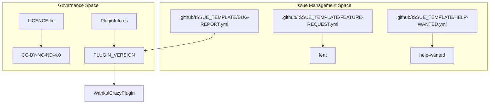
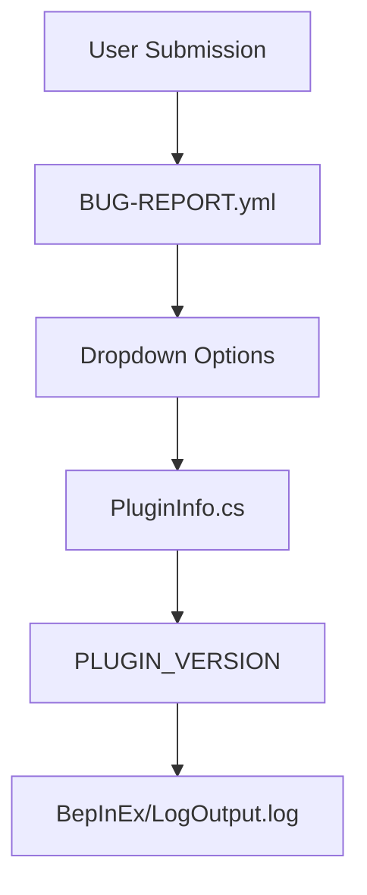

# Modèles de gouvernance et de problèmes de projet

> **Fichiers sources pertinents**
> * [.github/ISSUE_TEMPLATE/BUG-REPORT.yml](https://github.com/Drakilis-57/WankulCrazy/blob/57b1f5ed/.github/ISSUE_TEMPLATE/BUG-REPORT.yml)
> * [.github/ISSUE_TEMPLATE/FEATURE-REQUEST.yml](https://github.com/Drakilis-57/WankulCrazy/blob/57b1f5ed/.github/ISSUE_TEMPLATE/FEATURE-REQUEST.yml)
> * [.github/ISSUE_TEMPLATE/HELP-WANTED.yml](https://github.com/Drakilis-57/WankulCrazy/blob/57b1f5ed/.github/ISSUE_TEMPLATE/HELP-WANTED.yml)
> * [LICENCE.txt](https://github.com/Drakilis-57/WankulCrazy/blob/57b1f5ed/LICENCE.txt)
> * [PluginInfo.cs](https://github.com/Drakilis-57/WankulCrazy/blob/57b1f5ed/PluginInfo.cs)
> * [libs/Assembly-CSharp.dll](https://github.com/Drakilis-57/WankulCrazy/blob/57b1f5ed/libs/Assembly-CSharp.dll)

## Objectif et portée

Cette section détaille la gouvernance du projet, le schéma de versionnage, les contraintes de licence, les flux de contribution, et les configurations de suivi des problèmes pour la base de code `WankulCrazy`. Elle établit comment les métadonnées sont centralisées via `PluginInfo.cs`, comment la PI (Propriété Intellectuelle) et les actifs tiers sont gérés sous `LICENCE.txt`, et comment les modèles de problèmes GitHub standardisés (`.github/ISSUE_TEMPLATE/`) structurent les retours utilisateurs, les demandes de fonctionnalités, et les rapports de bugs.

---

## 1. Versionnage et Métadonnées d'Assemblage

Le mod s'appuie sur un conteneur de métadonnées centralisé défini dans `PluginInfo.cs` pour exposer ses paramètres d'identification du plugin BepInEx.Cette structure garantit la cohérence entre les sorties de l’assembly compilé, de l’injection de dépendances et du débogage.

* `PLUGIN_GUID` : Identifie l'espace de noms du plugin globalement dans le chargeur d'exécution (runtime loader) BepInEx (`WankulCrazyPlugin`).
* `PLUGIN_NAME` : Identifiant lisible par l'homme utilisé dans les journaux et les interfaces utilisateur (`WankulCrazy`).
* `PLUGIN_VERSION` : Chaîne de version sémantique reflétant la cible de build actuelle (`1.4.1`).

```javascript
namespace WankulCrazyPlugin{    public static class PluginInfo    {        public const string PLUGIN_GUID = "WankulCrazyPlugin";        public const string PLUGIN_NAME = "WankulCrazy";        public const string PLUGIN_VERSION = "1.4.1";    }}
```

Sources : [PluginInfo.cs L1-L9](https://github.com/Drakilis-57/WankulCrazy/blob/57b1f5ed/PluginInfo.cs#L1-L9)

---

## 2. Licences et propriété intellectuelle

`WankulCrazy` est régi par la licence **Creative Commons Attribution-NonCommercial-NoDerivatives 4.0 International** (CC BY-NC-ND 4.0).

Les points de gouvernance clés décrits dans la licence du projet incluent :

* **Propriété des actifs** : toutes les textures de cartes et actifs artistiques restent la propriété de `wankul.fr` et `Wankil © 2024`.L'implémentation du mod ne revendique pas la propriété de ces textures mais les utilise dans le cadre d'autorisations explicites.
* **Remerciements des contributeurs** : des crédits spéciaux sont formellement attribués dans la documentation pour les contributions au code et la retexturation des actifs : * `Karilla` : contributions au code et logique de mise en œuvre.* `Hurtem` : Retexturation des actifs et pipelines graphiques.

Sources : [LICENCE.txt L1-L8](https://github.com/Drakilis-57/WankulCrazy/blob/57b1f5ed/LICENCE.txt#L1-L8)

---

## 3. Modèles de problèmes GitHub et flux de travail de contribution

Le référentiel implémente des modèles de problèmes structurés basés sur YAML sous `.github/ISSUE_TEMPLATE/` pour rationaliser le tri des bogues, les propositions de fonctionnalités et le support de la communauté.

### Schéma de rapport de bug (BUG-REPORT.yml)

Le modèle de rapport de bug applique une collecte de télémétrie structurée auprès des utilisateurs rencontrant des anomalies d'exécution :

* **Champs de description** : collecte les observations des utilisateurs concernant le comportement attendu par rapport au comportement réel.
* **Version Dropdown** : restreint la sélection de versions aux versions historiques et actuelles valides allant de `1.0.0` à `1.4.2 (Latest)`, avec des références croisées avec `PluginInfo. PLUGIN_VERSION`.
* **Extraction de journaux** : oblige à coller la sortie du shell BepInEx à partir de `BepInEx/LogOutput.log` pour faciliter l'analyse de la trace de la pile.

```yaml
name: Bug Reportdescription: Informez nous d'un bug.title: "[Bug]: "labels: ["bug"]projects: ["WankulCrazy"]body:  - type: dropdown    id: version    attributes:      label: Version      description: Quel version du mod était utilisée ?      options:        - 1.4.2 (Latest)        - 1.4.1         - 1.4.0        ...
```

Sources : [.github/ISSUE_TEMPLATE/BUG-REPORT.yml L1-L49](https://github.com/Drakilis-57/WankulCrazy/blob/57b1f5ed/.github/ISSUE_TEMPLATE/BUG-REPORT.yml#L1-L49)

### Demandes de fonctionnalités et modèles d'aide recherchée

* **Demande de fonctionnalité (`FEATURE-REQUEST.yml`)** : capture les modifications ou ajouts proposés au mod, étiquetés automatiquement avec l'étiquette `feat`.
* **Aide recherchée (`HELP-WANTED.yml`)** : fournit un canal de communication direct pour les problèmes d'intégration ou l'assistance utilisateur, étiqueté avec l'étiquette `help wanted`.

Sources : [.github/ISSUE_TEMPLATE/FEATURE-REQUEST.yml L1-L18](https://github.com/Drakilis-57/WankulCrazy/blob/57b1f5ed/.github/ISSUE_TEMPLATE/FEATURE-REQUEST.yml#L1-L18)

 [.github/ISSUE_TEMPLATE/HELP-WANTED.yml L1-L18](https://github.com/Drakilis-57/WankulCrazy/blob/57b1f5ed/.github/ISSUE_TEMPLATE/HELP-WANTED.yml#L1-L18)

---

## 4. Diagrammes de gouvernance et d'architecture des problèmes

### Diagramme : Gouvernance du référentiel et flux de métadonnées

Ce diagramme illustre comment les fichiers du référentiel régissent le balisage des versions, la distribution des métadonnées et la gestion des problèmes.



Sources: [PluginInfo.cs L1-L9](https://github.com/Drakilis-57/WankulCrazy/blob/57b1f5ed/PluginInfo.cs#L1-L9)

 [LICENCE.txt L1-L8](https://github.com/Drakilis-57/WankulCrazy/blob/57b1f5ed/LICENCE.txt#L1-L8)

 [.github/ISSUE_TEMPLATE/BUG-REPORT.yml L1-L49](https://github.com/Drakilis-57/WankulCrazy/blob/57b1f5ed/.github/ISSUE_TEMPLATE/BUG-REPORT.yml#L1-L49)

 [.github/ISSUE_TEMPLATE/FEATURE-REQUEST.yml L1-L18](https://github.com/Drakilis-57/WankulCrazy/blob/57b1f5ed/.github/ISSUE_TEMPLATE/FEATURE-REQUEST.yml#L1-L18)

 [.github/ISSUE_TEMPLATE/HELP-WANTED.yml L1-L18](https://github.com/Drakilis-57/WankulCrazy/blob/57b1f5ed/.github/ISSUE_TEMPLATE/HELP-WANTED.yml#L1-L18)

### Diagramme : rapport de bug au flux de mappage de version de code

Ce diagramme détaille le flux de données lorsqu'un utilisateur soumet un rapport de bogue mappé aux définitions de code.



Sources : [PluginInfo.cs L1-L9](https://github.com/Drakilis-57/WankulCrazy/blob/57b1f5ed/PluginInfo.cs#L1-L9)

 [.github/ISSUE_TEMPLATE/BUG-REPORT.yml L1-L49](https://github.com/Drakilis-57/WankulCrazy/blob/57b1f5ed/.github/ISSUE_TEMPLATE/BUG-REPORT.yml#L1-L49)