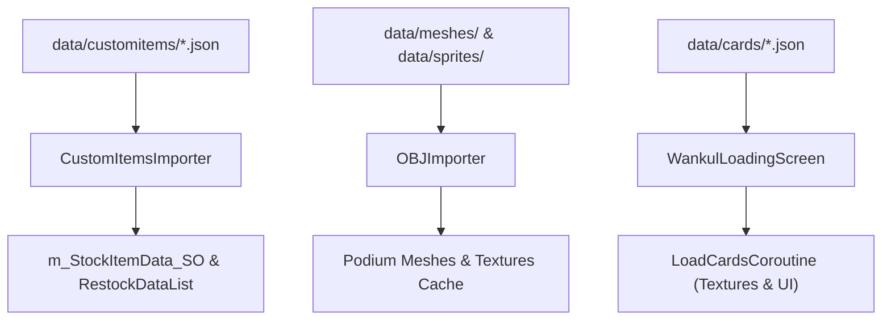
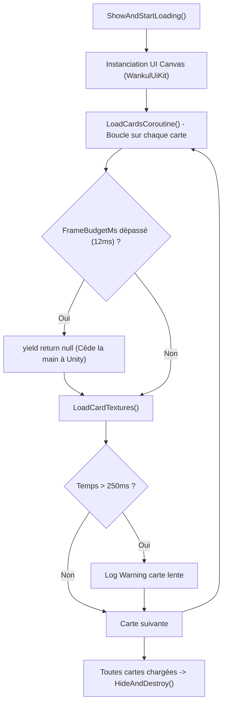

# Importateurs d'actifs et de contenu

> **Fichiers sources pertinents**
> * [importer/CustomItemsImporter.cs](https://github.com/Drakilis-57/WankulCrazy/blob/57b1f5ed/importer/CustomItemsImporter.cs)
> * [importer/OBJImporter.cs](https://github.com/Drakilis-57/WankulCrazy/blob/57b1f5ed/importer/OBJImporter.cs)
> * [importer/WankulLoadingScreen.cs](https://github.com/Drakilis-57/WankulCrazy/blob/57b1f5ed/importer/WankulLoadingScreen.cs)

Présentation des pipelines d'importation qui injectent des éléments personnalisés, des maillages, des textures et une interface utilisateur de chargement.

## Introduction

Le sous-système d'importation d'actifs et de contenu est responsable du démarrage et de l'injection d'actifs personnalisés dans l'état d'exécution du jeu.Cela implique le chargement de modèles 3D personnalisés (`.obj`), de textures, de sprites, d'éléments personnalisés et de configurations de boutique à partir du répertoire `data/` du mod, tout en gérant un écran de chargement budgétisé par cadre (`WankulLoadingScreen`) pour éviter les accrocs lors de l'initialisation.

Sources : `importer/CustomItemsImporter.cs:1-133`, `importer/OBJImporter.cs:1-156`, `importer/WankulLoadingScreen.cs:27-140`

### Schéma d'architecture de l'importateur

Sources : `importer/CustomItemsImporter.cs:20-98`, `importer/OBJImporter.cs:109-156`, `importer/WankulLoadingScreen.cs:27-44`

## 5.1 Articles personnalisés et inscription à la boutique

Pour plus de détails, voir [Objets Personnalisés et Enregistrement Boutique](Objets%20Personnalisés%20et%20Enregistrement%20Boutique.md).

Le `CustomItemsImporter` gère le chargement des définitions d'éléments personnalisés, les données de réapprovisionnement et les liaisons de maillage à partir des schémas JSON situés dans `data/customitems/`.Il s'interface directement avec `InventoryBase` pour injecter des articles et des options de réapprovisionnement dans la base de données d'articles en stock du jeu (`m_StockItemData_SO`) [importer/CustomItemsImporter.cs L20-L25](https://github.com/Drakilis-57/WankulCrazy/blob/57b1f5ed/importer/CustomItemsImporter.cs#L20-L25)

Il gère la déduplication et positionne les variantes personnalisées normales et `Taux` dans les catégories de boutique appropriées et les emplacements de réapprovisionnement [importer/CustomItemsImporter.cs L31-L95](https://github.com/Drakilis-57/WankulCrazy/blob/57b1f5ed/importer/CustomItemsImporter.cs#L31-L95)

Sources : `importer/CustomItemsImporter.cs:13-98`

## 5.2 Remplacement du maillage, de la texture et du sprite

Pour plus de détails, voir [Remplacement de Maillage Texture et Sprite](Remplacement%20de%20Maillage%20Texture%20et%20Sprite.md).

L'utilitaire `OBJImporter` analyse `data/meshes/`, `data/sprites/` et `data/names/` pour charger et mettre en cache les maillages et textures 3D `.obj` personnalisés au démarrage [importer/OBJImporter.csL18-L156](https://github.com/Drakilis-57/WankulCrazy/blob/57b1f5ed/importer/OBJImporter.cs#L18-L156)

Il gère des dictionnaires de recherche et des structures de secours pour les maillages et les textures de podium, permettant de remplacer dynamiquement les actifs visuels Vanilla par des modèles et des sprites Wankul personnalisés [importer/OBJImporter.cs L26-L95](https://github.com/Drakilis-57/WankulCrazy/blob/57b1f5ed/importer/OBJImporter.cs#L26-L95)

Sources : `importer/OBJImporter.cs:18-156`

## 5.3 Écran de chargement et interface utilisateur de débogage

Pour plus de détails, voir [Écran de Chargement et UI de Débogage](Écran%20de%20Chargement%20et%20UI%20de%20Débogage.md).

Le `WankulLoadingScreen` fournit un système de chargement de coroutine budgétisé par image (`LoadCardsCoroutine`) qui traite progressivement les textures de carte sans perdre d'images [importer/WankulLoadingScreen.csL11-L140](https://github.com/Drakilis-57/WankulCrazy/blob/57b1f5ed/importer/WankulLoadingScreen.cs#L11-L140)

Il gère un canevas d'interface utilisateur personnalisé créé via `WankulUiKit`, suit la progression du chargement et signale les cartes lentes ou les ressources manquantes tout en bloquant les entrées de jeu lors du chargement initial des ressources [importer/WankulLoadingScreen.csL57-L140](https://github.com/Drakilis-57/WankulCrazy/blob/57b1f5ed/importer/WankulLoadingScreen.cs#L57-L140)

Sources : `importer/WankulLoadingScreen.cs:11-140`

### Diagramme du pipeline de chargement et de rendu

Sources : `importer/WankulLoadingScreen.cs:27-167`