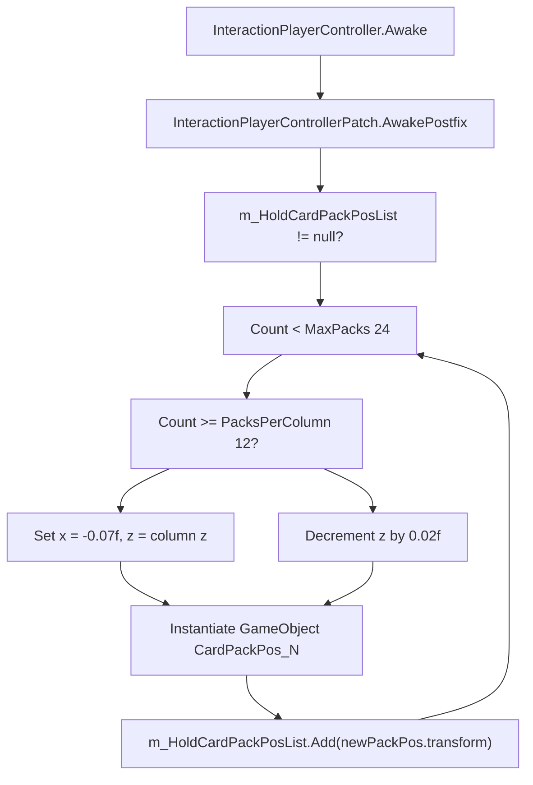
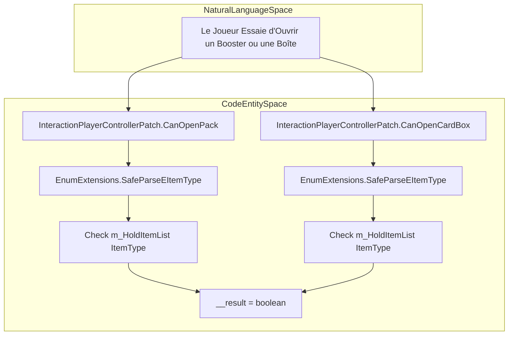

# Player Interaction and Card Boxes

> **Fichiers sources pertinents**
> * [patch/EItemTypeExtension.cs](https://github.com/Drakilis-57/WankulCrazy/blob/57b1f5ed/patch/EItemTypeExtension.cs)
> * [patch/InteractionPlayerControllerPatch.cs](https://github.com/Drakilis-57/WankulCrazy/blob/57b1f5ed/patch/InteractionPlayerControllerPatch.cs)

## Objectif et portée

Cette page détaille l'implémentation de `InteractionPlayerControllerPatch`, qui modifie les comportements d'interaction des joueurs dans `TCG Card Shop Simulator` pour prendre en charge les éléments Wankul Crazy personnalisés [patch/InteractionPlayerControllerPatch.cs L16-L17](https://github.com/Drakilis-57/WankulCrazy/blob/57b1f5ed/patch/InteractionPlayerControllerPatch.cs#L16-L17)

La portée comprend l'extension des emplacements pour packs de cartes, la validation des boosters personnalisés et des boîtes de cartes, le mappage des boîtes de cartes avec leurs types de pack correspondants et l'intégration avec `EnumExtensions` pour la résolution dynamique des types d'éléments [patch/InteractionPlayerControllerPatch.csL18-L120](https://github.com/Drakilis-57/WankulCrazy/blob/57b1f5ed/patch/InteractionPlayerControllerPatch.cs#L18-L120)

 [patch/EItemTypeExtension.cs L12-L36](https://github.com/Drakilis-57/WankulCrazy/blob/57b1f5ed/patch/EItemTypeExtension.cs#L12-L36)

---

## Emplacements de pack étendus et initialisation

Le jeu de base (vanilla) limite le nombre de paquets de cartes qu'un joueur peut tenir ou manipuler simultanément. `InteractionPlayerControllerPatch` s'accroche (hooks) à la méthode `Awake` de `InteractionPlayerController` via un patch postfix Harmony pour étendre la collection interne `m_HoldCardPackPosList` [patch/InteractionPlayerControllerPatch.cs L23-L25](https://github.com/Drakilis-57/WankulCrazy/blob/57b1f5ed/patch/InteractionPlayerControllerPatch.cs#L23-L25)

Une fois initialisé, le correctif vérifie si `m_HoldCardPackPosList` est renseigné [patch/InteractionPlayerControllerPatch.cs L28-L29](https://github.com/Drakilis-57/WankulCrazy/blob/57b1f5ed/patch/InteractionPlayerControllerPatch.cs#L28-L29)

Il ajoute ensuite les positions de transformation jusqu'à ce que la liste atteigne `MaxPacks` (défini sur `24`) [patch/InteractionPlayerControllerPatch.cs L31](https://github.com/Drakilis-57/WankulCrazy/blob/57b1f5ed/patch/InteractionPlayerControllerPatch.cs#L31-L31)

Les packs sont répartis sur deux colonnes (`PacksPerColumn = 12`) en ajustant les coordonnées locales `x` et `z` par rapport à l'entrée de transformation précédente [patch/InteractionPlayerControllerPatch.csL19-L54](https://github.com/Drakilis-57/WankulCrazy/blob/57b1f5ed/patch/InteractionPlayerControllerPatch.cs#L19-L54)

*Sources :* [patch/InteractionPlayerControllerPatch.cs L23-L61](https://github.com/Drakilis-57/WankulCrazy/blob/57b1f5ed/patch/InteractionPlayerControllerPatch.cs#L23-L61)

---

## Validation du booster pack et de la boîte à cartes

Pour permettre au joueur d'ouvrir des boosters Wankul personnalisés et des boîtes d'affichage, le correctif implémente une logique de remplacement ou d'évaluation de type préfixe pour `CanOpenPack` et `CanOpenCardBox` [patch/InteractionPlayerControllerPatch.csL63-L101](https://github.com/Drakilis-57/WankulCrazy/blob/57b1f5ed/patch/InteractionPlayerControllerPatch.cs#L63-L101)

Ces méthodes inspectent les objets actuellement détenus dans `m_HoldItemList` via la réflexion (reflection) [patch/InteractionPlayerControllerPatch.cs L75-L93](https://github.com/Drakilis-57/WankulCrazy/blob/57b1f5ed/patch/InteractionPlayerControllerPatch.cs#L75-L93)

À l'aide de `EnumExtensions.SafeParseEItemType`, ils évaluent si le type d'élément correspond aux types Vanilla ou aux types d'éléments personnalisés nouvellement enregistrés (par exemple, `BoosterStellar`, `DisplayStellar`, `TestCardPack32`, etc.) [patch/InteractionPlayerControllerPatch.csL66-L98](https://github.com/Drakilis-57/WankulCrazy/blob/57b1f5ed/patch/InteractionPlayerControllerPatch.cs#L66-L98)

*Sources :* [patch/InteractionPlayerControllerPatch.cs L63-L101](https://github.com/Drakilis-57/WankulCrazy/blob/57b1f5ed/patch/InteractionPlayerControllerPatch.cs#L63-L101)

, [patch/EItemTypeExtension.cs L128-L160](https://github.com/Drakilis-57/WankulCrazy/blob/57b1f5ed/patch/EItemTypeExtension.cs#L128-L160)

---

## Mappage de la boîte de cartes au pack de cartes

Lors de la conversion ou de l'interaction avec des boîtes de cartes, le jeu nécessite une couche de traduction entre l'identifiant de l'élément de la boîte et son identifiant de paquet de cartes déballable.`CardBoxToCardPack` gère ce mappage pour les boîtes personnalisées [patch/InteractionPlayerControllerPatch.cs L103-L120](https://github.com/Drakilis-57/WankulCrazy/blob/57b1f5ed/patch/InteractionPlayerControllerPatch.cs#L103-L120)

Il évalue l'entrée `cardBoxItemType` par rapport aux types Vanilla et aux extensions personnalisées analysées via `EnumExtensions.SafeParseEItemType` (telles que `DisplayStellar`, `DisplayLegacy` et `AscensionCardBox`), en attribuant le type de pack `__result` correspondant [patch/InteractionPlayerControllerPatch.csL103-L120](https://github.com/Drakilis-57/WankulCrazy/blob/57b1f5ed/patch/InteractionPlayerControllerPatch.cs#L103-L120)

 [patch/EItemTypeExtension.cs L128-L160](https://github.com/Drakilis-57/WankulCrazy/blob/57b1f5ed/patch/EItemTypeExtension.cs#L128-L160)

*Sources :* [patch/InteractionPlayerControllerPatch.cs L103-L120](https://github.com/Drakilis-57/WankulCrazy/blob/57b1f5ed/patch/InteractionPlayerControllerPatch.cs#L103-L120)

, [patch/EItemTypeExtension.cs L128-L160](https://github.com/Drakilis-57/WankulCrazy/blob/57b1f5ed/patch/EItemTypeExtension.cs#L128-L160)

---

## Infrastructure d'énumération personnalisée

Les extensions de type d'élément fournissent les définitions sous-jacentes requises par `InteractionPlayerControllerPatch`.La classe `EnumExtensions` gère un dictionnaire de mappages d'entiers d'énumération personnalisés pour `EItemType`, `ECollectionPackType` et `EMonsterType`, garantissant une désérialisation et une identification sécurisées [patch/EItemTypeExtension.csL12-L55](https://github.com/Drakilis-57/WankulCrazy/blob/57b1f5ed/patch/EItemTypeExtension.cs#L12-L55)

Il normalise également les entrées de chaîne et gère les espaces, la casse et les alias de chaîne (par exemple, mapper `"Booster Stellar"` à `"BoosterStellar"`) avant de tenter l'analyse standard [patch/EItemTypeExtension.csL110-L160](https://github.com/Drakilis-57/WankulCrazy/blob/57b1f5ed/patch/EItemTypeExtension.cs#L110-L160)

*Sources :* [patch/EItemTypeExtension.cs L12-L160](https://github.com/Drakilis-57/WankulCrazy/blob/57b1f5ed/patch/EItemTypeExtension.cs#L12-L160)