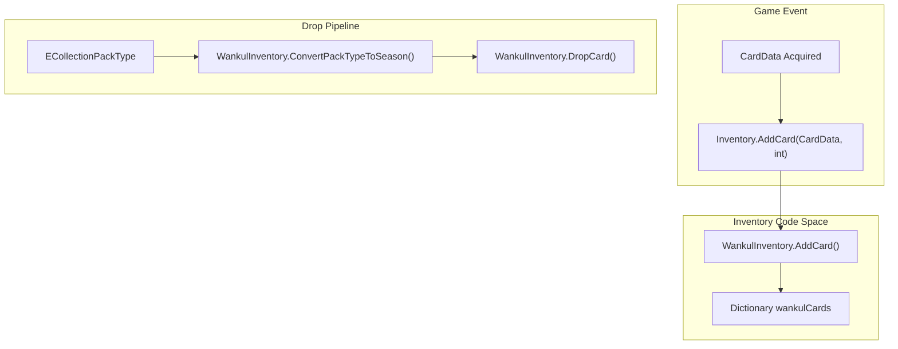
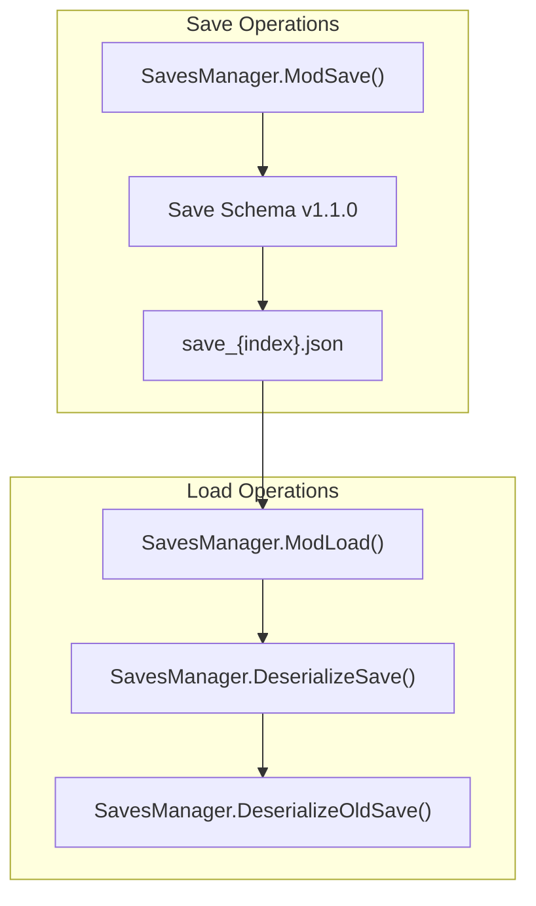

# Inventory and Persistence

> **Fichiers sources pertinents**
> * [inventaire/WankulInventory.cs](https://github.com/Drakilis-57/WankulCrazy/blob/57b1f5ed/inventory/WankulInventory.cs)
> * [patch/Inventory.cs](https://github.com/Drakilis-57/WankulCrazy/blob/57b1f5ed/patch/Inventory.cs)
> * [utils/SavesManager.cs](https://github.com/Drakilis-57/WankulCrazy/blob/57b1f5ed/utils/SavesManager.cs)

## Objectif et portée

Le module `Inventory and Persistence` régit le suivi de l'état de la collection des joueurs, les algorithmes de dépôt de cartes et la sérialisation de l'état du jeu dans `WankulCrazy`.Il relie les interactions des cartes d'exécution avec le stockage permanent sur disque, garantissant ainsi la persistance des inventaires des joueurs, des historiques de prix du marché et des associations de cartes personnalisées tout au long des sessions de jeu.

Pour une répartition complète des composants enfants, reportez-vous aux pages enfants :

* [WankulInventory et Drop Mechanics](/Drakilis-57/WankulCrazy/4.1-wankulinventory-and-drop-mechanics)
* [Sauvegarder le système](/Drakilis-57/WankulCrazy/4.2-save-system)

---

## 4.1.Gestion des stocks et pipelines de dépôt

La propriété des cartes et l'inventaire de collection sont gérés via la classe singleton `WankulInventory` [inventory/WankulInventory.cs L12-L14](https://github.com/Drakilis-57/WankulCrazy/blob/57b1f5ed/inventory/WankulInventory.cs#L12-L14)

Les interactions d'exécution telles que l'ajout ou la suppression de cartes acquises s'interfacent directement avec les méthodes `WankulInventory` via des wrappers de correctifs [patch/Inventory.cs L8-L32](https://github.com/Drakilis-57/WankulCrazy/blob/57b1f5ed/patch/Inventory.cs#L8-L32)

Drop mechanics evaluate pack types using `ConvertPackTypeToSeason` [inventory/WankulInventory.cs L30-L51](https://github.com/Drakilis-57/WankulCrazy/blob/57b1f5ed/inventory/WankulInventory.cs#L30-L51)

et exécutez des algorithmes probabilistes pondérés dans `DropCard` [inventory/WankulInventory.cs L53-L154](https://github.com/Drakilis-57/WankulCrazy/blob/57b1f5ed/inventory/WankulInventory.cs#L53-L154)

 pour remplir le contenu des boosters, en tenant compte des raretés, des contraintes saisonnières, et du filtrage des doublons.

Sources : [inventaire/WankulInventory.cs L12-L154](https://github.com/Drakilis-57/WankulCrazy/blob/57b1f5ed/inventory/WankulInventory.cs#L12-L154)

 [patch/Inventory.cs L8-L32](https://github.com/Drakilis-57/WankulCrazy/blob/57b1f5ed/patch/Inventory.cs#L8-L32)

Pour des détails techniques approfondis, voir [WankulInventory and Drop Mechanics](/Drakilis-57/WankulCrazy/4.1-wankulinventory-and-drop-mechanics).

---

## 4.2.Gestion de la persistance et des sauvegardes

La persistance est gérée par `SavesManager` [utils/SavesManager.cs L63-L404](https://github.com/Drakilis-57/WankulCrazy/blob/57b1f5ed/utils/SavesManager.cs#L63-L404)

 qui lit et écrit des fichiers de sauvegarde JSON structurés liés aux emplacements de sauvegarde de jeu actifs [utils/SavesManager.cs L73-L77](https://github.com/Drakilis-57/WankulCrazy/blob/57b1f5ed/utils/SavesManager.cs#L73-L77)

Le schéma de sérialisation est encapsulé par les classes `Save` et `OldSave` [utils/SavesManager.cs L16-L62](https://github.com/Drakilis-57/WankulCrazy/blob/57b1f5ed/utils/SavesManager.cs#L16-L62)

 supporting automated data migration, version checking against `SaveVersion` [utils/SavesManager.cs L66](https://github.com/Drakilis-57/WankulCrazy/blob/57b1f5ed/utils/SavesManager.cs#L66-L66)

et déboguer les états de sauvegarde.

Sources : [utils/SavesManager.cs L63-L169](https://github.com/Drakilis-57/WankulCrazy/blob/57b1f5ed/utils/SavesManager.cs#L63-L169)

Pour des détails techniques approfondis, voir [Save System](/Drakilis-57/WankulCrazy/4.2-save-system).