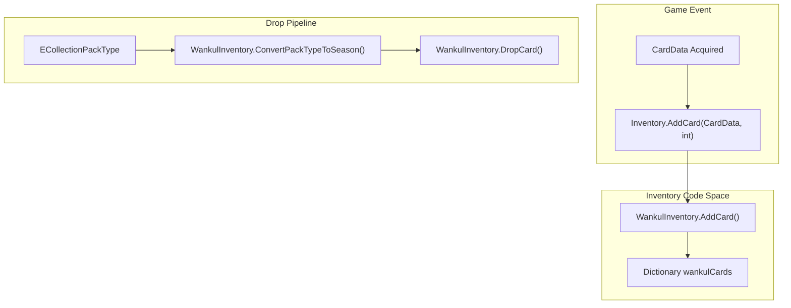
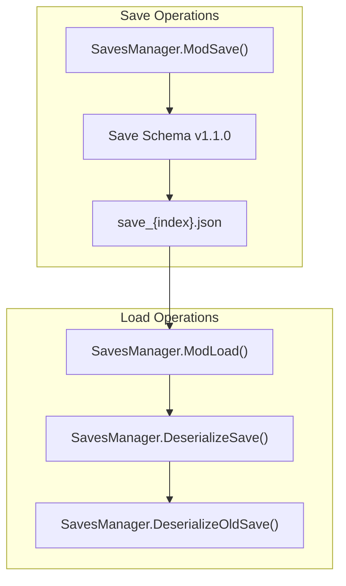

# Inventory and Persistence

> **Relevant source files**
> * [inventory/WankulInventory.cs](https://github.com/Drakilis-57/WankulCrazy/blob/57b1f5ed/inventory/WankulInventory.cs)
> * [patch/Inventory.cs](https://github.com/Drakilis-57/WankulCrazy/blob/57b1f5ed/patch/Inventory.cs)
> * [utils/SavesManager.cs](https://github.com/Drakilis-57/WankulCrazy/blob/57b1f5ed/utils/SavesManager.cs)

## Purpose and Scope

The `Inventory and Persistence` module governs player collection state tracking, card drop algorithms, and game state serialization in `WankulCrazy`. It bridges runtime card interactions with permanent storage on disk, ensuring player inventories, market pricing histories, and custom card associations persist across play sessions.

For a comprehensive breakdown of the child components, refer to the child pages:

* [WankulInventory and Drop Mechanics](/Drakilis-57/WankulCrazy/4.1-wankulinventory-and-drop-mechanics)
* [Save System](/Drakilis-57/WankulCrazy/4.2-save-system)

---

## 4.1. Inventory Management and Drop Pipelines

Card ownership and collection inventory are managed via the `WankulInventory` singleton class [inventory/WankulInventory.cs L12-L14](https://github.com/Drakilis-57/WankulCrazy/blob/57b1f5ed/inventory/WankulInventory.cs#L12-L14)

 Runtime interactions such as adding or removing acquired cards interface directly with `WankulInventory` methods through patch wrappers [patch/Inventory.cs L8-L32](https://github.com/Drakilis-57/WankulCrazy/blob/57b1f5ed/patch/Inventory.cs#L8-L32)

Drop mechanics evaluate pack types using `ConvertPackTypeToSeason` [inventory/WankulInventory.cs L30-L51](https://github.com/Drakilis-57/WankulCrazy/blob/57b1f5ed/inventory/WankulInventory.cs#L30-L51)

 and execute weighted probabilistic algorithms inside `DropCard` [inventory/WankulInventory.cs L53-L154](https://github.com/Drakilis-57/WankulCrazy/blob/57b1f5ed/inventory/WankulInventory.cs#L53-L154)

 to populate booster contents, factoring in rarities, seasonal constraints, and duplicate filtering.

Sources: [inventory/WankulInventory.cs L12-L154](https://github.com/Drakilis-57/WankulCrazy/blob/57b1f5ed/inventory/WankulInventory.cs#L12-L154)

 [patch/Inventory.cs L8-L32](https://github.com/Drakilis-57/WankulCrazy/blob/57b1f5ed/patch/Inventory.cs#L8-L32)

For deep technical details, see [WankulInventory and Drop Mechanics](/Drakilis-57/WankulCrazy/4.1-wankulinventory-and-drop-mechanics).

---

## 4.2. Persistence and Save Management

Persistence is handled by `SavesManager` [utils/SavesManager.cs L63-L404](https://github.com/Drakilis-57/WankulCrazy/blob/57b1f5ed/utils/SavesManager.cs#L63-L404)

 which reads and writes structured JSON save files tied to active game save slots [utils/SavesManager.cs L73-L77](https://github.com/Drakilis-57/WankulCrazy/blob/57b1f5ed/utils/SavesManager.cs#L73-L77)

 The serialization schema is encapsulated by the `Save` and `OldSave` classes [utils/SavesManager.cs L16-L62](https://github.com/Drakilis-57/WankulCrazy/blob/57b1f5ed/utils/SavesManager.cs#L16-L62)

 supporting automated data migration, version checking against `SaveVersion` [utils/SavesManager.cs L66](https://github.com/Drakilis-57/WankulCrazy/blob/57b1f5ed/utils/SavesManager.cs#L66-L66)

 and debug save states.

Sources: [utils/SavesManager.cs L63-L169](https://github.com/Drakilis-57/WankulCrazy/blob/57b1f5ed/utils/SavesManager.cs#L63-L169)

For deep technical details, see [Save System](/Drakilis-57/WankulCrazy/4.2-save-system).