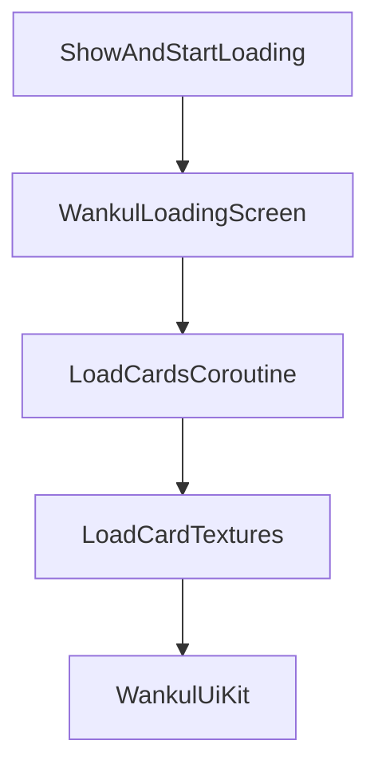
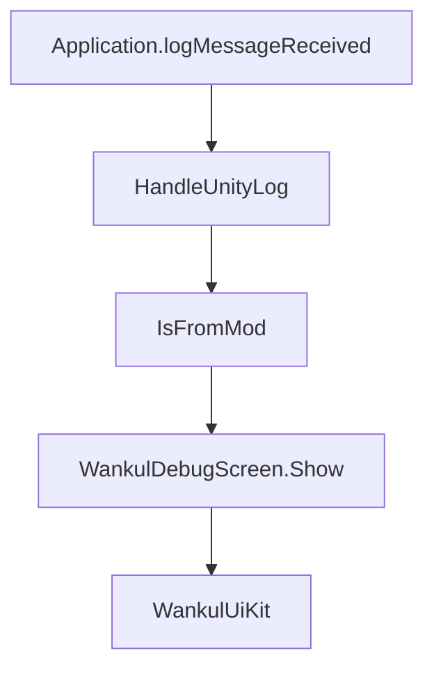

# Loading Screen and Debug UI

> **Relevant source files**
> * [importer/OBJImporter.cs](https://github.com/Drakilis-57/WankulCrazy/blob/57b1f5ed/importer/OBJImporter.cs)
> * [importer/WankulDebugScreen.cs](https://github.com/Drakilis-57/WankulCrazy/blob/57b1f5ed/importer/WankulDebugScreen.cs)
> * [importer/WankulLoadingScreen.cs](https://github.com/Drakilis-57/WankulCrazy/blob/57b1f5ed/importer/WankulLoadingScreen.cs)
> * [importer/WankulUiKit.cs](https://github.com/Drakilis-57/WankulCrazy/blob/57b1f5ed/importer/WankulUiKit.cs)
> * [patch/DebugFilterPatch.cs](https://github.com/Drakilis-57/WankulCrazy/blob/57b1f5ed/patch/DebugFilterPatch.cs)
> * [patch/PlayCardSetUIPatch.cs](https://github.com/Drakilis-57/WankulCrazy/blob/57b1f5ed/patch/PlayCardSetUIPatch.cs)
> * [patch/SceneLifecyclePatches.cs](https://github.com/Drakilis-57/WankulCrazy/blob/57b1f5ed/patch/SceneLifecyclePatches.cs)

## Purpose and Scope

This document details the implementation of the UI, loading, and debugging subsystems in the `WankulCrazy` codebase. Specifically, it covers the frame-budgeted asynchronous card asset loading managed by `WankulLoadingScreen`, the shared UGUI component factory `WankulUiKit`, the runtime exception/error interception screen `WankulDebugScreen`, and the log noise filter `DebugFilterPatch`.

---

## 1. WankulLoadingScreen and Frame-Budgeted Loading

The `WankulLoadingScreen` class is a `MonoBehaviour` singleton responsible for loading card textures and masks asynchronously without causing frame drops or stuttering during game initialization [importer/WankulLoadingScreen.cs L11-L44](https://github.com/Drakilis-57/WankulCrazy/blob/57b1f5ed/importer/WankulLoadingScreen.cs#L11-L44)

### Core Mechanics and Frame Budgeting

* **`IsLoading`**: A static public property (`bool`) used across the mod to block booster openings or album interactions while asset loading is active [importer/WankulLoadingScreen.cs L18-L20](https://github.com/Drakilis-57/WankulCrazy/blob/57b1f5ed/importer/WankulLoadingScreen.cs#L18-L20)
* **Frame Budget (`FrameBudgetMs`)**: Set to `12f` milliseconds, ensuring that texture loading operations yield control back to Unity once the frame time budget is exhausted [importer/WankulLoadingScreen.cs L22-L23](https://github.com/Drakilis-57/WankulCrazy/blob/57b1f5ed/importer/WankulLoadingScreen.cs#L22-L23)
* **Performance Tracking**: Individual card load durations are measured via `System.Diagnostics.Stopwatch`. Cards exceeding `SlowCardMs` (250 ms) trigger a warning log [importer/WankulLoadingScreen.cs L24-L114](https://github.com/Drakilis-57/WankulCrazy/blob/57b1f5ed/importer/WankulLoadingScreen.cs#L24-L114)

Sources: `importer/WankulLoadingScreen.cs:27-140`

---

## 2. WankulUiKit Utility Framework

`WankulUiKit` is an internal static utility class providing helper functions for UGUI setup, layout anchoring, and component instantiation used by both `WankulLoadingScreen` and `WankulDebugScreen` [importer/WankulUiKit.cs L7-L120](https://github.com/Drakilis-57/WankulCrazy/blob/57b1f5ed/importer/WankulUiKit.cs#L7-L120)

Key features include:

* **Font Fallback**: Retrieves Unity's built-in `Arial.ttf` or falls back to an OS font dynamically [importer/WankulUiKit.cs L13-L24](https://github.com/Drakilis-57/WankulCrazy/blob/57b1f5ed/importer/WankulUiKit.cs#L13-L24)
* **White Sprite Generation**: Generates a runtime 1x1 white `Sprite` from `Texture2D.whiteTexture` for solid color image rendering [importer/WankulUiKit.cs L26-L37](https://github.com/Drakilis-57/WankulCrazy/blob/57b1f5ed/importer/WankulUiKit.cs#L26-L37)
* **Canvas Setup**: Configures screen-space overlay canvases with `CanvasScaler` referenced to a `1920x1080` resolution and explicit sorting orders [importer/WankulUiKit.cs L39-L53](https://github.com/Drakilis-57/WankulCrazy/blob/57b1f5ed/importer/WankulUiKit.cs#L39-L53)
* **RectTransform Helpers**: Provides layout shortcuts such as `Stretch`, `PlaceCentered`, and `Place` [importer/WankulUiKit.cs L55-L76](https://github.com/Drakilis-57/WankulCrazy/blob/57b1f5ed/importer/WankulUiKit.cs#L55-L76)
* **UI Element Factories**: Methods like `CreateImage`, `CreateText`, and `CreateButton` streamline programmatic UI generation [importer/WankulUiKit.cs L78-L118](https://github.com/Drakilis-57/WankulCrazy/blob/57b1f5ed/importer/WankulUiKit.cs#L78-L118)

Sources: `importer/WankulUiKit.cs:1-120`

---

## 3. WankulDebugScreen and Log Interception

`WankulDebugScreen` captures Unity engine logs and exceptions at runtime, displaying a modal error screen when critical exceptions originate from the mod [importer/WankulDebugScreen.cs L8-L97](https://github.com/Drakilis-57/WankulCrazy/blob/57b1f5ed/importer/WankulDebugScreen.cs#L8-L97)

### Exception Handling Pipeline

1. **Event Hook**: Subscribes to `Application.logMessageReceived` in `Awake()` and unsubscribes in `OnDestroy()` [importer/WankulDebugScreen.cs L49-L54](https://github.com/Drakilis-57/WankulCrazy/blob/57b1f5ed/importer/WankulDebugScreen.cs#L49-L54)
2. **Filtering**: Ignores closing events, non-mod logs (`IsFromMod`), and non-critical logs, targeting `LogType.Exception` and critical `LogType.Error` instances (such as `NullReferenceException`, `ArgumentOutOfRangeException`, and `IndexOutOfRangeException`) [importer/WankulDebugScreen.cs L75-L97](https://github.com/Drakilis-57/WankulCrazy/blob/57b1f5ed/importer/WankulDebugScreen.cs#L75-L97)
3. **UI Display**: Renders a high-priority overlay (`sortingOrder = 10000`), forces cursor visibility and unlocks cursor state during display updates [importer/WankulDebugScreen.cs L59-L146](https://github.com/Drakilis-57/WankulCrazy/blob/57b1f5ed/importer/WankulDebugScreen.cs#L59-L146)

Sources: `importer/WankulDebugScreen.cs:46-146`

---

## 4. DebugFilterPatch and Log Noise Reduction

`DebugFilterPatch` intercepts Unity logging calls to suppress known, harmless engine warnings and trace messages that clutter the BepInEx console [patch/DebugFilterPatch.cs L6-L71](https://github.com/Drakilis-57/WankulCrazy/blob/57b1f5ed/patch/DebugFilterPatch.cs#L6-L71)

The `ShouldIgnore` method evaluates log strings for known patterns, returning `false` (suppressing the log) for messages such as:

* Font asset underline missing warnings [patch/DebugFilterPatch.cs L11](https://github.com/Drakilis-57/WankulCrazy/blob/57b1f5ed/patch/DebugFilterPatch.cs#L11-L11)
* `DontDestroyOnLoad` warnings on non-root game objects [patch/DebugFilterPatch.cs L12](https://github.com/Drakilis-57/WankulCrazy/blob/57b1f5ed/patch/DebugFilterPatch.cs#L12-L12)
* RectTransform parent assignment warnings [patch/DebugFilterPatch.cs L13](https://github.com/Drakilis-57/WankulCrazy/blob/57b1f5ed/patch/DebugFilterPatch.cs#L13-L13)
* Negative scale/size warnings on `BoxCollider` [patch/DebugFilterPatch.cs L14](https://github.com/Drakilis-57/WankulCrazy/blob/57b1f5ed/patch/DebugFilterPatch.cs#L14-L14)
* `percentDone` progress logs [patch/DebugFilterPatch.cs L15](https://github.com/Drakilis-57/WankulCrazy/blob/57b1f5ed/patch/DebugFilterPatch.cs#L15-L15)

Sources: `patch/DebugFilterPatch.cs:8-16`