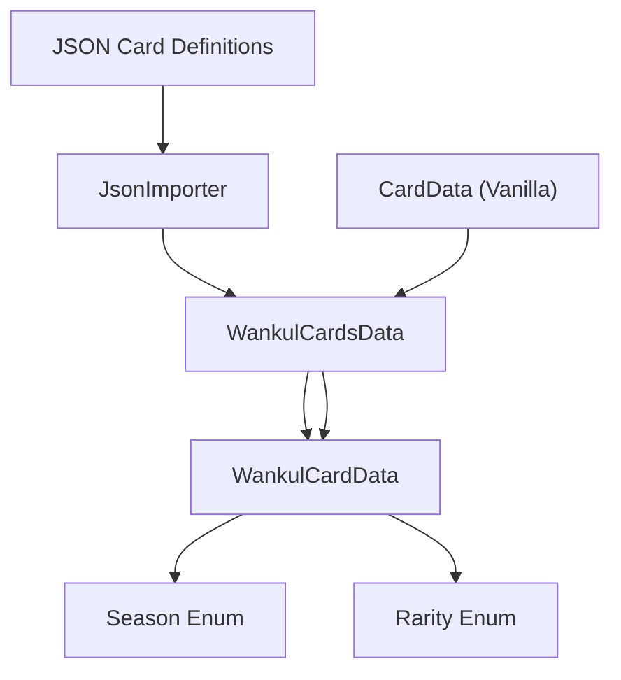

# Modèle de données de carte

> **Fichiers sources pertinents**
> * [cards/Rarity.cs](https://github.com/Drakilis-57/WankulCrazy/blob/57b1f5ed/cards/Rarity.cs)
> * [cards/Season.cs](https://github.com/Drakilis-57/WankulCrazy/blob/57b1f5ed/cards/Season.cs)
> * [cards/Seasons.cs](https://github.com/Drakilis-57/WankulCrazy/blob/57b1f5ed/cards/Seasons.cs)
> * [cards/WankulCardsData.cs](https://github.com/Drakilis-57/WankulCrazy/blob/57b1f5ed/cards/WankulCardsData.cs)

## Objectif et portée

Le Modèle de Données des Cartes (Card Data Model) régit la manière dont les cartes personnalisées Wankul sont structurées, catégorisées et suivies au sein de la modification `WankulCrazy`. Situé principalement sous le répertoire `cards/`, ce modèle de domaine relie les structures de cartes de base (vanilla) de TCG Card Shop Simulator avec des entités Wankul personnalisées, en supportant les saisons, les raretés, et les types de cartes dynamiques (Effigies, Terrains, et Spéciales).

En tant que page parente, ce document fournit un aperçu architectural de haut niveau du sous-système de domaine de cartes. Pour les spécificités d'implémentation, consultez les pages enfants :

* Registre WankulCardsData et types de cartes : [Registre WankulCardsData et types de cartes](/Drakilis-57/WankulCrazy/2.1-wankulcardsdata-registry-and-card-types)
* Saisons et raretés : [Saisons et raretés](/Drakilis-57/WankulCrazy/2.2-seasons-and-rarities)
* Données JSON de carte et importation : [Données JSON de carte et importation](/Drakilis-57/WankulCrazy/2.3-card-json-data-and-importing)

Sources : `cards/WankulCardsData.cs:1-165` [cards/WankulCardsData.cs](https://github.com/Drakilis-57/WankulCrazy/blob/57b1f5ed/cards/WankulCardsData.cs)

---

## Architecture de haut niveau

Le sous-système de données de carte coordonne les définitions JSON brutes, les singletons de conteneurs, les entités de jeu Vanilla (`CardData`, `MonsterData`) et les structures de suivi des stocks.

*Sources: `cards/WankulCardsData.cs:12-30` [cards/WankulCardsData.cs](https://github.com/Drakilis-57/WankulCrazy/blob/57b1f5ed/cards/WankulCardsData.cs)*

---

## 2.1 Registre WankulCardsData et types de cartes

Le coordinateur central pour la recherche et l'instanciation de cartes est `WankulCardsData`, un singleton héritant de `Singleton<WankulCardsData>` [cards/WankulCardsData.cs L12-L13](https://github.com/Drakilis-57/WankulCrazy/blob/57b1f5ed/cards/WankulCardsData.cs#L12-L13)

Il maintient la liste principale des cartes personnalisées (`cards`), des cartes d'association directe (`association`) et des caches de recherche inversée (`reverseAssociation`) pour traduire entre les références de cartes de jeu Vanilla et les représentations de cartes Wankul.

Pour plus de détails sur les sous-classes de cartes (`EffigyCardData`, `TerrainCardData`, `SpecialCardData`), les définitions de champs et les mécanismes de secours comme `AJETER`, voir [WankulCardsData Registry and Card Types](/Drakilis-57/WankulCrazy/2.1-wankulcardsdata-registry-and-card-types).

Sources: `cards/WankulCardsData.cs:12-165` [cards/WankulCardsData.cs](https://github.com/Drakilis-57/WankulCrazy/blob/57b1f5ed/cards/WankulCardsData.cs)

---

## 2.2 Saisons et raretés

La classification des cartes repose sur des énumérations fortement typées et des structures de gestionnaire dynamiques.L'énumération `Season` définit des époques telles que `S01`, `S02`, `S03`, `S04`, `S05` et `HS` (Hors Serie) [cards/Season.csL3-L11](https://github.com/Drakilis-57/WankulCrazy/blob/57b1f5ed/cards/Season.cs#L3-L11)

mappé à des étiquettes descriptives via `SeasonsContainer` [cards/Seasons.cs L5-L16](https://github.com/Drakilis-57/WankulCrazy/blob/57b1f5ed/cards/Seasons.cs#L5-L16)

De même, l'énumération `Rarity` prend en charge une liste de niveaux étendue allant des standards communs (`C`) et peu communs (`UC`) aux éditions spéciales, packs de démarrage et classifications de mèmes personnalisées [cards/Rarity.csL3-L27](https://github.com/Drakilis-57/WankulCrazy/blob/57b1f5ed/cards/Rarity.cs#L3-L27)

Pour des informations détaillées sur les convertisseurs JSON, les gestionnaires de saisons/raretés, et les fichiers de données, voir [Saisons et Raretés](/Drakilis-57/WankulCrazy/2.2-seasons-and-rarities).

Sources : `cards/Season.cs:3-11]`, `cards/Seasons.cs:5-16]`, `cards/Rarity.cs:3-27` [cards/Season.cs L3-L11](https://github.com/Drakilis-57/WankulCrazy/blob/57b1f5ed/cards/Season.cs#L3-L11)

---

## 2.3 Données JSON de Carte et Importation

Les données de carte personnalisée sont chargées dynamiquement à partir du disque via les pipelines d'importation.Le système analyse les attributs de carte, les chemins d'image-objet, les chemins de masque et les schémas hérités du répertoire `data/cards`.

Pour plus d'informations sur la logique d'analyse, la prise en charge du schéma `legacy.json` et la résolution du chemin d'actif, voir [Données JSON de carte et importation](/Drakilis-57/WankulCrazy/2.3-card-json-data-and-importing).

Sources : `cards/WankulCardsData.cs:18-25` [cards/WankulCardsData.cs](https://github.com/Drakilis-57/WankulCrazy/blob/57b1f5ed/cards/WankulCardsData.cs)