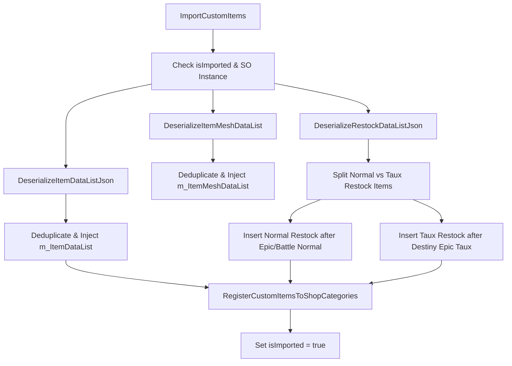
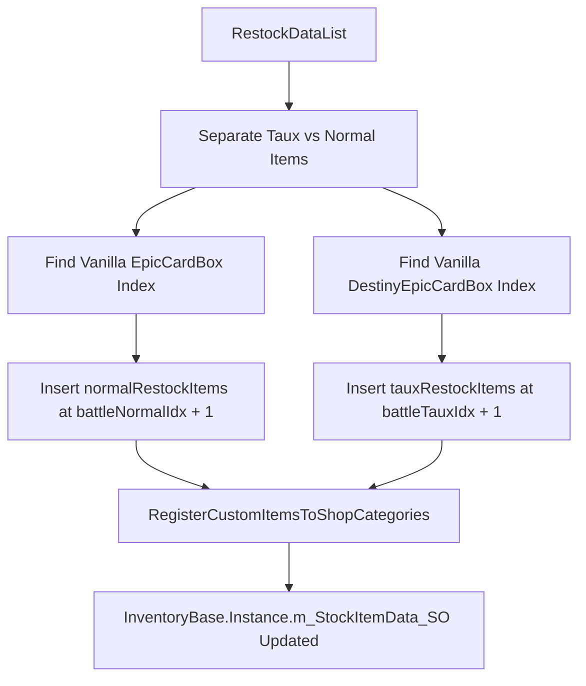

# Articles personnalisés et inscription à la boutique

> **Fichiers sources pertinents**
> * [data/customitems/ItemDataList.json](https://github.com/Drakilis-57/WankulCrazy/blob/57b1f5ed/data/customitems/ItemDataList.json)
> * [data/customitems/itemMeshDataList.json](https://github.com/Drakilis-57/WankulCrazy/blob/57b1f5ed/data/customitems/itemMeshDataList.json)
> * [data/customitems/restockDataList.json](https://github.com/Drakilis-57/WankulCrazy/blob/57b1f5ed/data/customitems/restockDataList.json)
> * [importer/CustomItemsImporter.cs](https://github.com/Drakilis-57/WankulCrazy/blob/57b1f5ed/importer/CustomItemsImporter.cs)

## Objectif et portée

Cette page détaille la mise en œuvre du pipeline d'importation d'actifs personnalisés centré autour de `CustomItemsImporter` [importer/CustomItemsImporter.cs L13-L100](https://github.com/Drakilis-57/WankulCrazy/blob/57b1f5ed/importer/CustomItemsImporter.cs#L13-L100)

Il explique comment les définitions basées sur JSON pour les éléments, les règles de réapprovisionnement et les maillages sont désérialisées, dédupliquées et injectées dans les bases de données d'inventaire ScriptableObject du jeu de base (`InventoryBase`) [importer/CustomItemsImporter.csL23-L98](https://github.com/Drakilis-57/WankulCrazy/blob/57b1f5ed/importer/CustomItemsImporter.cs#L23-L98)

En outre, il documente les schémas structurels JSON (`ItemData`, `RestockData`, `ItemMeshData`), les algorithmes chronologiques de réapprovisionnement, l'enregistrement des catégories de boutique et la gestion spéciale des variantes `Taux` à taux d'abandon élevé.

---

## 1. Pipeline et flux de données de l'importateur d'éléments personnalisés

Le pipeline d'éléments personnalisés est orchestré par la classe `CustomItemsImporter` [importer/CustomItemsImporter.cs L13](https://github.com/Drakilis-57/WankulCrazy/blob/57b1f5ed/importer/CustomItemsImporter.cs#L13-L13)

Lorsqu'il est déclenché, `ImportCustomItems()` [importer/CustomItemsImporter.cs:20] vérifie que l'importation n'a pas déjà eu lieu (indicateur `isImported`) et que la référence ScriptableObject d'inventaire (`InventoryBase.Instance.m_StockItemData_SO`) est disponible [importer/CustomItemsImporter.csL22-L23](https://github.com/Drakilis-57/WankulCrazy/blob/57b1f5ed/importer/CustomItemsImporter.cs#L22-L23)

The pipeline executes in three major phases:

1. **Désérialisation** : charge et analyse `ItemDataList.json`, `restockDataList.json` et `itemMeshDataList.json` à partir du répertoire `data/customitems` à l'aide de JSON.NET [importer/CustomItemsImporter.csL27-L29](https://github.com/Drakilis-57/WankulCrazy/blob/57b1f5ed/importer/CustomItemsImporter.cs#L27-L29)
2. **Deduplication and Injection**: Clears existing items and meshes matching custom names to prevent duplicates, then appends the newly parsed items into `m_ItemDataList` and `m_ItemMeshDataList` [importer/CustomItemsImporter.cs L31-L44](https://github.com/Drakilis-57/WankulCrazy/blob/57b1f5ed/importer/CustomItemsImporter.cs#L31-L44)
3. **Chronologie de réapprovisionnement et catégorisation de la boutique** : trie les entrées de réapprovisionnement dans des listes de variantes normales et `Taux`, les insère dans des index chronologiques spécifiques relatifs aux articles du jeu de base et les enregistre dans les catégories d'affichage de la boutique [importer/CustomItemsImporter.csL47-L95](https://github.com/Drakilis-57/WankulCrazy/blob/57b1f5ed/importer/CustomItemsImporter.cs#L47-L95)

### Flux d'exécution de l'importateur



*Sources : [importer/CustomItemsImporter.cs L20-L99](https://github.com/Drakilis-57/WankulCrazy/blob/57b1f5ed/importer/CustomItemsImporter.cs#L20-L99)*

---

## 2. Schémas JSON : ItemData, RestockData et ItemMeshData

Les ressources personnalisées reposent sur trois configurations de schéma JSON distinctes stockées dans le répertoire `data/customitems/`.

### ItemData (ItemDataList.json)

Définit les principales propriétés économiques, dimensionnelles et de catégorie des objets (boosters, présentoirs, figurines, tapis de jeu, classeurs).

|Champ |Tapez |Descriptif |
|--- |--- |--- |
|`itemType` |`string` |Identifiant interne unique (par exemple, `BoosterStellar`, `CaleconStellar`) [data/customitems/ItemDataList.json L3-L85](https://github.com/Drakilis-57/WankulCrazy/blob/57b1f5ed/data/customitems/ItemDataList.json#L3-L85) |
|`name` |`string` |Nom d'affichage de l'élément [data/customitems/ItemDataList.json L4-L86](https://github.com/Drakilis-57/WankulCrazy/blob/57b1f5ed/data/customitems/ItemDataList.json#L4-L86) |
|`category` |`string` |Catégorie de boutique (`TCG`, `Figurine`, `Playmat`) [data/customitems/ItemDataList.json L5-L145](https://github.com/Drakilis-57/WankulCrazy/blob/57b1f5ed/data/customitems/ItemDataList.json#L5-L145) |
| `baseCost` | `float` | Base purchase cost from wholesalers [data/customitems/ItemDataList.json L8-L28](https://github.com/Drakilis-57/WankulCrazy/blob/57b1f5ed/data/customitems/ItemDataList.json#L8-L28) |
|`marketPriceMinPercent` / `maxPercent` |`float` |Limites fluctuantes des prix du marché [data/customitems/ItemDataList.json L9-L30](https://github.com/Drakilis-57/WankulCrazy/blob/57b1f5ed/data/customitems/ItemDataList.json#L9-L30) |
|`colliderScale` / `colliderPosOffset` |Vecteur3 |Dimensionnement du collisionneur physique et décalages de position pour l'interaction [data/customitems/ItemDataList.json L18-L19](https://github.com/Drakilis-57/WankulCrazy/blob/57b1f5ed/data/customitems/ItemDataList.json#L18-L19) |

*Sources : [data/customitems/ItemDataList.json L1-L187](https://github.com/Drakilis-57/WankulCrazy/blob/57b1f5ed/data/customitems/ItemDataList.json#L1-L187)*

### RestockData (restockDataList.json)

Définit les exigences en matière de licence, le dimensionnement des boîtes et les quantités de boîtes disponibles dans le système de commande informatique.

```json
{    "index": 0,    "name": "Booster Stellar (32)",    "isBigBox": false,    "amount": 32,    "licenseShopLevelRequired": 20,    "licensePrice": 10000,    "itemType": "BoosterStellar"}
```

*Sources : [data/customitems/restockDataList.json L1-L266](https://github.com/Drakilis-57/WankulCrazy/blob/57b1f5ed/data/customitems/restockDataList.json#L1-L266)*

### ItemMeshData (itemMeshDataList.json)

Contrôle si l'élément est généré via une copie de maillage de base (`CopyItem`) ou chargé à partir d'un fichier `.obj` externe (`ImportObj`), ainsi que des liaisons de texture.

|Champ |Tapez |Descriptif |
|--- |--- |--- |
|`importType` |`string` |Identifiant de stratégie : `CopyItem` ou `ImportObj` [data/customitems/itemMeshDataList.json L3-L67](https://github.com/Drakilis-57/WankulCrazy/blob/57b1f5ed/data/customitems/itemMeshDataList.json#L3-L67) |
|`copyItemType` |`string` |Type d'élément de jeu de base pour cloner la géométrie à partir de [data/customitems/itemMeshDataList.json L6-L46](https://github.com/Drakilis-57/WankulCrazy/blob/57b1f5ed/data/customitems/itemMeshDataList.json#L6-L46) |
|`texture` |`string` |Nom de fichier de la texture diffuse/spéculaire personnalisée [data/customitems/itemMeshDataList.json L7-L70](https://github.com/Drakilis-57/WankulCrazy/blob/57b1f5ed/data/customitems/itemMeshDataList.json#L7-L70) |
|`obj` |`string` |Chemin d'accès au fichier de géométrie `.obj` (utilisé lorsque `ImportObj`) [data/customitems/itemMeshDataList.json L71](https://github.com/Drakilis-57/WankulCrazy/blob/57b1f5ed/data/customitems/itemMeshDataList.json#L71-L71) |

*Sources : [data/customitems/itemMeshDataList.json L1-L131](https://github.com/Drakilis-57/WankulCrazy/blob/57b1f5ed/data/customitems/itemMeshDataList.json#L1-L131)*

---

## 3. Inscription dans l'onglet Boutique et chronologie de réapprovisionnement

Pour garantir que les licences personnalisées apparaissent logiquement dans l'arborescence de progression de la boutique sans écraser les licences Vanilla, `CustomItemsImporter` sépare les données de réapprovisionnement en articles standard et variantes `Taux` [importer/CustomItemsImporter.csL52-L91](https://github.com/Drakilis-57/WankulCrazy/blob/57b1f5ed/importer/CustomItemsImporter.cs#L52-L91)

### Logique d'insertion chronologique

1. **Objets de réapprovisionnement normaux** : recherche de l'index des éléments de combat standard (`EpicCardBox` ou noms contenant `"Epic"`) et insère le tableau de réapprovisionnement personnalisé normal immédiatement après [importer/CustomItemsImporter.csL64-L72](https://github.com/Drakilis-57/WankulCrazy/blob/57b1f5ed/importer/CustomItemsImporter.cs#L64-L72)
2. **Taux Restock Items** : cible les éléments `Taux` à taux de chute élevé (`BoosterStellarTaux`, `DisplayStellarTaux`, `BoosterLegacyTaux`, `DisplayLegacyTaux`) et les insère directement après le `DestinyEpicCardBox` vanille ou les structures de combat `Taux` équivalentes [importer/CustomItemsImporter.csL52-L91](https://github.com/Drakilis-57/WankulCrazy/blob/57b1f5ed/importer/CustomItemsImporter.cs#L52-L91)

### Architecture d'enregistrement des boutiques



*Sources : [importer/CustomItemsImporter.cs L47-L98](https://github.com/Drakilis-57/WankulCrazy/blob/57b1f5ed/importer/CustomItemsImporter.cs#L47-L98)*

---

## 4. Variantes de taux et configurations spéciales d'importateur

Les variantes `Taux` représentent des packs de cartes améliorés présentant des taux d'abandon élevés.Ils utilisent des types d'éléments distincts (par exemple, `BoosterStellarTaux` et `DisplayStellarTaux`) associés à des fichiers d'icônes personnalisés modifiés (`Icon_Booster_S4_TauxDrop.png`) et des mappages de texture (`Texture_Booster_S4_TauxDrop.png`) [data/customitems/ItemDataList.jsonL43-L81](https://github.com/Drakilis-57/WankulCrazy/blob/57b1f5ed/data/customitems/ItemDataList.json#L43-L81)

 [data/customitems/itemMeshDataList.json L20-L33](https://github.com/Drakilis-57/WankulCrazy/blob/57b1f5ed/data/customitems/itemMeshDataList.json#L20-L33)

Contrairement aux boosters standard qui héritent du prix de base, les variantes `Taux` comportent des multiplicateurs `baseCost` échelonnés (par exemple, `baseCost: 40` contre `20` pour les boosters Stellar standard) et sont débloquées aux niveaux de licence de magasin supérieurs (`licenseShopLevelRequired` jusqu'à `70`) [data/customitems/restockDataList.jsonL98-L193](https://github.com/Drakilis-57/WankulCrazy/blob/57b1f5ed/data/customitems/restockDataList.json#L98-L193)

 [data/customitems/ItemDataList.json L48](https://github.com/Drakilis-57/WankulCrazy/blob/57b1f5ed/data/customitems/ItemDataList.json#L48-L48)