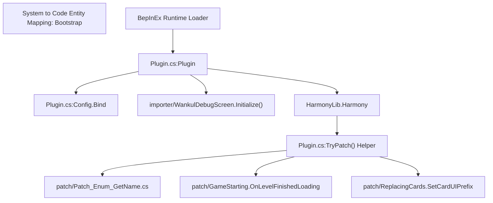
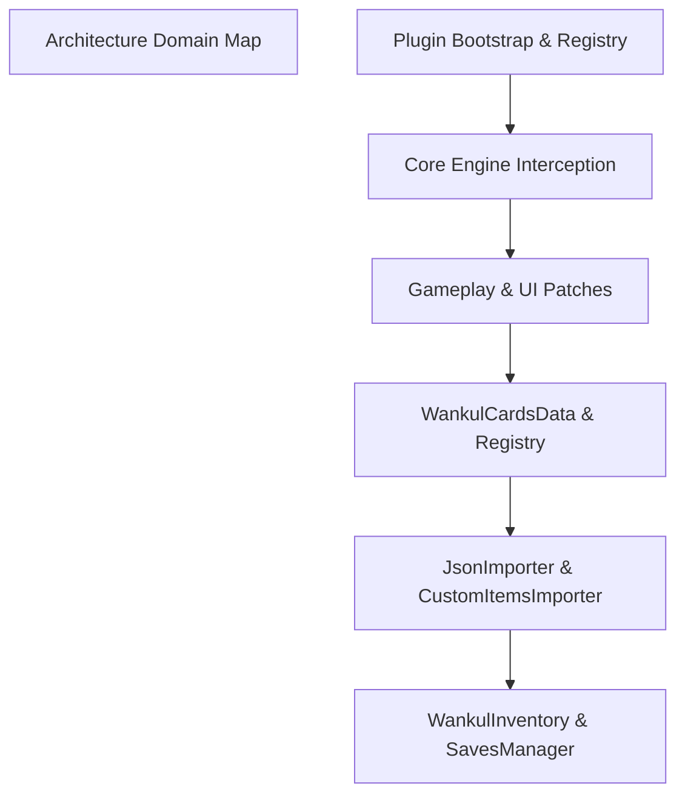

# Overview

> **Relevant source files**
> * [.github/ISSUE_TEMPLATE/BUG-REPORT.yml](https://github.com/Drakilis-57/WankulCrazy/blob/57b1f5ed/.github/ISSUE_TEMPLATE/BUG-REPORT.yml)
> * [Docs/DOCS.md](https://github.com/Drakilis-57/WankulCrazy/blob/57b1f5ed/Docs/DOCS.md?plain=1)
> * [INSTALL.txt](https://github.com/Drakilis-57/WankulCrazy/blob/57b1f5ed/INSTALL.txt)
> * [Plugin.cs](https://github.com/Drakilis-57/WankulCrazy/blob/57b1f5ed/Plugin.cs)
> * [PluginInfo.cs](https://github.com/Drakilis-57/WankulCrazy/blob/57b1f5ed/PluginInfo.cs)
> * [README.md](https://github.com/Drakilis-57/WankulCrazy/blob/57b1f5ed/README.md?plain=1)
> * [libs/Assembly-CSharp.dll](https://github.com/Drakilis-57/WankulCrazy/blob/57b1f5ed/libs/Assembly-CSharp.dll)

## Purpose and Scope

`WankulCrazy` is a BepInEx 5.4 and Harmony-based modification for *TCG Card Shop Simulator*, implemented in C#. Its primary objective is to replace standard in-game assets, cards, and UI elements with custom Wankul universe content [Docs/DOCS.md:7-17]. The mod manages a complex dynamic data pipeline, loading custom card definitions, seasons, rarities, 3D meshes, and textures from JSON files and injecting them into the runtime using Harmony method patches [Docs/DOCS.md:7-40].

The core runtime orchestration is anchored by the `Plugin` class, which extends BepInEx's `BaseUnityPlugin` and handles lifecycle initialization, configuration binding, and method patching [Plugin.cs:14-46].

*Sources: [Plugin.cs:14-112]*, *[Docs/DOCS.md:7-17]*

---

## Architecture Overview

The codebase is organized into discrete functional layers responsible for bootstrapping, domain models, gameplay hooks, inventory persistence, and content asset importing. High-level subsystems interface through centralized managers and static registries.

*Sources: [Plugin.cs:1-176]*, *[Docs/DOCS.md:92-104]*

For detailed explorations of specific subsystems, refer to the child documentation pages:

* [Getting Started & Installation](/Drakilis-57/WankulCrazy/1.1-getting-started-and-installation) — Installation instructions, mod folder layout under `BepInEx/plugins`, configuration parameters, and reference documents in `Docs/` and `INSTALL.txt` [INSTALL.txt:1-4, Plugin.cs:40].
* [Plugin Bootstrap and Harmony Patch Registry](/Drakilis-57/WankulCrazy/1.2-plugin-bootstrap-and-harmony-patch-registry) — Detailed breakdown of `Plugin.cs` lifecycle execution in `Awake()`, the `TryPatch` registration helper, reflection caching strategies, GameObject path utilities, and runtime bugfix patches [Plugin.cs:36-92].

---

## Overview of Other Subsystems

While the foundational bootstrap and installation are covered in child pages [Getting Started & Installation](/Drakilis-57/WankulCrazy/1.1-getting-started-and-installation) and [Plugin Bootstrap and Harmony Patch Registry](/Drakilis-57/WankulCrazy/1.2-plugin-bootstrap-and-harmony-patch-registry), the remainder of the mod architecture is divided into the following major domains across the wiki:

* **Card Data Model (Section 2)**: Manages `WankulCardsData`, card types (`EffigyCardData`, `TerrainCardData`, `SpecialCardData`), dynamic `SeasonsManager`, `RaritiesManager`, and JSON parsing pipelines [Docs/DOCS.md:22-40].
* **Gameplay Patches (Section 3)**: Intercepts core game mechanics including booster opening sequences (`CardOpening`), player interactions (`InteractionPlayerControllerPatch`), visual UI overrides (`ReplacingCards`), and economy pricing (`CardPrice`) [Docs/DOCS.md:71-88].
* **Inventory and Persistence (Section 4)**: Tracks singleton inventories (`WankulInventory`), drop weight mechanics, pricing aggregation, and save migration routines (`SavesManager`) [Docs/DOCS.md:100].
* **Asset & Content Importers (Section 5)**: Handles custom item registration (`CustomItemsImporter`), OBJ mesh and texture loading (`OBJImporter`, `PatchTexturesImporter`), and frame-budgeted loading screens (`WankulLoadingScreen`) [Docs/DOCS.md:42-59, 99].
* **Build, CI and Testing (Section 6)**: Defines the build pipeline (`build.ps1`), test suites via xUnit/Mono.Cecil, and GitHub Actions workflows [Docs/DOCS.md:103].
* **Glossary (Section 7)**: Technical reference for codebase terminology, Harmony conventions, BepInEx integration, and internal asset hashes.

*Sources: [Plugin.cs:1-644]*, *[Docs/DOCS.md:1-282]*