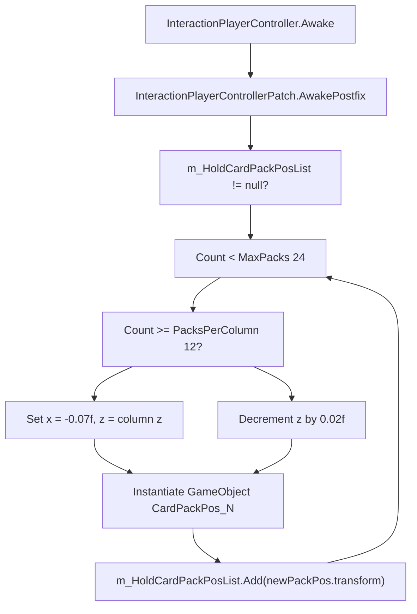
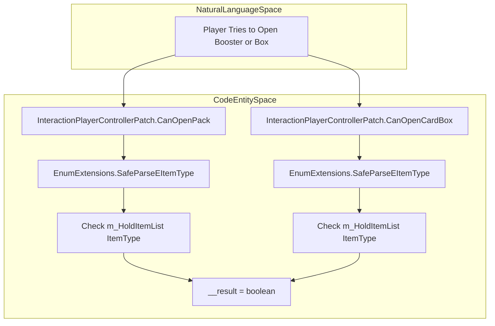

# Player Interaction and Card Boxes

> **Relevant source files**
> * [patch/EItemTypeExtension.cs](https://github.com/Drakilis-57/WankulCrazy/blob/57b1f5ed/patch/EItemTypeExtension.cs)
> * [patch/InteractionPlayerControllerPatch.cs](https://github.com/Drakilis-57/WankulCrazy/blob/57b1f5ed/patch/InteractionPlayerControllerPatch.cs)

## Purpose and Scope

This page details the implementation of `InteractionPlayerControllerPatch`, which modifies player interaction behaviors in `TCG Card Shop Simulator` to support custom Wankul Crazy items [patch/InteractionPlayerControllerPatch.cs L16-L17](https://github.com/Drakilis-57/WankulCrazy/blob/57b1f5ed/patch/InteractionPlayerControllerPatch.cs#L16-L17)

 The scope includes expanding holdable card pack slots, validating custom booster packs and card boxes, mapping card boxes to their corresponding pack types, and integrating with `EnumExtensions` for dynamic item type resolution [patch/InteractionPlayerControllerPatch.cs L18-L120](https://github.com/Drakilis-57/WankulCrazy/blob/57b1f5ed/patch/InteractionPlayerControllerPatch.cs#L18-L120)

 [patch/EItemTypeExtension.cs L12-L36](https://github.com/Drakilis-57/WankulCrazy/blob/57b1f5ed/patch/EItemTypeExtension.cs#L12-L36)

---

## Expanded Pack Slots and Initialization

The vanilla game limits the number of card packs a player can hold or manipulate simultaneously. `InteractionPlayerControllerPatch` hooks into the `Awake` method of `InteractionPlayerController` via a Harmony postfix patch to expand the internal `m_HoldCardPackPosList` collection [patch/InteractionPlayerControllerPatch.cs L23-L25](https://github.com/Drakilis-57/WankulCrazy/blob/57b1f5ed/patch/InteractionPlayerControllerPatch.cs#L23-L25)

When initialized, the patch checks if `m_HoldCardPackPosList` is populated [patch/InteractionPlayerControllerPatch.cs L28-L29](https://github.com/Drakilis-57/WankulCrazy/blob/57b1f5ed/patch/InteractionPlayerControllerPatch.cs#L28-L29)

 It then appends transform positions until the list reaches `MaxPacks` (set to `24`) [patch/InteractionPlayerControllerPatch.cs L31](https://github.com/Drakilis-57/WankulCrazy/blob/57b1f5ed/patch/InteractionPlayerControllerPatch.cs#L31-L31)

 Packs are distributed across two columns (`PacksPerColumn = 12`) by adjusting the local `x` and `z` coordinates relative to the preceding transform entry [patch/InteractionPlayerControllerPatch.cs L19-L54](https://github.com/Drakilis-57/WankulCrazy/blob/57b1f5ed/patch/InteractionPlayerControllerPatch.cs#L19-L54)

*Sources:* [patch/InteractionPlayerControllerPatch.cs L23-L61](https://github.com/Drakilis-57/WankulCrazy/blob/57b1f5ed/patch/InteractionPlayerControllerPatch.cs#L23-L61)

---

## Booster Pack and Card Box Validation

To allow custom Wankul boosters and display boxes to be opened by the player, the patch implements prefix-style replacement or evaluation logic for `CanOpenPack` and `CanOpenCardBox` [patch/InteractionPlayerControllerPatch.cs L63-L101](https://github.com/Drakilis-57/WankulCrazy/blob/57b1f5ed/patch/InteractionPlayerControllerPatch.cs#L63-L101)

These methods inspect the items currently held in `m_HoldItemList` via reflection [patch/InteractionPlayerControllerPatch.cs L75-L93](https://github.com/Drakilis-57/WankulCrazy/blob/57b1f5ed/patch/InteractionPlayerControllerPatch.cs#L75-L93)

 Using `EnumExtensions.SafeParseEItemType`, they evaluate whether the item type matches vanilla types or newly registered custom item types (e.g., `BoosterStellar`, `DisplayStellar`, `TestCardPack32`, etc.) [patch/InteractionPlayerControllerPatch.cs L66-L98](https://github.com/Drakilis-57/WankulCrazy/blob/57b1f5ed/patch/InteractionPlayerControllerPatch.cs#L66-L98)

*Sources:* [patch/InteractionPlayerControllerPatch.cs L63-L101](https://github.com/Drakilis-57/WankulCrazy/blob/57b1f5ed/patch/InteractionPlayerControllerPatch.cs#L63-L101)

, [patch/EItemTypeExtension.cs L128-L160](https://github.com/Drakilis-57/WankulCrazy/blob/57b1f5ed/patch/EItemTypeExtension.cs#L128-L160)

---

## Card Box to Card Pack Mapping

When converting or interacting with card boxes, the game requires a translation layer between the box item identifier and its unpackable card pack identifier. `CardBoxToCardPack` handles this mapping for custom boxes [patch/InteractionPlayerControllerPatch.cs L103-L120](https://github.com/Drakilis-57/WankulCrazy/blob/57b1f5ed/patch/InteractionPlayerControllerPatch.cs#L103-L120)

It evaluates the input `cardBoxItemType` against both vanilla types and custom extensions parsed through `EnumExtensions.SafeParseEItemType` (such as `DisplayStellar`, `DisplayLegacy`, and `AscensionCardBox`), assigning the corresponding `__result` pack type [patch/InteractionPlayerControllerPatch.cs L103-L120](https://github.com/Drakilis-57/WankulCrazy/blob/57b1f5ed/patch/InteractionPlayerControllerPatch.cs#L103-L120)

 [patch/EItemTypeExtension.cs L128-L160](https://github.com/Drakilis-57/WankulCrazy/blob/57b1f5ed/patch/EItemTypeExtension.cs#L128-L160)

*Sources:* [patch/InteractionPlayerControllerPatch.cs L103-L120](https://github.com/Drakilis-57/WankulCrazy/blob/57b1f5ed/patch/InteractionPlayerControllerPatch.cs#L103-L120)

, [patch/EItemTypeExtension.cs L128-L160](https://github.com/Drakilis-57/WankulCrazy/blob/57b1f5ed/patch/EItemTypeExtension.cs#L128-L160)

---

## Custom Enum Infrastructure

Item type extensions provide the underlying definitions required by `InteractionPlayerControllerPatch`. The `EnumExtensions` class maintains a dictionary of custom enum integer mappings for `EItemType`, `ECollectionPackType`, and `EMonsterType`, ensuring safe deserialization and identification [patch/EItemTypeExtension.cs L12-L55](https://github.com/Drakilis-57/WankulCrazy/blob/57b1f5ed/patch/EItemTypeExtension.cs#L12-L55)

It also normalizes string inputs and handles whitespace, casing, and string aliases (e.g., mapping `"Booster Stellar"` to `"BoosterStellar"`) before attempting standard parsing [patch/EItemTypeExtension.cs L110-L160](https://github.com/Drakilis-57/WankulCrazy/blob/57b1f5ed/patch/EItemTypeExtension.cs#L110-L160)

*Sources:* [patch/EItemTypeExtension.cs L12-L160](https://github.com/Drakilis-57/WankulCrazy/blob/57b1f5ed/patch/EItemTypeExtension.cs#L12-L160)