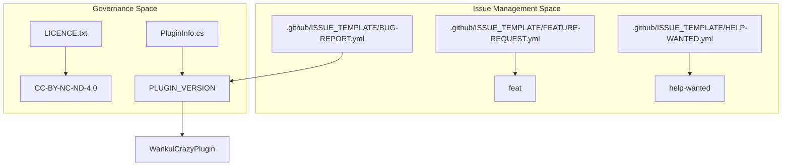
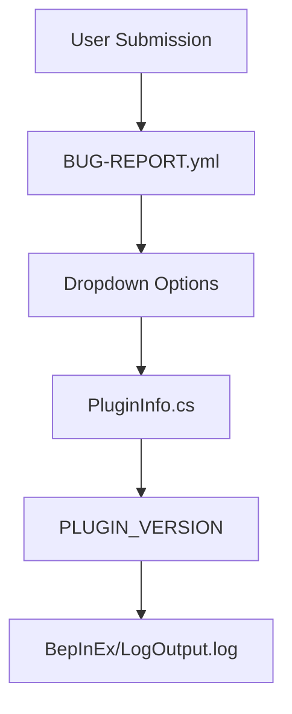

# Project Governance and Issue Templates

> **Relevant source files**
> * [.github/ISSUE_TEMPLATE/BUG-REPORT.yml](https://github.com/Drakilis-57/WankulCrazy/blob/57b1f5ed/.github/ISSUE_TEMPLATE/BUG-REPORT.yml)
> * [.github/ISSUE_TEMPLATE/FEATURE-REQUEST.yml](https://github.com/Drakilis-57/WankulCrazy/blob/57b1f5ed/.github/ISSUE_TEMPLATE/FEATURE-REQUEST.yml)
> * [.github/ISSUE_TEMPLATE/HELP-WANTED.yml](https://github.com/Drakilis-57/WankulCrazy/blob/57b1f5ed/.github/ISSUE_TEMPLATE/HELP-WANTED.yml)
> * [LICENCE.txt](https://github.com/Drakilis-57/WankulCrazy/blob/57b1f5ed/LICENCE.txt)
> * [PluginInfo.cs](https://github.com/Drakilis-57/WankulCrazy/blob/57b1f5ed/PluginInfo.cs)
> * [libs/Assembly-CSharp.dll](https://github.com/Drakilis-57/WankulCrazy/blob/57b1f5ed/libs/Assembly-CSharp.dll)

## Purpose and Scope

This section details the project governance, versioning schema, licensing constraints, contribution workflows, and issue tracking configurations for the `WankulCrazy` codebase. It establishes how metadata is centralized via `PluginInfo.cs`, how IP and third-party assets are managed under `LICENCE.txt`, and how standardized GitHub issue templates (`.github/ISSUE_TEMPLATE/`) structure user feedback, feature requests, and bug reports.

---

## 1. Versioning and Assembly Metadata

The mod relies on a centralized metadata container defined in `PluginInfo.cs` to expose its BepInEx plugin identification parameters. This structure ensures consistency across the compiled assembly, dependency injection, and debugging outputs.

* `PLUGIN_GUID`: Identifies the plugin namespace globally within the BepInEx runtime loader (`WankulCrazyPlugin`).
* `PLUGIN_NAME`: Human-readable identifier used in logs and user interfaces (`WankulCrazy`).
* `PLUGIN_VERSION`: Semantic version string reflecting the current build target (`1.4.1`).

```javascript
namespace WankulCrazyPlugin{    public static class PluginInfo    {        public const string PLUGIN_GUID = "WankulCrazyPlugin";        public const string PLUGIN_NAME = "WankulCrazy";        public const string PLUGIN_VERSION = "1.4.1";    }}
```

Sources: [PluginInfo.cs L1-L9](https://github.com/Drakilis-57/WankulCrazy/blob/57b1f5ed/PluginInfo.cs#L1-L9)

---

## 2. Licensing and Intellectual Property

`WankulCrazy` is governed by the **Creative Commons Attribution-NonCommercial-NoDerivatives 4.0 International** (CC BY-NC-ND 4.0) license.

Key governance points outlined in the project license include:

* **Asset Ownership**: All card textures and artistic assets remain the property of `wankul.fr` and `Wankil © 2024`. The mod implementation does not claim ownership of these textures but utilizes them under explicit permission scopes.
* **Contributor Acknowledgments**: Special credits are formally attributed within the documentation for code contributions and asset retexturing: * `Karilla`: Code contributions and implementation logic. * `Hurtem`: Asset retexturing and graphical pipelines.

Sources: [LICENCE.txt L1-L8](https://github.com/Drakilis-57/WankulCrazy/blob/57b1f5ed/LICENCE.txt#L1-L8)

---

## 3. GitHub Issue Templates and Contribution Workflows

The repository implements structured YAML-based issue templates under `.github/ISSUE_TEMPLATE/` to streamline bug triage, feature proposals, and community support.

### Bug Report Schema (BUG-REPORT.yml)

The bug report template enforces structured telemetry collection from users experiencing runtime anomalies:

* **Description Fields**: Collects user observations regarding expected vs. actual behavior.
* **Version Dropdown**: Restricts version selection to valid historical and current releases ranging from `1.0.0` up to `1.4.2 (Latest)`, cross-referencing against `PluginInfo. PLUGIN_VERSION`.
* **Log Extraction**: Mandates pasting BepInEx shell output from `BepInEx/LogOutput.log` to assist in stack trace analysis.

```yaml
name: Bug Reportdescription: Informez nous d'un bug.title: "[Bug]: "labels: ["bug"]projects: ["WankulCrazy"]body:  - type: dropdown    id: version    attributes:      label: Version      description: Quel version du mod était utilisée ?      options:        - 1.4.2 (Latest)        - 1.4.1         - 1.4.0        ...
```

Sources: [.github/ISSUE_TEMPLATE/BUG-REPORT.yml L1-L49](https://github.com/Drakilis-57/WankulCrazy/blob/57b1f5ed/.github/ISSUE_TEMPLATE/BUG-REPORT.yml#L1-L49)

### Feature Requests and Help Wanted Templates

* **Feature Request (`FEATURE-REQUEST.yml`)**: Captures proposed modifications or additions to the mod, tagged automatically with the `feat` label.
* **Help Wanted (`HELP-WANTED.yml`)**: Provides a direct communication channel for integration issues or user support, tagged with the `help wanted` label.

Sources: [.github/ISSUE_TEMPLATE/FEATURE-REQUEST.yml L1-L18](https://github.com/Drakilis-57/WankulCrazy/blob/57b1f5ed/.github/ISSUE_TEMPLATE/FEATURE-REQUEST.yml#L1-L18)

 [.github/ISSUE_TEMPLATE/HELP-WANTED.yml L1-L18](https://github.com/Drakilis-57/WankulCrazy/blob/57b1f5ed/.github/ISSUE_TEMPLATE/HELP-WANTED.yml#L1-L18)

---

## 4. Governance and Issue Architecture Diagrams

### Diagram: Repository Governance and Metadata Flow

This diagram illustrates how repository files govern release tagging, metadata distribution, and issue management.



Sources: [PluginInfo.cs L1-L9](https://github.com/Drakilis-57/WankulCrazy/blob/57b1f5ed/PluginInfo.cs#L1-L9)

 [LICENCE.txt L1-L8](https://github.com/Drakilis-57/WankulCrazy/blob/57b1f5ed/LICENCE.txt#L1-L8)

 [.github/ISSUE_TEMPLATE/BUG-REPORT.yml L1-L49](https://github.com/Drakilis-57/WankulCrazy/blob/57b1f5ed/.github/ISSUE_TEMPLATE/BUG-REPORT.yml#L1-L49)

 [.github/ISSUE_TEMPLATE/FEATURE-REQUEST.yml L1-L18](https://github.com/Drakilis-57/WankulCrazy/blob/57b1f5ed/.github/ISSUE_TEMPLATE/FEATURE-REQUEST.yml#L1-L18)

 [.github/ISSUE_TEMPLATE/HELP-WANTED.yml L1-L18](https://github.com/Drakilis-57/WankulCrazy/blob/57b1f5ed/.github/ISSUE_TEMPLATE/HELP-WANTED.yml#L1-L18)

### Diagram: Bug Report to Code Version Mapping Flow

This diagram details the data flow when a user submits a bug report mapping to code definitions.



Sources: [PluginInfo.cs L1-L9](https://github.com/Drakilis-57/WankulCrazy/blob/57b1f5ed/PluginInfo.cs#L1-L9)

 [.github/ISSUE_TEMPLATE/BUG-REPORT.yml L1-L49](https://github.com/Drakilis-57/WankulCrazy/blob/57b1f5ed/.github/ISSUE_TEMPLATE/BUG-REPORT.yml#L1-L49)