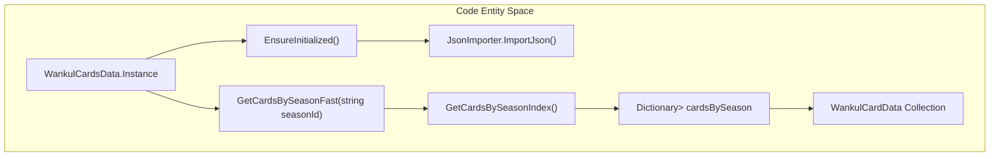
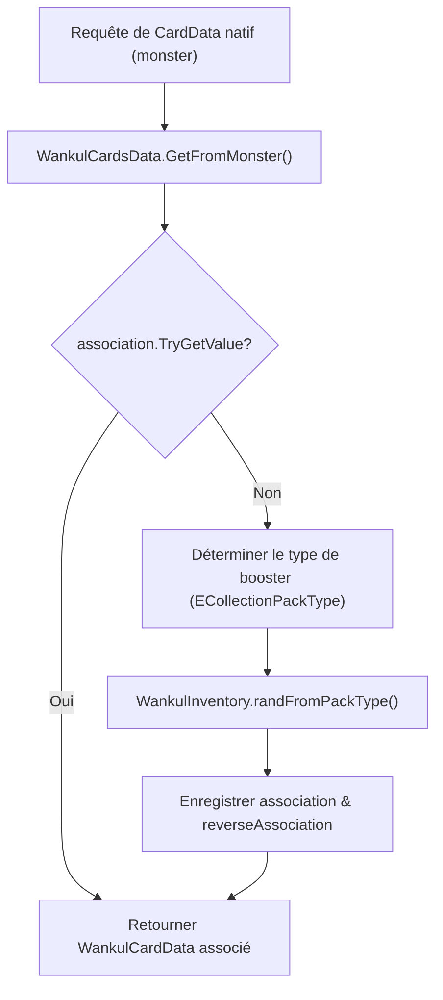

# Registre WankulCardsData et types de cartes

> **Fichiers sources pertinents**
> * [cards/CardType.cs](https://github.com/Drakilis-57/WankulCrazy/blob/57b1f5ed/cards/CardType.cs)
> * [cards/SpecialCardData.cs](https://github.com/Drakilis-57/WankulCrazy/blob/57b1f5ed/cards/SpecialCardData.cs)
> * [cards/Specials.cs](https://github.com/Drakilis-57/WankulCrazy/blob/57b1f5ed/cards/Specials.cs)
> * [cards/TerrainCardData.cs](https://github.com/Drakilis-57/WankulCrazy/blob/57b1f5ed/cards/TerrainCardData.cs)
> * [cards/WankulCardData.cs](https://github.com/Drakilis-57/WankulCrazy/blob/57b1f5ed/cards/WankulCardData.cs)
> * [cards/WankulCardsData.cs](https://github.com/Drakilis-57/WankulCrazy/blob/57b1f5ed/cards/WankulCardsData.cs)
> * [patch/CheckPriceUI.cs](https://github.com/Drakilis-57/WankulCrazy/blob/57b1f5ed/patch/CheckPriceUI.cs)

## Objectif et portée

Cette page documente le modèle de domaine de la carte principale et le système de registre dans `WankulCrazy`.Il couvre le singleton `WankulCardsData`, le mappage d'association entre les structures de jeu natives (`CardData`/`MonsterData`) et les enregistrements Wankul personnalisés, la hiérarchie des types de cartes polymorphes (`EffigyCardData`, `TerrainCardData`, `SpecialCardData`) et la gestion de secours, y compris les éléments spéciaux comme `AJETER`.

Sources : [cards/WankulCardsData.cs L1-L12](https://github.com/Drakilis-57/WankulCrazy/blob/57b1f5ed/cards/WankulCardsData.cs#L1-L12)

 [cards/WankulCardData.cs L1-L10](https://github.com/Drakilis-57/WankulCrazy/blob/57b1f5ed/cards/WankulCardData.cs#L1-L10)

---

## 1. WankulCardsData Singleton et architecture de base

`WankulCardsData` hérite de `Singleton<WankulCardsData>` [cards/WankulCardsData.cs L12-L13](https://github.com/Drakilis-57/WankulCrazy/blob/57b1f5ed/cards/WankulCardsData.cs#L12-L13)

et sert de référentiel d'exécution central pour toutes les cartes Wankul chargées.

### Initialisation et stockage

Le registre contient une liste principale de cartes (`cards`) et un cache de recherche organisé par saison (`cardsBySeason`) [cards/WankulCardsData.cs L14-L36](https://github.com/Drakilis-57/WankulCrazy/blob/57b1f5ed/cards/WankulCardsData.cs#L14-L36)

Si la collection n'est pas initialisée lors de l'accès, `EnsureInitialized()` appelle `JsonImporter.ImportJson()` [cards/WankulCardsData.cs L18-L25](https://github.com/Drakilis-57/WankulCrazy/blob/57b1f5ed/cards/WankulCardsData.cs#L18-L25)

```csharp
public void EnsureInitialized()
{
    if (cards == null || cards.Count == 0)
    {
        Plugin.LogInfo("[WankulCardsData] Initialisation des cartes déclenchée par EnsureInitialized.");
        JsonImporter.ImportJson();
    }
}
```
[cards/WankulCardsData.cs L18-L25](https://github.com/Drakilis-57/WankulCrazy/blob/57b1f5ed/cards/WankulCardsData.cs#L18-L25)

### Indexation des saisons

Pour éviter les scans $O(N)$ lors du rendu de l'interface utilisateur ou du filtrage des saisons, `GetCardsBySeasonIndex()` construit un dictionnaire paresseux mappant les chaînes de saison ou les valeurs d'énumération à des sous-listes de `WankulCardData` [cards/WankulCardsData.cs L38-L60](https://github.com/Drakilis-57/WankulCrazy/blob/57b1f5ed/cards/WankulCardsData.cs#L38-L60). Les assistants statiques `GetCardsBySeasonFast(string seasonId)` et `GetCardsBySeasonFast(Season season)` fournissent un accès direct [cards/WankulCardsData.cs L62-L76](https://github.com/Drakilis-57/WankulCrazy/blob/57b1f5ed/cards/WankulCardsData.cs#L62-L76).



*Figure 1 : Cycle de vie de WankulCardsData et cartographie des index saisonniers.*

Sources : [cards/WankulCardsData.cs L12-L77](https://github.com/Drakilis-57/WankulCrazy/blob/57b1f5ed/cards/WankulCardsData.cs#L12-L77)

---

## 2. Cartographie des associations et recherches inversées

Le moteur de jeu nécessite des instances natives `CardData` pour afficher, tarifer et échanger des cartes.Étant donné que les cartes personnalisées remplacent les cartes natives, `WankulCardsData` maintient des structures de mappage bidirectionnel entre les références de jeu natives et les objets `WankulCardData` personnalisés.

### Dictionnaires d'associations

* `association` : mappe les clés de chaîne composites (`{monsterType}_{borderType}_{expansionType}`) à `WankulCardData` [cards/WankulCardsData.cs L16-L84](https://github.com/Drakilis-57/WankulCrazy/blob/57b1f5ed/cards/WankulCardsData.cs#L16-L84)
* `reverseAssociation` : mappe `WankulCardData.Index` aux objets natifs `CardData`, optimisant les requêtes inverses de $O(N)$ à $O(1)$ [cards/WankulCardsData.csL28-L156](https://github.com/Drakilis-57/WankulCrazy/blob/57b1f5ed/cards/WankulCardsData.cs#L28-L156)

### Logique GetFromMonster

Lorsque le jeu demande un mappage de carte pour un `CardData` natif donné (appelé `monster`), `GetFromMonster` vérifie d'abord les associations existantes [cards/WankulCardsData.csL79-L92](https://github.com/Drakilis-57/WankulCrazy/blob/57b1f5ed/cards/WankulCardsData.cs#L79-L92)

S'il est manquant et autorisé, il évalue la rareté et le type d'expansion pour déterminer le `ECollectionPackType` approprié, tire une carte aléatoire via `WankulInventory.randFromPackType()` et enregistre les liens aller et retour [cards/WankulCardsData.csL107-L146](https://github.com/Drakilis-57/WankulCrazy/blob/57b1f5ed/cards/WankulCardsData.cs#L107-L146)



*Figure 2 : Workflow de résolution d'association pour les cartes natives.*

Sources : [cards/WankulCardsData.cs L16-L165](https://github.com/Drakilis-57/WankulCrazy/blob/57b1f5ed/cards/WankulCardsData.cs#L16-L165)

---

## 3. Hiérarchie et sous-types des données de carte

`WankulCardData` sert de schéma de base pour toutes les définitions de cartes, classées par l'énumération `CardType` (`Terrain`, `Effigy`, `Special`) [cards/WankulCardData.csL8-L18](https://github.com/Drakilis-57/WankulCrazy/blob/57b1f5ed/cards/WankulCardData.cs#L8-L18)

 [cards/CardType.cs L3-L8](https://github.com/Drakilis-57/WankulCrazy/blob/57b1f5ed/cards/CardType.cs#L3-L8)

|Champ de base/Propriété |Tapez |Descriptif |
|--- |--- |--- |
|`Index` |`int` |Index d'identification unique de la carte.|
|`Number` |`string` |Numéro de catalogue de la carte (analysé via `NumberInt`) [cards/WankulCardData.cs L12-L83](https://github.com/Drakilis-57/WankulCrazy/blob/57b1f5ed/cards/WankulCardData.cs#L12-L83) |
|`Title` |`string` |Afficher le titre de la carte [cards/WankulCardData.cs L14](https://github.com/Drakilis-57/WankulCrazy/blob/57b1f5ed/cards/WankulCardData.cs#L14-L14) |
|`Artist` |`string` |Nom du créateur de l'œuvre [cards/WankulCardData.cs L16](https://github.com/Drakilis-57/WankulCrazy/blob/57b1f5ed/cards/WankulCardData.cs#L16-L16) |
|`CardType` |`CardType` |Énumération de catégorisation (`Terrain`, `Effigy`, `Special`) [cards/WankulCardData.cs L18](https://github.com/Drakilis-57/WankulCrazy/blob/57b1f5ed/cards/WankulCardData.cs#L18-L18) |
|`Season` / `SeasonId` |`Season` / `string` |Cartographie de la saison d'expansion avec enregistrement automatique `SeasonsManager` [cards/WankulCardData.cs L20-L40](https://github.com/Drakilis-57/WankulCrazy/blob/57b1f5ed/cards/WankulCardData.cs#L20-L40) |
|`TexturePath` |`string` |Chemin du fichier pour le chargement de la texture de la carte [cards/WankulCardData.cs L42](https://github.com/Drakilis-57/WankulCrazy/blob/57b1f5ed/cards/WankulCardData.cs#L42-L42) |
|`MarketPrice` |`float` |Évaluation boursière calculée intégrant des multiplicateurs dynamiques [cards/WankulCardData.cs L92-L114](https://github.com/Drakilis-57/WankulCrazy/blob/57b1f5ed/cards/WankulCardData.cs#L92-L114) |

### Sous-types de cartes spécialisées

* **TerrainCardData** : hérite de `WankulCardData` et introduit les propriétés des effets de jeu [cards/TerrainCardData.cs L3-L11](https://github.com/Drakilis-57/WankulCrazy/blob/57b1f5ed/cards/TerrainCardData.cs#L3-L11) : * `WinningEffect`[cards/TerrainCardData.cs L6](https://github.com/Drakilis-57/WankulCrazy/blob/57b1f5ed/cards/TerrainCardData.cs#L6-L6) * `LosingEffect` [cards/TerrainCardData.csL8](https://github.com/Drakilis-57/WankulCrazy/blob/57b1f5ed/cards/TerrainCardData.cs#L8-L8) * `SpecialEffect` [cards/TerrainCardData.csL10](https://github.com/Drakilis-57/WankulCrazy/blob/57b1f5ed/cards/TerrainCardData.cs#L10-L10)
* **SpecialCardData** : hérite de `WankulCardData` et définit les comportements de carte non standard via l'énumération `Specials` (`AJETER`, `TOR`) [cards/SpecialCardData.csL3-L7](https://github.com/Drakilis-57/WankulCrazy/blob/57b1f5ed/cards/SpecialCardData.cs#L3-L7) [cards/Specials.csL3-L7](https://github.com/Drakilis-57/WankulCrazy/blob/57b1f5ed/cards/Specials.cs#L3-L7)

Sources : [cards/WankulCardData.cs L8-L115](https://github.com/Drakilis-57/WankulCrazy/blob/57b1f5ed/cards/WankulCardData.cs#L8-L115)

 [cards/CardType.cs L1-L9](https://github.com/Drakilis-57/WankulCrazy/blob/57b1f5ed/cards/CardType.cs#L1-L9)

 [cards/SpecialCardData.cs L1-L8](https://github.com/Drakilis-57/WankulCrazy/blob/57b1f5ed/cards/SpecialCardData.cs#L1-L8)

 [cards/Specials.cs L1-L8](https://github.com/Drakilis-57/WankulCrazy/blob/57b1f5ed/cards/Specials.cs#L1-L8)

 [cards/TerrainCardData.cs L1-L12](https://github.com/Drakilis-57/WankulCrazy/blob/57b1f5ed/cards/TerrainCardData.cs#L1-L12)

---

## 4. Prix du marché, saisons et repli d'AJETER

### Calcul du prix du marché

La propriété `MarketPrice` évalue paresseusement [cards/WankulCardData.cs L92-L114](https://github.com/Drakilis-57/WankulCrazy/blob/57b1f5ed/cards/WankulCardData.cs#L92-L114)

Si `generatedMarketPrice` n'est pas attribué, il appelle `CardPrice.generateMarketPrice(this)`, en mettant le résultat à l'échelle en fonction du facteur de baisse/fluctuation `Percentage` actuel de la carte [cards/WankulCardData.csL97-L109](https://github.com/Drakilis-57/WankulCrazy/blob/57b1f5ed/cards/WankulCardData.cs#L97-L109)

### Inscription à la saison

Le paramètre `SeasonId` vérifie la validité, enregistre la saison de manière dynamique via `SeasonsManager.RegisterSeason()` et tente une analyse sécurisée dans l'énumération `Season` [cards/WankulCardData.csL25-L40](https://github.com/Drakilis-57/WankulCrazy/blob/57b1f5ed/cards/WankulCardData.cs#L25-L40)

### Cartes non associées et solution de secours AJETER

Lors du rendu des prix de contrôle ou des inventaires pour lesquels une carte n'a pas d'association native directe, les correctifs d'interface utilisateur reviennent à une recherche de carte non associée [patch/CheckPriceUI.cs L107-L118](https://github.com/Drakilis-57/WankulCrazy/blob/57b1f5ed/patch/CheckPriceUI.cs#L107-L118)

Les types de cartes spéciales tels que `AJETER` (A jeter / jetable) gèrent les états inutiles ou de repli dans les pipelines de rappel et d'économie.

Sources : [cards/WankulCardData.cs L25-L114](https://github.com/Drakilis-57/WankulCrazy/blob/57b1f5ed/cards/WankulCardData.cs#L25-L114)

 [cards/Specials.cs L3-L7](https://github.com/Drakilis-57/WankulCrazy/blob/57b1f5ed/cards/Specials.cs#L3-L7)

 [patch/CheckPriceUI.cs L107-L118](https://github.com/Drakilis-57/WankulCrazy/blob/57b1f5ed/patch/CheckPriceUI.cs#L107-L118)