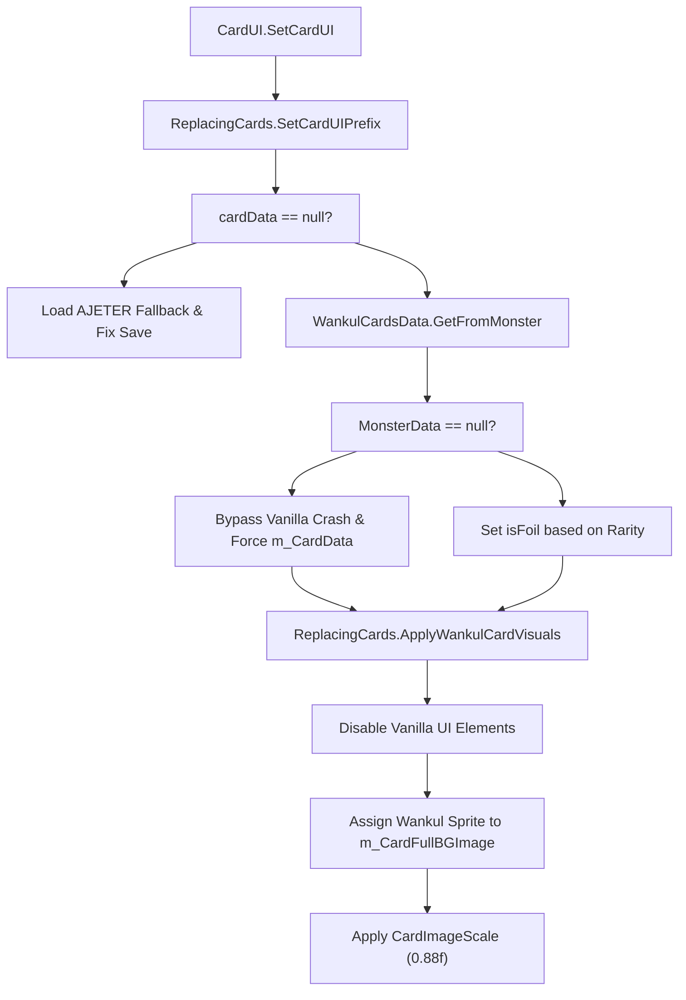
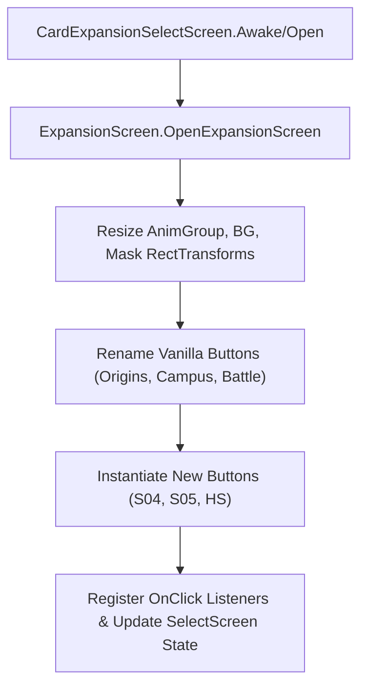
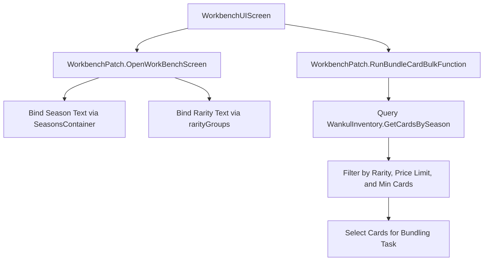
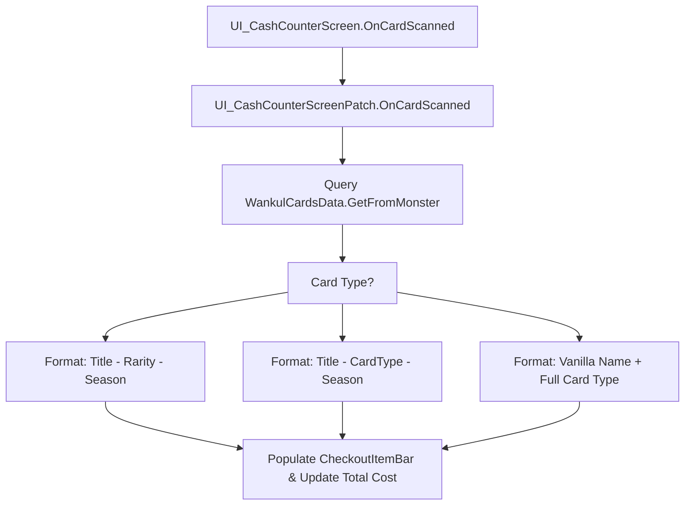
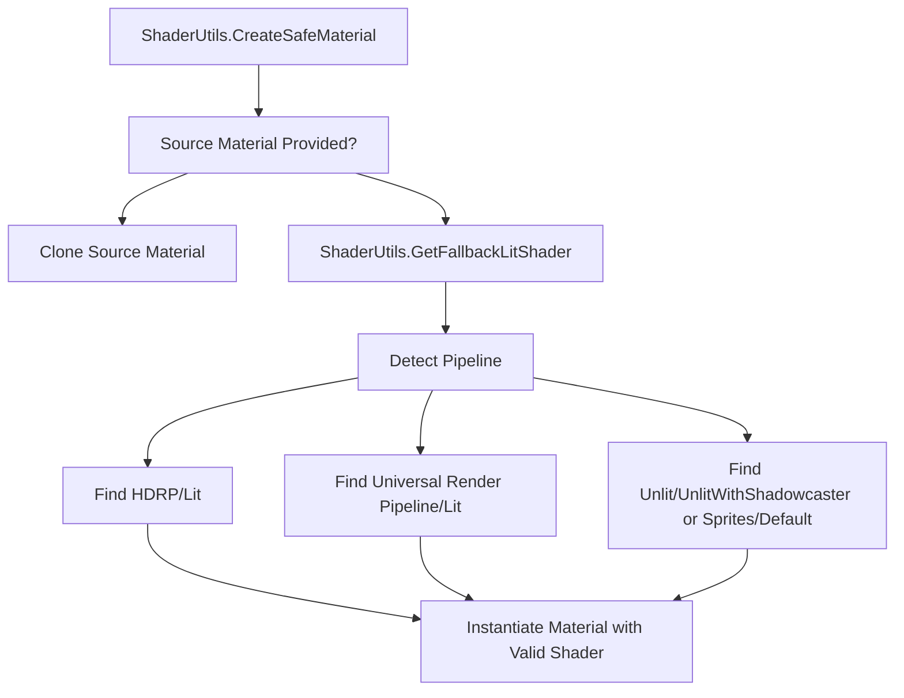

# Card Rendering and UI Replacement

> **Relevant source files**
> * [cards/SortSeasonType.cs](https://github.com/Drakilis-57/WankulCrazy/blob/57b1f5ed/cards/SortSeasonType.cs)
> * [patch/ExpansionScreen.cs](https://github.com/Drakilis-57/WankulCrazy/blob/57b1f5ed/patch/ExpansionScreen.cs)
> * [patch/ReplacingCards.cs](https://github.com/Drakilis-57/WankulCrazy/blob/57b1f5ed/patch/ReplacingCards.cs)
> * [patch/SortUI.cs](https://github.com/Drakilis-57/WankulCrazy/blob/57b1f5ed/patch/SortUI.cs)
> * [patch/UI_CashCounterScreenPatch.cs](https://github.com/Drakilis-57/WankulCrazy/blob/57b1f5ed/patch/UI_CashCounterScreenPatch.cs)
> * [patch/WindowsPosters.cs](https://github.com/Drakilis-57/WankulCrazy/blob/57b1f5ed/patch/WindowsPosters.cs)
> * [patch/workbench/WorkbenchPatch.cs](https://github.com/Drakilis-57/WankulCrazy/blob/57b1f5ed/patch/workbench/WorkbenchPatch.cs)
> * [utils/ShaderUtils.cs](https://github.com/Drakilis-57/WankulCrazy/blob/57b1f5ed/utils/ShaderUtils.cs)
> * [utils/TextureUtils.cs](https://github.com/Drakilis-57/WankulCrazy/blob/57b1f5ed/utils/TextureUtils.cs)
> * [utils/obj/OBJLoaderHelper.cs](https://github.com/Drakilis-57/WankulCrazy/blob/57b1f5ed/utils/obj/OBJLoaderHelper.cs)

## Objectif et portée

Cette page détaille la mise en œuvre technique des remplacements de rendu de carte, des modifications de la disposition de l'interface utilisateur, de la personnalisation de l'environnement du magasin et des utilitaires de shader/texture dans `WankulCrazy`.Il explique comment les composants de l'interface utilisateur Vanilla et les écrans de jeu sont interceptés via les correctifs Harmony pour afficher les ressources spécifiques à Wankul, gérer les packs d'extension personnalisés, faire fonctionner l'atelier, restituer les affiches de magasin personnalisées et empêcher les échecs de rendu (tels que les shaders magenta dans les pipelines de rendu personnalisés).

---

## 1. Remplacement visuel de CardUI (ReplaceingCards)

Le cœur de la substitution visuelle des cartes est géré par `ReplacingCards`, qui intercepte l'exécution de `CardUI.SetCardUI` via un correctif de préfixe (`SetCardUIPrefix`) [patch/ReplacingCards.cs L16-L78](https://github.com/Drakilis-57/WankulCrazy/blob/57b1f5ed/patch/ReplacingCards.cs#L16-L78)

Lorsqu'une carte est rendue dans l'interface utilisateur, le correctif effectue les étapes suivantes :

1. **Validation de Sauvegarde & Récupération** : Si `cardData` est null (indiquant un emplacement de sauvegarde cassé ou corrompu), il utilise par défaut une carte non associée de secours en utilisant `WankulCardsData.GetAJETER()` et l'injecte dans les données du joueur [patch/ReplacingCards.cs L22-L35](https://github.com/Drakilis-57/WankulCrazy/blob/57b1f5ed/patch/ReplacingCards.cs#L22-L35)
2. **Monster Data Mapping** : il récupère le `WankulCardData` correspondant via `WankulCardsData.Instance.GetFromMonster(gameCardData, true)` [patch/ReplacingCards.cs L39](https://github.com/Drakilis-57/WankulCrazy/blob/57b1f5ed/patch/ReplacingCards.cs#L39-L39) Si des données de monstre Vanilla sont manquantes (par exemple, des identifiants personnalisés$\ge 122$), il intercepte l'appel pour empêcher un `NullReferenceException`, attribue `m_CardData` manuellement, exécute les visuels Wankul et abandonne l'exécution de la méthode vanilla d'origine en renvoyant `false` [patch/ReplacingCards.csL40-L75](https://github.com/Drakilis-57/WankulCrazy/blob/57b1f5ed/patch/ReplacingCards.cs#L40-L75)
3. **Foil and Champion Overrides**: Forces `isFoil` and `isChampionCard` flags based on rarity thresholds (e.g., `EffigyCardData` with `Rarity >= Rarity.UR1` automatically becomes foil) [patch/ReplacingCards.cs L53-L64](https://github.com/Drakilis-57/WankulCrazy/blob/57b1f5ed/patch/ReplacingCards.cs#L53-L64)
4. **Remplacement visuel (`ApplyWankulCardVisuals`)** : désactive les GameObjects standard d'arrière-plan, de bordure et de couche avant (`__instance.m_CardBGImage`, `__instance.m_CardBorderImage`, `__instance.m_CardFrontImage`, etc.).Il active `m_CardFullBGImage`, attribue le sprite Wankul personnalisé (ou revient à AJETER), définit la préservation des proportions et applique un facteur de mise à l'échelle (`CardImageScale = 0.88f`) [patch/ReplacingCards.csL82-L165](https://github.com/Drakilis-57/WankulCrazy/blob/57b1f5ed/patch/ReplacingCards.cs#L82-L165)

*Sources : [patch/ReplacingCards.cs L16-L165](https://github.com/Drakilis-57/WankulCrazy/blob/57b1f5ed/patch/ReplacingCards.cs#L16-L165)*

---

## 2. Tri des albums, écrans d'extension et filtrage

WankulCrazy remplace les écrans d'expansion et de tri Vanilla pour prendre en charge les saisons Wankul (SNIPPET 0, SNIPPET _1, SNIPPET _2, `S04`, `S05`, `HS`) au lieu des identifiants Vanilla.

### Tri des albums (SortUI)

`SortUI` intercepte les opérations `CollectionBinderUI` pour injecter des boutons de filtrage de saison personnalisés.Il remplace le `m_ExpansionBtnList` par des boutons de saison Wankul générés dynamiquement (`ALL_Button`, `S01_Button`, etc.), masque les textes/arrière-plans des titres Vanilla et désactive les groupes de mise en page qui entrent en conflit avec le positionnement personnalisé [patch/SortUI.csL35-L130](https://github.com/Drakilis-57/WankulCrazy/blob/57b1f5ed/patch/SortUI.cs#L35-L130)

### Expansion Selection (ExpansionScreen)

`ExpansionScreen` corrige `CardExpansionSelectScreen` [patch/ExpansionScreen.cs L11-L122](https://github.com/Drakilis-57/WankulCrazy/blob/57b1f5ed/patch/ExpansionScreen.cs#L11-L122)

 It resizes container rects (`AnimGroup`, `BG`, `Mask`) and re-maps vanilla expansion button labels to Wankul equivalents:

* `Tetramon_Button` $\rightarrow$ "Origines" [patch/ExpansionScreen.cs L42-L43](https://github.com/Drakilis-57/WankulCrazy/blob/57b1f5ed/patch/ExpansionScreen.cs#L42-L43)
* `Destiny_Button` $\rightarrow$ "Campus" [patch/ExpansionScreen.cs L49-L50](https://github.com/Drakilis-57/WankulCrazy/blob/57b1f5ed/patch/ExpansionScreen.cs#L49-L50)
* `Ghost_Button` $\rightarrow$ "Battle" [patch/ExpansionScreen.cs L52-L53](https://github.com/Drakilis-57/WankulCrazy/blob/57b1f5ed/patch/ExpansionScreen.cs#L52-L53)

De plus, il instancie de manière programmatique de nouveaux GameObjects d'interface utilisateur pour les saisons `S04`, `S05`, et `HS`, en attachant des écouteurs d'événements qui mettent à jour dynamiquement les indices de `CardExpansionSelectScreen` [patch/ExpansionScreen.cs L69-L122](https://github.com/Drakilis-57/WankulCrazy/blob/57b1f5ed/patch/ExpansionScreen.cs#L69-L122)

*Sources : [patch/ExpansionScreen.cs L11-L122](https://github.com/Drakilis-57/WankulCrazy/blob/57b1f5ed/patch/ExpansionScreen.cs#L11-L122)

[patch/SortUI.cs L35-L130](https://github.com/Drakilis-57/WankulCrazy/blob/57b1f5ed/patch/SortUI.cs#L35-L130)*

---

## 3. Interface utilisateur de Workbench et opérations groupées (WorkbenchPatch)

L'interface utilisateur de Workbench est adaptée pour filtrer et regrouper les cartes Wankul en fonction de groupes de saison et de rareté personnalisés [patch/workbench/WorkbenchPatch.cs L15-L128](https://github.com/Drakilis-57/WankulCrazy/blob/57b1f5ed/patch/workbench/WorkbenchPatch.cs#L15-L128)

* **Groupes de rareté (`rarityGroups`)** : mappe les indices entiers vers des étiquettes personnalisées et des ensembles de rareté (par exemple, `0` : "Toute Rareté", `1` : "Commune", `2` : "Peu Commune", `3` : "Rare", `4` : "Terrains") [patch/workbench/WorkbenchPatch.csL22-L29](https://github.com/Drakilis-57/WankulCrazy/blob/57b1f5ed/patch/workbench/WorkbenchPatch.cs#L22-L29)
* **Initialisation de l'écran (`OpenWorkBenchScreen`)** : met à jour les champs `WorkbenchUIScreen`, définissant les noms d'extension à partir de `SeasonsContainer.Seasons` et les limites de prix limites [patch/workbench/WorkbenchPatch.csL80-L86](https://github.com/Drakilis-57/WankulCrazy/blob/57b1f5ed/patch/workbench/WorkbenchPatch.cs#L80-L86)
* **Traitement en masse (`RunBundleCardBulkFunction`)** : interroge l'inventaire via `WankulInventory.GetCardsBySeason()`, filtrant `EffigyCardData` et `TerrainCardData` en fonction des curseurs actifs (limite de prix, quantité minimale de cartes, limites de rareté) pour regrouper automatiquement les cartes [patch/workbench/WorkbenchPatch.csL88-L128](https://github.com/Drakilis-57/WankulCrazy/blob/57b1f5ed/patch/workbench/WorkbenchPatch.cs#L88-L128)

*Sources: [patch/workbench/WorkbenchPatch.cs L15-L128](https://github.com/Drakilis-57/WankulCrazy/blob/57b1f5ed/patch/workbench/WorkbenchPatch.cs#L15-L128)*

---

## 4. Environnement du magasin et intégration de la caisse

### Affiches Windows (WindowsPosters)

`WindowsPosters` initialise les affiches personnalisées sur les vitrines des magasins (`StoreModel_Group/Windows door`) [patch/WindowsPosters.cs L13-L15](https://github.com/Drakilis-57/WankulCrazy/blob/57b1f5ed/patch/WindowsPosters.cs#L13-L15)

Il crée des GameObjects `Quad` primitifs à des positions locales prédéfinies, charge les ressources PNG à partir du répertoire mod, configure les matériaux en toute sécurité à l'aide de `ShaderUtils.CreateSafeMaterial()` et ajuste les proportions en fonction des dimensions de la texture [patch/WindowsPosters.csL17-L68](https://github.com/Drakilis-57/WankulCrazy/blob/57b1f5ed/patch/WindowsPosters.cs#L17-L68)

### Écran du comptoir de caisse (UI_CashCounterScreenPatch)

`UI_CashCounterScreenPatch` remplace `OnCardScanned` pour inspecter les cartes numérisées et afficher les métadonnées détaillées du Wankul (titre, rareté, saison ou type de carte personnalisée) directement dans les barres d'articles de paiement (`__instance.m_CheckoutItemBarList`) [patch/UI_CashCounterScreenPatch.csL11-L52](https://github.com/Drakilis-57/WankulCrazy/blob/57b1f5ed/patch/UI_CashCounterScreenPatch.cs#L11-L52)

*Sources : [patch/UI_CashCounterScreenPatch.cs L9-L52](https://github.com/Drakilis-57/WankulCrazy/blob/57b1f5ed/patch/UI_CashCounterScreenPatch.cs#L9-L52)

 [patch/WindowsPosters.cs L11-L70](https://github.com/Drakilis-57/WankulCrazy/blob/57b1f5ed/patch/WindowsPosters.cs#L11-L70)*

---

## 5. Utilitaires de shader et de pipeline de texture

Pour éviter les ruptures de rendu (telles que les matériaux magenta plein écran causés par des shaders manquants dans les pipelines HDRP/URP), WankulCrazy s'appuie sur des classes d'utilitaires robustes [utils/ShaderUtils.cs L6-L12](https://github.com/Drakilis-57/WankulCrazy/blob/57b1f5ed/utils/ShaderUtils.cs#L6-L12)

:

* **Pipeline-Aware Fallbacks (`ShaderUtils`)** : `GetFallbackLitShader()` détecte si le pipeline de rendu actif est HDRP, URP ou intégré.Pour les pipelines intégrés ou non reconnus, il évite le shader `"Standard"` obsolète/supprimé, préférant les solutions de secours compilées comme `"Unlit/UnlitWithShadowcaster"` ou `"Sprites/Default"` [utils/ShaderUtils.csL18-L62](https://github.com/Drakilis-57/WankulCrazy/blob/57b1f5ed/utils/ShaderUtils.cs#L18-L62)
* **Instanciation de matériaux sécurisés (`ShaderUtils.CreateSafeMaterial`)** : garantit que les matériaux nouvellement créés ne déclencheront pas d'erreurs magenta [utils/ShaderUtils.cs L106-L116](https://github.com/Drakilis-57/WankulCrazy/blob/57b1f5ed/utils/ShaderUtils.cs#L106-L116)
* **Textures lisibles par le CPU (`TextureUtils`)** : `MakeTextureReadable()` copie les textures GPU via des textures de rendu temporaires afin que les opérations côté CPU (`GetPixels()`) puissent inspecter en toute sécurité les données de pixels sans violer les restrictions de mémoire graphique [utils/TextureUtils.csL10-L29](https://github.com/Drakilis-57/WankulCrazy/blob/57b1f5ed/utils/TextureUtils.cs#L10-L29)

*Sources : [utils/ShaderUtils.cs L13-L116](https://github.com/Drakilis-57/WankulCrazy/blob/57b1f5ed/utils/ShaderUtils.cs#L13-L116)

[utils/TextureUtils.cs L8-L39](https://github.com/Drakilis-57/WankulCrazy/blob/57b1f5ed/utils/TextureUtils.cs#L8-L39)*