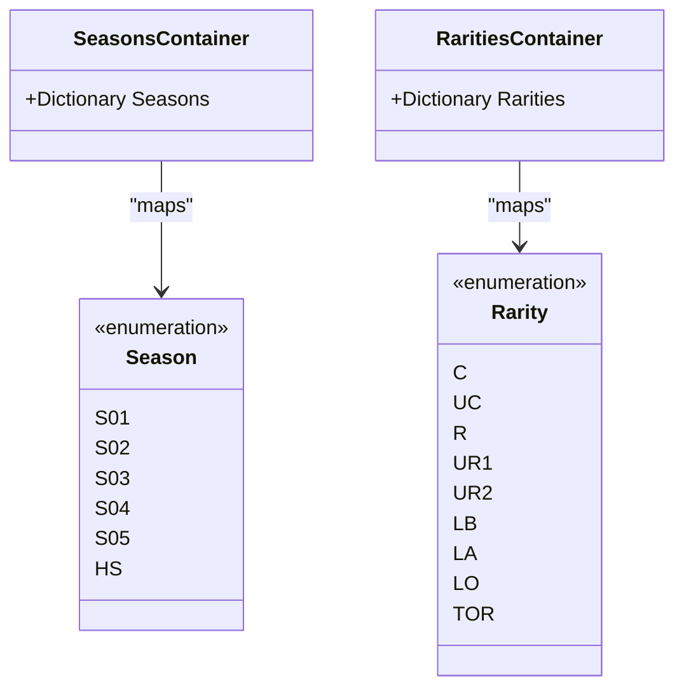
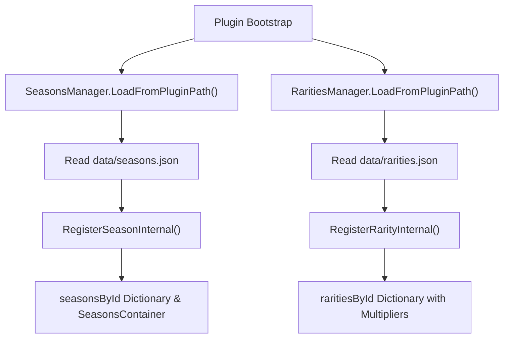
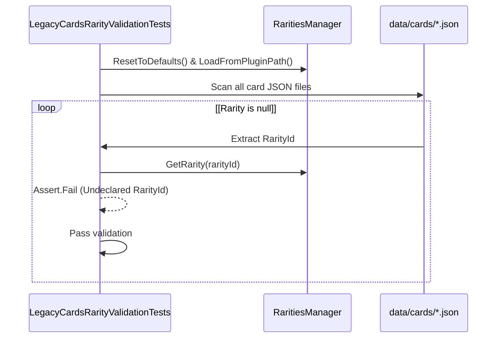

# Saisons et raretés

> **Fichiers sources pertinents**
> * [WankulCrazyPlugin.Tests/LegacyCardsRarityValidationTests.cs](https://github.com/Drakilis-57/WankulCrazy/blob/57b1f5ed/WankulCrazyPlugin.Tests/LegacyCardsRarityValidationTests.cs)
> * [cards/Rarities.cs](https://github.com/Drakilis-57/WankulCrazy/blob/57b1f5ed/cards/Rarities.cs)
> * [cards/RaritiesManager.cs](https://github.com/Drakilis-57/WankulCrazy/blob/57b1f5ed/cards/RaritiesManager.cs)
> * [cards/Rarity.cs](https://github.com/Drakilis-57/WankulCrazy/blob/57b1f5ed/cards/Rarity.cs)
> * [cards/RarityData.cs](https://github.com/Drakilis-57/WankulCrazy/blob/57b1f5ed/cards/RarityData.cs)
> * [cards/RarityJsonConverter.cs](https://github.com/Drakilis-57/WankulCrazy/blob/57b1f5ed/cards/RarityJsonConverter.cs)
> * [cards/Season.cs](https://github.com/Drakilis-57/WankulCrazy/blob/57b1f5ed/cards/Season.cs)
> * [cards/SeasonData.cs](https://github.com/Drakilis-57/WankulCrazy/blob/57b1f5ed/cards/SeasonData.cs)
> * [cards/SeasonJsonConverter.cs](https://github.com/Drakilis-57/WankulCrazy/blob/57b1f5ed/cards/SeasonJsonConverter.cs)
> * [cards/Seasons.cs](https://github.com/Drakilis-57/WankulCrazy/blob/57b1f5ed/cards/Seasons.cs)
> * [cards/SeasonsManager.cs](https://github.com/Drakilis-57/WankulCrazy/blob/57b1f5ed/cards/SeasonsManager.cs)
> * [data/cards/Legacy/legacy.json](https://github.com/Drakilis-57/WankulCrazy/blob/57b1f5ed/data/cards/Legacy/legacy.json)
> * [data/rarities.json](https://github.com/Drakilis-57/WankulCrazy/blob/57b1f5ed/data/rarities.json)
> * [data/seasons.json](https://github.com/Drakilis-57/WankulCrazy/blob/57b1f5ed/data/seasons.json)
> * [utils/Singleton.cs](https://github.com/Drakilis-57/WankulCrazy/blob/57b1f5ed/utils/Singleton.cs)

## Objectif et portée

Le sous-système Saisons et raretés est responsable de la définition, du stockage et du chargement dynamique des métadonnées associées aux extensions de carte (*Saisons*) et aux niveaux de carte (*Rarités*) dans `WankulCrazy`.Il relie les énumérations codées en dur avec des données JSON flexibles et externalisées (`seasons.json` et `rarities.json`).Cela permet au mod de prendre en charge des extensions personnalisées, de nouvelles catégories de rareté et des multiplicateurs d'équilibrage économique (tels que des multiplicateurs d'expérience et de prix) sans nécessiter une recompilation rigide du code.

---

## Énumérations et conteneurs statiques

L'identité du domaine principal pour les saisons et les raretés est ancrée dans les énumérations C# qui servent d'identifiants au moment de la compilation et de solutions de secours lorsque des actifs externes sont manquants ou se chargent dynamiquement.

### Énumérations de saison et de rareté

* `Season` : définit les identifiants d'extension principaux, y compris les saisons standard (`S01` à `S05`) et les éditions spéciales (`HS`) [cards/Season.cs L3-L12](https://github.com/Drakilis-57/WankulCrazy/blob/57b1f5ed/cards/Season.cs#L3-L12)
* `Rarity` : énumère les raretés standard (`C`, `UC`, `R`), les ultra-rares (`UR1`, `UR2`), les niveaux légendaires (`LB`, `LA`, `LO`), les éditions promotionnelles (`PGW23`, `C`0, `C`1), les packs de démarrage et les encarts spéciaux.comme `C`2 [cards/Rarity.cs L3-L26](https://github.com/Drakilis-57/WankulCrazy/blob/57b1f5ed/cards/Rarity.cs#L3-L26)

### Conteneurs statiques

Pour mapper les énumérations sur des noms d'affichage lisibles par l'homme, les conteneurs de dictionnaire statique agissent comme des recherches par défaut :

* `SeasonsContainer` : mappe les valeurs d'énumération `Season` à leurs titres anglais/français par défaut (par exemple, `{ Season.S05, "Legacy" }`) [cards/Seasons.cs L5-L16](https://github.com/Drakilis-57/WankulCrazy/blob/57b1f5ed/cards/Seasons.cs#L5-L16)
* `RaritiesContainer` : mappe les valeurs d'énumération `Rarity` aux chaînes de localisation (par exemple, `{ Rarity.C, "Commune" }`, `{ Rarity.LO, "Légendaire Or" }`) [cards/Rarities.cs L5-L31](https://github.com/Drakilis-57/WankulCrazy/blob/57b1f5ed/cards/Rarities.cs#L5-L31)



*Sources : [cards/Season.cs L3-L12](https://github.com/Drakilis-57/WankulCrazy/blob/57b1f5ed/cards/Season.cs#L3-L12)

 [cards/Rarity.cs L3-L26](https://github.com/Drakilis-57/WankulCrazy/blob/57b1f5ed/cards/Rarity.cs#L3-L26)

 [cards/Seasons.cs L5-L16](https://github.com/Drakilis-57/WankulCrazy/blob/57b1f5ed/cards/Seasons.cs#L5-L16)

[cartes/Rarities.cs L5-L31](https://github.com/Drakilis-57/WankulCrazy/blob/57b1f5ed/cards/Rarities.cs#L5-L31)*

---

## Gestionnaires dynamiques (SeasonsManager et RaritiesManager)

Au moment de l'exécution, `SeasonsManager` et `RaritiesManager` gèrent des registres thread-safe soutenus par des dictionnaires et des listes.Ils chargent les remplacements de configuration à partir du disque lors du démarrage du plugin.

### Implémentation de SeasonsManager

`SeasonsManager` s'initialise avec les valeurs par défaut via `ResetToDefaults()` [cards/SeasonsManager.cs L40-L54](https://github.com/Drakilis-57/WankulCrazy/blob/57b1f5ed/cards/SeasonsManager.cs#L40-L54)

et charge les remplacements de `data/seasons.json` à l'aide de `JsonConvert.DeserializeObject` [cards/SeasonsManager.cs L56-L88](https://github.com/Drakilis-57/WankulCrazy/blob/57b1f5ed/cards/SeasonsManager.cs#L56-L88)

Lors de l'enregistrement interne (`RegisterSeasonInternal`), il synchronise les données chargées dans `SeasonsContainer.Seasons` si l'ID de saison est analysé avec succès par rapport à l'énumération `Season` [cards/SeasonsManager.cs L99-L130](https://github.com/Drakilis-57/WankulCrazy/blob/57b1f5ed/cards/SeasonsManager.cs#L99-L130)

### Implémentation du gestionnaire de raretés

`RaritiesManager` contrôle les définitions de rareté, y compris les multiplicateurs d'équilibrage économique (`ExperienceMultiplier` et `PriceMultiplier`).Il est réinitialisé aux valeurs par défaut [cards/RaritiesManager.cs L25-L54](https://github.com/Drakilis-57/WankulCrazy/blob/57b1f5ed/cards/RaritiesManager.cs#L25-L54)

et charge les entrées personnalisées de `data/rarities.json` [cards/RaritiesManager.cs L56-L88](https://github.com/Drakilis-57/WankulCrazy/blob/57b1f5ed/cards/RaritiesManager.cs#L56-L88)

Lors de l'enregistrement d'une rareté (`RegisterRarityInternal`), il préserve les multiplicateurs existants non par défaut si un enregistrement partiel est chargé [cards/RaritiesManager.cs L99-L129](https://github.com/Drakilis-57/WankulCrazy/blob/57b1f5ed/cards/RaritiesManager.cs#L99-L129)

Les méthodes d'assistance telles que `GetExperienceMultiplier(string rarityId)` et `GetPriceMultiplier(string rarityId)` fournissent des recherches économiques rapides [cards/RaritiesManager.cs L146-L161](https://github.com/Drakilis-57/WankulCrazy/blob/57b1f5ed/cards/RaritiesManager.cs#L146-L161)



*Sources : [cards/SeasonsManager.cs L40-L130](https://github.com/Drakilis-57/WankulCrazy/blob/57b1f5ed/cards/SeasonsManager.cs#L40-L130)

[cartes/RaritiesManager.cs L25-L129](https://github.com/Drakilis-57/WankulCrazy/blob/57b1f5ed/cards/RaritiesManager.cs#L25-L129)*

---

## Schémas et convertisseurs de données JSON

Les fichiers de données externes résident dans le répertoire de données du plugin et sont analysés via Newtonsoft.Json.

### saisons.json

Définit les saisons actives avec des identifiants de chaîne uniques et des noms d'affichage :

```json
[  { "Id": "S04", "Name": "Stellar" },  { "Id": "S05", "Name": "Legacy" }]
```

*Sources : [data/seasons.json L1-L4](https://github.com/Drakilis-57/WankulCrazy/blob/57b1f5ed/data/seasons.json#L1-L4)*

### raretés.json

Définit les raretés ainsi que les paramètres de mise à l'échelle pour l'expérience et l'évaluation de la boutique :

```json
[  {    "Id": "C",    "Name": "Common",    "ExperienceMultiplier": 1.0,    "PriceMultiplier": 1.0  },  {    "Id": "DUO",    "Name": "Duo",    "ExperienceMultiplier": 4.0,    "PriceMultiplier": 4.0  }]
```

*Sources : [data/rarities.json L1-L56](https://github.com/Drakilis-57/WankulCrazy/blob/57b1f5ed/data/rarities.json#L1-L56)*

Les convertisseurs JSON (`SeasonJsonConverter` et `RarityJsonConverter`) gèrent la sérialisation et la désérialisation des jetons entre les clés de chaîne JSON et leurs structures d'énumération correspondantes lors de l'analyse des fichiers de carte.

*Sources : [cards/SeasonJsonConverter.cs](https://github.com/Drakilis-57/WankulCrazy/blob/57b1f5ed/cards/SeasonJsonConverter.cs)

[cards/RarityJsonConverter.cs](https://github.com/Drakilis-57/WankulCrazy/blob/57b1f5ed/cards/RarityJsonConverter.cs)*

---

## Validation et tests

Pour éviter les régressions (telles que les solutions de secours silencieuses où les identifiants de rareté non valides sont par défaut Common avec des multiplicateurs 1,0x), des suites de tests automatisés valident l'intégrité référentielle.

`LegacyCardsRarityValidationTests` vérifie que :

1. Tous les identifiants de rareté utilisés dans les fichiers de définition de carte sous `data/cards/` sont explicitement déclarés dans `data/rarities.json` [WankulCrazyPlugin.Tests/LegacyCardsRarityValidationTests.csL50-L110](https://github.com/Drakilis-57/WankulCrazy/blob/57b1f5ed/WankulCrazyPlugin.Tests/LegacyCardsRarityValidationTests.cs#L50-L110)
2. Des raretés spéciales comme `"DUO"` sont présentes dans `rarities.json` [WankulCrazyPlugin.Tests/LegacyCardsRarityValidationTests.csL33-L47](https://github.com/Drakilis-57/WankulCrazy/blob/57b1f5ed/WankulCrazyPlugin.Tests/LegacyCardsRarityValidationTests.cs#L33-L47)
3. Les identifiants obsolètes ou mal orthographiés (par exemple `"L-B"`, `"L-A"`, `"L-O"`) n'existent dans aucun fichier de configuration de carte [WankulCrazyPlugin.Tests/LegacyCardsRarityValidationTests.csL112-L133](https://github.com/Drakilis-57/WankulCrazy/blob/57b1f5ed/WankulCrazyPlugin.Tests/LegacyCardsRarityValidationTests.cs#L112-L133)



*Sources : [WankulCrazyPlugin.Tests/LegacyCardsRarityValidationTests.csL50-L133](https://github.com/Drakilis-57/WankulCrazy/blob/57b1f5ed/WankulCrazyPlugin.Tests/LegacyCardsRarityValidationTests.cs#L50-L133)*