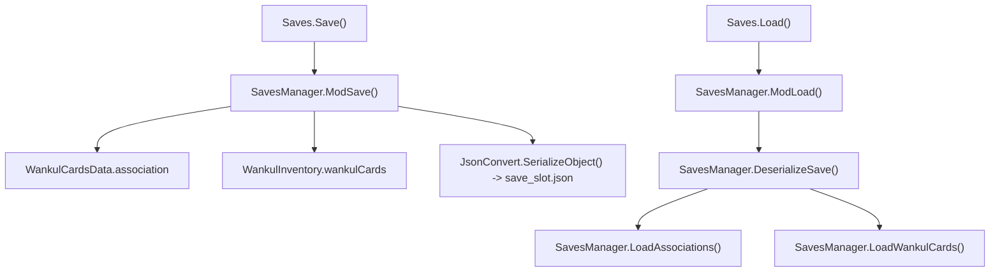
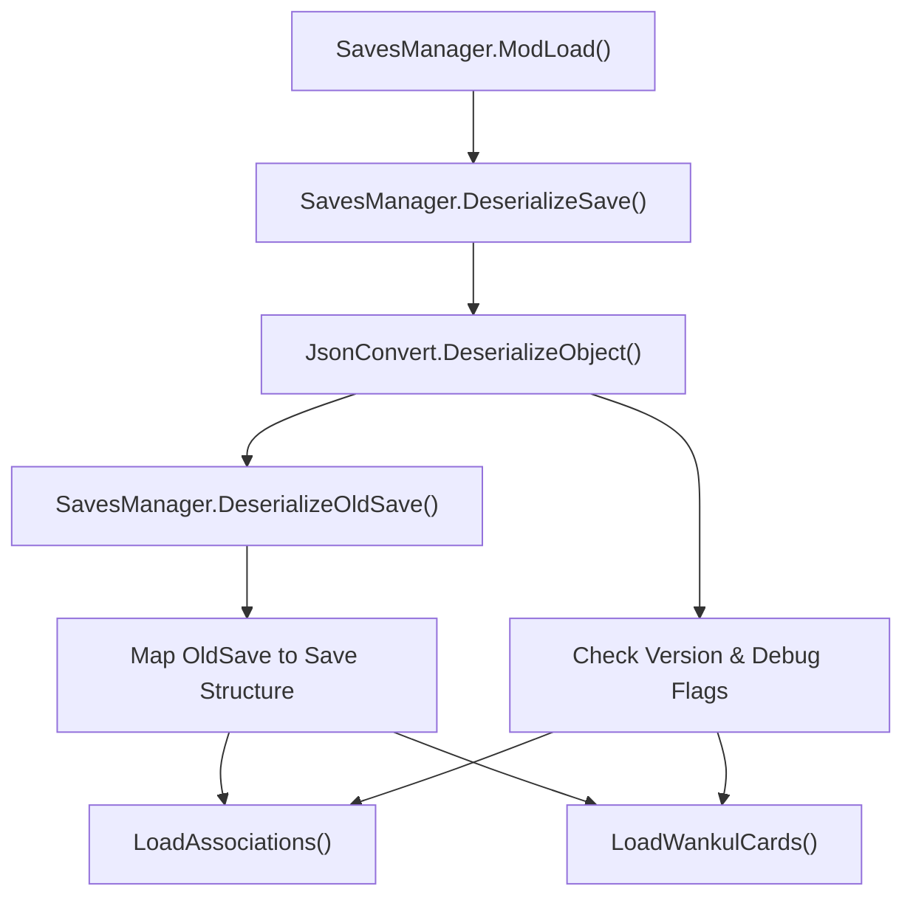

# Save System

> **Relevant source files**
> * [patch/GameStarting.cs](https://github.com/Drakilis-57/WankulCrazy/blob/57b1f5ed/patch/GameStarting.cs)
> * [patch/Saves.cs](https://github.com/Drakilis-57/WankulCrazy/blob/57b1f5ed/patch/Saves.cs)
> * [utils/SavesManager.cs](https://github.com/Drakilis-57/WankulCrazy/blob/57b1f5ed/utils/SavesManager.cs)

The Save System manages the persistence of custom card associations, market price histories, generated market values, and inventory items (`WankulInventory`) across game load slots. It integrates with the game's save/load lifecycle via patch hooks, handles backward compatibility through migration routines from legacy schemas (`OldSave`), and supports debugging flags.

## Architecture and Data Structures

Persistence relies on JSON serialization of custom state classes located in `utils/SavesManager.cs`. Two primary schema versions exist: `OldSave`, representing legacy save formats without market percentage history, and `Save`, the current format incorporating granular tracking data.

* **`OldSave`**: Maps card associations as simple integers and stores raw past prices [utils/SavesManager.cs L16-L21](https://github.com/Drakilis-57/WankulCrazy/blob/57b1f5ed/utils/SavesManager.cs#L16-L21)
* **`Save`**: Maps card associations to tuples containing index, past percentage history (`List<float>`), and generated market prices (`float`), alongside an inventory dictionary and a version string (`SavesManager.SaveVersion`) [utils/SavesManager.cs L22-L62](https://github.com/Drakilis-57/WankulCrazy/blob/57b1f5ed/utils/SavesManager.cs#L22-L62)

### Title: Save and Load Execution Flow

*Sources: [utils/SavesManager.cs L63-L155](https://github.com/Drakilis-57/WankulCrazy/blob/57b1f5ed/utils/SavesManager.cs#L63-L155)

 [patch/Saves.cs L1-L19](https://github.com/Drakilis-57/WankulCrazy/blob/57b1f5ed/patch/Saves.cs#L1-L19)*

## Serialization and Deserialization Workflow

The `SavesManager` class coordinates reading and writing files corresponding to the active game slot (`CGameManager.Instance.m_CurrentSaveLoadSlotSelectedIndex`) [utils/SavesManager.cs L63-L107](https://github.com/Drakilis-57/WankulCrazy/blob/57b1f5ed/utils/SavesManager.cs#L63-L107)

* **`ModSave()`**: Iterates over `WankulCardsData.Instance.association` to capture card index, price history, and market values. It records all entries in `WankulInventory.Instance.wankulCards` mapped by card keys (`monsterType_borderType_expansionType`), serializes the `Save` instance, and writes it to `{pluginPath}/data/save_{saveIndex}.json` [utils/SavesManager.cs L67-L97](https://github.com/Drakilis-57/WankulCrazy/blob/57b1f5ed/utils/SavesManager.cs#L67-L97)
* **`ModLoad()`**: Resets UI state via `SortUI.inited`, ensures card data is initialized, and attempts to read the target slot's JSON file [utils/SavesManager.cs L99-L118](https://github.com/Drakilis-57/WankulCrazy/blob/57b1f5ed/utils/SavesManager.cs#L99-L118)
* **`DeserializeSave()`**: Wraps JSON parsing in a try-catch block to catch `JsonSerializationException` anomalies, triggering automatic fallback to `DeserializeOldSave()` if schema mismatches occur [utils/SavesManager.cs L157-L168](https://github.com/Drakilis-57/WankulCrazy/blob/57b1f5ed/utils/SavesManager.cs#L157-L168)

### Title: Deserialization and Migration Fallback Pipeline

*Sources: [utils/SavesManager.cs L99-L168](https://github.com/Drakilis-57/WankulCrazy/blob/57b1f5ed/utils/SavesManager.cs#L99-L168)*

## Versioning and Migration

The system checks the deserialized `Save.version` against `SavesManager.SaveVersion` ("1.1.0") [utils/SavesManager.cs L66](https://github.com/Drakilis-57/WankulCrazy/blob/57b1f5ed/utils/SavesManager.cs#L66-L66)

* If `save.savedebug` is enabled, `HandleDebugSave(save)` is invoked [utils/SavesManager.cs L137-L140](https://github.com/Drakilis-57/WankulCrazy/blob/57b1f5ed/utils/SavesManager.cs#L137-L140)
* If the version string is null or differs from the current version, migration and price updating routines execute across all registered `WankulCardsData` instances via `UpdateCardPriceIfNeeded()` [utils/SavesManager.cs L141-L149](https://github.com/Drakilis-57/WankulCrazy/blob/57b1f5ed/utils/SavesManager.cs#L141-L149)
* Otherwise, standard association and card inventory loaders are executed directly [utils/SavesManager.cs L150-L154](https://github.com/Drakilis-57/WankulCrazy/blob/57b1f5ed/utils/SavesManager.cs#L150-L154)

Sources: [utils/SavesManager.cs L1-L168](https://github.com/Drakilis-57/WankulCrazy/blob/57b1f5ed/utils/SavesManager.cs#L1-L168)

## Save Patch Hooks

Persistence hooks are exposed via the `patch/Saves` class, which delegates game-engine triggers directly to `SavesManager` methods [patch/Saves.cs L7-L18](https://github.com/Drakilis-57/WankulCrazy/blob/57b1f5ed/patch/Saves.cs#L7-L18)

* **`Saves.Save()`**: Invokes `SavesManager.ModSave()` when the game requests a save state [patch/Saves.cs L9-L12](https://github.com/Drakilis-57/WankulCrazy/blob/57b1f5ed/patch/Saves.cs#L9-L12)
* **`Saves.Load()`**: Invokes `SavesManager.ModLoad()` when loading a save slot [patch/Saves.cs L14-L17](https://github.com/Drakilis-57/WankulCrazy/blob/57b1f5ed/patch/Saves.cs#L14-L17)

Sources: [patch/Saves.cs L1-L19](https://github.com/Drakilis-57/WankulCrazy/blob/57b1f5ed/patch/Saves.cs#L1-L19)