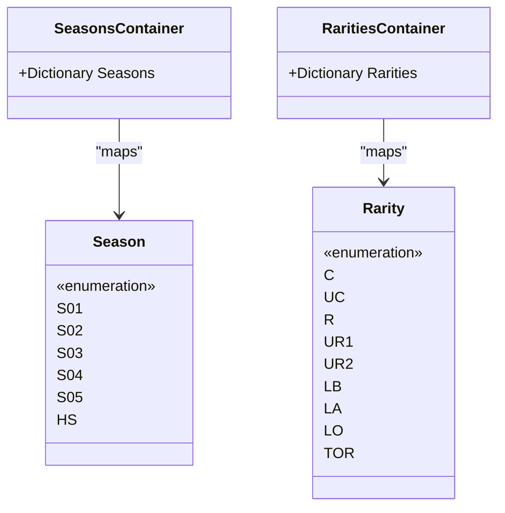
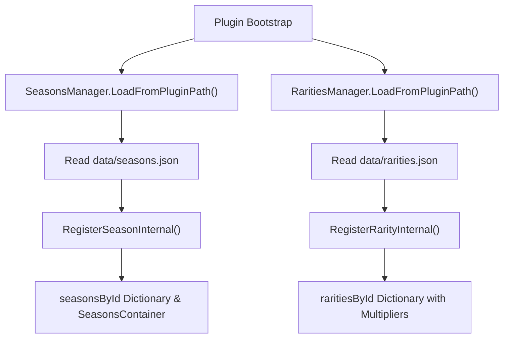
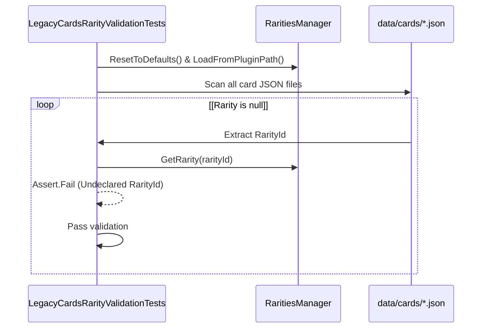

# Seasons and Rarities

> **Relevant source files**
> * [WankulCrazyPlugin.Tests/LegacyCardsRarityValidationTests.cs](https://github.com/Drakilis-57/WankulCrazy/blob/57b1f5ed/WankulCrazyPlugin.Tests/LegacyCardsRarityValidationTests.cs)
> * [cards/Rarities.cs](https://github.com/Drakilis-57/WankulCrazy/blob/57b1f5ed/cards/Rarities.cs)
> * [cards/RaritiesManager.cs](https://github.com/Drakilis-57/WankulCrazy/blob/57b1f5ed/cards/RaritiesManager.cs)
> * [cards/Rarity.cs](https://github.com/Drakilis-57/WankulCrazy/blob/57b1f5ed/cards/Rarity.cs)
> * [cards/RarityData.cs](https://github.com/Drakilis-57/WankulCrazy/blob/57b1f5ed/cards/RarityData.cs)
> * [cards/RarityJsonConverter.cs](https://github.com/Drakilis-57/WankulCrazy/blob/57b1f5ed/cards/RarityJsonConverter.cs)
> * [cards/Season.cs](https://github.com/Drakilis-57/WankulCrazy/blob/57b1f5ed/cards/Season.cs)
> * [cards/SeasonData.cs](https://github.com/Drakilis-57/WankulCrazy/blob/57b1f5ed/cards/SeasonData.cs)
> * [cards/SeasonJsonConverter.cs](https://github.com/Drakilis-57/WankulCrazy/blob/57b1f5ed/cards/SeasonJsonConverter.cs)
> * [cards/Seasons.cs](https://github.com/Drakilis-57/WankulCrazy/blob/57b1f5ed/cards/Seasons.cs)
> * [cards/SeasonsManager.cs](https://github.com/Drakilis-57/WankulCrazy/blob/57b1f5ed/cards/SeasonsManager.cs)
> * [data/cards/Legacy/legacy.json](https://github.com/Drakilis-57/WankulCrazy/blob/57b1f5ed/data/cards/Legacy/legacy.json)
> * [data/rarities.json](https://github.com/Drakilis-57/WankulCrazy/blob/57b1f5ed/data/rarities.json)
> * [data/seasons.json](https://github.com/Drakilis-57/WankulCrazy/blob/57b1f5ed/data/seasons.json)
> * [utils/Singleton.cs](https://github.com/Drakilis-57/WankulCrazy/blob/57b1f5ed/utils/Singleton.cs)

## Purpose and Scope

The Seasons and Rarities subsystem is responsible for defining, storing, and dynamically loading metadata associated with card expansions (*Seasons*) and card tiers (*Rarities*) in `WankulCrazy`. It bridges hardcoded enums with flexible, externalized JSON data (`seasons.json` and `rarities.json`). This allows the mod to support custom expansions, new rarity categories, and economy balancing multipliers (such as experience and price multipliers) without requiring rigid code recompilation.

---

## Enums and Static Containers

The core domain identity for seasons and rarities is rooted in C# enums which serve as compile-time identifiers and fallbacks when external assets are missing or loading dynamically.

### Season and Rarity Enums

* `Season`: Defines primary expansion identifiers including standard seasons (`S01` through `S05`) and special editions (`HS`) [cards/Season.cs L3-L12](https://github.com/Drakilis-57/WankulCrazy/blob/57b1f5ed/cards/Season.cs#L3-L12)
* `Rarity`: Enumerates standard rarities (`C`, `UC`, `R`), ultra-rares (`UR1`, `UR2`), legendary tiers (`LB`, `LA`, `LO`), promotional editions (`PGW23`, `NOEL23`, `PGW24`), starter packs, and special inserts like `TOR` [cards/Rarity.cs L3-L26](https://github.com/Drakilis-57/WankulCrazy/blob/57b1f5ed/cards/Rarity.cs#L3-L26)

### Static Containers

To map enums to human-readable display names, static dictionary containers act as default lookups:

* `SeasonsContainer`: Maps `Season` enum values to their default English/French titles (e.g., `{ Season.S05, "Legacy" }`) [cards/Seasons.cs L5-L16](https://github.com/Drakilis-57/WankulCrazy/blob/57b1f5ed/cards/Seasons.cs#L5-L16)
* `RaritiesContainer`: Maps `Rarity` enum values to localization strings (e.g., `{ Rarity.C, "Commune" }`, `{ Rarity.LO, "Légendaire Or" }`) [cards/Rarities.cs L5-L31](https://github.com/Drakilis-57/WankulCrazy/blob/57b1f5ed/cards/Rarities.cs#L5-L31)



*Sources: [cards/Season.cs L3-L12](https://github.com/Drakilis-57/WankulCrazy/blob/57b1f5ed/cards/Season.cs#L3-L12)

 [cards/Rarity.cs L3-L26](https://github.com/Drakilis-57/WankulCrazy/blob/57b1f5ed/cards/Rarity.cs#L3-L26)

 [cards/Seasons.cs L5-L16](https://github.com/Drakilis-57/WankulCrazy/blob/57b1f5ed/cards/Seasons.cs#L5-L16)

 [cards/Rarities.cs L5-L31](https://github.com/Drakilis-57/WankulCrazy/blob/57b1f5ed/cards/Rarities.cs#L5-L31)*

---

## Dynamic Managers (SeasonsManager and RaritiesManager)

At runtime, `SeasonsManager` and `RaritiesManager` manage thread-safe registries backed by dictionaries and lists. They load configuration overrides from disk during plugin bootstrap.

### SeasonsManager Implementation

`SeasonsManager` initializes with default values via `ResetToDefaults()` [cards/SeasonsManager.cs L40-L54](https://github.com/Drakilis-57/WankulCrazy/blob/57b1f5ed/cards/SeasonsManager.cs#L40-L54)

 and loads overrides from `data/seasons.json` using `LoadFromPluginPath(string pluginPath)` [cards/SeasonsManager.cs L56-L88](https://github.com/Drakilis-57/WankulCrazy/blob/57b1f5ed/cards/SeasonsManager.cs#L56-L88)

 During internal registration (`RegisterSeasonInternal`), it synchronizes loaded data back into `SeasonsContainer.Seasons` if the season ID successfully parses against the `Season` enum [cards/SeasonsManager.cs L99-L130](https://github.com/Drakilis-57/WankulCrazy/blob/57b1f5ed/cards/SeasonsManager.cs#L99-L130)

### RaritiesManager Implementation

`RaritiesManager` controls rarity definitions, including economy balancing multipliers (`ExperienceMultiplier` and `PriceMultiplier`). It resets to default values [cards/RaritiesManager.cs L25-L54](https://github.com/Drakilis-57/WankulCrazy/blob/57b1f5ed/cards/RaritiesManager.cs#L25-L54)

 and loads custom entries from `data/rarities.json` [cards/RaritiesManager.cs L56-L88](https://github.com/Drakilis-57/WankulCrazy/blob/57b1f5ed/cards/RaritiesManager.cs#L56-L88)

 When registering a rarity (`RegisterRarityInternal`), it preserves existing non-default multipliers if a partial record is loaded [cards/RaritiesManager.cs L99-L129](https://github.com/Drakilis-57/WankulCrazy/blob/57b1f5ed/cards/RaritiesManager.cs#L99-L129)

 Helper methods such as `GetExperienceMultiplier(string rarityId)` and `GetPriceMultiplier(string rarityId)` provide fast economic lookups [cards/RaritiesManager.cs L146-L161](https://github.com/Drakilis-57/WankulCrazy/blob/57b1f5ed/cards/RaritiesManager.cs#L146-L161)



*Sources: [cards/SeasonsManager.cs L40-L130](https://github.com/Drakilis-57/WankulCrazy/blob/57b1f5ed/cards/SeasonsManager.cs#L40-L130)

 [cards/RaritiesManager.cs L25-L129](https://github.com/Drakilis-57/WankulCrazy/blob/57b1f5ed/cards/RaritiesManager.cs#L25-L129)*

---

## JSON Data Schemas and Converters

The external data files reside under the plugin's data directory and are parsed via Newtonsoft.Json.

### seasons.json

Defines active seasons with unique string identifiers and display names:

```json
[  { "Id": "S04", "Name": "Stellar" },  { "Id": "S05", "Name": "Legacy" }]
```

*Sources: [data/seasons.json L1-L4](https://github.com/Drakilis-57/WankulCrazy/blob/57b1f5ed/data/seasons.json#L1-L4)*

### rarities.json

Defines rarities along with scaling parameters for experience and shop valuation:

```json
[  {    "Id": "C",    "Name": "Common",    "ExperienceMultiplier": 1.0,    "PriceMultiplier": 1.0  },  {    "Id": "DUO",    "Name": "Duo",    "ExperienceMultiplier": 4.0,    "PriceMultiplier": 4.0  }]
```

*Sources: [data/rarities.json L1-L56](https://github.com/Drakilis-57/WankulCrazy/blob/57b1f5ed/data/rarities.json#L1-L56)*

JSON converters (`SeasonJsonConverter` and `RarityJsonConverter`) handle token serialization and deserialization between JSON string keys and their corresponding enum structures during card file parsing.

*Sources: [cards/SeasonJsonConverter.cs](https://github.com/Drakilis-57/WankulCrazy/blob/57b1f5ed/cards/SeasonJsonConverter.cs)

 [cards/RarityJsonConverter.cs](https://github.com/Drakilis-57/WankulCrazy/blob/57b1f5ed/cards/RarityJsonConverter.cs)*

---

## Validation and Testing

To prevent regressions (such as silent fallbacks where invalid rarity IDs default to Common with 1.0x multipliers), automated test suites validate referential integrity.

`LegacyCardsRarityValidationTests` verifies that:

1. All rarity IDs used across card definition files under `data/cards/` are explicitly declared in `data/rarities.json` [WankulCrazyPlugin.Tests/LegacyCardsRarityValidationTests.cs L50-L110](https://github.com/Drakilis-57/WankulCrazy/blob/57b1f5ed/WankulCrazyPlugin.Tests/LegacyCardsRarityValidationTests.cs#L50-L110)
2. Special rarities like `"DUO"` are present in `rarities.json` [WankulCrazyPlugin.Tests/LegacyCardsRarityValidationTests.cs L33-L47](https://github.com/Drakilis-57/WankulCrazy/blob/57b1f5ed/WankulCrazyPlugin.Tests/LegacyCardsRarityValidationTests.cs#L33-L47)
3. Deprecated or misspelled identifiers (e.g. `"L-B"`, `"L-A"`, `"L-O"`) do not exist in any card configuration files [WankulCrazyPlugin.Tests/LegacyCardsRarityValidationTests.cs L112-L133](https://github.com/Drakilis-57/WankulCrazy/blob/57b1f5ed/WankulCrazyPlugin.Tests/LegacyCardsRarityValidationTests.cs#L112-L133)



*Sources: [WankulCrazyPlugin.Tests/LegacyCardsRarityValidationTests.cs L50-L133](https://github.com/Drakilis-57/WankulCrazy/blob/57b1f5ed/WankulCrazyPlugin.Tests/LegacyCardsRarityValidationTests.cs#L50-L133)*