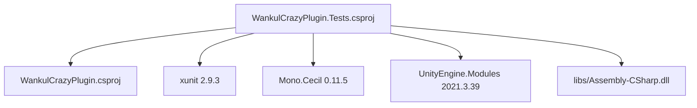
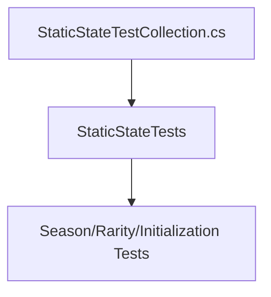
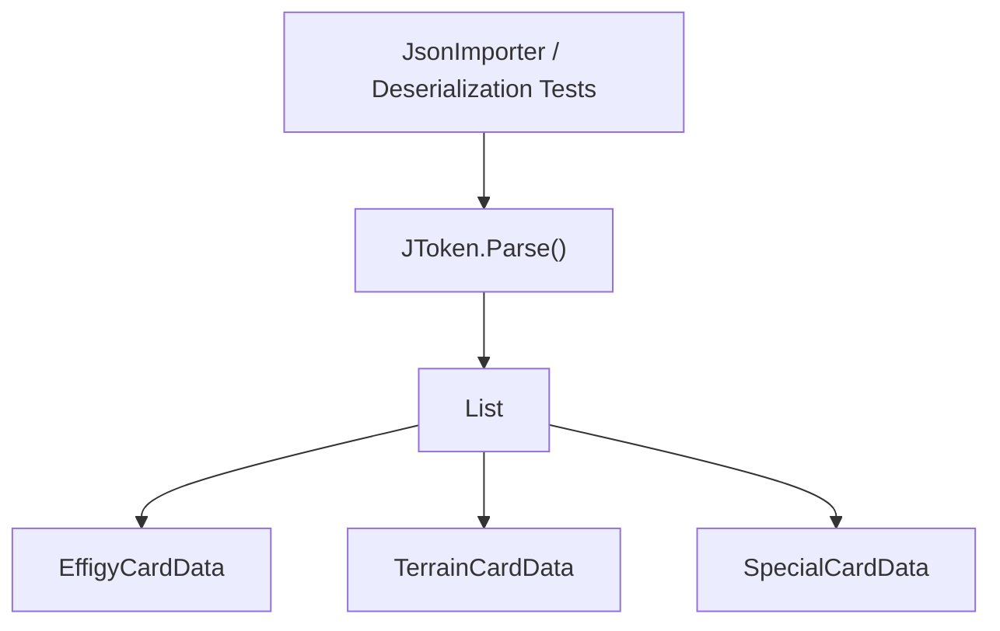
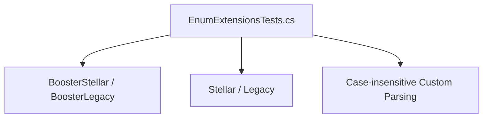
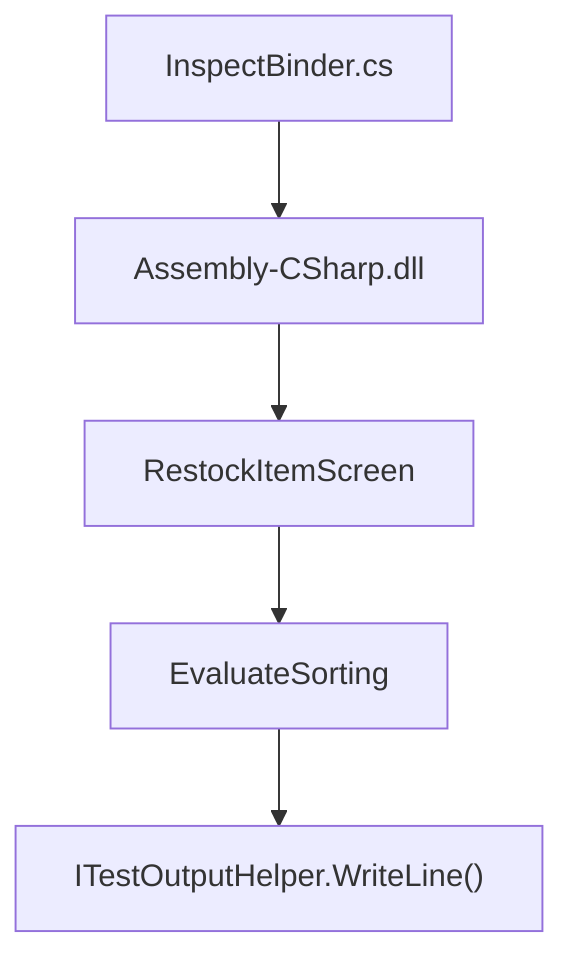
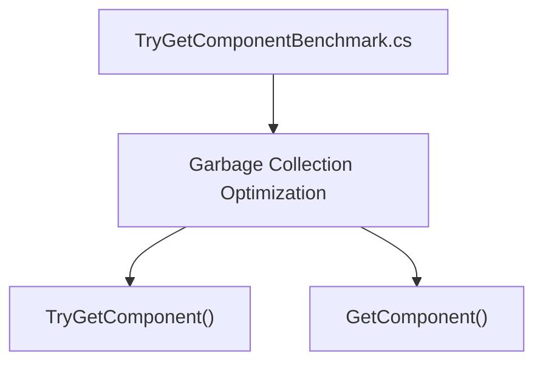

# Suite de tests

> **Fichiers sources pertinents**
> * [WankulCrazyPlugin.Tests/DocsFeaturesVerificationTests.cs](https://github.com/Drakilis-57/WankulCrazy/blob/57b1f5ed/WankulCrazyPlugin.Tests/DocsFeaturesVerificationTests.cs)
> * [WankulCrazyPlugin.Tests/DynamicSeasonsAndRaritiesTests.cs](https://github.com/Drakilis-57/WankulCrazy/blob/57b1f5ed/WankulCrazyPlugin.Tests/DynamicSeasonsAndRaritiesTests.cs)
> * [WankulCrazyPlugin.Tests/EnumExtensionsTests.cs](https://github.com/Drakilis-57/WankulCrazy/blob/57b1f5ed/WankulCrazyPlugin.Tests/EnumExtensionsTests.cs)
> * [WankulCrazyPlugin.Tests/IndexAndExpansionTests.cs](https://github.com/Drakilis-57/WankulCrazy/blob/57b1f5ed/WankulCrazyPlugin.Tests/IndexAndExpansionTests.cs)
> * [WankulCrazyPlugin.Tests/InitializationTests.cs](https://github.com/Drakilis-57/WankulCrazy/blob/57b1f5ed/WankulCrazyPlugin.Tests/InitializationTests.cs)
> * [WankulCrazyPlugin.Tests/InspectBinder.cs](https://github.com/Drakilis-57/WankulCrazy/blob/57b1f5ed/WankulCrazyPlugin.Tests/InspectBinder.cs)
> * [WankulCrazyPlugin.Tests/SeasonTestAndCustomPacksTests.cs](https://github.com/Drakilis-57/WankulCrazy/blob/57b1f5ed/WankulCrazyPlugin.Tests/SeasonTestAndCustomPacksTests.cs)
> * [WankulCrazyPlugin.Tests/StaticStateTestCollection.cs](https://github.com/Drakilis-57/WankulCrazy/blob/57b1f5ed/WankulCrazyPlugin.Tests/StaticStateTestCollection.cs)
> * [WankulCrazyPlugin.Tests/TryGetComponentBenchmark.cs](https://github.com/Drakilis-57/WankulCrazy/blob/57b1f5ed/WankulCrazyPlugin.Tests/TryGetComponentBenchmark.cs)
> * [WankulCrazyPlugin.Tests/WankulCrazyPlugin.Tests.csproj](https://github.com/Drakilis-57/WankulCrazy/blob/57b1f5ed/WankulCrazyPlugin.Tests/WankulCrazyPlugin.Tests.csproj)
> * [cards/EffigyCardData.cs](https://github.com/Drakilis-57/WankulCrazy/blob/57b1f5ed/cards/EffigyCardData.cs)

La suite de tests valide les modèles de données de cartes, la gestion dynamique des saisons et raretés, la désérialisation de jetons JSON, les analyseurs d'objets personnalisés, le parsing d'énumérations sécurisé, l'inspection IL via Mono.Cecil, et les benchmarks de performances. Le projet de test est configuré comme un assemblage de test xUnit autonome ciblant `.NET 8.0` [WankulCrazyPlugin.Tests/WankulCrazyPlugin.Tests.csproj:1-13] et repose sur les paquets NuGet incluant `xunit`, `Mono.Cecil`, et `UnityEngine.Modules` [WankulCrazyPlugin.Tests/WankulCrazyPlugin.Tests.csproj:15-22].

---

## 1. Tester la structure et les dépendances du projet

Le projet de test `WankulCrazyPlugin.Tests` fait référence au projet principal `WankulCrazyPlugin` et inclut des dépendances externes pour l'analyse, les tests unitaires et l'inspection de l'assemblage du jeu [WankulCrazyPlugin.Tests/WankulCrazyPlugin.Tests.csproj:24-33].

Sources : [WankulCrazyPlugin.Tests/WankulCrazyPlugin.Tests.csprojL1-L35](https://github.com/Drakilis-57/WankulCrazy/blob/57b1f5ed/WankulCrazyPlugin.Tests/WankulCrazyPlugin.Tests.csproj#L1-L35)

---

## 2. Test d'isolement et collecte d'états statiques

Étant donné que plusieurs gestionnaires (`SeasonsManager`, `RaritiesManager`) maintiennent des dictionnaires d'état statiques pendant l'exécution, les tests qui modifient les saisons ou les raretés utilisent une définition de collection xUnit avec `DisableParallelization = true` (`StaticStateTests`) [WankulCrazyPlugin.Tests/StaticStateTestCollection.cs:1-10].Cela évite les conditions de concurrence lors de l’exécution parallèle.

Sources : [WankulCrazyPlugin.Tests/StaticStateTestCollection.cs L1-L9](https://github.com/Drakilis-57/WankulCrazy/blob/57b1f5ed/WankulCrazyPlugin.Tests/StaticStateTestCollection.cs#L1-L9)

---

## 3. JSON Validation and Importer Verification

La suite de tests vérifie que les jetons de données de carte, les éléments personnalisés, les listes de réapprovisionnement et les définitions de maillage sont correctement désérialisés et validés [WankulCrazyPlugin.Tests/SeasonTestAndCustomPacksTests.cs:34-79].

### Classes de test d'importateur de clés

|Classe d'essai |Fichier |Responsabilité principale |
|--- |--- |--- |
|`SeasonTestAndCustomPacksTests` |`SeasonTestAndCustomPacksTests.cs` |Valide les structures de données JSON des éléments personnalisés (`ItemDataList.json`, `restockDataList.json`, `itemMeshDataList.json`) et les extensions d'énumération [WankulCrazyPlugin.Tests/SeasonTestAndCustomPacksTests.cs:34-95] |
|`DocsFeaturesVerificationTests` |`DocsFeaturesVerificationTests.cs` |Teste l'analyse de conteneurs multi-fichiers (`wankuls`, `terrains`, `specials`) et les cycles de vie dynamiques des saisons/rarités [WankulCrazyPlugin.Tests/DocsFeaturesVerificationTests.cs:15-128] |
|`DynamicSeasonsAndRaritiesTests` |`DynamicSeasonsAndRaritiesTests.cs` |Vérifie l'enregistrement par défaut, l'enregistrement personnalisé, la désérialisation des jetons et les calculs d'expérience [WankulCrazyPlugin.Tests/DynamicSeasonsAndRaritiesTests.cs:15-120] |
| `IndexAndExpansionTests` | `IndexAndExpansionTests.cs` | Ensures card indexes are auto-assigned when missing or zero [WankulCrazyPlugin.Tests/IndexAndExpansionTests.cs:13-25] |
|`InitializationTests` |`InitializationTests.cs` |Teste l'initialisation à partir du chemin du plugin et de l'analyse de cartes multi-types (`EffigyCardData`, `TerrainCardData`, `SpecialCardData`) [WankulCrazyPlugin.Tests/InitializationTests.cs:14-51] |

Sources : `[WankulCrazyPlugin.Tests/SeasonTestAndCustomPacksTests.cs:34-95]`, `[WankulCrazyPlugin.Tests/DocsFeaturesVerificationTests.cs:15-128]`, `[WankulCrazyPlugin.Tests/DynamicSeasonsAndRaritiesTests.cs:15-120]`, `[WankulCrazyPlugin.Tests/IndexAndExpansionTests.cs:13-25]`, [WankulCrazyPlugin.Tests/InitializationTests.csL14-L51](https://github.com/Drakilis-57/WankulCrazy/blob/57b1f5ed/WankulCrazyPlugin.Tests/InitializationTests.cs#L14-L51)

---

## 4. Enum Safe-Parsing and Extension Testing

Les extensions d'énumération et les correctifs d'énumération Harmony (`Patch_Enum_IsDefined`, `Patch_Enum_GetName`, `Patch_Enum_Parse`) sont rigoureusement testés pour garantir une gestion sûre des identifiants de chaîne et des valeurs entières personnalisées [WankulCrazyPlugin.Tests/EnumExtensionsTests.cs:1-77].

Sources : `[WankulCrazyPlugin.Tests/SeasonTestAndCustomPacksTests.cs:81-96]`, [WankulCrazyPlugin.Tests/EnumExtensionsTests.cs L1-L77](https://github.com/Drakilis-57/WankulCrazy/blob/57b1f5ed/WankulCrazyPlugin.Tests/EnumExtensionsTests.cs#L1-L77)

---

## 5. IL Inspection via Mono.Cecil

`InspectBinder` utilise `Mono.Cecil` pour inspecter les instructions IL de l'assemblage du jeu (telles que `RestockItemScreen.EvaluateSorting`) lors d'enquêtes locales [WankulCrazyPlugin.Tests/InspectBinder.cs:1-38].

Sources : [WankulCrazyPlugin.Tests/InspectBinder.cs L1-L38](https://github.com/Drakilis-57/WankulCrazy/blob/57b1f5ed/WankulCrazyPlugin.Tests/InspectBinder.cs#L1-L38)

---

## 6. Benchmarks et vérification des performances

`TryGetComponentBenchmark` documente et valide les considérations de performances concernant les appels d'API Unity, en comparant spécifiquement les allocations `GetComponent<T>()` et `TryGetComponent<T>()` [WankulCrazyPlugin.Tests/TryGetComponentBenchmark.cs:1-27].

Sources : [WankulCrazyPlugin.Tests/TryGetComponentBenchmark.cs L1-L27](https://github.com/Drakilis-57/WankulCrazy/blob/57b1f5ed/WankulCrazyPlugin.Tests/TryGetComponentBenchmark.cs#L1-L27)