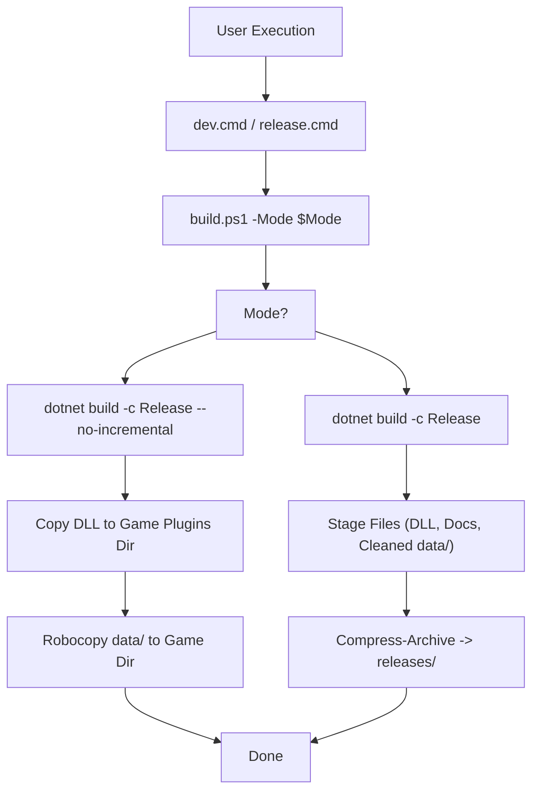

# Construire le système et les dépendances

> **Fichiers sources pertinents**
> * [.github/workflows/build.yml](https://github.com/Drakilis-57/WankulCrazy/blob/57b1f5ed/.github/workflows/build.yml)
> * [.gitignore](https://github.com/Drakilis-57/WankulCrazy/blob/57b1f5ed/.gitignore)
> * [BUILD_GUIDE.md](BUILD_GUIDE.md)
> * [inventaire.md](inventaire.md)
> * [WankulCrazyPlugin.Tests/StringExtensionsTests.cs](https://github.com/Drakilis-57/WankulCrazy/blob/57b1f5ed/WankulCrazyPlugin.Tests/StringExtensionsTests.cs)
> * [WankulCrazyPlugin.csproj](https://github.com/Drakilis-57/WankulCrazy/blob/57b1f5ed/WankulCrazyPlugin.csproj)
> * [WankulCrazyPlugin.sln](https://github.com/Drakilis-57/WankulCrazy/blob/57b1f5ed/WankulCrazyPlugin.sln)
> * [build.ps1](https://github.com/Drakilis-57/WankulCrazy/blob/57b1f5ed/build.ps1)
> * [cards/SortType.cs](https://github.com/Drakilis-57/WankulCrazy/blob/57b1f5ed/cards/SortType.cs)
> * [dev.cmd](https://github.com/Drakilis-57/WankulCrazy/blob/57b1f5ed/dev.cmd)
> * [libs/Newtonsoft.Json.dll](https://github.com/Drakilis-57/WankulCrazy/blob/57b1f5ed/libs/Newtonsoft.Json.dll)
> * [release.cmd](https://github.com/Drakilis-57/WankulCrazy/blob/57b1f5ed/release.cmd)

### Objectif et portée

Ce document détaille la configuration de construction, la structure du projet, les dépendances d'assemblage externes, les scripts d'automatisation et les flux de travail d'intégration continue (CI) pour le mod `WankulCrazy` BepInEx.Il décrit comment `WankulCrazyPlugin.csproj` [WankulCrazyPlugin.csproj L1-L84](https://github.com/Drakilis-57/WankulCrazy/blob/57b1f5ed/WankulCrazyPlugin.csproj#L1-L84)

et `WankulCrazyPlugin.sln` [WankulCrazyPlugin.sln L1-L66](https://github.com/Drakilis-57/WankulCrazy/blob/57b1f5ed/WankulCrazyPlugin.sln#L1-L66)

configurer les cibles de compilation, comment les assemblys de référence dans `libs/` sont consommés, comment `build.ps1` [build.ps1 L1-L149](https://github.com/Drakilis-57/WankulCrazy/blob/57b1f5ed/build.ps1#L1-L149)

coordonne le développement et les déploiements de versions, ainsi que la manière dont GitHub Actions exécute les builds et les suites de tests à distance.

---

## 1. Configuration de la solution et du projet

Le projet est structuré autour d'un fichier de solution central, `WankulCrazyPlugin.sln` [WankulCrazyPlugin.sln L1-L66](https://github.com/Drakilis-57/WankulCrazy/blob/57b1f5ed/WankulCrazyPlugin.sln#L1-L66)

qui contient deux projets principaux :

1. `WankulCrazyPlugin` (`WankulCrazyPlugin.csproj`) [WankulCrazyPlugin.csproj L1-L84](https://github.com/Drakilis-57/WankulCrazy/blob/57b1f5ed/WankulCrazyPlugin.csproj#L1-L84) — L'assemblage de mod BepInEx de base ciblant `netstandard2.1`[WankulCrazyPlugin.csproj L3](https://github.com/Drakilis-57/WankulCrazy/blob/57b1f5ed/WankulCrazyPlugin.csproj#L3-L3)
2. `WankulCrazyPlugin.Tests` (`WankulCrazyPlugin.Tests.csproj`) [WankulCrazyPlugin.sln L8](https://github.com/Drakilis-57/WankulCrazy/blob/57b1f5ed/WankulCrazyPlugin.sln#L8-L8) — La suite de tests xUnit validant les schémas, les énumérations et l'intégrité des données JSON.

### Propriétés du projet (WankulCrazyPlugin.csproj)

Le projet active les blocs non sécurisés, cible la dernière version du langage C# et personnalise les chemins de sortie pour isoler les artefacts de build sous `dist/WankulCrazy/` :

```xml
<PropertyGroup>    <TargetFramework>netstandard2.1</TargetFramework>    <AssemblyName>WankulCrazyPlugin</AssemblyName>    <Product>My first plugin</Product>    <Version>1.0.0</Version>    <AllowUnsafeBlocks>true</AllowUnsafeBlocks>    <LangVersion>latest</LangVersion>    <OutputPath>.\dist\WankulCrazy\</OutputPath>    <BaseOutputPath>.\dist\WankulCrazy\</BaseOutputPath>    <AppendTargetFrameworkToOutputPath>false</AppendTargetFrameworkToOutputPath>    <GenerateDependencyFile>false</GenerateDependencyFile>    <DebugType>none</DebugType>    <GenerateAssemblyInfo>false</GenerateAssemblyInfo></PropertyGroup>
```

*Sources : [WankulCrazyPlugin.csproj L1-L24](https://github.com/Drakilis-57/WankulCrazy/blob/57b1f5ed/WankulCrazyPlugin.csproj#L1-L24)

[WankulCrazyPlugin.sln L1-L66](https://github.com/Drakilis-57/WankulCrazy/blob/57b1f5ed/WankulCrazyPlugin.sln#L1-L66)*

---

## 2. Assemblages de référence et dépendances externes

Étant donné que `WankulCrazy` s'exécute comme un mod BepInEx dans *TCG Card Shop Simulator* (construit sur Unity 2021.3.39), la compilation s'appuie à la fois sur les packages NuGet et sur les assemblys de référence de jeu privés stockés localement dans le répertoire `libs/`.Ces références sont marquées avec `<Private>False</Private>` pour éviter la duplication des assemblys de moteur et de jeu dans la distribution de sortie.

### Tableau des dépendances

|Type de dépendance |Source/Nom du package |Version / AstucePath |Rôle dans la construction |
|--- |--- |--- |--- |
|**NuGet** |`BepInEx.Core` |`5.*` [WankulCrazyPlugin.csproj L34](https://github.com/Drakilis-57/WankulCrazy/blob/57b1f5ed/WankulCrazyPlugin.csproj#L34-L34) |Cadre de chargement du plugin Core BepInEx |
|**NuGet** |`BepInEx.Analyzers` |`1.*` [WankulCrazyPlugin.csproj L33](https://github.com/Drakilis-57/WankulCrazy/blob/57b1f5ed/WankulCrazyPlugin.csproj#L33-L33) |Analyseurs Roslyn pour les modèles de code BepInEx |
|**NuGet** |`BepInEx.PluginInfoProps` |`2.*` [WankulCrazyPlugin.csproj L35](https://github.com/Drakilis-57/WankulCrazy/blob/57b1f5ed/WankulCrazyPlugin.csproj#L35-L35) |Propriétés de génération automatique `PluginInfo` |
|**NuGet** |`UnityEngine.Modules` |`2021.3.39` [WankulCrazyPlugin.csproj L36](https://github.com/Drakilis-57/WankulCrazy/blob/57b1f5ed/WankulCrazyPlugin.csproj#L36-L36) |Références de compilation du moteur Unity |
|**Libération locale** |`Assembly-CSharp.dll` |`libs\Assembly-CSharp.dll` [WankulCrazyPlugin.csproj L44-L47](https://github.com/Drakilis-57/WankulCrazy/blob/57b1f5ed/WankulCrazyPlugin.csproj#L44-L47) |Logique principale du jeu et classes |
|**Libération locale** |`Newtonsoft.Json.dll` |`libs\Newtonsoft.Json.dll` [WankulCrazyPlugin.csproj L48-L51](https://github.com/Drakilis-57/WankulCrazy/blob/57b1f5ed/WankulCrazyPlugin.csproj#L48-L51) |Analyse JSON pour les cartes, les sauvegardes et les configurations |
|**Libération locale** |`Unity.TextMeshPro.dll` |`libs\Unity.TextMeshPro.dll` [WankulCrazyPlugin.csproj L52-L55](https://github.com/Drakilis-57/WankulCrazy/blob/57b1f5ed/WankulCrazyPlugin.csproj#L52-L55) |Composants de rendu de texte de l'interface utilisateur |
|**Libération locale** |`UnityEngine.UI.dll` |`libs\UnityEngine.UI.dll` [WankulCrazyPlugin.csproj L56-L59](https://github.com/Drakilis-57/WankulCrazy/blob/57b1f5ed/WankulCrazyPlugin.csproj#L56-L59) |Canevas et éléments de mise en page de l'interface utilisateur Unity |

### Diagramme : Construire le mappage des composants du système

```

```

*Sources : [WankulCrazyPlugin.csproj L26-L66](https://github.com/Drakilis-57/WankulCrazy/blob/57b1f5ed/WankulCrazyPlugin.csproj#L26-L66)

[WankulCrazyPlugin.sln L1-L66](https://github.com/Drakilis-57/WankulCrazy/blob/57b1f5ed/WankulCrazyPlugin.sln#L1-L66)*

---

## 3. Construire l'automatisation et les scripts

Les opérations de construction sont pilotées par `build.ps1`, qui prend en charge deux modes d'exécution principaux : `dev` et `release` [build.ps1 L8-L12](https://github.com/Drakilis-57/WankulCrazy/blob/57b1f5ed/build.ps1#L8-L12)

### Mode développement (dév.)

Invoqué via `dev.cmd` [dev.cmd L1-L3](https://github.com/Drakilis-57/WankulCrazy/blob/57b1f5ed/dev.cmd#L1-L3)

ou `.\dev` [BUILD_GUIDE.md L3](BUILD_GUIDE.md)

ce mode :

1. Compile le projet dans la configuration `Release` sans mise en cache incrémentielle (`dotnet build -c Release --no-incremental`) [build.ps1 L64](https://github.com/Drakilis-57/WankulCrazy/blob/57b1f5ed/build.ps1#L64-L64)
2. Localise le répertoire du jeu cible à l'aide des variables d'environnement (`$env:TCGCARDSHOP_PLUGIN_DIR`), `local.config.json` ou des chemins d'installation Steam courants [build.ps1 L28-L56](https://github.com/Drakilis-57/WankulCrazy/blob/57b1f5ed/build.ps1#L28-L56)
3. Copie `WankulCrazyPlugin.dll` directement dans le dossier des plugins BepInEx [build.ps1 L74](https://github.com/Drakilis-57/WankulCrazy/blob/57b1f5ed/build.ps1#L74-L74)
4. Synchronise le répertoire `data/`, riche en ressources, à l'aide de `robocopy` avec les options `/E /XO /FFT` pour refléter efficacement les textures mises à jour, les définitions de cartes et les fichiers de configuration [build.ps1 L81-L90](https://github.com/Drakilis-57/WankulCrazy/blob/57b1f5ed/build.ps1#L81-L90)

### Mode de sortie (version)

Invoqué via `release.cmd` [release.cmd L1-L3](https://github.com/Drakilis-57/WankulCrazy/blob/57b1f5ed/release.cmd#L1-L3)

ou `.\release` [BUILD_GUIDE.md L3](BUILD_GUIDE.md)

ce mode :

1. Compile une version propre de `Release` [build.ps1 L101](https://github.com/Drakilis-57/WankulCrazy/blob/57b1f5ed/build.ps1#L101-L101)
2. Prépare un dossier intermédiaire isolé `release_build/WankulCrazy/` [build.ps1 L103-L110](https://github.com/Drakilis-57/WankulCrazy/blob/57b1f5ed/build.ps1#L103-L110)
3. Copie la DLL compilée, `INSTALL.txt`, `LICENCE.txt` et le répertoire complet `data/` tout en purgeant les artefacts de développement temporaires (par exemple, `save_*.json`, les sauvegardes et les répertoires de saison de test) [build.ps1L117-L134](https://github.com/Drakilis-57/WankulCrazy/blob/57b1f5ed/build.ps1#L117-L134)
4. Compresse le dossier intermédiaire dans une archive `.zip` horodatée sous `releases/WankulCrazy_Release_YYYYMMDD_HHMMSS.zip` [build.ps1 L137-L141](https://github.com/Drakilis-57/WankulCrazy/blob/57b1f5ed/build.ps1#L137-L141)

### Diagramme : flux d'exécution de script de création



*Sources : [build.ps1 L1-L149](https://github.com/Drakilis-57/WankulCrazy/blob/57b1f5ed/build.ps1#L1-L149)

 [dev.cmd L1-L3](https://github.com/Drakilis-57/WankulCrazy/blob/57b1f5ed/dev.cmd#L1-L3)

[release.cmd L1-L3](https://github.com/Drakilis-57/WankulCrazy/blob/57b1f5ed/release.cmd#L1-L3)*

---

## 4. Pipeline CI/CD et actions GitHub

La validation automatisée est gérée par GitHub Actions (`.github/workflows/build.yml`) [.github/workflows/build.yml L1-L33](https://github.com/Drakilis-57/WankulCrazy/blob/57b1f5ed/.github/workflows/build.yml#L1-L33)

Le pipeline se déclenche sur les requêtes push et pull vers `main` ou `master`, ainsi que sur les balises de version [.github/workflows/build.yml L3-L11](https://github.com/Drakilis-57/WankulCrazy/blob/57b1f5ed/.github/workflows/build.yml#L3-L11)

### Étapes du flux de travail du pipeline

1. **Checkout** : utilise `actions/checkout@v4` pour cloner le référentiel [.github/workflows/build.yml L21-L22](https://github.com/Drakilis-57/WankulCrazy/blob/57b1f5ed/.github/workflows/build.yml#L21-L22)
2. **Configurer .NET** : configure le SDK .NET `8.0.x` via `actions/setup-dotnet@v4` [.github/workflows/build.yml L24-L27](https://github.com/Drakilis-57/WankulCrazy/blob/57b1f5ed/.github/workflows/build.yml#L24-L27)
3. **Build** : restaure les dépendances et les builds à l'aide de la configuration `ReleaseNoDeps` (`dotnet build --configuration ReleaseNoDeps`) [.github/workflows/build.yml L29-L30](https://github.com/Drakilis-57/WankulCrazy/blob/57b1f5ed/.github/workflows/build.yml#L29-L30)
4. **Test** : exécute la suite de tests unitaires (`dotnet test --configuration Release`) [.github/workflows/build.yml L32-L33](https://github.com/Drakilis-57/WankulCrazy/blob/57b1f5ed/.github/workflows/build.yml#L32-L33)

*Sources : [.github/workflows/build.yml L1-L33](https://github.com/Drakilis-57/WankulCrazy/blob/57b1f5ed/.github/workflows/build.yml#L1-L33)*

---

## 5. Guide de construction et disposition des artefacts

Comme indiqué dans `Docs/BUILD_GUIDE.md`, les développeurs peuvent exécuter des builds à l'aide de PowerShell, de l'invite de commande ou de raccourcis de fichiers directs [BUILD_GUIDE.md L1-L5](BUILD_GUIDE.md)

### Structure du package de distribution des joueurs

Le fichier `.zip` packagé généré par les versions de version fournit la présentation suivante attendue par BepInEx :

```
TCG Card Shop Simulator/└── BepInEx/    └── plugins/        └── WankulCrazy/            ├── WankulCrazyPlugin.dll            ├── INSTALL.txt            ├── LICENCE.txt            └── data/                ├── seasons.json                ├── rarities.json                ├── cards/                ├── sprites/                ├── masks/                ├── patchtextures/                └── names/
```

*Sources : [Docs/BUILD_GUIDE.md:43-62]*