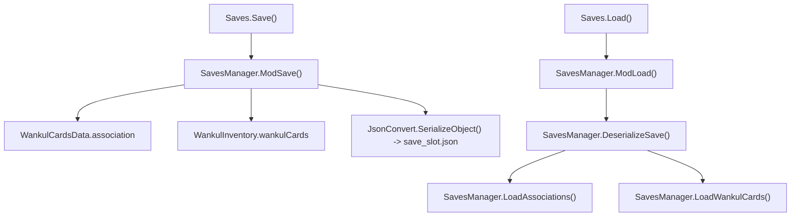
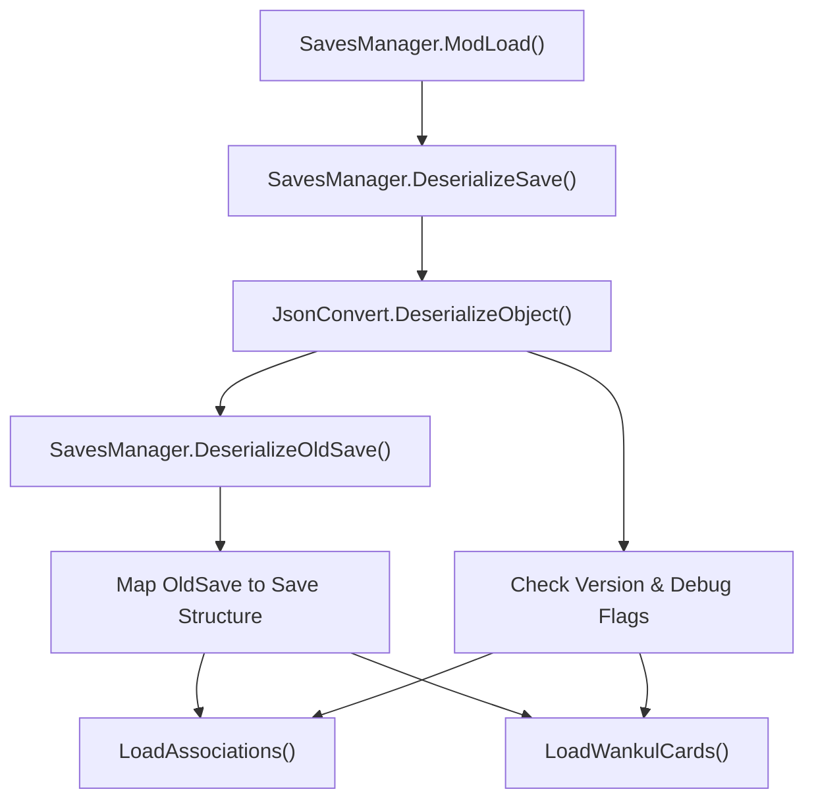

# Enregistrer le système

> **Fichiers sources pertinents**
> * [patch/GameStarting.cs](https://github.com/Drakilis-57/WankulCrazy/blob/57b1f5ed/patch/GameStarting.cs)
> * [patch/Saves.cs](https://github.com/Drakilis-57/WankulCrazy/blob/57b1f5ed/patch/Saves.cs)
> * [utils/SavesManager.cs](https://github.com/Drakilis-57/WankulCrazy/blob/57b1f5ed/utils/SavesManager.cs)

Le système de sauvegarde gère la persistance des associations de cartes personnalisées, des historiques de prix du marché, des valeurs marchandes générées et des articles d'inventaire (`WankulInventory`) dans les emplacements de chargement du jeu.Il s'intègre au cycle de vie de sauvegarde/chargement du jeu via des patch hooks, gère la rétrocompatibilité via des routines de migration à partir de schémas hérités (`OldSave`) et prend en charge les indicateurs de débogage.

## Architecture et structures de données

La persistance repose sur la sérialisation JSON des classes d'état personnalisées situées dans `utils/SavesManager.cs`.Il existe deux versions principales du schéma : `OldSave`, représentant les anciens formats de sauvegarde sans historique du pourcentage de marché, et `Save`, le format actuel intégrant des données de suivi granulaires.

* **`OldSave`** : cartographie les associations de cartes sous forme d'entiers simples et stocke les prix bruts passés [utils/SavesManager.cs L16-L21](https://github.com/Drakilis-57/WankulCrazy/blob/57b1f5ed/utils/SavesManager.cs#L16-L21)
* **`Save`** : mappe les associations de cartes sur des tuples contenant un index, un historique de pourcentage passé (`List<float>`) et des prix de marché générés (`float`), ainsi qu'un dictionnaire d'inventaire et une chaîne de version (`SavesManager.SaveVersion`) [utils/SavesManager.csL22-L62](https://github.com/Drakilis-57/WankulCrazy/blob/57b1f5ed/utils/SavesManager.cs#L22-L62)

### Titre : Flux d'exécution d'enregistrement et de chargement

*Sources : [utils/SavesManager.cs L63-L155](https://github.com/Drakilis-57/WankulCrazy/blob/57b1f5ed/utils/SavesManager.cs#L63-L155)

[patch/Saves.cs L1-L19](https://github.com/Drakilis-57/WankulCrazy/blob/57b1f5ed/patch/Saves.cs#L1-L19)*

## Workflow de sérialisation et de désérialisation

La classe `SavesManager` coordonne la lecture et l'écriture des fichiers correspondant à l'emplacement de jeu actif (`CGameManager.Instance.m_CurrentSaveLoadSlotSelectedIndex`) [utils/SavesManager.cs L63-L107](https://github.com/Drakilis-57/WankulCrazy/blob/57b1f5ed/utils/SavesManager.cs#L63-L107)

* **`ModSave()`** : itère sur `WankulCardsData.Instance.association` pour capturer l'index des cartes, l'historique des prix et les valeurs marchandes.Il enregistre toutes les entrées dans `WankulInventory.Instance.wankulCards` mappées par les clés de carte (`monsterType_borderType_expansionType`), sérialise l'instance `Save` et l'écrit dans `{pluginPath}/data/save_{saveIndex}.json` [utils/SavesManager.csL67-L97](https://github.com/Drakilis-57/WankulCrazy/blob/57b1f5ed/utils/SavesManager.cs#L67-L97)
* **`ModLoad()`** : réinitialise l'état de l'interface utilisateur via `SortUI.inited`, garantit que les données de la carte sont initialisées et tente de lire le fichier JSON de l'emplacement cible [utils/SavesManager.cs L99-L118](https://github.com/Drakilis-57/WankulCrazy/blob/57b1f5ed/utils/SavesManager.cs#L99-L118)
* **`DeserializeSave()`** : Encapsule l'analyse JSON dans un bloc try-catch pour détecter les anomalies `JsonSerializationException`, déclenchant le repli automatique vers `DeserializeOldSave()` si des incompatibilités de schéma se produisent [utils/SavesManager.csL157-L168](https://github.com/Drakilis-57/WankulCrazy/blob/57b1f5ed/utils/SavesManager.cs#L157-L168)

### Titre : Pipeline de repli de désérialisation et de migration

*Sources : [utils/SavesManager.cs L99-L168](https://github.com/Drakilis-57/WankulCrazy/blob/57b1f5ed/utils/SavesManager.cs#L99-L168)*

## Gestion des versions et migration

Le système vérifie le `Save.version` désérialisé par rapport à `SavesManager.SaveVersion` ("1.1.0") [utils/SavesManager.cs L66](https://github.com/Drakilis-57/WankulCrazy/blob/57b1f5ed/utils/SavesManager.cs#L66-L66)

* Si `save.savedebug` est activé, `HandleDebugSave(save)` est invoqué [utils/SavesManager.cs L137-L140](https://github.com/Drakilis-57/WankulCrazy/blob/57b1f5ed/utils/SavesManager.cs#L137-L140)
* Si la chaîne de version est nulle ou diffère de la version actuelle, les routines de migration et de mise à jour des prix s'exécutent sur toutes les instances `WankulCardsData` enregistrées via `UpdateCardPriceIfNeeded()` [utils/SavesManager.cs L141-L149](https://github.com/Drakilis-57/WankulCrazy/blob/57b1f5ed/utils/SavesManager.cs#L141-L149)
* Sinon, les chargeurs d'association standard et d'inventaire de cartes sont exécutés directement [utils/SavesManager.cs L150-L154](https://github.com/Drakilis-57/WankulCrazy/blob/57b1f5ed/utils/SavesManager.cs#L150-L154)

Sources : [utils/SavesManager.cs L1-L168](https://github.com/Drakilis-57/WankulCrazy/blob/57b1f5ed/utils/SavesManager.cs#L1-L168)

## Enregistrer les crochets de patch

Les hooks de persistance sont exposés via la classe `patch/Saves`, qui délègue les déclencheurs du moteur de jeu directement aux méthodes `SavesManager` [patch/Saves.cs L7-L18](https://github.com/Drakilis-57/WankulCrazy/blob/57b1f5ed/patch/Saves.cs#L7-L18)

* **`Saves.Save()`** : appelle `SavesManager.ModSave()` lorsque le jeu demande un état de sauvegarde [patch/Saves.cs L9-L12](https://github.com/Drakilis-57/WankulCrazy/blob/57b1f5ed/patch/Saves.cs#L9-L12)
* **`Saves.Load()`** : appelle `SavesManager.ModLoad()` lors du chargement d'un emplacement de sauvegarde [patch/Saves.cs L14-L17](https://github.com/Drakilis-57/WankulCrazy/blob/57b1f5ed/patch/Saves.cs#L14-L17)

Sources : [patch/Saves.cs L1-L19](https://github.com/Drakilis-57/WankulCrazy/blob/57b1f5ed/patch/Saves.cs#L1-L19)