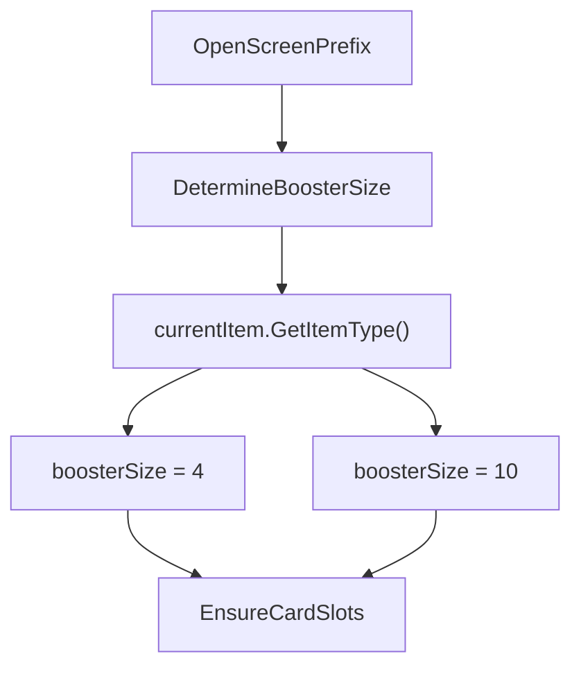
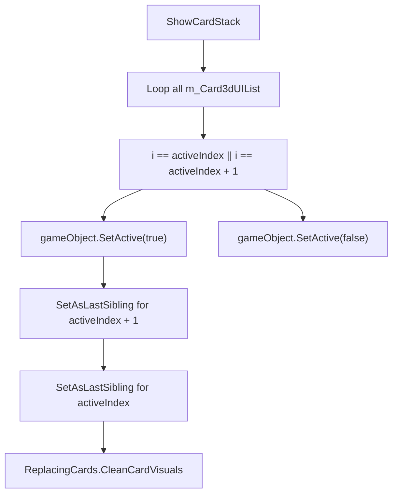
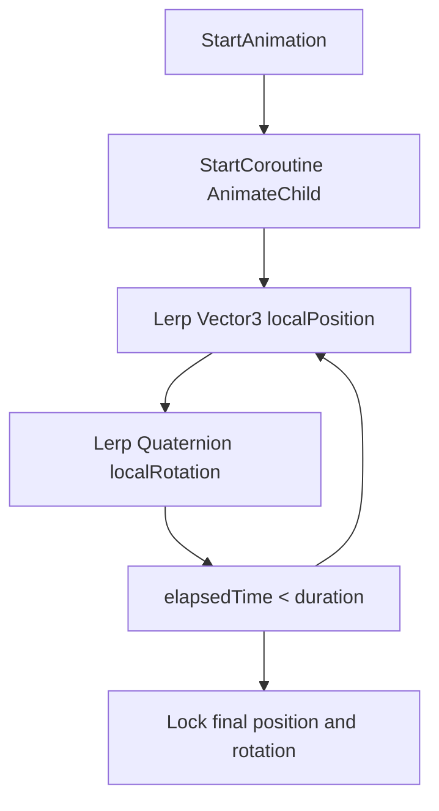

# Séquence d'ouverture de la carte

> **Fichiers sources pertinents**
> * [patch/AnimationOpeningDisplay.cs](https://github.com/Drakilis-57/WankulCrazy/blob/57b1f5ed/patch/AnimationOpeningDisplay.cs)
> * [patch/CardOpening.cs](https://github.com/Drakilis-57/WankulCrazy/blob/57b1f5ed/patch/CardOpening.cs)
> * [patch/CardOpeningHelpers.cs](https://github.com/Drakilis-57/WankulCrazy/blob/57b1f5ed/patch/CardOpeningHelpers.cs)
> * [utils/AnimationCopier.cs](https://github.com/Drakilis-57/WankulCrazy/blob/57b1f5ed/utils/AnimationCopier.cs)

## Objectif et portée

Le système `CardOpening` gère la boucle d'ouverture du pack de boosters dans *WankulCrazy*, interceptant la logique du jeu Vanilla via des correctifs Harmony pour prendre en charge les formats de booster personnalisés (tels que les boosters dorés à 4 cartes par rapport aux boosters standard de 10 cartes), le rendu actif de la pile de cartes, les accesseurs de champ privés et les animations d'ouverture de carte.La logique principale est divisée en `patch/CardOpening.cs`, `patch/CardOpeningHelpers.cs`, `patch/AnimationOpeningDisplay.cs` et `utils/AnimationCopier.cs`.

Sources : `patch/CardOpening.cs:1-152`, `patch/CardOpeningHelpers.cs:1-125`, `patch/AnimationOpeningDisplay.cs:1-38`, `utils/AnimationCopier.cs:1-55`

---

## 1. State Machine & Booster Sizes

Le processus d'ouverture de la carte est régi par la machine à états Vanilla `CardOpeningSequence`.`CardOpening` s'intègre aux transitions d'état pour remplacer les tailles de booster en fonction du type d'article ouvert et vide l'expérience de la boutique lorsque l'index d'état `11` est atteint [patch/CardOpening.cs L26-L34](https://github.com/Drakilis-57/WankulCrazy/blob/57b1f5ed/patch/CardOpening.cs#L26-L34)

### Détermination de la taille du booster

Lorsqu'un écran de rappel s'ouvre, `OpenScreenPrefix` appelle `CheckBoosterSize`, qui évalue le type d'élément actuel (`BoosterGoldBattle` ou `BoosterGoldStellar`) pour définir `boosterSize` sur `4`, par défaut sur `10` pour les packs standard [patch/CardOpening.cs

NaN-NaN](https://github.com/Drakilis-57/WankulCrazy/blob/57b1f5ed/patch/CardOpening.cs#LNaN-LNaN)

Sources : `patch/CardOpening.cs:26-123`

---

## 2. Card Stack Rendering & Visual Hygiene

Pour optimiser le rendu et appliquer une superposition visuelle appropriée lors du retournement de la carte, `ShowCardStack` isole la carte active et la carte immédiatement suivante (`activeIndex + 1`), désactivant tous les autres GameObjects de la carte (`SetActive(false)`) [patch/CardOpening.csL58-L70](https://github.com/Drakilis-57/WankulCrazy/blob/57b1f5ed/patch/CardOpening.cs#L58-L70)

### Z-Index et hiérarchie du canevas

Because Unity UI relies on sibling index order within a `CanvasWorldspace` to determine rendering priority (last child renders on top), `ShowCardStack` forces the background card and active card into correct sibling order using `SetAsLastSibling()` [patch/CardOpening.cs L72-L83](https://github.com/Drakilis-57/WankulCrazy/blob/57b1f5ed/patch/CardOpening.cs#L72-L83)

Enfin, il nettoie les attributs de feuille, les shaders scintillants et les statistiques vanille sur les cartes actives et à venir à l'aide de `ReplacingCards.CleanCardVisuals` [patch/CardOpening.cs L85-L100](https://github.com/Drakilis-57/WankulCrazy/blob/57b1f5ed/patch/CardOpening.cs#L85-L100).

Sources : `patch/CardOpening.cs:58-100`

---

## 3. Couche d'accès CardOpeningHelpers

Étant donné que `CardOpeningSequence` encapsule son état dans des champs privés, `CardOpeningHelpers` agit comme un pont statique exposant les getters et setters typés via `Plugin.GetPProperty` et `Plugin.SetPProperty` [patch/CardOpeningHelpers.csL1-L125](https://github.com/Drakilis-57/WankulCrazy/blob/57b1f5ed/patch/CardOpeningHelpers.cs#L1-L125)

|Catégorie |Méthodes d'assistance |Cible de propriété sous-jacente |
| --- | --- | --- |
| **Flags** | `GetIsScreenActive`, `SetIsScreenActive` | `m_IsScreenActive` [patch/CardOpeningHelpers.cs L14-L17](https://github.com/Drakilis-57/WankulCrazy/blob/57b1f5ed/patch/CardOpeningHelpers.cs#L14-L17) |
|**Drapeaux** |`GetIsAutoFire`, `SetIsAutoFire` |`m_IsAutoFire` [patch/CardOpeningHelpers.cs L34-L37](https://github.com/Drakilis-57/WankulCrazy/blob/57b1f5ed/patch/CardOpeningHelpers.cs#L34-L37) |
| **Timers** | `GetSlider`, `SetSlider` | `m_Slider` [patch/CardOpeningHelpers.cs L54-L57](https://github.com/Drakilis-57/WankulCrazy/blob/57b1f5ed/patch/CardOpeningHelpers.cs#L54-L57) |
| **Indexes** | `GetCurrentOpenedCardIndex`, `SetCurrentOpenedCardIndex` | `m_CurrentOpenedCardIndex` [patch/CardOpeningHelpers.cs L82-L85](https://github.com/Drakilis-57/WankulCrazy/blob/57b1f5ed/patch/CardOpeningHelpers.cs#L82-L85) |
|**Listes** |`GetRolledCardDataList` |`m_RolledCardDataList` [patch/CardOpeningHelpers.cs L115-L117](https://github.com/Drakilis-57/WankulCrazy/blob/57b1f5ed/patch/CardOpeningHelpers.cs#L115-L117) |
| **Item** | `GetCurrentItem`, `SetCurrentItem` | `m_CurrentItem` [patch/CardOpeningHelpers.cs L120-L123](https://github.com/Drakilis-57/WankulCrazy/blob/57b1f5ed/patch/CardOpeningHelpers.cs#L120-L123) |

Sources: `patch/CardOpeningHelpers.cs:1-125`

---

## 4. Animations & Coroutines

Les visuels de déballage des cartes sont orchestrés par `AnimationOpeningDisplay` et pris en charge par `AnimationCopier` [patch/AnimationOpeningDisplay.cs

NaN-NaN](https://github.com/Drakilis-57/WankulCrazy/blob/57b1f5ed/patch/AnimationOpeningDisplay.cs#LNaN-LNaN)

### Boucle d'affichage de la coroutine

`AnimationOpeningDisplay` runs an `AnimateChild` coroutine that lerps a card transform from a starting position and rotation (`Quaternion.Euler(90, 180, 0)`) to an end position and rotation (`Quaternion.Euler(180, 180, 0)`) over a duration of `1.5` seconds [patch/AnimationOpeningDisplay.cs L8-L31](https://github.com/Drakilis-57/WankulCrazy/blob/57b1f5ed/patch/AnimationOpeningDisplay.cs#L8-L31)

Sources : `patch/AnimationOpeningDisplay.cs:1-38`

### Clonage d'animations

`AnimationCopier` fournit des routines d'assistance pour extraire les données `AnimationClip` d'une source `GameObject` et les injecter dans le composant `Animation` d'une cible `GameObject` [utils/AnimationCopier.csL1-L55](https://github.com/Drakilis-57/WankulCrazy/blob/57b1f5ed/utils/AnimationCopier.cs#L1-L55)

Sources : `utils/AnimationCopier.cs:1-55`