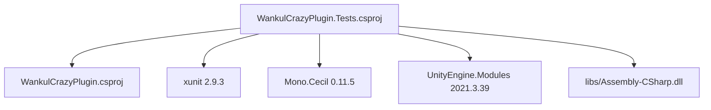
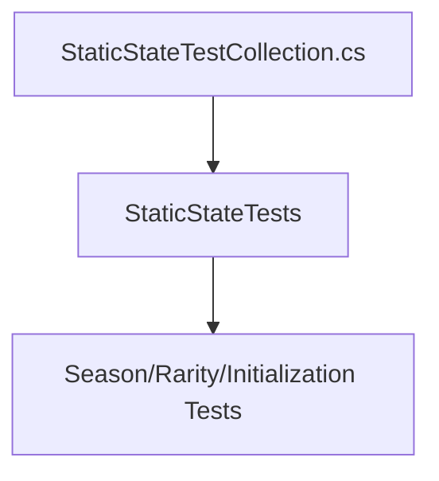
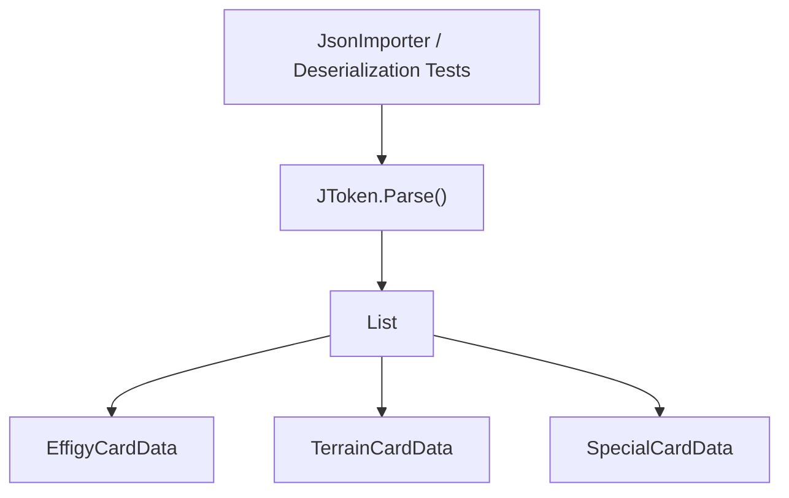
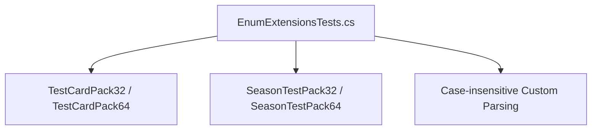
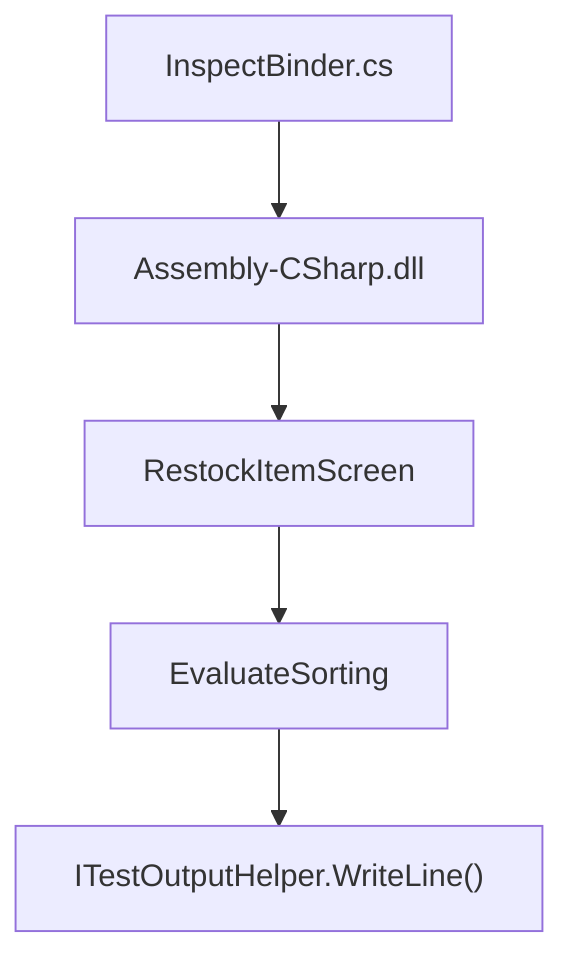
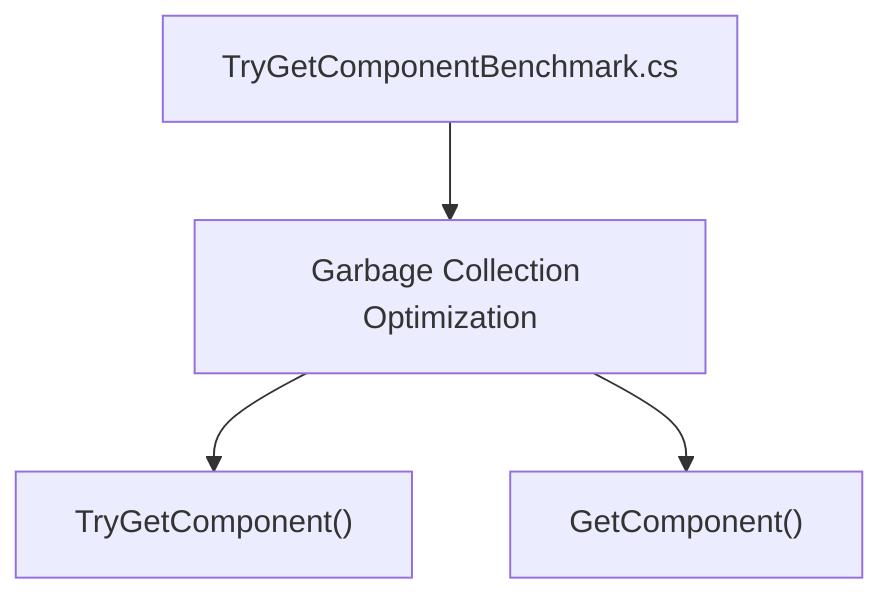

# Test Suite

> **Relevant source files**
> * [WankulCrazyPlugin.Tests/DocsFeaturesVerificationTests.cs](https://github.com/Drakilis-57/WankulCrazy/blob/57b1f5ed/WankulCrazyPlugin.Tests/DocsFeaturesVerificationTests.cs)
> * [WankulCrazyPlugin.Tests/DynamicSeasonsAndRaritiesTests.cs](https://github.com/Drakilis-57/WankulCrazy/blob/57b1f5ed/WankulCrazyPlugin.Tests/DynamicSeasonsAndRaritiesTests.cs)
> * [WankulCrazyPlugin.Tests/EnumExtensionsTests.cs](https://github.com/Drakilis-57/WankulCrazy/blob/57b1f5ed/WankulCrazyPlugin.Tests/EnumExtensionsTests.cs)
> * [WankulCrazyPlugin.Tests/IndexAndExpansionTests.cs](https://github.com/Drakilis-57/WankulCrazy/blob/57b1f5ed/WankulCrazyPlugin.Tests/IndexAndExpansionTests.cs)
> * [WankulCrazyPlugin.Tests/InitializationTests.cs](https://github.com/Drakilis-57/WankulCrazy/blob/57b1f5ed/WankulCrazyPlugin.Tests/InitializationTests.cs)
> * [WankulCrazyPlugin.Tests/InspectBinder.cs](https://github.com/Drakilis-57/WankulCrazy/blob/57b1f5ed/WankulCrazyPlugin.Tests/InspectBinder.cs)
> * [WankulCrazyPlugin.Tests/SeasonTestAndCustomPacksTests.cs](https://github.com/Drakilis-57/WankulCrazy/blob/57b1f5ed/WankulCrazyPlugin.Tests/SeasonTestAndCustomPacksTests.cs)
> * [WankulCrazyPlugin.Tests/StaticStateTestCollection.cs](https://github.com/Drakilis-57/WankulCrazy/blob/57b1f5ed/WankulCrazyPlugin.Tests/StaticStateTestCollection.cs)
> * [WankulCrazyPlugin.Tests/TryGetComponentBenchmark.cs](https://github.com/Drakilis-57/WankulCrazy/blob/57b1f5ed/WankulCrazyPlugin.Tests/TryGetComponentBenchmark.cs)
> * [WankulCrazyPlugin.Tests/WankulCrazyPlugin.Tests.csproj](https://github.com/Drakilis-57/WankulCrazy/blob/57b1f5ed/WankulCrazyPlugin.Tests/WankulCrazyPlugin.Tests.csproj)
> * [cards/EffigyCardData.cs](https://github.com/Drakilis-57/WankulCrazy/blob/57b1f5ed/cards/EffigyCardData.cs)

The test suite validates card data models, dynamic seasons and rarities management, JSON token deserialization, custom item parsers, safe enum parsing, IL inspection via Mono.Cecil, and performance benchmarks. The test project is configured as a standalone xUnit test assembly targeting `.NET 8.0` [WankulCrazyPlugin.Tests/WankulCrazyPlugin.Tests.csproj:1-13] and relies on NuGet packages including `xunit`, `Mono.Cecil`, and `UnityEngine.Modules` [WankulCrazyPlugin.Tests/WankulCrazyPlugin.Tests.csproj:15-22].

---

## 1. Test Project Structure and Dependencies

The test project `WankulCrazyPlugin.Tests` references the main `WankulCrazyPlugin` project and includes external dependencies for parsing, unit testing, and game assembly inspection [WankulCrazyPlugin.Tests/WankulCrazyPlugin.Tests.csproj:24-33].

Sources: [WankulCrazyPlugin.Tests/WankulCrazyPlugin.Tests.csproj L1-L35](https://github.com/Drakilis-57/WankulCrazy/blob/57b1f5ed/WankulCrazyPlugin.Tests/WankulCrazyPlugin.Tests.csproj#L1-L35)

---

## 2. Test Isolation and Static State Collection

Because several managers (`SeasonsManager`, `RaritiesManager`) maintain static state dictionaries during runtime, tests that modify seasons or rarities use an xUnit collection definition with `DisableParallelization = true` (`StaticStateTests`) [WankulCrazyPlugin.Tests/StaticStateTestCollection.cs:1-10]. This prevents race conditions during parallel execution.

Sources: [WankulCrazyPlugin.Tests/StaticStateTestCollection.cs L1-L9](https://github.com/Drakilis-57/WankulCrazy/blob/57b1f5ed/WankulCrazyPlugin.Tests/StaticStateTestCollection.cs#L1-L9)

---

## 3. JSON Validation and Importer Verification

The test suite verifies that card data tokens, custom items, restock lists, and mesh definitions are correctly deserialized and validated [WankulCrazyPlugin.Tests/SeasonTestAndCustomPacksTests.cs:34-79].

### Key Importer Test Classes

| Test Class | File | Primary Responsibility |
| --- | --- | --- |
| `SeasonTestAndCustomPacksTests` | `SeasonTestAndCustomPacksTests.cs` | Validates custom items JSON data structures (`ItemDataList.json`, `restockDataList.json`, `itemMeshDataList.json`) and enum extensions [WankulCrazyPlugin.Tests/SeasonTestAndCustomPacksTests.cs:34-95] |
| `DocsFeaturesVerificationTests` | `DocsFeaturesVerificationTests.cs` | Tests multi-file container parsing (`wankuls`, `terrains`, `specials`) and dynamic seasons/rarities lifecycles [WankulCrazyPlugin.Tests/DocsFeaturesVerificationTests.cs:15-128] |
| `DynamicSeasonsAndRaritiesTests` | `DynamicSeasonsAndRaritiesTests.cs` | Verifies default registration, custom registration, token deserialization, and experience calculations [WankulCrazyPlugin.Tests/DynamicSeasonsAndRaritiesTests.cs:15-120] |
| `IndexAndExpansionTests` | `IndexAndExpansionTests.cs` | Ensures card indexes are auto-assigned when missing or zero [WankulCrazyPlugin.Tests/IndexAndExpansionTests.cs:13-25] |
| `InitializationTests` | `InitializationTests.cs` | Tests initialization from plugin path and multi-type card parsing (`EffigyCardData`, `TerrainCardData`, `SpecialCardData`) [WankulCrazyPlugin.Tests/InitializationTests.cs:14-51] |

Sources: `[WankulCrazyPlugin.Tests/SeasonTestAndCustomPacksTests.cs:34-95]`, `[WankulCrazyPlugin.Tests/DocsFeaturesVerificationTests.cs:15-128]`, `[WankulCrazyPlugin.Tests/DynamicSeasonsAndRaritiesTests.cs:15-120]`, `[WankulCrazyPlugin.Tests/IndexAndExpansionTests.cs:13-25]`, [WankulCrazyPlugin.Tests/InitializationTests.cs L14-L51](https://github.com/Drakilis-57/WankulCrazy/blob/57b1f5ed/WankulCrazyPlugin.Tests/InitializationTests.cs#L14-L51)

---

## 4. Enum Safe-Parsing and Extension Testing

Enum extensions and Harmony enum patches (`Patch_Enum_IsDefined`, `Patch_Enum_GetName`, `Patch_Enum_Parse`) are rigorously tested to ensure safe handling of string identifiers and custom integer values [WankulCrazyPlugin.Tests/EnumExtensionsTests.cs:1-77].

Sources: `[WankulCrazyPlugin.Tests/SeasonTestAndCustomPacksTests.cs:81-96]`, [WankulCrazyPlugin.Tests/EnumExtensionsTests.cs L1-L77](https://github.com/Drakilis-57/WankulCrazy/blob/57b1f5ed/WankulCrazyPlugin.Tests/EnumExtensionsTests.cs#L1-L77)

---

## 5. IL Inspection via Mono.Cecil

`InspectBinder` uses `Mono.Cecil` to inspect game assembly IL instructions (such as `RestockItemScreen.EvaluateSorting`) during local investigations [WankulCrazyPlugin.Tests/InspectBinder.cs:1-38].

Sources: [WankulCrazyPlugin.Tests/InspectBinder.cs L1-L38](https://github.com/Drakilis-57/WankulCrazy/blob/57b1f5ed/WankulCrazyPlugin.Tests/InspectBinder.cs#L1-L38)

---

## 6. Benchmarks & Performance Verification

`TryGetComponentBenchmark` documents and validates performance considerations regarding Unity API calls, specifically comparing `GetComponent<T>()` and `TryGetComponent<T>()` allocations [WankulCrazyPlugin.Tests/TryGetComponentBenchmark.cs:1-27].

Sources: [WankulCrazyPlugin.Tests/TryGetComponentBenchmark.cs L1-L27](https://github.com/Drakilis-57/WankulCrazy/blob/57b1f5ed/WankulCrazyPlugin.Tests/TryGetComponentBenchmark.cs#L1-L27)