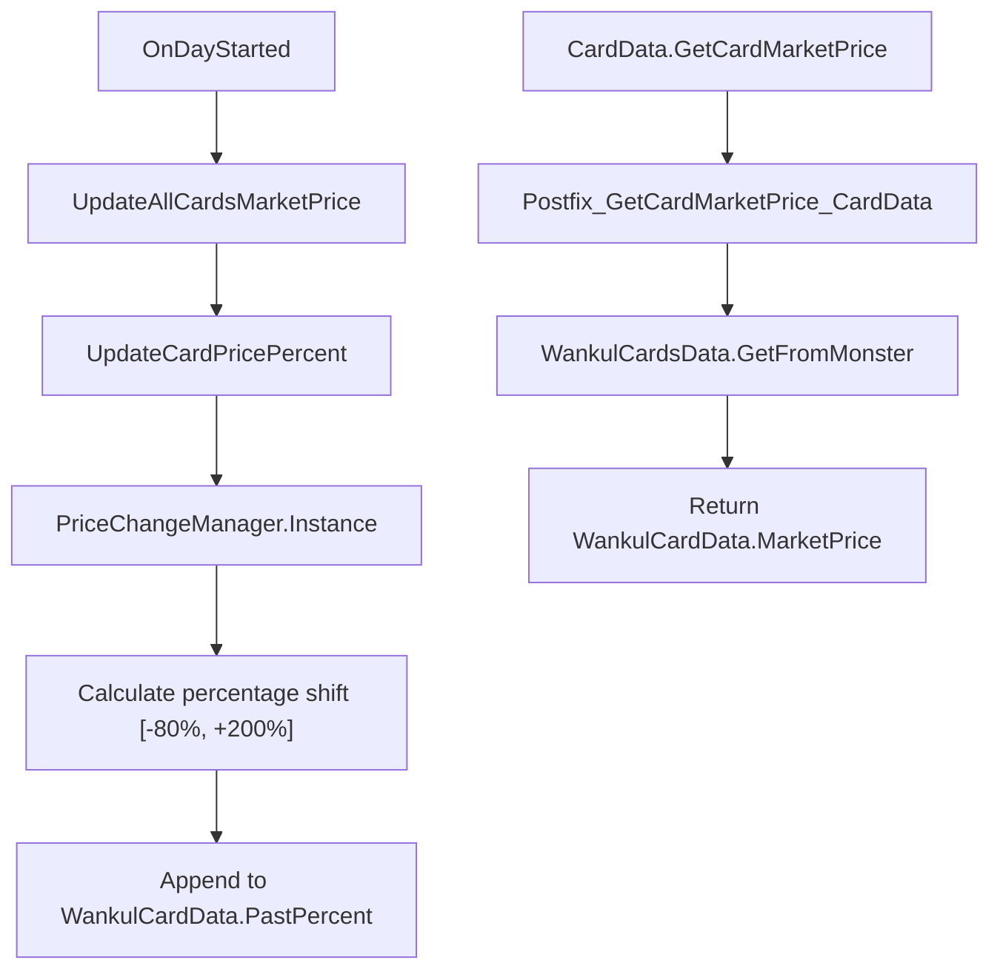
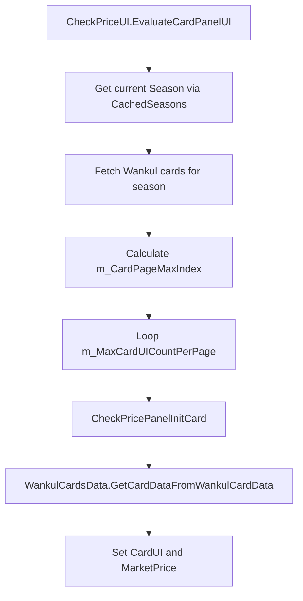
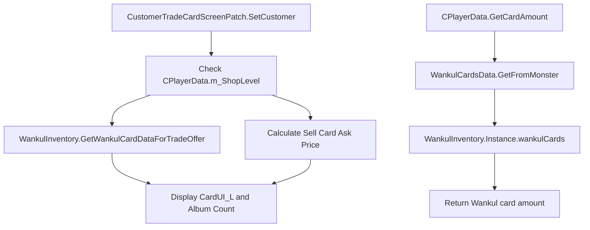

# Économie : tarification et échanges

> **Fichiers sources pertinents**
> * [cards/WankulCardData.cs](https://github.com/Drakilis-57/WankulCrazy/blob/57b1f5ed/cards/WankulCardData.cs)
> * [patch/CPlayerDataPatch.cs](https://github.com/Drakilis-57/WankulCrazy/blob/57b1f5ed/patch/CPlayerDataPatch.cs)
> * [patch/CardPrice.cs](https://github.com/Drakilis-57/WankulCrazy/blob/57b1f5ed/patch/CardPrice.cs)
> * [patch/CheckPriceUI.cs](https://github.com/Drakilis-57/WankulCrazy/blob/57b1f5ed/patch/CheckPriceUI.cs)
> * [patch/CustomerTradeCardScreenPatch.cs](https://github.com/Drakilis-57/WankulCrazy/blob/57b1f5ed/patch/CustomerTradeCardScreenPatch.cs)

Cette page détaille le sous-système économique du mod WankulCrazy, couvrant la génération dynamique de prix du marché, les fluctuations de prix quotidiennes, les panneaux d'inspection de l'interface utilisateur (`CheckPriceUI`), la logique d'échange/vente client (`CustomerTradeCardScreenPatch`) et les correctifs d'intégration des stocks (`CPlayerDataPatch`).

---

## 1. Génération des prix du marché et fluctuations quotidiennes

The mod replaces vanilla card valuation with a multi-tiered pricing system anchored to card rarities, drop rates, and seasonal factors (`patch/CardPrice.cs`).

### Price Calculation Logic

When a card's market price is requested, `CardPrice.generateMarketPrice(WankulCardData)` calculates a baseline price by evaluating:

1. **Multiplicateur de saison** : différentes saisons (`Season.S01` à `Season.HS`) appliquent des facteurs d'échelle de base allant de `1.0f` à `2.0f` [patch/CardPrice.csL21-L41](https://github.com/Drakilis-57/WankulCrazy/blob/57b1f5ed/patch/CardPrice.cs#L21-L41)
2. **Segments de taux de chute** : les cartes sont classées en niveaux de taux de chute (des baisses courantes `>= 0.45f` avec une fourchette de prix de `0.01f` à `0.5f` jusqu'aux raretés extrêmes comme le Golden Ticket `>= 0.0001f` allant de `10,000f` à `100,000f`) [patch/CardPrice.csL43-L106](https://github.com/Drakilis-57/WankulCrazy/blob/57b1f5ed/patch/CardPrice.cs#L43-L106)
3. **Variation aléatoire** : une variance aléatoire de base entre `-2%` et `+2%` est appliquée aux limites du segment [patch/CardPrice.cs L18-L111](https://github.com/Drakilis-57/WankulCrazy/blob/57b1f5ed/patch/CardPrice.cs#L18-L111)

In `WankulCardData`, the `MarketPrice` property uses lazy initialization to call `CardPrice.generateMarketPrice(this)` once, caching the result in `generatedMarketPrice`, and scales it dynamically by the current daily percentage multiplier (`Percentage / 100`) [cards/WankulCardData.cs L92-L114](https://github.com/Drakilis-57/WankulCrazy/blob/57b1f5ed/cards/WankulCardData.cs#L92-L114)

### Daily Price Shifts

At the start of every day via `CardPrice.OnDayStarted()`, `UpdateAllCardsMarketPrice()` iterates over all registered cards and invokes `UpdateCardPricePercent(WankulCardData)` [patch/CardPrice.cs L119-L165](https://github.com/Drakilis-57/WankulCrazy/blob/57b1f5ed/patch/CardPrice.cs#L119-L165)

* Cached reflection fields (`priceChangeMinField` and `priceChangeMaxField`) query `PriceChangeManager.Instance` to fetch configuration parameters without performance-heavy `AccessTools.Field` lookups on every tick [patch/CardPrice.cs L114-L128](https://github.com/Drakilis-57/WankulCrazy/blob/57b1f5ed/patch/CardPrice.cs#L114-L128)
* La valeur en pourcentage de la carte est ajustée et bloquée entre `-80f` et `+200f` [patch/CardPrice.cs L130-L143](https://github.com/Drakilis-57/WankulCrazy/blob/57b1f5ed/patch/CardPrice.cs#L130-L143)
* Un historique glissant allant jusqu'à 30 pourcentages passés est conservé dans `PastPercent` [patch/CardPrice.cs L144-L148](https://github.com/Drakilis-57/WankulCrazy/blob/57b1f5ed/patch/CardPrice.cs#L144-L148)

*Sources : [patch/CardPrice.cs L114-L181](https://github.com/Drakilis-57/WankulCrazy/blob/57b1f5ed/patch/CardPrice.cs#L114-L181)

[cards/WankulCardData.cs L92-L114](https://github.com/Drakilis-57/WankulCrazy/blob/57b1f5ed/cards/WankulCardData.cs#L92-L114)*

---

## 2. Interface utilisateur et pagination d'inspection des prix

La classe `CheckPriceUI` remplace le comportement de l'écran de vérification des prix Vanilla pour afficher les informations de catalogue spécifiques à Wankul, le filtrage saisonnier et les valorisations boursières calculées (`patch/CheckPriceUI.cs`).

### Évaluation de la pagination et de la mise en page

`CheckPriceUI.EvaluateCardPanelUI(...)` gère les boucles de rendu des cartes au sein de l'interface de contrôle de prix :

* Résout les propriétés de l'instance (`m_PosX`, `m_LerpPosX`, `m_CardPageMaxIndex`, etc.) à l'aide des délégués d'accès mis en cache [patch/CheckPriceUI.cs L25-L30](https://github.com/Drakilis-57/WankulCrazy/blob/57b1f5ed/patch/CheckPriceUI.cs#L25-L30)
* Récupère les regroupements saisonniers actuels à l'aide de `CachedSeasons[ExpansionScreen.currentExpensionIndex]` [patch/CheckPriceUI.cs L32](https://github.com/Drakilis-57/WankulCrazy/blob/57b1f5ed/patch/CheckPriceUI.cs#L32-L32)
* Dimensionne dynamiquement les grilles de cartes par page à l'aide de `__instance.m_MaxCardUICountPerPage` et remplit `wankulCardsSet` [patch/CheckPriceUI.cs L44-L81](https://github.com/Drakilis-57/WankulCrazy/blob/57b1f5ed/patch/CheckPriceUI.cs#L44-L81)

Individual panels are initialized via `CheckPricePanelInitCard(...)`, binding the target `WankulCardData` to its corresponding UI container and formatting custom effigy titles and rarities [patch/CheckPriceUI.cs L95-L136](https://github.com/Drakilis-57/WankulCrazy/blob/57b1f5ed/patch/CheckPriceUI.cs#L95-L136)

*Sources : [patch/CheckPriceUI.cs L21-L136](https://github.com/Drakilis-57/WankulCrazy/blob/57b1f5ed/patch/CheckPriceUI.cs#L21-L136)*

---

## 3. Offres commerciales des clients et crochets d'inventaire

Modifications to customer interactions and player data queries allow custom Wankul inventory items to be traded and evaluated seamlessly (`patch/CustomerTradeCardScreenPatch.cs`, `patch/CPlayerDataPatch.cs`).

### Pipeline d'écrans d'échanges clients

`CustomerTradeCardScreenPatch.SetCustomer(...)` intercepts customer interactions at the shop counter:

* Evaluates shop level (`CPlayerData.m_ShopLevel`) to determine if a trade proposal should be initiated (capped at level 40) [patch/CustomerTradeCardScreenPatch.cs L22-L30](https://github.com/Drakilis-57/WankulCrazy/blob/57b1f5ed/patch/CustomerTradeCardScreenPatch.cs#L22-L30)
* Extrait les candidats aux offres commerciales via `WankulInventory.GetWankulCardDataForTradeOffer()` si aucune donnée commerciale existante n'est fournie [patch/CustomerTradeCardScreenPatch.cs L66-L68](https://github.com/Drakilis-57/WankulCrazy/blob/57b1f5ed/patch/CustomerTradeCardScreenPatch.cs#L66-L68)
* Calcule les prix demandés à l'aide de multiplicateurs dynamiques adaptés au prix du marché de la carte [patch/CustomerTradeCardScreenPatch.cs L81-L127](https://github.com/Drakilis-57/WankulCrazy/blob/57b1f5ed/patch/CustomerTradeCardScreenPatch.cs#L81-L127)

### Interception des données du joueur

`CPlayerDataPatch.GetCardAmount` remplace les contrôles de propriété des cartes de jeu de base [patch/CPlayerDataPatch.cs L11-L24](https://github.com/Drakilis-57/WankulCrazy/blob/57b1f5ed/patch/CPlayerDataPatch.cs#L11-L24)

:

* Mappe Vanilla `CardData` à `WankulCardData` à l'aide de `WankulCardsData.GetFromMonster` [patch/CPlayerDataPatch.cs L13](https://github.com/Drakilis-57/WankulCrazy/blob/57b1f5ed/patch/CPlayerDataPatch.cs#L13-L13)
* Queries `WankulInventory.Instance.wankulCards` by index to return the exact quantity owned by the player, bypassing default save structures [patch/CPlayerDataPatch.cs L20-L21](https://github.com/Drakilis-57/WankulCrazy/blob/57b1f5ed/patch/CPlayerDataPatch.cs#L20-L21)

*Sources : [patch/CustomerTradeCardScreenPatch.cs L16-L127](https://github.com/Drakilis-57/WankulCrazy/blob/57b1f5ed/patch/CustomerTradeCardScreenPatch.cs#L16-L127)

[patch/CPlayerDataPatch.cs:9-25]*