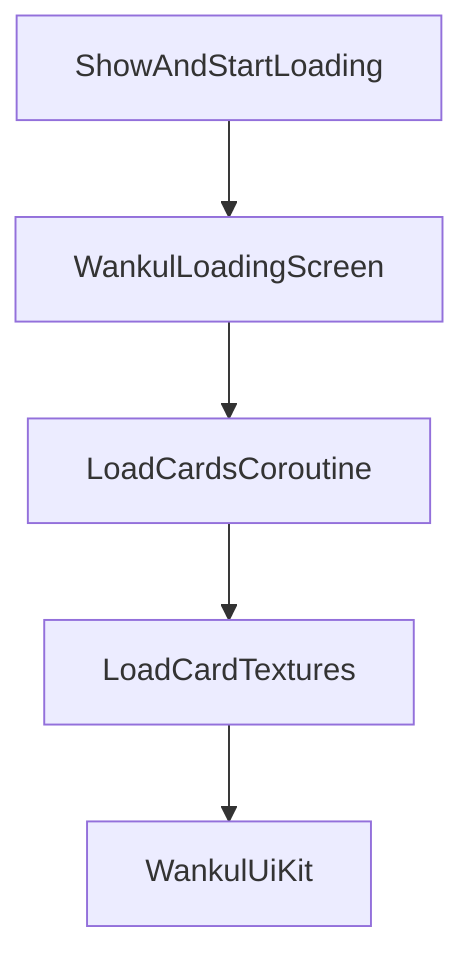
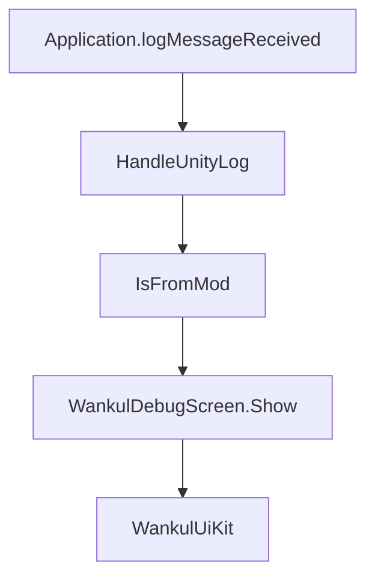

# Écran de chargement et interface utilisateur de débogage

> **Fichiers sources pertinents**
> * [importer/OBJImporter.cs](https://github.com/Drakilis-57/WankulCrazy/blob/57b1f5ed/importer/OBJImporter.cs)
> * [importer/WankulDebugScreen.cs](https://github.com/Drakilis-57/WankulCrazy/blob/57b1f5ed/importer/WankulDebugScreen.cs)
> * [importer/WankulLoadingScreen.cs](https://github.com/Drakilis-57/WankulCrazy/blob/57b1f5ed/importer/WankulLoadingScreen.cs)
> * [importer/WankulUiKit.cs](https://github.com/Drakilis-57/WankulCrazy/blob/57b1f5ed/importer/WankulUiKit.cs)
> * [patch/DebugFilterPatch.cs](https://github.com/Drakilis-57/WankulCrazy/blob/57b1f5ed/patch/DebugFilterPatch.cs)
> * [patch/PlayCardSetUIPatch.cs](https://github.com/Drakilis-57/WankulCrazy/blob/57b1f5ed/patch/PlayCardSetUIPatch.cs)
> * [patch/SceneLifecyclePatches.cs](https://github.com/Drakilis-57/WankulCrazy/blob/57b1f5ed/patch/SceneLifecyclePatches.cs)

## Objectif et portée

Ce document détaille l'implémentation de l'interface utilisateur, du chargement et des sous-systèmes de débogage dans la base de code de `WankulCrazy`. Plus précisément, il couvre le chargement asynchrone des actifs de cartes avec un budget de trames géré par `WankulLoadingScreen`, la fabrique de composants UGUI partagée `WankulUiKit`, l'écran d'interception des exceptions/erreurs d'exécution `WankulDebugScreen`, et le filtre de bruit de log `DebugFilterPatch`.

---

## 1. WankulLoadingScreen et chargement budgétisé par cadre

La classe `WankulLoadingScreen` est un singleton `MonoBehaviour` responsable du chargement des textures et des masques de carte de manière asynchrone sans provoquer de chutes d'images ni de bégaiement lors de l'initialisation du jeu [importer/WankulLoadingScreen.csL11-L44](https://github.com/Drakilis-57/WankulCrazy/blob/57b1f5ed/importer/WankulLoadingScreen.cs#L11-L44)

### Mécaniques de base et budgétisation du cadre

* **`IsLoading`** : Une propriété publique statique (`bool`) utilisée à travers le mod pour bloquer les ouvertures de boosters ou les interactions d'album pendant que le chargement des actifs est actif [importer/WankulLoadingScreen.cs L18-L20](https://github.com/Drakilis-57/WankulCrazy/blob/57b1f5ed/importer/WankulLoadingScreen.cs#L18-L20)
* **Budget de trame (`FrameBudgetMs`)** : défini sur `12f` millisecondes, garantissant que les opérations de chargement de texture redonnent le contrôle à Unity une fois le budget de temps de trame épuisé [importer/WankulLoadingScreen.csL22-L23](https://github.com/Drakilis-57/WankulCrazy/blob/57b1f5ed/importer/WankulLoadingScreen.cs#L22-L23)
* **Suivi des performances** : les durées de chargement des cartes individuelles sont mesurées via `System.Diagnostics.Stopwatch`.Les cartes dépassant `SlowCardMs` (250 ms) déclenchent un journal d'avertissement [importer/WankulLoadingScreen.cs L24-L114](https://github.com/Drakilis-57/WankulCrazy/blob/57b1f5ed/importer/WankulLoadingScreen.cs#L24-L114)

Sources : `importer/WankulLoadingScreen.cs:27-140`

---

## 2. WankulUiKit Utility Framework

`WankulUiKit` est une classe utilitaire statique interne fournissant des fonctions d'assistance pour la configuration UGUI, l'ancrage de la mise en page et l'instanciation des composants utilisés à la fois par `WankulLoadingScreen` et `WankulDebugScreen` [importer/WankulUiKit.csL7-L120](https://github.com/Drakilis-57/WankulCrazy/blob/57b1f5ed/importer/WankulUiKit.cs#L7-L120)

Les principales fonctionnalités incluent :

* **Font Fallback** : récupère le `Arial.ttf` intégré à Unity ou revient dynamiquement à une police du système d'exploitation [importer/WankulUiKit.cs L13-L24](https://github.com/Drakilis-57/WankulCrazy/blob/57b1f5ed/importer/WankulUiKit.cs#L13-L24)
* **Génération de sprite blanc** : génère un `Sprite` blanc 1x1 d'exécution à partir de `Texture2D.whiteTexture` pour un rendu d'image en couleur unie [importer/WankulUiKit.cs L26-L37](https://github.com/Drakilis-57/WankulCrazy/blob/57b1f5ed/importer/WankulUiKit.cs#L26-L37)
* **Configuration du canevas** : configure les canevas de superposition d'espace d'écran avec `CanvasScaler` référencé à une résolution `1920x1080` et des ordres de tri explicites [importer/WankulUiKit.csL39-L53](https://github.com/Drakilis-57/WankulCrazy/blob/57b1f5ed/importer/WankulUiKit.cs#L39-L53)
* **RectTransform Helpers**: Provides layout shortcuts such as `Stretch`, `PlaceCentered`, and `Place` [importer/WankulUiKit.cs L55-L76](https://github.com/Drakilis-57/WankulCrazy/blob/57b1f5ed/importer/WankulUiKit.cs#L55-L76)
* **Usines d'éléments d'interface utilisateur** : des méthodes telles que `CreateImage`, `CreateText` et `CreateButton` rationalisent la génération d'interface utilisateur par programmation [importer/WankulUiKit.csL78-L118](https://github.com/Drakilis-57/WankulCrazy/blob/57b1f5ed/importer/WankulUiKit.cs#L78-L118)

Sources : `importer/WankulUiKit.cs:1-120`

---

## 3. WankulDebugScreen et interception des journaux

`WankulDebugScreen` capture les journaux et les exceptions du moteur Unity au moment de l'exécution, affichant un écran d'erreur modal lorsque des exceptions critiques proviennent du mod [importer/WankulDebugScreen.cs L8-L97](https://github.com/Drakilis-57/WankulCrazy/blob/57b1f5ed/importer/WankulDebugScreen.cs#L8-L97)

### Pipeline de gestion des exceptions

1. **Event Hook**: Subscribes to `Application.logMessageReceived` in `Awake()` and unsubscribes in `OnDestroy()` [importer/WankulDebugScreen.cs L49-L54](https://github.com/Drakilis-57/WankulCrazy/blob/57b1f5ed/importer/WankulDebugScreen.cs#L49-L54)
2. **Filtrage** : ignore les événements de fermeture, les journaux non modifiés (`IsFromMod`) et les journaux non critiques, ciblant les instances `LogType.Exception` et critiques `LogType.Error` (telles que `NullReferenceException`, `ArgumentOutOfRangeException` et `IndexOutOfRangeException`) [importer/WankulDebugScreen.csL75-L97](https://github.com/Drakilis-57/WankulCrazy/blob/57b1f5ed/importer/WankulDebugScreen.cs#L75-L97)
3. **UI Display**: Renders a high-priority overlay (`sortingOrder = 10000`), forces cursor visibility and unlocks cursor state during display updates [importer/WankulDebugScreen.cs L59-L146](https://github.com/Drakilis-57/WankulCrazy/blob/57b1f5ed/importer/WankulDebugScreen.cs#L59-L146)

Sources : `importer/WankulDebugScreen.cs:46-146`

---

## 4. DebugFilterPatch et réduction du bruit du journal

`DebugFilterPatch` intercepte les appels de journalisation Unity pour supprimer les avertissements de moteur connus et inoffensifs et tracer les messages qui encombrent la console BepInEx [patch/DebugFilterPatch.cs L6-L71](https://github.com/Drakilis-57/WankulCrazy/blob/57b1f5ed/patch/DebugFilterPatch.cs#L6-L71)

La méthode `ShouldIgnore` évalue les chaînes de journal pour les modèles connus, renvoyant `false` (supprimant le journal) pour les messages tels que :

* L'élément de police souligne les avertissements manquants [patch/DebugFilterPatch.cs L11](https://github.com/Drakilis-57/WankulCrazy/blob/57b1f5ed/patch/DebugFilterPatch.cs#L11-L11)
* Avertissements `DontDestroyOnLoad` sur les objets de jeu non root [patch/DebugFilterPatch.cs L12](https://github.com/Drakilis-57/WankulCrazy/blob/57b1f5ed/patch/DebugFilterPatch.cs#L12-L12)
* Avertissements d'affectation des parents RectTransform [patch/DebugFilterPatch.cs L13](https://github.com/Drakilis-57/WankulCrazy/blob/57b1f5ed/patch/DebugFilterPatch.cs#L13-L13)
* Avertissements d'échelle/taille négative sur `BoxCollider` [patch/DebugFilterPatch.cs L14](https://github.com/Drakilis-57/WankulCrazy/blob/57b1f5ed/patch/DebugFilterPatch.cs#L14-L14)
* `percentDone` progress logs [patch/DebugFilterPatch.cs L15](https://github.com/Drakilis-57/WankulCrazy/blob/57b1f5ed/patch/DebugFilterPatch.cs#L15-L15)

Sources : `patch/DebugFilterPatch.cs:8-16`